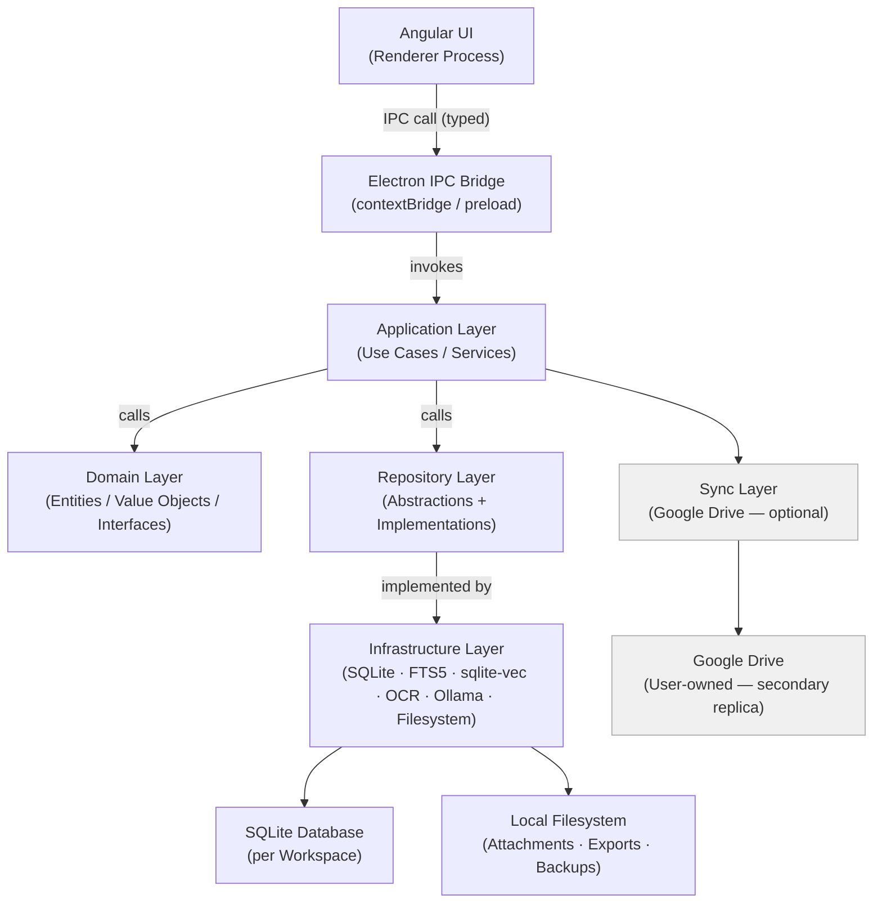
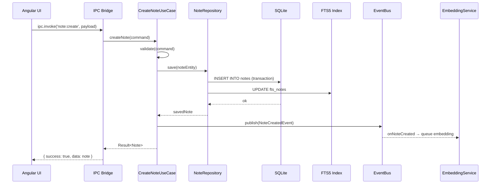
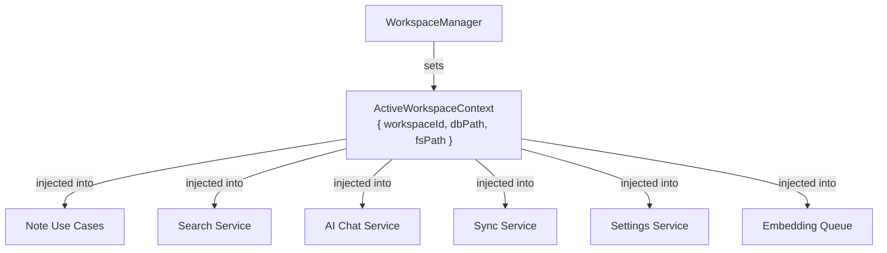
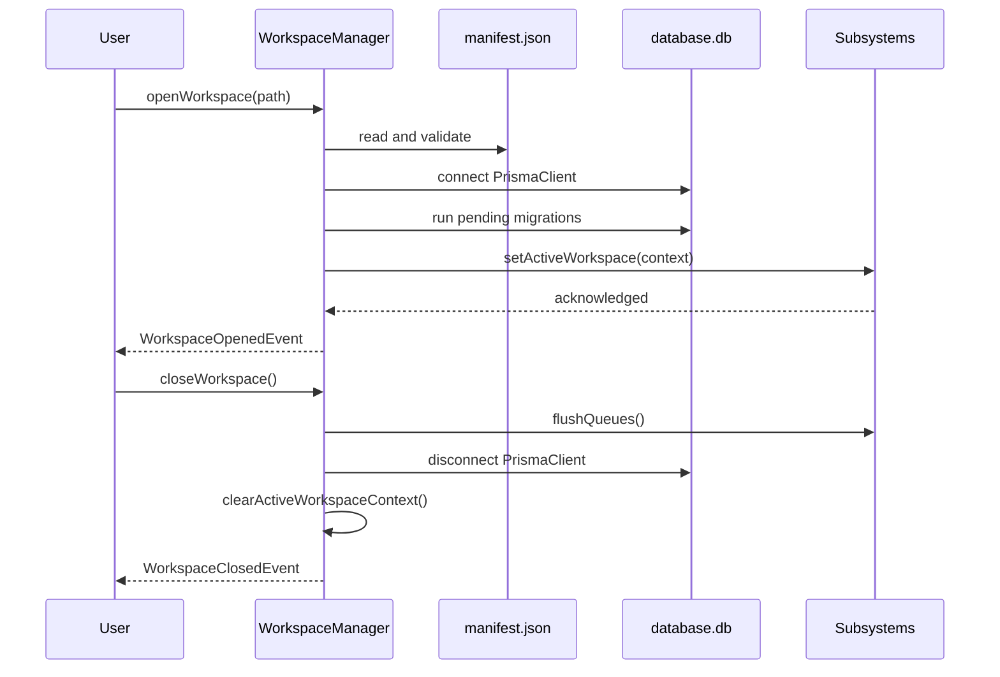
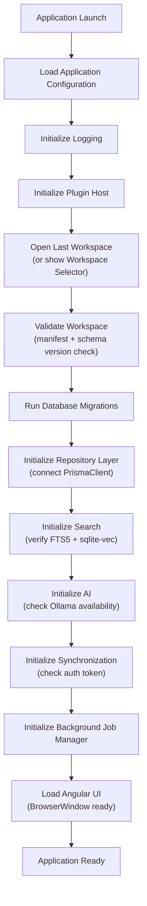
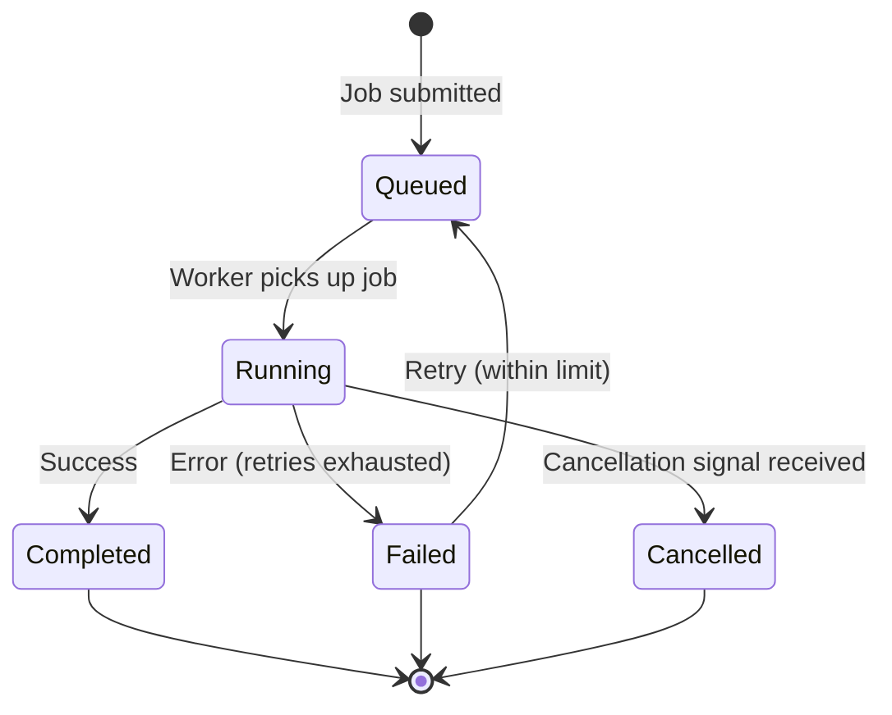
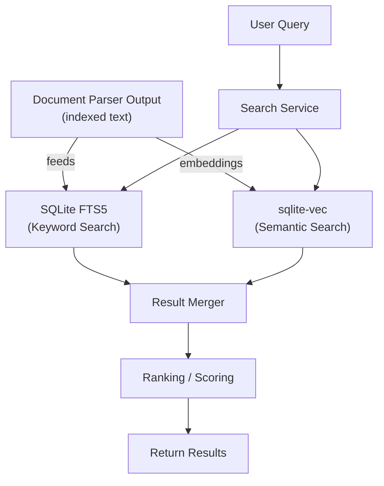

# 01 — System Overview

> **Document Type:** Architecture Overview
> **Status:** Draft
> **Applies To:** Notebook — All Versions
> **Related Documents:**
> [02-CleanArchitecture.md](./02-CleanArchitecture.md) · [03-Monorepo.md](./03-Monorepo.md) · [04-Electron.md](./04-Electron.md) · [05-Angular.md](./05-Angular.md) · [06-IPC.md](./06-IPC.md) · [../00-overview/01-Vision.md](../00-overview/01-Vision.md) · [../00-overview/03-Scope.md](../00-overview/03-Scope.md)

---

## 1. Purpose

This document provides the authoritative high-level architecture overview for Notebook. It describes the overall system structure, the major architectural layers, the data flow between them, and the key design decisions that shape the entire system.

All subsequent architecture documents in `docs/01-architecture/` elaborate on specific subsystems described here. This document is the starting point for any engineer or contributor onboarding to the project.

---

## 2. Architectural Philosophy

Notebook's architecture is shaped by three immovable constraints derived from [../00-overview/01-Vision.md](../00-overview/01-Vision.md):

1. **No developer-owned backend.** All computation, storage, and AI inference must run on the user's machine.
2. **The local SQLite database and filesystem are the single source of truth.** Google Drive is a sync target only.
3. **Every core feature must work fully offline.** Network is optional.

These constraints eliminate entire categories of architectural patterns (distributed systems, REST backends, cloud databases, microservices) and direct the architecture toward a **clean, layered, single-process desktop application** with optional network integration.

---

## 3. Technology Stack Summary

| Concern | Technology | Role |
|---|---|---|
| Desktop shell | Electron | Cross-platform desktop host; native OS integration |
| Frontend | Angular | UI framework; component tree; routing |
| Language | TypeScript | Static typing across all layers |
| Primary database | SQLite (via Prisma) | Relational data store, per Workspace |
| Full-text search | SQLite FTS5 | Keyword search over notes and attachments |
| Vector search | sqlite-vec | Semantic similarity search |
| Rich text editor | Tiptap | ProseMirror-based extensible editor |
| Local AI inference | Ollama | LLM and embedding model runner |
| OCR | Tesseract.js / Tesseract | Local optical character recognition |
| Sync | Google Drive API | Optional, user-initiated Workspace synchronization |

---

## 4. High-Level Layer Diagram



**Dependency rule:** Dependencies point inward. Outer layers depend on inner layers. Inner layers know nothing about outer layers. The Domain Layer has zero external dependencies.

---

## 5. Process Architecture

Notebook runs as an **Electron application** with two process types:

### 5.1 Main Process

The Electron main process is the application host. It runs in a full Node.js environment and is responsible for:

- Application lifecycle (startup, shutdown, window management)
- IPC message routing between renderer and application core
- Native OS integration (file dialogs, notifications, system tray)
- Application Layer execution (use cases, services)
- Repository Layer execution (database access, filesystem access)
- Ollama process management
- Google Drive sync coordination

The main process is the only process with unrestricted filesystem and Node.js API access. See [04-Electron.md](./04-Electron.md).

### 5.2 Renderer Process

The Angular application runs inside the Electron renderer process. The renderer:

- Has no direct access to Node.js APIs
- Communicates with the main process exclusively via the typed IPC bridge
- Manages all UI state, routing, and user interaction
- Receives streamed AI responses via IPC events

### 5.3 Preload Script

A preload script running with `contextIsolation: true` exposes a minimal, explicitly typed API surface to the renderer via `contextBridge`. This is the only permitted communication channel. See [06-IPC.md](./06-IPC.md) and [11-SecurityArchitecture.md](./11-SecurityArchitecture.md).

---

## 6. Data Architecture

### 6.1 Workspace as the Unit of Isolation

Every user data entity belongs to exactly one Workspace. Each Workspace is stored as a self-contained directory. The **Workspace Manager** (see §14) is the sole component responsible for opening, closing, creating, and switching Workspaces.

The application uses **one SQLite database per Workspace**. This provides complete data isolation — each Workspace's data, search index, and embedding vectors are independent. See §12.1 below and [ADR-009-WorkspaceIsolation.md](./ADR-009-WorkspaceIsolation.md).

### 6.2 Workspace Storage Layout

Each Workspace directory follows this canonical layout:

```
~/Notebooks/<workspace-name>/
    manifest.json        ← Workspace identity, sync metadata, schema version
    database.db          ← SQLite database (notes, folders, tags, todos, FTS5, sqlite-vec embeddings, version history)
    attachments/         ← Raw attachment files (stored verbatim; never re-encoded)
    cache/
        ocr/             ← OCR text output cache (intermediate results)
        thumbnails/      ← Generated image thumbnails
    logs/                ← Workspace-level operation logs
    backups/             ← Local backup snapshots (created by BackupWorkspaceUseCase)
```

| Entry | Purpose |
|---|---|
| `manifest.json` | Workspace UUID, name, schema version, device sync metadata. Read first on open; synchronized to Google Drive. |
| `database.db` | The single SQLite database containing all structured data for this Workspace. |
| `attachments/` | Raw files attached to notes. Stored verbatim; referenced by metadata records in `database.db`. |
| `cache/ocr/` | Intermediate OCR text output. Treated as reproducible; may be deleted and regenerated. |
| `cache/thumbnails/` | Scaled image previews for the UI. Reproducible from original attachments. |
| `logs/` | Workspace-scoped log entries from background jobs (OCR, embedding, sync). |
| `backups/` | Local point-in-time backup archives. Never automatically deleted by the application. |

Workspaces are fully self-contained. Deleting the directory deletes the Workspace.

### 6.3 Primary vs. Secondary Storage

| Storage | Role | Authority |
|---|---|---|
| Local SQLite + filesystem | Primary data store | **Authoritative** |
| Google Drive | Sync replica | Secondary — never authoritative |

### 6.4 Workspace Database Strategy

The application uses **one `database.db` per Workspace**. Workspaces are never stored in a shared global database.

| Advantage | Detail |
|---|---|
| **Isolation** | A corrupted Workspace database cannot affect other Workspaces |
| **Independent backup** | Each Workspace database is backed up and restored independently |
| **Independent sync** | Sync can be enabled per Workspace without affecting others |
| **Independent AI index** | Embedding vectors are scoped to their Workspace; re-indexing one Workspace does not affect others |
| **Simpler export/import** | A Workspace export is the directory itself — no partial database extraction needed |
| **Future encryption** | Each database can be encrypted independently with a per-Workspace passphrase |

### 6.5 Search Subsystems

Two complementary search subsystems run locally, both stored within `database.db`:

- **FTS5** — SQLite extension for keyword search. Maintains a virtual FTS table updated on every note/attachment write.
- **sqlite-vec** — SQLite extension for vector similarity search. Stores embedding vectors alongside note metadata.

Both subsystems are queried locally with no network dependency. See §17 for the full Search Architecture.

---

## 7. AI Architecture Summary

AI features operate entirely on-device. The architecture is provider-abstracted:

```
Chat Service
    → Context Builder (retrieves relevant notes via semantic search)
    → AI Provider Interface
        → OllamaProvider (default)
        → [Plugin-registered provider] (optional)
```

The AI **shall never** receive note content unless it is the local provider. No content leaves the machine through the AI path unless the user explicitly configures a remote provider via the plugin system. See [13-AIArchitecture.md](./13-AIArchitecture.md).

---

## 8. Sync Architecture Summary

Google Drive sync is optional, user-initiated, and runs entirely on the client. The sync engine:

- Reads and writes the local Workspace directory
- Transfers files to/from the user's Google Drive using the Google Drive API
- Applies conflict detection and resolution locally
- Never modifies local data without user confirmation when a conflict cannot be resolved automatically

See [12-SynchronizationArchitecture.md](./12-SynchronizationArchitecture.md).

---

## 9. Plugin Architecture Summary

The Plugin System allows first- and third-party developers to extend Notebook without modifying core code. Plugins run within the main process under a declared-permission model. Extension points include: AI providers, sync providers, OCR providers, importers, exporters, editor extensions, and themes.

See [10-PluginArchitecture.md](./10-PluginArchitecture.md).

---

## 10. Data Flow — Core Note Creation

The following sequence illustrates the end-to-end data flow for creating and saving a note:



---

## 11. Key Architectural Decisions (Summary)

Full ADRs are in [14-ArchitectureDecisions.md](./14-ArchitectureDecisions.md). Summary:

| Decision | Choice | Primary Reason |
|---|---|---|
| Desktop framework | Electron | Cross-platform; full filesystem access; Node.js in main |
| Frontend | Angular | Dependency injection; strong typing; module system |
| Database | SQLite per Workspace | Embedded; serverless; portable; open format |
| ORM | Prisma | Type-safe queries; migration management |
| Architecture pattern | Clean Architecture + Repository | Testability; substitutability; no framework lock-in |
| AI runtime | Ollama | Local-first; model-agnostic; extensible |
| State management | Signals + Services (no NgRx) | Simplicity; avoids overhead for a single-user app |
| Plugin isolation | Main process + permission model | Avoids renderer access; controllable API surface |
| Search | FTS5 + sqlite-vec | No external service; co-located with data |

---

## 12. Assumptions and Constraints

1. The application is single-user; no multi-user concurrency model is required.
2. All code executes within the Electron process pair (main + renderer). No external process is owned by the developer.
3. Ollama is a separately installed tool on the user's machine; Notebook manages its configuration but does not bundle it.
4. The architecture must remain testable: domain and application layers must be testable without Electron, Angular, or a real database.
5. Plugin code runs in the main process; renderer-side plugins (editor extensions, themes) are sandboxed through the Angular plugin host.

---

## 13. Future Considerations

- A formal process boundary between core and plugins (e.g., worker threads or secondary Electron utility processes) for stronger plugin isolation.
- Peer-to-peer sync as an alternative sync provider.
- A secondary read model (in-memory cache) for performance-critical queries at very large Workspace scales.

---

## 14. Workspace Manager

The **Workspace Manager** is a dedicated architectural component in the Application Layer responsible for the complete Workspace lifecycle. It is the single point of authority for which Workspace is currently active.

### 14.1 Responsibilities

| Responsibility | Description |
|---|---|
| **Create Workspace** | Initializes the directory structure, `manifest.json`, and `database.db`; runs initial migrations |
| **Open Workspace** | Validates the manifest, connects the Prisma client to `database.db`, runs pending migrations, initializes subsystems |
| **Close Workspace** | Gracefully disconnects the Prisma client, flushes background queues, and clears the active Workspace context |
| **Switch Active Workspace** | Closes the current Workspace and opens the selected one; notifies all subsystems of the context change |
| **Rename Workspace** | Updates `manifest.json` and the directory name; updates the internal registry |
| **Delete Workspace** | Closes if active, removes the directory after user confirmation |
| **Workspace Manifest** | Reads and writes `manifest.json`; maintains Workspace identity, schema version, and sync metadata |
| **Active Workspace Context** | Exposes the currently active `WorkspaceId` and local path to all subsystems that require it |
| **Workspace Metadata** | Provides the list of all registered Workspaces and their last-opened state |

### 14.2 Active Workspace Context

Every module that accesses notes, files, AI, search, sync, or settings **shall** operate against the currently active Workspace. The active Workspace context is not a global variable — it is a value provided by the Workspace Manager and injected into use cases and services as a dependency.



When a Workspace is switched, the Workspace Manager updates the context and all dependent services re-scope to the new Workspace automatically.

### 14.3 Workspace Lifecycle Sequence



---

## 15. Application Startup Sequence

The following sequence defines the initialization order for the Electron main process. The order is deliberate: each step depends on the completion of the step above it.



### 15.1 Step Rationale

| Step | Why This Order |
|---|---|
| **Load Configuration** | All subsequent steps depend on configuration (paths, preferences, last Workspace) |
| **Initialize Logging** | Logging must be ready before any step that can fail |
| **Initialize Plugin Host** | Plugins may register providers (AI, OCR, sync) that subsequent init steps need to discover |
| **Open Last Workspace** | The Workspace path is needed before database and repository initialization |
| **Validate Workspace** | Corrupt or incompatible manifests must be caught before migrations run |
| **Run Migrations** | The database schema must be current before repositories attempt queries |
| **Initialize Repository Layer** | Repositories must be ready before search and AI subsystems query them |
| **Initialize Search** | FTS5 and sqlite-vec readiness is verified; any missing index triggers a background rebuild |
| **Initialize AI** | Ollama availability is probed; result is surfaced in the UI but does not block startup |
| **Initialize Synchronization** | OAuth token validity is checked; sync is not started automatically |
| **Initialize Background Job Manager** | Resumes any interrupted jobs from the previous session |
| **Load Angular UI** | The UI is shown only once all critical subsystems are ready; AI/sync degraded states are shown in-UI |

---

## 16. Background Job Manager

The **Background Job Manager** is a lightweight in-process coordinator for long-running, non-blocking operations. It runs entirely within the Electron main process and requires no external queue infrastructure.

### 16.1 Responsibilities

| Responsibility | Description |
|---|---|
| **Queue** | Maintains an ordered queue of pending jobs per job type |
| **Progress Reporting** | Pushes progress events to the renderer via IPC (`embedding:progress`, `ocr:progress`, etc.) |
| **Retry** | Retries failed jobs up to a configurable limit with exponential backoff |
| **Cancellation** | Supports per-job cancellation signals; jobs check the signal and abort gracefully |
| **Concurrency Limits** | Enforces maximum concurrency per job type (e.g., max 1 OCR job and 1 embedding job in parallel) |
| **Error Reporting** | Persists job failure details to the Workspace log directory; surfaces errors to the renderer |
| **Session Resume** | On startup, resumes interrupted jobs from the previous session (job state is persisted to `database.db`) |

### 16.2 Managed Job Types

| Job Type | Trigger | Concurrency |
|---|---|---|
| **OCR** | `AttachmentAddedEvent` | 1 concurrent |
| **Embedding Generation** | `NoteCreatedEvent`, `NoteUpdatedEvent`, `OcrCompletedEvent` | 1 concurrent |
| **Synchronization** | User-initiated or scheduled | 1 concurrent |
| **Backup** | User-initiated | 1 concurrent |
| **Thumbnail Generation** | `AttachmentAddedEvent` | 2 concurrent |
| **File Indexing** | `AttachmentAddedEvent` (for document parsing) | 1 concurrent |
| **Import** | User-initiated | 1 concurrent |
| **Export** | User-initiated | 1 concurrent |

### 16.3 Job State Machine



---

## 17. Search Architecture

The search subsystem provides two complementary search modes that can be used independently or merged into a hybrid result set.

### 17.1 Search Flow



### 17.2 Search Modes

| Mode | Mechanism | Best For |
|---|---|---|
| **Keyword Search** | SQLite FTS5 — exact and prefix matching against note titles, body text, and OCR-extracted attachment text | Finding specific terms, names, or phrases |
| **Semantic Search** | sqlite-vec — cosine similarity between query embedding and pre-computed content embeddings | Finding conceptually related content regardless of exact wording |
| **Hybrid Search** | Both modes executed; results merged and re-ranked by a combined relevance score | Best overall relevance for general queries |

### 17.3 Search Boundaries

- The Search Service **shall** access data only through `ISearchRepository` and `IEmbeddingRepository` — never by querying SQLite directly.
- AI features **shall** use the Retrieval Service (which wraps semantic search) to retrieve context — they do not call the Search Service directly.
- Future re-ranking support (cross-encoder models) can be added as an optional post-processing step in the Ranking stage without changing the search query path.
