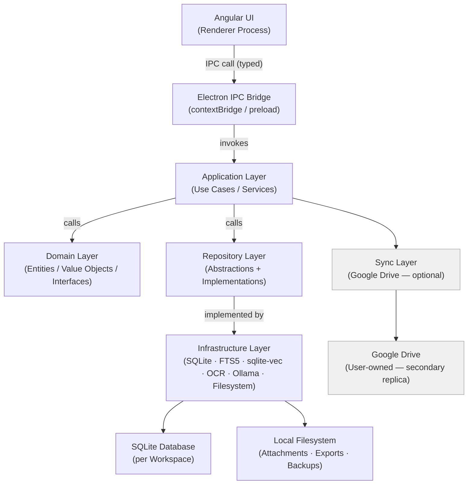
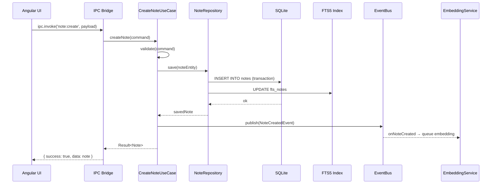

# 01 — System Overview

> **Document Type:** Architecture Overview
> **Status:** Draft
> **Applies To:** Notebook — All Versions
> **Related Documents:**
> [02-CleanArchitecture.md](./02-CleanArchitecture.md) · [03-Monorepo.md](./03-Monorepo.md) · [04-Electron.md](./04-Electron.md) · [05-Angular.md](./05-Angular.md) · [06-IPC.md](./06-IPC.md) · [../00-overview/01-Vision.md](../00-overview/01-Vision.md) · [../00-overview/03-Scope.md](../00-overview/03-Scope.md)

---

## 1. Purpose

This document provides the authoritative high-level architecture overview for Notebook. It describes the overall system structure, the major architectural layers, the data flow between them, and the key design decisions that shape the entire system.

All subsequent architecture documents in `docs/01-architecture/` elaborate on specific subsystems described here. This document is the starting point for any engineer or contributor onboarding to the project.

---

## 2. Architectural Philosophy

Notebook's architecture is shaped by three immovable constraints derived from [../00-overview/01-Vision.md](../00-overview/01-Vision.md):

1. **No developer-owned backend.** All computation, storage, and AI inference must run on the user's machine.
2. **The local SQLite database and filesystem are the single source of truth.** Google Drive is a sync target only.
3. **Every core feature must work fully offline.** Network is optional.

These constraints eliminate entire categories of architectural patterns (distributed systems, REST backends, cloud databases, microservices) and direct the architecture toward a **clean, layered, single-process desktop application** with optional network integration.

---

## 3. Technology Stack Summary

| Concern | Technology | Role |
|---|---|---|
| Desktop shell | Electron | Cross-platform desktop host; native OS integration |
| Frontend | Angular | UI framework; component tree; routing |
| Language | TypeScript | Static typing across all layers |
| Primary database | SQLite (via Prisma) | Relational data store, per Workspace |
| Full-text search | SQLite FTS5 | Keyword search over notes and attachments |
| Vector search | sqlite-vec | Semantic similarity search |
| Rich text editor | Tiptap | ProseMirror-based extensible editor |
| Local AI inference | Ollama | LLM and embedding model runner |
| OCR | Tesseract.js / Tesseract | Local optical character recognition |
| Sync | Google Drive API | Optional, user-initiated Workspace synchronization |

---

## 4. High-Level Layer Diagram



**Dependency rule:** Dependencies point inward. Outer layers depend on inner layers. Inner layers know nothing about outer layers. The Domain Layer has zero external dependencies.

---

## 5. Process Architecture

Notebook runs as an **Electron application** with two process types:

### 5.1 Main Process

The Electron main process is the application host. It runs in a full Node.js environment and is responsible for:

- Application lifecycle (startup, shutdown, window management)
- IPC message routing between renderer and application core
- Native OS integration (file dialogs, notifications, system tray)
- Application Layer execution (use cases, services)
- Repository Layer execution (database access, filesystem access)
- Ollama process management
- Google Drive sync coordination

The main process is the only process with unrestricted filesystem and Node.js API access. See [04-Electron.md](./04-Electron.md).

### 5.2 Renderer Process

The Angular application runs inside the Electron renderer process. The renderer:

- Has no direct access to Node.js APIs
- Communicates with the main process exclusively via the typed IPC bridge
- Manages all UI state, routing, and user interaction
- Receives streamed AI responses via IPC events

### 5.3 Preload Script

A preload script running with `contextIsolation: true` exposes a minimal, explicitly typed API surface to the renderer via `contextBridge`. This is the only permitted communication channel. See [06-IPC.md](./06-IPC.md) and [11-SecurityArchitecture.md](./11-SecurityArchitecture.md).

---

## 6. Data Architecture

### 6.1 Workspace as the Unit of Isolation

Every user data entity belongs to exactly one Workspace. Each Workspace is stored as:

```
~/Notebooks/<workspace-name>/
    notebook.db          ← SQLite database (notes, metadata, embeddings, FTS, version history)
    attachments/         ← Raw attachment files
    exports/             ← Temporary export staging area
    backups/             ← Local backup snapshots
    .manifest.json       ← Workspace identity and sync metadata
```

Workspaces are fully self-contained. Deleting the directory deletes the Workspace.

### 6.2 Primary vs. Secondary Storage

| Storage | Role | Authority |
|---|---|---|
| Local SQLite + filesystem | Primary data store | **Authoritative** |
| Google Drive | Sync replica | Secondary — never authoritative |

### 6.3 Search Architecture

Two complementary search subsystems run locally:

- **FTS5** — SQLite extension for keyword search. Maintains a virtual FTS table automatically updated on note/attachment write.
- **sqlite-vec** — SQLite extension for vector similarity search. Stores embeddings alongside note data in the same database file.

Both subsystems are queried locally with no network dependency.

---

## 7. AI Architecture Summary

AI features operate entirely on-device. The architecture is provider-abstracted:

```
Chat Service
    → Context Builder (retrieves relevant notes via semantic search)
    → AI Provider Interface
        → OllamaProvider (default)
        → [Plugin-registered provider] (optional)
```

The AI **shall never** receive note content unless it is the local provider. No content leaves the machine through the AI path unless the user explicitly configures a remote provider via the plugin system. See [13-AIArchitecture.md](./13-AIArchitecture.md).

---

## 8. Sync Architecture Summary

Google Drive sync is optional, user-initiated, and runs entirely on the client. The sync engine:

- Reads and writes the local Workspace directory
- Transfers files to/from the user's Google Drive using the Google Drive API
- Applies conflict detection and resolution locally
- Never modifies local data without user confirmation when a conflict cannot be resolved automatically

See [12-SynchronizationArchitecture.md](./12-SynchronizationArchitecture.md).

---

## 9. Plugin Architecture Summary

The Plugin System allows first- and third-party developers to extend Notebook without modifying core code. Plugins run within the main process under a declared-permission model. Extension points include: AI providers, sync providers, OCR providers, importers, exporters, editor extensions, and themes.

See [10-PluginArchitecture.md](./10-PluginArchitecture.md).

---

## 10. Data Flow — Core Note Creation

The following sequence illustrates the end-to-end data flow for creating and saving a note:



---

## 11. Key Architectural Decisions (Summary)

Full ADRs are in [14-ArchitectureDecisions.md](./14-ArchitectureDecisions.md). Summary:

| Decision | Choice | Primary Reason |
|---|---|---|
| Desktop framework | Electron | Cross-platform; full filesystem access; Node.js in main |
| Frontend | Angular | Dependency injection; strong typing; module system |
| Database | SQLite per Workspace | Embedded; serverless; portable; open format |
| ORM | Prisma | Type-safe queries; migration management |
| Architecture pattern | Clean Architecture + Repository | Testability; substitutability; no framework lock-in |
| AI runtime | Ollama | Local-first; model-agnostic; extensible |
| State management | Signals + Services (no NgRx) | Simplicity; avoids overhead for a single-user app |
| Plugin isolation | Main process + permission model | Avoids renderer access; controllable API surface |
| Search | FTS5 + sqlite-vec | No external service; co-located with data |

---

## 12. Assumptions and Constraints

1. The application is single-user; no multi-user concurrency model is required.
2. All code executes within the Electron process pair (main + renderer). No external process is owned by the developer.
3. Ollama is a separately installed tool on the user's machine; Notebook manages its configuration but does not bundle it.
4. The architecture must remain testable: domain and application layers must be testable without Electron, Angular, or a real database.
5. Plugin code runs in the main process; renderer-side plugins (editor extensions, themes) are sandboxed through the Angular plugin host.

---

## 13. Future Considerations

- A formal process boundary between core and plugins (e.g., worker threads or secondary Electron utility processes) for stronger plugin isolation.
- Peer-to-peer sync as an alternative sync provider.
- A secondary read model (in-memory cache) for performance-critical queries at very large Workspace scales.
