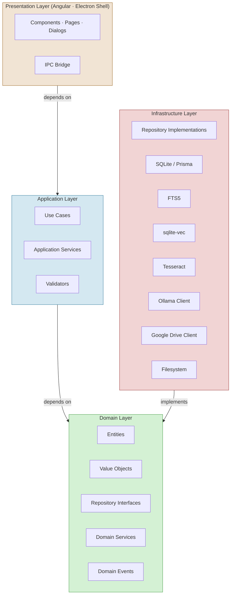
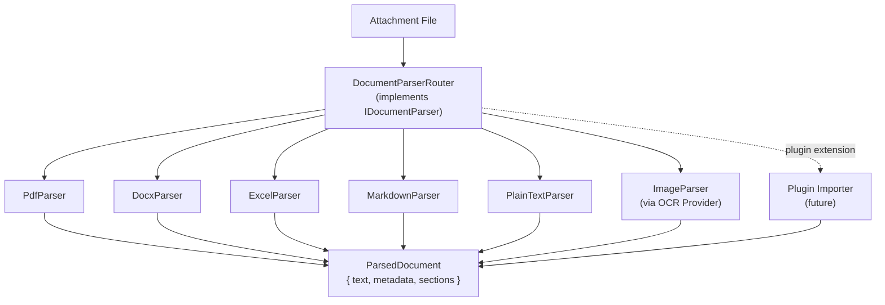
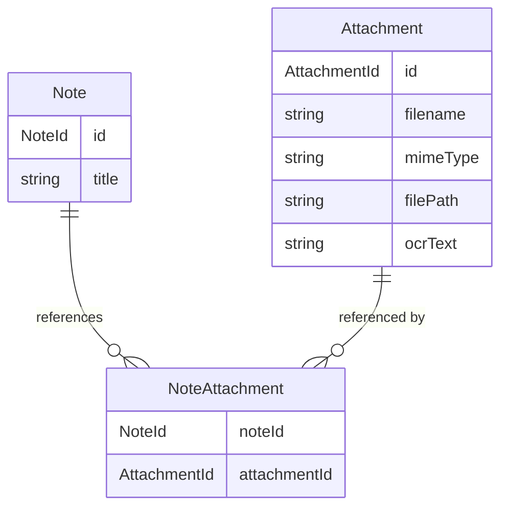

# 02 — Clean Architecture

> **Document Type:** Architecture Specification
> **Status:** Draft
> **Applies To:** Notebook — All Versions
> **Related Documents:**
> [01-SystemOverview.md](./01-SystemOverview.md) · [07-DependencyInjection.md](./07-DependencyInjection.md) · [08-RepositoryPattern.md](./08-RepositoryPattern.md) · [../00-overview/03-Scope.md](../00-overview/03-Scope.md)

---

## 1. Purpose

This document specifies how Clean Architecture principles are applied throughout Notebook. It defines the layer boundaries, the dependency rule, and the responsibilities of each layer. Every module, service, and class in the codebase **shall** be placed in a layer consistent with the rules defined here.

---

## 2. Why Clean Architecture

Notebook has a unique set of constraints that make Clean Architecture an ideal fit:

- **No backend.** Business logic must live entirely in the desktop application. It cannot be distributed to a server.
- **Testability without infrastructure.** Domain and application logic must be unit-testable without Electron, Angular, SQLite, or a real filesystem.
- **Extensibility.** The plugin system requires that AI, OCR, sync, and import/export subsystems be substitutable behind interfaces.
- **Longevity.** A personal knowledge management tool accumulates years of user data. The architecture must support maintenance and evolution without requiring data migrations caused by architectural refactoring.

---

## 3. The Four Layers



**The Dependency Rule:** Source code dependencies **shall** only point inward. Presentation depends on Application. Application depends on Domain. Infrastructure implements Domain interfaces. Domain depends on nothing.

---

## 4. Domain Layer

**Location:** `packages/domain/`

The Domain Layer is the innermost layer. It contains the core business logic and has **zero** external dependencies — no Electron, no Angular, no Prisma, no SQLite, no filesystem.

### 4.1 Entities

Entities are the core business objects. They have identity (a unique ID) and encapsulate business rules that operate on their own state.

| Entity | Description |
|---|---|
| `Workspace` | Top-level container; identity and metadata |
| `Note` | Primary content unit; title, body, timestamps |
| `Folder` | Hierarchical organizational container |
| `Attachment` | File metadata (not the file itself) |
| `Tag` | User-defined label, Workspace-scoped |
| `Todo` | Task item with status and optional due date |
| `NoteVersion` | Immutable snapshot of Note content |
| `WikiLink` | Directed link from one Note to another |
| `Backlink` | Inverse of a WikiLink; computed by the domain service |
| `AiChat` | Conversation session within a Workspace |
| `AiMessage` | Single message within an AiChat |
| `Embedding` | Vector metadata associated with a Note or Attachment |

### 4.2 Value Objects

Value Objects are immutable, identity-free objects that represent domain concepts through their value.

| Value Object | Description |
|---|---|
| `NoteId` | Typed wrapper around a note identifier |
| `WorkspaceId` | Typed wrapper around a Workspace identifier |
| `FolderId` | Typed wrapper around a folder identifier |
| `AttachmentId` | Typed wrapper around an attachment identifier |
| `NoteContent` | Rich text content with validation rules |
| `TagName` | Validated, normalized tag string |
| `FilePath` | Validated local filesystem path |
| `WikiLinkTarget` | `[[Note Title]]` parsed reference |
| `EmbeddingVector` | Fixed-size float array |
| `SyncVersion` | Monotonic version counter for sync metadata |

### 4.3 Repository Interfaces

Repository interfaces are defined in the Domain Layer. They describe persistence operations in domain terms without specifying how those operations are implemented.

```
INoteRepository
    findById(id: NoteId): Promise<Note | null>
    findByWorkspace(workspaceId: WorkspaceId): Promise<Note[]>
    findByFolder(folderId: FolderId): Promise<Note[]>
    save(note: Note): Promise<Note>
    delete(id: NoteId): Promise<void>
    moveToTrash(id: NoteId): Promise<void>

IWorkspaceRepository
IFolderRepository
IAttachmentRepository
ITagRepository
ITodoRepository
INoteVersionRepository
IEmbeddingRepository
IAiChatRepository
ISearchRepository
```

Full interface specifications are in [08-RepositoryPattern.md](./08-RepositoryPattern.md).

### 4.4 Domain Services

Domain Services contain business logic that spans multiple entities and cannot naturally belong to a single entity.

| Domain Service | Responsibility |
|---|---|
| `BacklinkService` | Compute and maintain bidirectional backlinks across all Wiki Links |
| `WikiLinkResolver` | Parse `[[Note Title]]` syntax and resolve to `NoteId` |
| `NoteVersioningService` | Determine when a new version snapshot should be recorded |
| `WorkspaceIntegrityService` | Validate Workspace consistency (referential integrity) |
| `TagNormalizationService` | Normalize and deduplicate tag names |

### 4.5 Domain Events

Domain events are value objects representing something that has happened in the domain. They are published by the application layer after successful operations. See [09-EventBus.md](./09-EventBus.md).

```
NoteCreatedEvent        { noteId, workspaceId, timestamp }
NoteUpdatedEvent        { noteId, workspaceId, timestamp }
NoteDeletedEvent        { noteId, workspaceId, timestamp }
AttachmentAddedEvent    { attachmentId, noteId, workspaceId }
TagAppliedEvent         { tagId, noteId, workspaceId }
TodoCompletedEvent      { todoId, workspaceId, timestamp }
WorkspaceOpenedEvent    { workspaceId }
SyncCompletedEvent      { workspaceId, timestamp, result }
EmbeddingQueuedEvent    { sourceId, sourceType, workspaceId }
```

---

## 5. Application Layer

**Location:** `packages/application/`

The Application Layer orchestrates domain objects to fulfill use cases. It contains **no business rules** — those live in the Domain Layer. It contains **no infrastructure concerns** — those live in the Infrastructure Layer.

### 5.1 Use Cases

Each use case corresponds to a single user-initiated action. Use cases:

- Receive a command (plain data object — no entities)
- Validate the command using domain validators
- Load domain entities via repository interfaces
- Apply domain logic
- Persist changes via repository interfaces
- Publish domain events via the event bus
- Return a result

**Use Case inventory (partial):**

| Use Case | Command |
|---|---|
| `CreateNoteUseCase` | `CreateNoteCommand` |
| `UpdateNoteUseCase` | `UpdateNoteCommand` |
| `DeleteNoteUseCase` | `DeleteNoteCommand` |
| `MoveNoteUseCase` | `MoveNoteCommand` |
| `CreateWorkspaceUseCase` | `CreateWorkspaceCommand` |
| `OpenWorkspaceUseCase` | `OpenWorkspaceCommand` |
| `ExportWorkspaceUseCase` | `ExportWorkspaceCommand` |
| `ImportWorkspaceUseCase` | `ImportWorkspaceCommand` |
| `BackupWorkspaceUseCase` | `BackupWorkspaceCommand` |
| `RestoreWorkspaceUseCase` | `RestoreWorkspaceCommand` |
| `AddAttachmentUseCase` | `AddAttachmentCommand` |
| `RunOcrUseCase` | `RunOcrCommand` |
| `SearchNotesUseCase` | `SearchNotesQuery` |
| `SemanticSearchUseCase` | `SemanticSearchQuery` |
| `SendAiMessageUseCase` | `SendAiMessageCommand` |
| `SyncWorkspaceUseCase` | `SyncWorkspaceCommand` |
| `CreateTodoUseCase` | `CreateTodoCommand` |
| `CompleteTodoUseCase` | `CompleteTodoCommand` |
| `InstallPluginUseCase` | `InstallPluginCommand` |
| `RestoreNoteVersionUseCase` | `RestoreNoteVersionCommand` |

### 5.2 Application Services

Application Services handle cross-cutting concerns that span multiple use cases but are not domain logic:

| Service | Responsibility |
|---|---|
| `WorkspaceManager` | Workspace lifecycle, active context management, manifest read/write |
| `EmbeddingQueueService` | Manages the queue of pending embedding jobs |
| `OcrQueueService` | Manages the queue of pending OCR jobs |
| `BackgroundJobManager` | Coordinates all long-running background jobs with queueing, retry, and progress reporting |
| `PluginRegistryService` | Manages registered plugins and their capabilities |
| `EventBusService` | Publishes and subscribes to domain events |
| `ConfigurationService` | Reads and writes application configuration |

### 5.3 Error Handling

All use cases **shall** return a `Result<T, AppError>` discriminated union rather than throwing exceptions. This ensures:

- IPC handlers can serialize errors cleanly to the renderer
- Tests can assert on error types without try/catch
- Error categories are explicit: `ValidationError`, `NotFoundError`, `ConflictError`, `InfrastructureError`, `PermissionError`

### 5.4 Transactions

Use cases that write to multiple repositories **shall** coordinate writes within a single database transaction, managed through a `UnitOfWork` abstraction provided by the infrastructure layer.

---

## 6. Infrastructure Layer

**Location:** `packages/infrastructure/`

The Infrastructure Layer contains all external concerns: database access, filesystem operations, OCR, AI communication, and Google Drive sync. It **implements** Domain interfaces. It knows about Domain entities but the Domain knows nothing about Infrastructure.

Key implementations:

| Interface | Implementation |
|---|---|
| `INoteRepository` | `PrismaNoteRepository` |
| `ISearchRepository` | `Fts5SearchRepository` |
| `IEmbeddingRepository` | `SqliteVecEmbeddingRepository` |
| `IAiProvider` | `OllamaAiProvider` |
| `IEmbeddingProvider` | `OllamaEmbeddingProvider` |
| `IOcrProvider` | `TesseractOcrProvider` |
| `ISyncProvider` | `GoogleDriveSyncProvider` |
| `IFileStorage` | `LocalFileStorage` |
| `IDocumentParser` | `DocumentParserRouter` (delegates to format-specific parsers) |

### 6.1 Document Parser Abstraction

The **Document Parser** layer converts every supported file format into a common internal representation before content is indexed for search or AI retrieval. This ensures that search and AI subsystems are decoupled from individual file format implementations.



The `ParsedDocument` output is the single contract consumed by:
- The **FTS5 indexer** (indexes the extracted text for keyword search)
- The **Embedding Queue** (embeds the extracted text for semantic search)
- The **AI Retrieval Service** (uses the parsed text as context)

Individual parser implementations live in `packages/infrastructure/parsers/`. New format support is added by implementing `IDocumentParser` and registering with the router — or by installing a plugin that declares `importer` extension point capabilities.

See [../01-architecture/08-RepositoryPattern.md](./08-RepositoryPattern.md) for the full pattern specification.

---

## 7. Presentation Layer

**Location:** `apps/desktop/src/` (Angular) and `apps/desktop/electron/` (Electron)

The Presentation Layer consists of:

- **Angular components** — UI rendering and user interaction
- **Angular services** — UI-level state, formatting, and IPC call coordination
- **IPC bridge** — The sole communication channel to the Application Layer

The Presentation Layer **shall not** contain business logic. It **shall not** directly access the database, filesystem, or any infrastructure concern.

---

## 8. Layer Enforcement

To enforce layer boundaries mechanically:

- Each layer lives in a separate package in the monorepo (see [03-Monorepo.md](./03-Monorepo.md)).
- TypeScript `paths` configuration and ESLint import boundary rules **shall** enforce that inner layers cannot import from outer layers.
- The Domain package has no `dependencies` in its `package.json` (only `devDependencies` for testing tools).

---

## 9. Trade-offs

| Trade-off | Mitigation |
|---|---|
| More files and indirection than a simple service-based approach | Justified by the testability and substitutability requirements of the plugin system and multi-provider AI/OCR/sync |
| Command/Result objects add verbosity | Balanced by predictable, serializable IPC contracts |
| Strict layer separation requires care when adding features | Enforced by ESLint import rules and monorepo package boundaries |

---

## 10. Acceptance Criteria

- Domain layer package has zero production dependencies on Electron, Angular, Prisma, or any I/O library.
- All use cases can be executed in a pure Node.js test environment with in-memory repository mocks.
- Swapping `OllamaAiProvider` for a mock AI provider requires no changes to any use case or domain entity.
- ESLint import boundary rule violations block CI builds.

---

## 11. Attachment Ownership Model

The architecture treats Attachments as **independent entities**, not as embedded children of a Note.

### 11.1 Ownership Rules

| Rule | Detail |
|---|---|
| **Attachments are independent** | An `Attachment` entity has its own identity (`AttachmentId`) and exists independently of any Note |
| **Notes reference Attachments** | A Note contains a set of `AttachmentId` references; it does not contain the attachment data |
| **Attachment files are not embedded** | The actual file is stored in `attachments/` on the filesystem; the database record contains only metadata (path, MIME type, size, OCR status) |
| **Multiple Notes may reference the same Attachment** | A shared file (e.g., a company logo PDF) can be referenced by multiple Notes without duplication |
| **Deleting a Note does not delete referenced Attachments** | Attachments are only deleted through an explicit `DeleteAttachmentUseCase` or through Trash permanent deletion |

### 11.2 Reference Model



This model **shall** be reflected consistently across the Domain entities, repository interfaces, and database schema.
