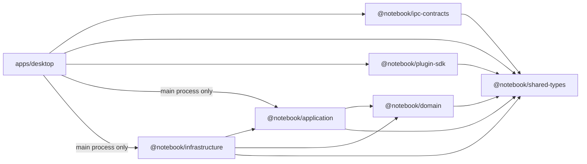

# 03 — Monorepo Structure

> **Document Type:** Architecture Specification
> **Status:** Draft
> **Applies To:** Notebook — All Versions
> **Related Documents:**
> [01-SystemOverview.md](./01-SystemOverview.md) · [02-CleanArchitecture.md](./02-CleanArchitecture.md) · [04-Electron.md](./04-Electron.md) · [05-Angular.md](./05-Angular.md)

---

## 1. Purpose

This document specifies the monorepo structure for the Notebook project. It defines the directory layout, the responsibilities of each package, the dependency graph between packages, and the tooling conventions that enforce those responsibilities.

---

## 2. Monorepo Rationale

A monorepo is chosen for the following reasons:

1. **Single TypeScript compilation context.** Shared types between the Angular UI and the Electron main process are automatically consistent.
2. **Atomic commits.** A change spanning domain, infrastructure, and UI can land in a single commit, keeping the repository in a always-shippable state.
3. **Simplified dependency management.** All packages share a single `node_modules` lockfile, eliminating version drift between internal packages.
4. **Enforced layer boundaries.** ESLint import rules and TypeScript project references enforce Clean Architecture layer separation at the tooling level.

---

## 3. Recommended Tooling

| Tool | Role |
|---|---|
| **pnpm workspaces** | Package manager with workspace support and efficient `node_modules` |
| **Nx** (optional) | Build orchestration, caching, affected-project detection, task pipelines |
| **TypeScript Project References** | Incremental compilation; enforces inter-package dependency graph |
| **ESLint + eslint-plugin-boundaries** | Import boundary enforcement between layers |
| **Vitest** | Unit and integration testing for Node.js packages |
| **Karma / Jest** | Angular unit testing in the `desktop` app |
| **Electron Forge** | Application packaging and distribution |

---

## 4. Top-Level Directory Structure

```
notebook/
├── apps/
│   └── desktop/                  ← Electron + Angular application
│
├── packages/
│   ├── domain/                   ← Domain Layer (entities, value objects, interfaces)
│   ├── application/              ← Application Layer (use cases, application services)
│   ├── infrastructure/           ← Infrastructure Layer (Prisma, OCR, Ollama, filesystem)
│   ├── ipc-contracts/            ← Shared IPC channel definitions and payload types
│   ├── shared-types/             ← Shared TypeScript types (DTOs, enums, result types)
│   └── plugin-sdk/               ← Public Plugin SDK (interfaces, decorators, utilities)
│
├── docs/
│   ├── 00-overview/              ← Vision, goals, scope, requirements, roadmap, glossary
│   ├── 01-architecture/          ← Architecture specifications (this directory)
│   ├── 02-database/              ← Database schema, migrations, indexing
│   ├── 03-modules/               ← Module-level functional specifications
│   ├── 04-sdk/                   ← Plugin SDK documentation
│   ├── 05-development/           ← Coding standards, contribution guide
│   └── 06-adr/                   ← Architecture Decision Records
│
├── scripts/
│   ├── build/                    ← Build and packaging scripts
│   ├── dev/                      ← Development utility scripts
│   └── db/                       ← Database migration and seeding scripts
│
├── .github/
│   └── workflows/                ← CI/CD pipeline definitions
│
├── package.json                  ← Root workspace manifest
├── pnpm-workspace.yaml           ← pnpm workspace configuration
├── tsconfig.base.json            ← Shared TypeScript base configuration
└── .eslintrc.js                  ← Root ESLint configuration with boundary rules
```

---

## 5. Package Responsibilities

### 5.1 `apps/desktop/`

The single deployable application. Contains two sub-trees:

```
apps/desktop/
├── electron/
│   ├── main.ts                   ← Electron main process entry point
│   ├── preload.ts                ← contextBridge preload script
│   ├── ipc/
│   │   └── handlers/             ← IPC handler registrations (thin — delegate to use cases)
│   └── lifecycle/                ← App startup, window management, tray
│
├── src/                          ← Angular application root
│   ├── app/
│   │   ├── core/                 ← Core module (guards, interceptors, global services)
│   │   ├── shared/               ← Shared components, directives, pipes
│   │   ├── features/             ← Feature modules (workspace, notes, search, ai-chat, etc.)
│   │   └── app.routes.ts         ← Root routing
│   ├── assets/
│   └── styles/
│
├── package.json
└── tsconfig.json
```

**Responsibilities:**
- Application shell and window management
- Angular UI rendering
- IPC handler registration (delegates immediately to use cases — no business logic here)
- Preload script exposing the typed IPC bridge

**Allowed dependencies:** `@notebook/ipc-contracts`, `@notebook/shared-types`, `@notebook/application` (main process only), `@notebook/plugin-sdk`

**Prohibited imports from:** `@notebook/domain` (directly), `@notebook/infrastructure` (directly from renderer)

---

### 5.2 `packages/domain/`

```
packages/domain/
├── entities/                     ← Note, Workspace, Folder, Attachment, Tag, Todo, etc.
├── value-objects/                ← NoteId, WorkspaceId, NoteContent, TagName, etc.
├── interfaces/
│   └── repositories/             ← INoteRepository, IWorkspaceRepository, etc.
├── services/                     ← BacklinkService, WikiLinkResolver, NoteVersioningService
├── events/                       ← Domain event definitions
└── errors/                       ← Domain error types
```

**Responsibilities:**
- All core business entities and their invariants
- Repository interfaces (contracts, not implementations)
- Domain services for cross-entity business logic
- Domain event type definitions

**Allowed dependencies:** None (zero production dependencies)

**Prohibited imports from:** Any other package in this monorepo

---

### 5.3 `packages/application/`

```
packages/application/
├── use-cases/
│   ├── workspace/                ← CreateWorkspace, OpenWorkspace, ExportWorkspace, etc.
│   ├── notes/                    ← CreateNote, UpdateNote, DeleteNote, MoveNote, etc.
│   ├── attachments/              ← AddAttachment, DeleteAttachment, RunOcr, etc.
│   ├── search/                   ← SearchNotes, SemanticSearch
│   ├── ai/                       ← SendAiMessage, ClearAiChat
│   ├── sync/                     ← SyncWorkspace, RestoreWorkspace
│   ├── plugins/                  ← InstallPlugin, UninstallPlugin, EnablePlugin
│   └── todos/                    ← CreateTodo, CompleteTodo, DeleteTodo
├── services/
│   ├── EmbeddingQueueService.ts
│   ├── OcrQueueService.ts
│   ├── WorkspaceSessionService.ts
│   ├── PluginRegistryService.ts
│   └── EventBusService.ts
├── interfaces/
│   ├── IAiProvider.ts            ← AI provider interface (used by application, implemented by infra)
│   ├── IEmbeddingProvider.ts
│   ├── IOcrProvider.ts
│   ├── ISyncProvider.ts
│   └── IFileStorage.ts
└── errors/                       ← Application-level error types (ValidationError, etc.)
```

**Responsibilities:**
- Use case orchestration
- Application-level service coordination
- Provider interfaces for AI, OCR, sync, storage
- Event publishing

**Allowed dependencies:** `@notebook/domain`, `@notebook/shared-types`

**Prohibited imports from:** `@notebook/infrastructure`, `@notebook/ipc-contracts`, any Electron or Angular module

---

### 5.4 `packages/infrastructure/`

```
packages/infrastructure/
├── database/
│   ├── prisma/
│   │   ├── schema.prisma         ← Prisma schema
│   │   └── migrations/           ← Generated migration files
│   └── repositories/
│       ├── PrismaNoteRepository.ts
│       ├── PrismaWorkspaceRepository.ts
│       ├── PrismaFolderRepository.ts
│       └── ...
├── search/
│   ├── Fts5SearchRepository.ts
│   └── SqliteVecEmbeddingRepository.ts
├── ai/
│   ├── OllamaAiProvider.ts
│   └── OllamaEmbeddingProvider.ts
├── ocr/
│   └── TesseractOcrProvider.ts
├── sync/
│   └── GoogleDriveSyncProvider.ts
├── filesystem/
│   └── LocalFileStorage.ts
├── logging/
│   └── FileLogger.ts
└── config/
    └── ConfigurationStore.ts
```

**Responsibilities:**
- All concrete implementations of domain repository interfaces
- All concrete implementations of application provider interfaces
- Database schema and migrations (Prisma)
- External service clients (Ollama, Google Drive, Tesseract)
- Filesystem operations
- Logging and configuration persistence

**Allowed dependencies:** `@notebook/domain`, `@notebook/application`, `@notebook/shared-types`, all external npm packages

---

### 5.5 `packages/ipc-contracts/`

```
packages/ipc-contracts/
├── channels.ts                   ← All IPC channel name constants
├── payloads/
│   ├── note.payloads.ts          ← CreateNoteRequest, UpdateNoteRequest, etc.
│   ├── workspace.payloads.ts
│   ├── search.payloads.ts
│   ├── ai.payloads.ts
│   └── sync.payloads.ts
└── responses/
    ├── note.responses.ts         ← NoteDto, NoteListDto, etc.
    └── ...
```

**Responsibilities:**
- Defines all IPC channel names as typed constants
- Defines all request payload and response DTO types
- Shared between the Electron main process (handler side) and Angular renderer (call site side)
- Ensures IPC contracts are always type-safe

**Allowed dependencies:** `@notebook/shared-types` only

---

### 5.6 `packages/shared-types/`

```
packages/shared-types/
├── result.ts                     ← Result<T, E> discriminated union
├── errors.ts                     ← AppError, ErrorCode enum
├── pagination.ts                 ← PageRequest, PageResult<T>
└── enums/
    ├── NoteStatus.ts
    ├── SyncStatus.ts
    └── PluginStatus.ts
```

**Responsibilities:**
- Cross-cutting utility types used by all packages
- `Result<T, E>` type (success/failure discriminated union)
- Common enumerations
- Pagination types

**Allowed dependencies:** None

---

### 5.7 `packages/plugin-sdk/`

```
packages/plugin-sdk/
├── interfaces/
│   ├── IPlugin.ts                ← Plugin manifest and lifecycle interface
│   ├── IAiProviderPlugin.ts
│   ├── ISyncProviderPlugin.ts
│   ├── IOcrProviderPlugin.ts
│   ├── IImporterPlugin.ts
│   ├── IExporterPlugin.ts
│   └── IEditorExtensionPlugin.ts
├── permissions/
│   └── PluginPermission.ts       ← Permission enum and declaration types
├── decorators/
│   └── Plugin.ts                 ← @Plugin() decorator for metadata registration
└── host/
    └── PluginHostApi.ts          ← The controlled API surface exposed to plugins
```

**Responsibilities:**
- Public interface contracts that plugin authors implement
- Permission declarations
- The bounded API surface available to plugins
- Plugin metadata types

**Allowed dependencies:** `@notebook/shared-types`

---

## 6. Inter-Package Dependency Graph



---

## 7. Scripts

| Script Location | Purpose |
|---|---|
| `scripts/build/package.ts` | Packages the Electron app for distribution |
| `scripts/build/sign.ts` | Code signing for macOS / Windows |
| `scripts/dev/seed-workspace.ts` | Creates a development Workspace with sample data |
| `scripts/db/migrate.ts` | Runs Prisma migrations against a target Workspace |
| `scripts/db/generate.ts` | Regenerates Prisma client after schema changes |

---

## 8. Conventions

1. Each package **shall** have its own `package.json`, `tsconfig.json`, and `vitest.config.ts`.
2. All package names **shall** follow the `@notebook/<name>` namespace.
3. TypeScript `paths` aliases in `tsconfig.base.json` **shall** map `@notebook/*` to the correct package `src/` directory.
4. ESLint boundary rules **shall** be configured to error on any import that violates the dependency graph in §6.
5. No package **shall** have a circular dependency with any other package.

---

## 9. Future Considerations

- If plugin isolation requires a worker thread boundary, plugins may be moved to a `packages/plugin-runtime/` package with a message-passing API.
- A `packages/testing/` package containing shared test utilities, mock factories, and in-memory repository implementations.
- Nx project graph visualization for dependency auditing.
