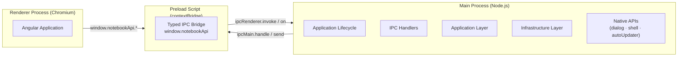
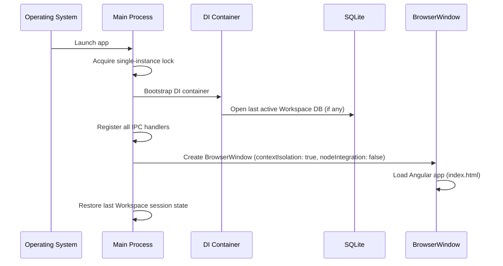

# 04 — Electron Architecture

> **Document Type:** Architecture Specification
> **Status:** Draft
> **Applies To:** Notebook — All Versions
> **Related Documents:**
> [01-SystemOverview.md](./01-SystemOverview.md) · [06-IPC.md](./06-IPC.md) · [11-SecurityArchitecture.md](./11-SecurityArchitecture.md) · [03-Monorepo.md](./03-Monorepo.md)

---

## 1. Purpose

This document specifies the Electron architecture for Notebook — how the main process, renderer process, and preload script are structured, how they communicate, how security is enforced, and how native OS capabilities are used.

---

## 2. Electron Process Model

Notebook runs as a standard Electron application with two process types and a preload bridge:



---

## 3. Main Process

**Entry point:** `apps/desktop/electron/main.ts`

The main process is the heart of the application. It is a standard Node.js process and has unrestricted access to the OS.

### 3.1 Responsibilities

| Responsibility | Details |
|---|---|
| Window management | Create, resize, minimize, maximize, and close `BrowserWindow` instances |
| Application lifecycle | `app.on('ready')`, `app.on('window-all-closed')`, single-instance lock |
| IPC handler registration | Register all `ipcMain.handle()` handlers at startup |
| Application Layer execution | Instantiate and invoke use cases with injected infrastructure implementations |
| Native dialogs | File open/save dialogs via `dialog.showOpenDialog()` |
| Native shell | Open URLs or files in the OS default application via `shell.openExternal()` |
| System tray | Optional tray icon with context menu |
| Auto-update | Future: Electron's `autoUpdater` integration |
| Ollama process awareness | Verify Ollama is running; surface status to renderer |

### 3.2 Startup Sequence



### 3.3 Single Instance Lock

The application **shall** use `app.requestSingleInstanceLock()` to prevent multiple instances from running simultaneously. If a second instance is launched, the existing instance's window is focused and brought to the front.

### 3.4 Window Configuration

```
BrowserWindow({
  contextIsolation: true,    // REQUIRED — see §6
  nodeIntegration: false,    // REQUIRED — see §6
  sandbox: false,            // Preload requires Node access; mitigated by contextIsolation
  webSecurity: true,
  preload: path.join(__dirname, 'preload.js'),
  show: false,               // Show only after 'ready-to-show' event to prevent flicker
})
```

---

## 4. Renderer Process

**Location:** `apps/desktop/src/` (Angular application)

The renderer process is a standard Chromium browser context. It runs the Angular application.

### 4.1 Constraints

- The renderer **shall not** have access to Node.js APIs.
- The renderer **shall not** access the filesystem directly.
- The renderer **shall not** communicate with the database directly.
- The renderer **shall** communicate with the main process exclusively via `window.notebookApi` (the contextBridge API).

### 4.2 Responsibilities

- Render the Angular component tree
- Manage UI-level state (active note, sidebar state, theme preference)
- Invoke IPC calls to the main process for all data operations
- Receive IPC events pushed from main (e.g., sync status updates, AI response streaming)
- Handle routing and navigation

---

## 5. Preload Script

**Entry point:** `apps/desktop/electron/preload.ts`

The preload script runs in a special context that has access to both Node.js APIs (via Electron's preload context) and the renderer's `window`. It uses `contextBridge.exposeInMainWorld()` to create a strictly typed API surface.

### 5.1 Exposed API Shape

The exposed API (`window.notebookApi`) mirrors the IPC contract packages. It exposes:

- **`invoke(channel, payload)`** — For request/response patterns (returns a Promise)
- **`on(channel, handler)`** — For push events from main (sync status, AI streaming, OCR progress)
- **`off(channel, handler)`** — Removes event listeners

The channel names and payload types are shared via `@notebook/ipc-contracts`. See [06-IPC.md](./06-IPC.md).

### 5.2 Whitelist Principle

The preload **shall** expose only the channels defined in `@notebook/ipc-contracts`. Any channel not explicitly listed **shall** be unreachable from the renderer. This is enforced by the typed wrapper, not by a runtime filter, though both **should** be applied.

---

## 6. Security Model

Security is a first-class concern. See [11-SecurityArchitecture.md](./11-SecurityArchitecture.md) for the complete threat model. The key Electron-specific rules:

| Setting | Value | Rationale |
|---|---|---|
| `contextIsolation` | `true` | Separates preload and renderer JavaScript contexts. Prevents renderer from accessing Node.js globals. |
| `nodeIntegration` | `false` | Renderer cannot call Node.js APIs directly. |
| `webSecurity` | `true` | Prevents cross-origin requests from renderer. |
| `allowRunningInsecureContent` | `false` | No mixed content. |
| `sandbox` | `false` | Preload needs Node.js access for `ipcRenderer`; mitigated by `contextIsolation`. |

### 6.1 Content Security Policy

A strict Content Security Policy **shall** be set on the main window:

```
default-src 'self';
script-src 'self';
style-src 'self' 'unsafe-inline';
img-src 'self' data: blob:;
connect-src 'self';
```

External URLs **shall** be opened via `shell.openExternal()`, never loaded in the app window.

### 6.2 Navigation Restriction

The application **shall** intercept `will-navigate` and `new-window` events and prevent any navigation to external URLs within the application window.

---

## 7. Native API Usage

| API | Usage |
|---|---|
| `dialog.showOpenDialog()` | File picker for importing files and opening Workspace directories |
| `dialog.showSaveDialog()` | File picker for exporting notes and Workspace archives |
| `shell.openExternal(url)` | Open links from note content in the system browser |
| `shell.openPath(path)` | Open attachment files in the system default application |
| `app.getPath('userData')` | Resolve platform-appropriate application data directory for configuration storage |
| `app.getPath('home')` | Default Workspace creation location |
| `nativeTheme.shouldUseDarkColors` | Detect system dark/light mode preference |
| `powerMonitor` | Future: detect sleep/wake for deferred sync |
| `autoUpdater` | Future: automatic application update delivery |

---

## 8. File Access Model

The main process has unrestricted filesystem access. File operations **shall** be performed exclusively in the main process.

The renderer **shall** never receive raw file paths in a way that allows it to construct arbitrary filesystem reads. File content **shall** be passed as data (Buffer, string) via IPC — not as file paths.

File dialogs (§7) return paths to the main process only. The main process performs the file operation and returns the result data.

---

## 9. IPC Architecture Overview

IPC is covered in full in [06-IPC.md](./06-IPC.md). At the Electron level:

- **Request/Response:** `ipcMain.handle()` + `ipcRenderer.invoke()` — for all data operations
- **Main-to-Renderer Push:** `webContents.send()` + `ipcRenderer.on()` — for streaming AI responses, OCR progress, sync status updates

---

## 10. Application Packaging

The application **shall** be packaged using **Electron Forge** with the following targets:

| Platform | Format |
|---|---|
| Windows | NSIS installer + portable `.exe` |
| macOS | `.dmg` + Mac App Store submission bundle (future) |
| Linux | AppImage + `.deb` |

Build configuration **shall** reside in `apps/desktop/forge.config.ts`.

Code signing credentials **shall** be managed via CI/CD secrets and never committed to the repository.

---

## 11. Future Considerations

- **Auto-update:** Electron's `autoUpdater` module, pointing to a release server or GitHub Releases. Updates download in the background and are applied on restart.
- **Utility process:** For stronger plugin isolation, plugins could run in Electron's `utilityProcess` (Node.js child process with IPC) rather than the main process.
- **Deep links:** `app.setAsDefaultProtocolClient('notebook://')` for opening specific Workspaces or notes from external links.
