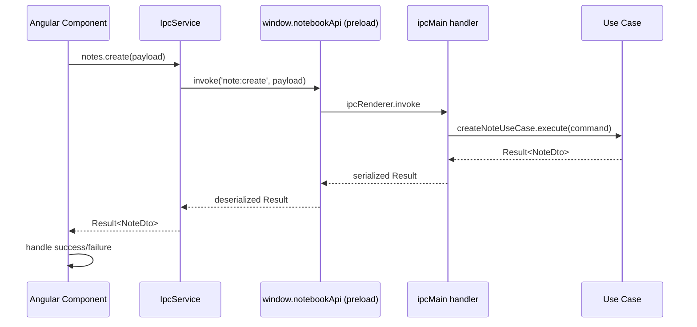
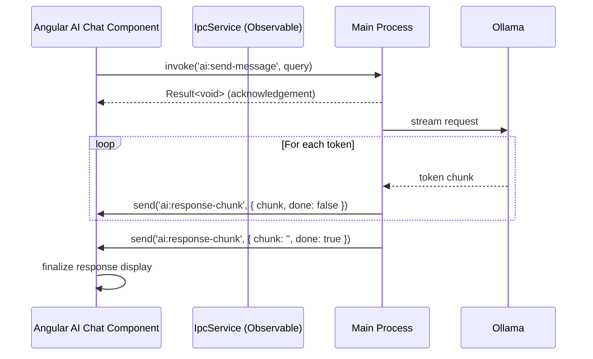

# 06 — IPC Architecture

> **Document Type:** Architecture Specification
> **Status:** Draft
> **Applies To:** Notebook — All Versions
> **Related Documents:**
> [04-Electron.md](./04-Electron.md) · [05-Angular.md](./05-Angular.md) · [11-SecurityArchitecture.md](./11-SecurityArchitecture.md) · [03-Monorepo.md](./03-Monorepo.md)

---

## 1. Purpose

This document specifies the Inter-Process Communication (IPC) architecture between the Angular renderer process and the Electron main process. It defines the channel naming convention, message patterns, type-safety strategy, error propagation, and streaming communication.

---

## 2. Communication Model

The IPC bridge is the **only** communication channel between the renderer and the main process. There are two message patterns:

| Pattern | Direction | Mechanism | Use For |
|---|---|---|---|
| Request / Response | Renderer → Main → Renderer | `ipcRenderer.invoke` / `ipcMain.handle` | All data operations (CRUD, search, AI queries) |
| Push Event | Main → Renderer | `webContents.send` / `ipcRenderer.on` | Streaming AI responses, sync progress, OCR progress, background task notifications |

No other communication mechanism (shared memory, file polling, WebSockets) **shall** be used.

---

## 3. Channel Naming Convention

All IPC channels **shall** follow the `domain:action` naming pattern, defined as typed constants in `@notebook/ipc-contracts`.

```
Channel Name Pattern:  <domain>:<action>

Examples:
  note:create
  note:update
  note:delete
  note:get
  note:list
  workspace:create
  workspace:open
  workspace:export
  workspace:backup
  search:fulltext
  search:semantic
  ai:send-message
  ai:clear-chat
  sync:start
  sync:status
  ocr:get-status
  tag:list
  todo:create
  todo:complete
  plugin:install
  plugin:list
  version-history:list
  version-history:restore
```

Push event channels follow the `domain:event` pattern:
```
  ai:response-chunk
  sync:status-changed
  ocr:progress
  embedding:progress
  plugin:status-changed
```

---

## 4. Type Safety Strategy

Type safety is enforced end-to-end using the `@notebook/ipc-contracts` package, which is shared between the main and renderer processes.

### 4.1 Contract Definition (in `@notebook/ipc-contracts`)

For every channel, the contract package defines:
- A channel name constant
- A request payload type
- A response type (wrapped in `Result<T, AppError>`)

```
// Example pattern (illustrative — not implementation code)

Channels.NOTE_CREATE = 'note:create'

type CreateNoteRequest = {
  workspaceId: string
  folderId?: string
  title: string
}

type CreateNoteResponse = Result<NoteDto, AppError>
```

### 4.2 Main Process Handler (type-checked)

IPC handlers in the main process are typed against the contract package. The handler receives the typed payload and returns the typed response.

### 4.3 Renderer IPC Service (type-checked)

The `IpcService` in Angular wraps `window.notebookApi.invoke()` with the typed contract so each method is fully typed at the call site. The compiler catches payload mismatches and return type errors.

---

## 5. Request / Response Flow



### 5.1 Handler Responsibility

IPC handlers in the main process **shall** be thin. They **shall**:
1. Deserialize the incoming payload
2. Delegate immediately to the appropriate use case
3. Serialize and return the `Result`

They **shall not** contain business logic, validation, or database calls.

---

## 6. Error Propagation

All IPC responses **shall** be wrapped in `Result<T, AppError>` (defined in `@notebook/shared-types`). This is a discriminated union:

```
Result<T, AppError>
  | { success: true;  data: T }
  | { success: false; error: AppError }

AppError {
  code: ErrorCode       // enum: VALIDATION_ERROR | NOT_FOUND | CONFLICT | INFRA_ERROR | PERMISSION_DENIED
  message: string
  details?: unknown
}
```

IPC handlers **shall never throw** to the renderer. All errors **shall** be caught in the handler and returned as `{ success: false, error }`. Electron's default behavior of propagating unhandled `ipcMain.handle` rejections as IPC errors is undesirable and **shall** be suppressed by wrapping all handlers in a try/catch.

---

## 7. Push Events (Main → Renderer)

For long-running operations that produce incremental output, the main process pushes events to the renderer using `webContents.send()`.

### 7.1 AI Response Streaming

When an AI message is sent (`ai:send-message`), the use case begins streaming the response from Ollama. Each token/chunk is pushed to the renderer as it arrives:



The `IpcService.ai.onResponseChunk()` method returns an RxJS `Observable<AiChunkEvent>` that the AI chat component subscribes to.

### 7.2 OCR Progress

```
send('ocr:progress', { attachmentId, status: 'processing' | 'complete' | 'failed', progress?: number })
```

### 7.3 Sync Status

```
send('sync:status-changed', { workspaceId, status: SyncStatus, lastSynced?: Date, error?: string })
```

### 7.4 Embedding Progress

```
send('embedding:progress', { itemId, itemType: 'note' | 'attachment', status: 'queued' | 'processing' | 'complete' | 'failed' })
```

---

## 8. IPC Handler Registration

All IPC handlers **shall** be registered at application startup in a dedicated `registerIpcHandlers()` function called from `main.ts`. Handlers are organized by domain:

```
apps/desktop/electron/ipc/
├── handlers/
│   ├── note.handlers.ts
│   ├── workspace.handlers.ts
│   ├── folder.handlers.ts
│   ├── attachment.handlers.ts
│   ├── search.handlers.ts
│   ├── ai.handlers.ts
│   ├── sync.handlers.ts
│   ├── tag.handlers.ts
│   ├── todo.handlers.ts
│   ├── version-history.handlers.ts
│   ├── plugin.handlers.ts
│   └── settings.handlers.ts
└── register-handlers.ts    ← Imports and calls all handler registration functions
```

---

## 9. Preload Script Structure

The preload script exposes `window.notebookApi` with the following top-level shape, namespaced by domain. Each method is typed against the corresponding contract:

```
window.notebookApi = {
  notes:          { create, get, update, delete, list, move, getBacklinks }
  workspaces:     { create, open, rename, delete, list, export, import, backup, restore }
  folders:        { create, rename, move, delete, list }
  attachments:    { add, delete, list, getOcrText }
  search:         { fullText, semantic }
  ai:             { sendMessage, clearChat, getChatHistory, onResponseChunk, offResponseChunk }
  sync:           { start, getStatus, authorize, revoke, onStatusChanged, offStatusChanged }
  tags:           { create, rename, delete, list, apply, remove }
  todos:          { create, update, complete, delete, list }
  versionHistory: { list, preview, restore }
  plugins:        { install, uninstall, enable, disable, list }
  settings:       { get, set }
  ocr:            { getStatus, onProgress, offProgress }
  shell:          { openExternal, openFile, showItemInFolder }
  dialog:         { showOpenDialog, showSaveDialog }
}
```

---

## 10. Security Considerations

- The preload script **shall** use `contextBridge.exposeInMainWorld()` — never set `window.*` properties directly.
- The preload **shall** validate that channel names passed to `invoke` are members of the known channel set before calling `ipcRenderer.invoke`.
- Push event listeners (`on` / `off`) **shall** be properly cleaned up when components unmount to prevent memory leaks and ghost listeners.
- The main process **shall** validate all incoming IPC payloads with a schema validator before passing to use cases.

See [11-SecurityArchitecture.md](./11-SecurityArchitecture.md) for the complete IPC threat model.

---

## 11. Acceptance Criteria

- No IPC handler contains business logic; all handlers delegate to use cases within 5 lines.
- All IPC channels are defined as constants in `@notebook/ipc-contracts`; no string literals appear in handler or call site code.
- A TypeScript error is produced at compile time if a call site passes the wrong payload type for any IPC channel.
- All push event listeners registered in Angular components are unregistered in `ngOnDestroy`.
- AI response streaming begins within 2 seconds of `ai:send-message` invocation on recommended hardware.
