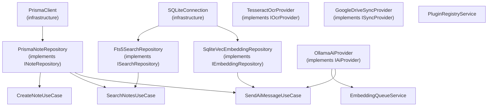

# 07 — Dependency Injection

> **Document Type:** Architecture Specification
> **Status:** Draft
> **Applies To:** Notebook — All Versions
> **Related Documents:**
> [02-CleanArchitecture.md](./02-CleanArchitecture.md) · [08-RepositoryPattern.md](./08-RepositoryPattern.md) · [04-Electron.md](./04-Electron.md) · [05-Angular.md](./05-Angular.md)

---

## 1. Purpose

This document specifies the Dependency Injection (DI) strategy for Notebook. It covers the DI approach for both the Electron main process (Node.js) and the Angular renderer process, explaining how interfaces are registered, how implementations are resolved, and how DI supports testability and extensibility.

---

## 2. DI in Two Contexts

Notebook has two separate runtime contexts that each require a DI approach:

| Context | DI Mechanism | Scope |
|---|---|---|
| **Electron main process** | Manual DI container (lightweight) | Application Layer + Infrastructure Layer |
| **Angular renderer process** | Angular's built-in DI system | UI Layer (components, services, guards) |

These are independent. The main process DI container is a plain TypeScript composition root. The Angular DI system handles UI concerns only.

---

## 3. Main Process — Composition Root

The Electron main process uses a **manual composition root** pattern rather than a third-party IoC container. This keeps the infrastructure simple, avoids unnecessary dependencies, and keeps the container fully transparent.

### 3.1 Rationale for Manual DI

- The application is single-user, single-process. There is no need for request-scoped lifetimes or complex scope hierarchies.
- A manual composition root is fully debuggable and readable without framework magic.
- Testing is achieved by constructing objects with mock dependencies, not by reconfiguring a container.
- A lightweight DI container library (e.g., `tsyringe`, `awilix`) **may** be used if the manual approach becomes unwieldy, but **shall** be introduced only if complexity justifies it.

### 3.2 Composition Root Structure

The composition root is a single module that wires all dependencies and exposes fully-constructed use case instances:

```
apps/desktop/electron/
└── container.ts    ← Composition root — creates all instances and wires dependencies
```

The composition root:

1. Creates infrastructure instances (Prisma client, SQLite connection, Tesseract, Ollama client)
2. Creates repository implementations (injecting infrastructure)
3. Creates application services (injecting repositories and other services)
4. Creates use cases (injecting repositories and services)
5. Exposes a `container` object that IPC handlers use to access use cases

### 3.3 Dependency Resolution Order



### 3.4 Lifetime Management

In the main process, all objects are effectively **singletons** for the application lifetime (or for the active Workspace lifetime). There are two natural scopes:

| Scope | Lifetime | Examples |
|---|---|---|
| **Application** | Created at startup; lives until app exit | `OllamaAiProvider`, `PluginRegistryService`, `ConfigurationStore`, `FileLogger` |
| **Workspace** | Created when a Workspace opens; torn down when it closes | `PrismaClient` (per Workspace DB), all Repository instances, `EmbeddingQueueService` |

When a Workspace is opened, the Workspace-scoped container is constructed. When it closes, the Prisma client is disconnected and all Workspace-scoped instances are released.

### 3.5 Interface-to-Implementation Mapping

| Interface | Default Implementation | Override Point |
|---|---|---|
| `INoteRepository` | `PrismaNoteRepository` | — |
| `IWorkspaceRepository` | `PrismaWorkspaceRepository` | — |
| `ISearchRepository` | `Fts5SearchRepository` | — |
| `IEmbeddingRepository` | `SqliteVecEmbeddingRepository` | — |
| `IAiProvider` | `OllamaAiProvider` | Plugin-registered provider |
| `IEmbeddingProvider` | `OllamaEmbeddingProvider` | Plugin-registered provider |
| `IOcrProvider` | `TesseractOcrProvider` | Plugin-registered provider |
| `ISyncProvider` | `GoogleDriveSyncProvider` | Plugin-registered provider |
| `IFileStorage` | `LocalFileStorage` | — |

When a plugin registers a provider override, the composition root **shall** substitute the plugin's implementation at the injection site of the affected use cases, without restarting.

---

## 4. Main Process — Dependency Inversion

The Dependency Inversion Principle is enforced by the Clean Architecture layer boundaries:

- Use cases (`packages/application/`) **only** hold references to **interfaces** (`INoteRepository`, `IAiProvider`, etc.)
- The interfaces are defined in `packages/domain/` (for repositories) and `packages/application/` (for providers)
- Concrete implementations live in `packages/infrastructure/`
- The composition root in `apps/desktop/electron/container.ts` is the **only** place where interfaces and implementations are connected

This means:
- No use case imports `PrismaNoteRepository` or `OllamaAiProvider`
- No use case knows what database or AI runtime is in use
- Replacing `OllamaAiProvider` with a plugin-provided `LlamaCppAiProvider` requires a change only in the composition root

---

## 5. Angular — Dependency Injection

The Angular renderer process uses Angular's built-in hierarchical DI system.

### 5.1 Provider Scopes

| Scope | Declaration | When to Use |
|---|---|---|
| **Root (singleton)** | `providedIn: 'root'` | `IpcService`, `WorkspaceService`, `ThemeService`, `ErrorService` |
| **Route-level** | `providers: []` in route config | Feature-specific services (e.g., `NoteEditorService`) |
| **Component-level** | `providers: []` in `@Component` | Per-instance services (rare) |

### 5.2 Injection Tokens

Where a service has multiple possible implementations (e.g., multiple theme providers), an **injection token** (`InjectionToken<T>`) **shall** be used rather than injecting the concrete class. This supports the plugin UI host, which may substitute a different implementation.

### 5.3 Angular DI and the IPC Service

The `IpcService` is the Angular DI boundary between the UI and the main process. All data access is mediated through it. No Angular service **shall** call `window.notebookApi` directly — they **shall** inject and use `IpcService`.

---

## 6. Testing Strategy

The DI architecture is specifically designed for testability:

### 6.1 Testing Use Cases

Use cases are tested with mock repository and provider implementations. Because use cases only hold interface references, test doubles are substituted at construction time:

```
// Testing pattern (illustrative)
const mockNoteRepo = new InMemoryNoteRepository()
const useCase = new CreateNoteUseCase(mockNoteRepo, mockEventBus)
const result = await useCase.execute(command)
```

No Electron, no Angular, no SQLite, no Ollama required.

### 6.2 Testing Infrastructure

Infrastructure implementations (Prisma repositories, Ollama provider) are tested with:
- An in-memory SQLite database (`:memory:`) for repository tests
- A mock HTTP server for Ollama client tests

### 6.3 Testing Angular Components

Angular component tests use Angular's `TestBed` with `IpcService` replaced by a mock. Components are tested in isolation from the main process entirely.

---

## 7. Trade-offs

| Trade-off | Mitigation |
|---|---|
| Manual composition root can become large | Split into sub-factories per domain area (workspace container, search container, ai container) |
| No automatic lifetime management for Workspace-scoped objects | Explicit `openWorkspace()` / `closeWorkspace()` lifecycle methods on the container |
| Angular DI and main process DI are disconnected | Intentional: they are separate runtimes. `IpcService` is the seam. |

---

## 8. Acceptance Criteria

- No use case contains a `new ConcreteImplementation()` call; all dependencies are injected via constructor.
- Swapping the AI provider (e.g., from Ollama to a plugin-provided provider) requires zero changes to any use case.
- All use cases can be instantiated and tested in a plain Node.js test environment with no Electron, Angular, or database running.
- All Angular components receive their data through injected services; no component directly calls `window.notebookApi`.
