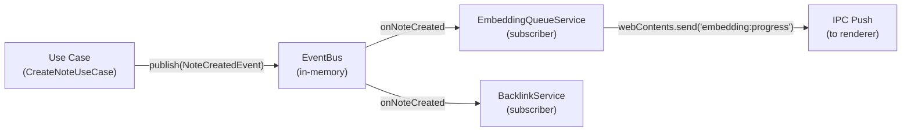

# 09 — Event Bus

> **Document Type:** Architecture Specification
> **Status:** Draft
> **Applies To:** Notebook — All Versions
> **Related Documents:**
> [02-CleanArchitecture.md](./02-CleanArchitecture.md) · [07-DependencyInjection.md](./07-DependencyInjection.md) · [06-IPC.md](./06-IPC.md)

---

## 1. Purpose

This document specifies the internal event bus architecture for Notebook. It defines the event-driven communication mechanism used within the main process application layer, the domain events catalogue, and the rules for when event-driven communication **shall** and **shall not** be used.

---

## 2. Philosophy — Lightweight, Not Complex

Notebook's event bus is intentionally lightweight. It is **not**:

- A distributed message broker (no RabbitMQ, Kafka, Redis pub/sub)
- An event sourcing system (events are notifications, not the primary record of state)
- A replacement for direct method calls within a single use case

The event bus exists to decouple side-effects from primary business operations. When a note is created, the primary operation (persist to DB) is synchronous and direct. The side-effects (queue an embedding job, update the FTS index, update backlinks) **should** be triggered by events rather than embedded as sequential calls in the use case.

---

## 3. Event Bus Design

The event bus runs entirely within the Electron main process. It is a simple publish/subscribe mechanism — a typed in-memory event emitter.



### 3.1 Implementation Approach

The event bus **shall** be implemented as a typed wrapper around Node.js's built-in `EventEmitter`. It provides:

- **Typed publish:** Accepts a domain event object; the event type determines the channel
- **Typed subscribe:** Accepts a handler typed to the specific event type
- **Unsubscribe:** Returns a cleanup function to remove the subscription
- **Synchronous dispatch by default:** Handlers are called synchronously within the same tick (preserves transaction integrity for FTS index updates)
- **Async handlers supported:** Handlers may be `async`; errors are caught and logged but do not propagate back to the publisher

### 3.2 Event Interface

All domain events **shall** implement a base interface:

```
IDomainEvent {
  readonly eventType: string      // Discriminant for the event catalogue
  readonly occurredAt: Date       // Timestamp of occurrence
  readonly workspaceId: string    // All events are Workspace-scoped
}
```

---

## 4. Domain Events Catalogue

### 4.1 Note Events

| Event | Published By | Payload |
|---|---|---|
| `NoteCreatedEvent` | `CreateNoteUseCase` | `noteId, folderId?, workspaceId, title` |
| `NoteUpdatedEvent` | `UpdateNoteUseCase` | `noteId, workspaceId, changedFields` |
| `NoteDeletedEvent` | `DeleteNoteUseCase` (trash) | `noteId, workspaceId` |
| `NotePermanentlyDeletedEvent` | `EmptyTrashUseCase` | `noteId, workspaceId` |
| `NoteRestoredEvent` | `RestoreNoteUseCase` | `noteId, workspaceId` |
| `NoteMovedEvent` | `MoveNoteUseCase` | `noteId, fromFolderId, toFolderId, workspaceId` |
| `NoteVersionCreatedEvent` | `UpdateNoteUseCase` | `versionId, noteId, workspaceId` |

### 4.2 Attachment Events

| Event | Published By | Payload |
|---|---|---|
| `AttachmentAddedEvent` | `AddAttachmentUseCase` | `attachmentId, noteId, workspaceId, fileType` |
| `AttachmentDeletedEvent` | `DeleteAttachmentUseCase` | `attachmentId, noteId, workspaceId` |
| `OcrCompletedEvent` | `OcrQueueService` | `attachmentId, workspaceId, text` |
| `OcrFailedEvent` | `OcrQueueService` | `attachmentId, workspaceId, error` |

### 4.3 Embedding Events

| Event | Published By | Payload |
|---|---|---|
| `EmbeddingQueuedEvent` | `EmbeddingQueueService` | `sourceId, sourceType, workspaceId` |
| `EmbeddingCompletedEvent` | `EmbeddingQueueService` | `sourceId, sourceType, workspaceId` |
| `EmbeddingFailedEvent` | `EmbeddingQueueService` | `sourceId, sourceType, workspaceId, error` |

### 4.4 Workspace Events

| Event | Published By | Payload |
|---|---|---|
| `WorkspaceOpenedEvent` | `OpenWorkspaceUseCase` | `workspaceId, path` |
| `WorkspaceClosedEvent` | Application lifecycle | `workspaceId` |
| `WorkspaceExportedEvent` | `ExportWorkspaceUseCase` | `workspaceId, exportPath` |
| `WorkspaceImportedEvent` | `ImportWorkspaceUseCase` | `workspaceId` |
| `WorkspaceBackupCreatedEvent` | `BackupWorkspaceUseCase` | `workspaceId, backupPath` |

### 4.5 Sync Events

| Event | Published By | Payload |
|---|---|---|
| `SyncStartedEvent` | `SyncWorkspaceUseCase` | `workspaceId` |
| `SyncCompletedEvent` | `SyncWorkspaceUseCase` | `workspaceId, result, timestamp` |
| `SyncFailedEvent` | `SyncWorkspaceUseCase` | `workspaceId, error` |
| `SyncConflictDetectedEvent` | `GoogleDriveSyncProvider` | `workspaceId, conflictDetails` |

### 4.6 Todo Events

| Event | Published By | Payload |
|---|---|---|
| `TodoCreatedEvent` | `CreateTodoUseCase` | `todoId, workspaceId` |
| `TodoCompletedEvent` | `CompleteTodoUseCase` | `todoId, workspaceId, completedAt` |
| `TodoDeletedEvent` | `DeleteTodoUseCase` | `todoId, workspaceId` |

### 4.7 Plugin Events

| Event | Published By | Payload |
|---|---|---|
| `PluginInstalledEvent` | `InstallPluginUseCase` | `pluginId, pluginName, version` |
| `PluginEnabledEvent` | `EnablePluginUseCase` | `pluginId` |
| `PluginDisabledEvent` | `DisablePluginUseCase` | `pluginId` |
| `PluginUninstalledEvent` | `UninstallPluginUseCase` | `pluginId` |

### 4.8 Tag Events

| Event | Published By | Payload |
|---|---|---|
| `TagAppliedEvent` | `ApplyTagUseCase` | `tagId, noteId, workspaceId` |
| `TagRemovedEvent` | `RemoveTagUseCase` | `tagId, noteId, workspaceId` |

---

## 5. Event Subscriber Responsibilities

| Subscriber | Events Handled | Action |
|---|---|---|
| `EmbeddingQueueService` | `NoteCreatedEvent`, `NoteUpdatedEvent`, `OcrCompletedEvent`, `AttachmentAddedEvent` | Enqueues the source for embedding/re-embedding |
| `OcrQueueService` | `AttachmentAddedEvent` | Enqueues image/PDF attachments for OCR |
| `BacklinkService` | `NoteCreatedEvent`, `NoteUpdatedEvent`, `NoteDeletedEvent`, `NoteMovedEvent` | Recomputes wiki link targets and updates backlink records |
| `FTS5 index updater` | `NoteCreatedEvent`, `NoteUpdatedEvent`, `NoteDeletedEvent`, `OcrCompletedEvent` | Keeps the FTS index consistent with note/attachment content |
| `IPC Push dispatcher` | `SyncCompletedEvent`, `EmbeddingCompletedEvent`, `OcrCompletedEvent` | Sends `webContents.send()` updates to the renderer |
| `NoteVersioningService` | `NoteUpdatedEvent` | Creates a version snapshot if the update meets the versioning policy threshold |

---

## 6. Rules — When to Use and When Not to Use Events

### 6.1 Use Events For

- **Decoupled side-effects:** When a primary operation has secondary consequences that are not fundamental to the operation's success. Example: note save succeeds even if embedding fails.
- **Cross-service coordination:** When two services should react to the same event independently. Example: both `EmbeddingQueueService` and `BacklinkService` react to `NoteUpdatedEvent`.
- **Asynchronous background work:** OCR processing and embedding generation are queued via events so they do not block the use case response.
- **IPC push notifications:** Domain events trigger `webContents.send()` to notify the renderer of background task completion.

### 6.2 Do NOT Use Events For

- **Primary operation steps:** If the UI requires the result of a step before proceeding, do it synchronously in the use case.
- **Cross-use-case synchronous orchestration:** Do not chain use cases through events. Call the second use case directly.
- **Data retrieval:** Events are notifications, not queries. Never use events to fetch data.
- **Replacing transactions:** Do not use events to simulate atomicity. Use a `UnitOfWork` transaction instead.
- **User-facing workflows that require failure feedback:** If the user must know that a step failed (e.g., sync failure), surface the failure directly — do not bury it in an event handler.

---

## 7. Error Handling

Event handlers **shall** wrap their logic in try/catch. An error in an event handler **shall**:

1. Be logged to the filesystem logger
2. Not propagate back to the publisher (the use case must not fail because a side-effect fails)
3. Where appropriate, publish a failure event (e.g., `EmbeddingFailedEvent`) for other subscribers to react to

---

## 8. Event Ordering and Consistency

The event bus dispatches handlers synchronously by default within a single process tick. This means:

- FTS index updates happen synchronously after a note save (within the same request context)
- Embedding and OCR are asynchronous (handlers schedule work on a background queue)
- There is no guaranteed ordering between independent async handlers

If ordering is critical (e.g., the FTS index must be updated before the use case returns a search result), the synchronous nature of the default dispatch guarantees this within a single use case invocation.

---

## 9. Future Considerations

- If plugin isolation moves to a `utilityProcess` worker, events crossing the process boundary would be serialized over IPC — events would need to be serializable (currently they are).
- A persistent event log (write-ahead log of events) for debugging or audit purposes could be added as a subscriber without changing publishers.
- Rate-limiting or batching for high-frequency events (e.g., rapid typing triggering many `NoteUpdatedEvent` instances) — debouncing in the use case before publishing is the preferred mitigation.
