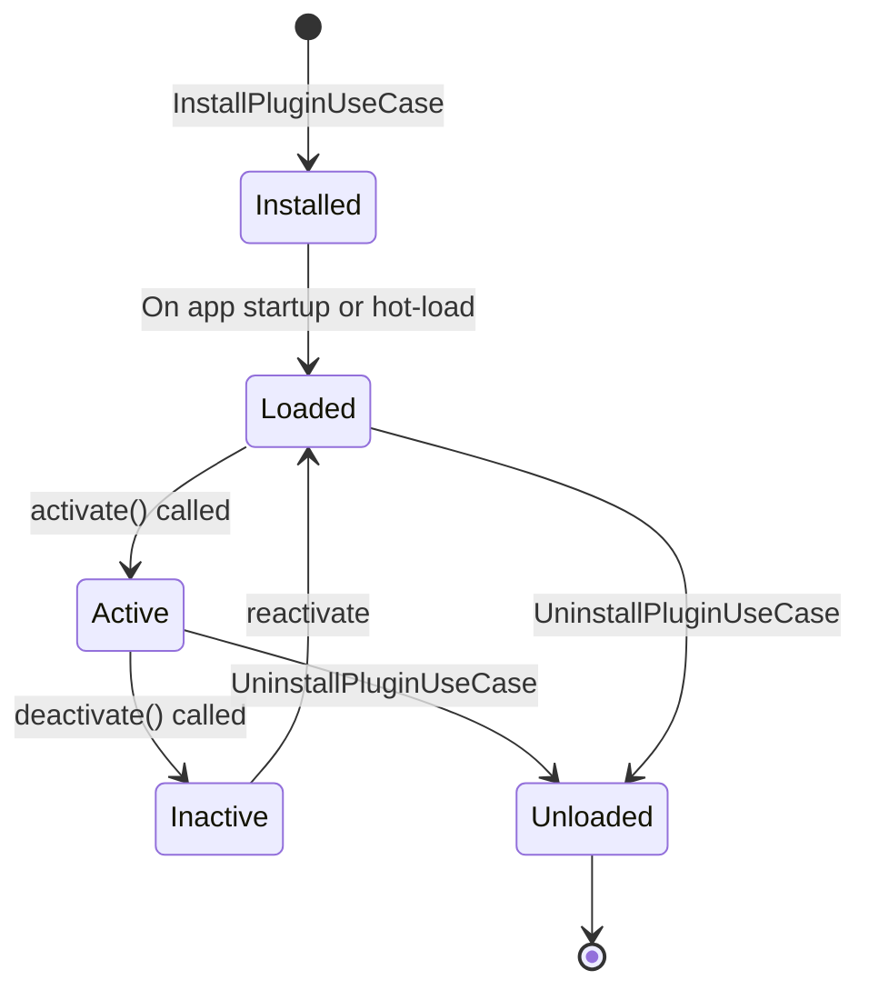

# 10 — Plugin Architecture

> **Document Type:** Architecture Specification
> **Status:** Draft
> **Applies To:** Notebook — All Versions
> **Related Documents:**
> [01-SystemOverview.md](./01-SystemOverview.md) · [02-CleanArchitecture.md](./02-CleanArchitecture.md) · [07-DependencyInjection.md](./07-DependencyInjection.md) · [11-SecurityArchitecture.md](./11-SecurityArchitecture.md) · [03-Monorepo.md](./03-Monorepo.md)

---

## 1. Purpose

This document specifies the Plugin Architecture for Notebook. It defines the plugin extension model, lifecycle, permission system, isolation boundaries, and how plugins integrate with the application's dependency injection and event systems.

---

## 2. Design Goals

The plugin system **shall**:

1. Allow first-party and third-party plugins to extend major subsystems without modifying core code.
2. Enforce a declared-permission model — plugins cannot access APIs they have not declared.
3. Isolate plugin failures from the core application — a misbehaving plugin **shall not** crash the application.
4. Be version-compatible — plugins declare the minimum SDK version they require; the application enforces compatibility.
5. Be installed from the local filesystem in the initial release.

---

## 3. Extension Points

The following subsystems expose plugin extension points:

| Extension Point | Interface | Description |
|---|---|---|
| **AI Provider** | `IAiProviderPlugin` | Replace or supplement Ollama as the LLM inference backend |
| **Embedding Provider** | `IEmbeddingProviderPlugin` | Replace or supplement the default embedding model |
| **OCR Provider** | `IOcrProviderPlugin` | Replace Tesseract with an alternative OCR engine |
| **Sync Provider** | `ISyncProviderPlugin` | Add alternative sync targets (Dropbox, WebDAV, etc.) |
| **Importer** | `IImporterPlugin` | Add support for additional import formats |
| **Exporter** | `IExporterPlugin` | Add support for additional export formats |
| **Editor Extension** | `IEditorExtensionPlugin` | Add Tiptap extensions (new node types, marks, commands) |
| **Theme** | `IThemePlugin` | Supply a custom CSS theme |
| **Automation** | `IAutomationPlugin` | React to domain events and perform custom actions |

---

## 4. Plugin Manifest

Every plugin **shall** include a `plugin.json` manifest at its root:

```json
{
  "id": "com.example.my-plugin",
  "name": "My Plugin",
  "version": "1.0.0",
  "sdkVersion": "^1.0.0",
  "description": "Short description of the plugin",
  "author": "Author Name",
  "entryPoint": "dist/index.js",
  "extensionPoints": ["ai-provider"],
  "permissions": [
    "filesystem:read",
    "network:outbound",
    "workspace:read"
  ]
}
```

| Field | Required | Description |
|---|---|---|
| `id` | Yes | Globally unique reverse-DNS identifier |
| `name` | Yes | Human-readable display name |
| `version` | Yes | SemVer version |
| `sdkVersion` | Yes | Required Plugin SDK version range (SemVer range) |
| `description` | Yes | Short description for the plugin manager UI |
| `entryPoint` | Yes | Path to the compiled plugin module (CommonJS) |
| `extensionPoints` | Yes | Array of extension point identifiers the plugin uses |
| `permissions` | Yes | Array of permission identifiers the plugin requires |

---

## 5. Plugin Lifecycle



### 5.1 Installation

`InstallPluginUseCase`:
1. Validate the `plugin.json` manifest (schema, required fields, SDK version compatibility)
2. Display declared permissions to the user and request confirmation
3. Copy the plugin directory to the application's plugin storage directory
4. Register the plugin in the local plugin registry (stored in the application configuration database)
5. Publish `PluginInstalledEvent`

### 5.2 Loading

At startup (and when hot-loading after install), `PluginRegistryService`:
1. Reads the plugin registry
2. For each enabled plugin, loads the plugin module using `require()` (CommonJS) in the main process
3. Validates the exported object implements the declared extension point interfaces
4. Injects the `PluginHostApi` — the controlled API surface available to the plugin
5. Calls `plugin.activate(hostApi)`

### 5.3 Activation

`plugin.activate(hostApi)`:
- The plugin registers its capabilities with the host (e.g., registers itself as an AI provider)
- The plugin subscribes to events via the host API (if it has `automation` permissions)
- Returns a cleanup function

### 5.4 Deactivation

When a plugin is disabled or the application is shutting down:
- The cleanup function returned by `activate()` is called
- The plugin is removed from the provider registry (if it was a provider)
- The plugin's event subscriptions are removed

### 5.5 Uninstallation

`UninstallPluginUseCase`:
1. Deactivate and unload the plugin
2. Delete the plugin directory from plugin storage
3. Remove the plugin from the registry
4. Publish `PluginUninstalledEvent`

---

## 6. Plugin Host API

The `PluginHostApi` is the only interface through which plugins interact with the application. It is a capability-restricted API — only capabilities corresponding to declared permissions are available. Attempting to call an undeclared API method **shall** throw a `PermissionDeniedError`.

```
PluginHostApi {
  // Registration (always available)
  registerAiProvider(provider: IAiProvider): void
  registerEmbeddingProvider(provider: IEmbeddingProvider): void
  registerOcrProvider(provider: IOcrProvider): void
  registerSyncProvider(provider: ISyncProvider): void
  registerImporter(importer: IImporter): void
  registerExporter(exporter: IExporter): void

  // Available with 'workspace:read' permission
  workspace: {
    getActiveWorkspaceId(): string
    getNoteMetadata(noteId: string): Promise<NoteMetadata>
  }

  // Available with 'events:subscribe' permission
  events: {
    subscribe<T extends IDomainEvent>(eventType: string, handler: (event: T) => void): () => void
  }

  // Available with 'filesystem:read' permission
  filesystem: {
    readFile(path: string): Promise<Buffer>
    readDirectory(path: string): Promise<string[]>
  }

  // Available with 'filesystem:write' permission
  filesystem: {
    writeFile(path: string, data: Buffer): Promise<void>
  }

  // Available with 'network:outbound' permission
  network: {
    fetch(url: string, options?: RequestInit): Promise<Response>
  }

  // Always available
  logger: {
    info(message: string): void
    warn(message: string): void
    error(message: string, error?: unknown): void
  }

  // Always available
  config: {
    get<T>(key: string): T | undefined
    set<T>(key: string, value: T): void
  }
}
```

---

## 7. Permission Model

### 7.1 Declared Permissions

| Permission | Access Granted |
|---|---|
| `workspace:read` | Read note metadata and Workspace info (not note content) |
| `workspace:read-content` | Read note content and attachment text |
| `filesystem:read` | Read files within the Workspace directory |
| `filesystem:write` | Write files within a plugin-specific subdirectory |
| `network:outbound` | Make outbound HTTP/HTTPS requests |
| `events:subscribe` | Subscribe to domain events |
| `ui:editor-extension` | Register Tiptap editor extensions |
| `ui:theme` | Register a UI theme |

### 7.2 Permission Enforcement

- At plugin load time, the `PluginHostApi` is constructed with only the methods corresponding to the plugin's declared permissions exposed. Other methods are absent.
- At runtime, the host validates that file path arguments are within permitted directories before executing filesystem operations.

---

## 8. Plugin Isolation

In the initial release, plugins run in the main process under the declared-permission model described above. Full process-level isolation (utility processes or worker threads) is a future consideration.

Current isolation measures:
- Plugins access the application only through the narrow `PluginHostApi` — not the use cases or repositories directly
- Plugin errors are caught by the `PluginRegistryService` and logged without propagating
- A plugin that throws during `activate()` is marked as failed and disabled; it does not prevent other plugins or the core app from starting
- Plugin configuration is stored in an isolated namespace in the configuration store

---

## 9. Version Compatibility

- The Plugin SDK is versioned independently with SemVer.
- The application declares the current SDK version it supports.
- At plugin load time, the application checks the plugin's `sdkVersion` range against the supported SDK version.
- If incompatible, the plugin is disabled with a clear error message in the Plugin Manager UI.
- **Minor version increments** of the SDK are backward-compatible (new APIs added, no breaking changes).
- **Major version increments** indicate breaking changes; a migration guide is published.

---

## 10. UI-Side Plugin Integration (Editor Extensions and Themes)

Editor extensions and themes affect the Angular renderer process. The integration flow:

1. The main process loads and validates the plugin, then pushes the plugin's UI configuration to the renderer via IPC.
2. The `PluginUiHostService` (Angular) receives the configuration and:
   - For **editor extensions:** Dynamically registers the Tiptap extension with the active editor instance.
   - For **themes:** Injects the plugin's CSS custom properties into the document.
3. Plugin UI code is never loaded as a script tag or `eval`; editor extensions are defined as Tiptap extension configurations (plain data objects), not arbitrary code executed in the renderer.

---

## 11. Future Considerations

- **Plugin marketplace:** A community plugin registry with discovery, ratings, and one-click install. Requires plugin signing infrastructure.
- **Plugin sandboxing in utility processes:** Moving plugin execution to a separate `utilityProcess` for stronger isolation, communicating over IPC.
- **Plugin hot-reload:** For developer experience during plugin development.
- **Remote sync provider plugins:** Enabling sync to Dropbox, OneDrive, WebDAV, or self-hosted servers via the `ISyncProviderPlugin` interface.

---

## 12. Acceptance Criteria

- A plugin that throws an unhandled exception during `activate()` is disabled without crashing the application.
- A plugin calling a method not covered by its declared permissions receives a `PermissionDeniedError`.
- Disabling a plugin removes its registered provider and restores the application to default behavior.
- The SDK version compatibility check prevents a plugin with an incompatible `sdkVersion` from loading.
- Installing a plugin and enabling it does not require an application restart.
