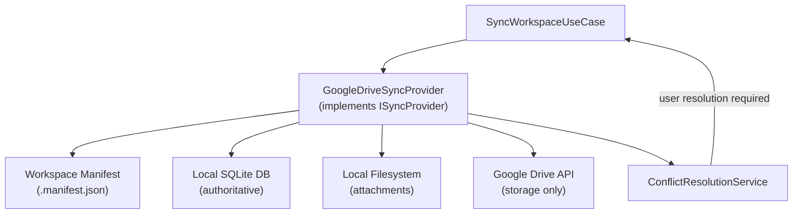
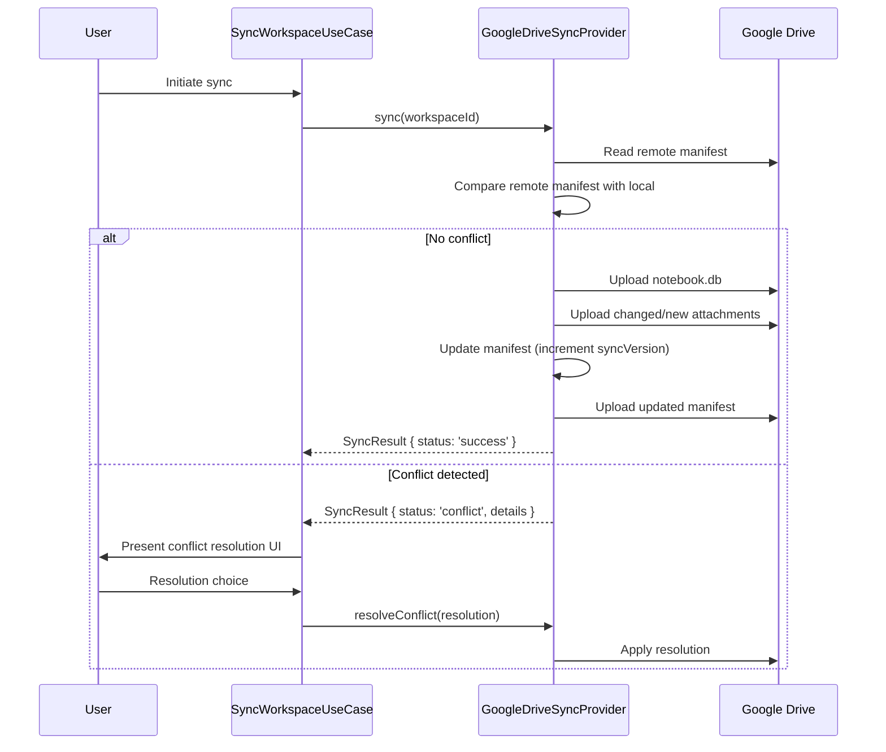
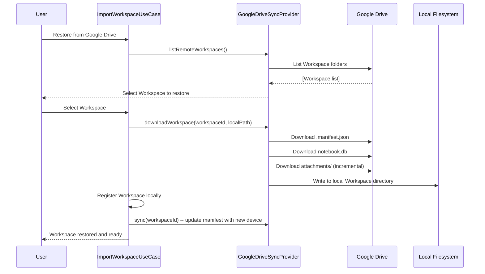

# 12 — Synchronization Architecture

> **Document Type:** Architecture Specification
> **Status:** Draft
> **Applies To:** Notebook — All Versions
> **Related Documents:**
> [01-SystemOverview.md](./01-SystemOverview.md) · [11-SecurityArchitecture.md](./11-SecurityArchitecture.md) · [../00-overview/04-FunctionalRequirements.md §14](../00-overview/04-FunctionalRequirements.md)

---

## 1. Purpose

This document specifies the synchronization architecture for Notebook. It covers the Google Drive sync mechanism, Workspace manifest design, conflict detection and resolution strategy, incremental sync, and Workspace restore.

**Key Principle:** Google Drive is a storage medium only. All synchronization logic — conflict detection, conflict resolution, manifest management, merge decisions — runs locally on the user's machine. Google Drive never executes any logic.

---

## 2. Sync Architecture Overview



---

## 3. Workspace Manifest

The Workspace manifest (`.manifest.json`) is the cornerstone of the sync system. It is a small JSON file stored in the Workspace root directory and synchronized to Google Drive alongside the database and attachments.

### 3.1 Manifest Contents

```json
{
  "workspaceId": "uuid-v4",
  "workspaceName": "My Knowledge Base",
  "schemaVersion": "1",
  "createdAt": "ISO-8601",
  "devices": {
    "device-id-1": {
      "deviceName": "MacBook Pro",
      "lastSyncAt": "ISO-8601",
      "syncVersion": 42
    },
    "device-id-2": {
      "deviceName": "Windows Desktop",
      "lastSyncAt": "ISO-8601",
      "syncVersion": 41
    }
  },
  "lastModifiedAt": "ISO-8601",
  "lastModifiedBy": "device-id-1"
}
```

### 3.2 Device ID

Each Notebook installation is assigned a persistent, locally-generated UUID (`deviceId`) stored in the application configuration. The device ID:

- Is generated once on first launch and never regenerated
- Is used to track which device last modified the Workspace
- Is used in conflict detection to identify the "other" device
- Is **not** linked to any user identity or account — it is anonymous

### 3.3 Sync Version

The `syncVersion` is a monotonically increasing integer maintained per device. It is incremented each time the device successfully completes a sync operation. It is used for ordering: a device with a higher `syncVersion` has more recent changes.

---

## 4. What Is Synchronized

The sync operation transfers the following from the local Workspace directory to Google Drive:

| Artifact | Sync Behavior |
|---|---|
| `notebook.db` | Synchronized as a single file (the SQLite database) |
| `attachments/` | Individual files synced incrementally; only changed/new files transferred |
| `.manifest.json` | Always synced; read first on restore |

**Not synchronized:**
- `exports/` — temporary export staging directory
- `backups/` — local backup snapshots are local-only
- Application configuration — not Workspace-specific

---

## 5. Sync Flow — Upload (Local → Google Drive)



---

## 6. Conflict Detection

A conflict occurs when **both** the local device and a remote device have made changes since the last successful sync. Conflict detection is based on the manifest:

1. The local sync provider reads the remote manifest from Google Drive.
2. It compares the remote `syncVersion` for the current device with the local `syncVersion`.
3. It compares the `lastModifiedAt` and `lastModifiedBy` fields.

**Conflict conditions:**

| Condition | Outcome |
|---|---|
| Remote `syncVersion` == local `syncVersion` and `lastModifiedBy` == this device | No conflict — local is up-to-date; upload changes |
| Remote `syncVersion` > local `syncVersion` and `lastModifiedBy` != this device | Remote is newer — download and merge OR present conflict |
| Remote `syncVersion` > local `syncVersion` but local has unsaved changes since last sync | **Conflict** — both sides have diverged |
| Remote manifest not found | First sync for this Workspace — upload directly |

---

## 7. Conflict Resolution Strategy

### 7.1 Automatic Resolution

The following cases **shall** be resolved automatically without user intervention:

- **Local only has deletions since last sync:** Remote is newer; accept remote changes, apply local deletions on top.
- **No local changes since last sync:** Remote is newer; download and restore (simple pull).
- **Remote has only attachment additions; local has only note edits:** Non-overlapping changes; merge both.

### 7.2 Manual Resolution (User Required)

When automatic resolution is not possible (e.g., both sides modified the same note content, or both sides deleted different notes), the application **shall**:

1. Present a conflict resolution UI listing the conflicting items.
2. For each conflict, offer choices: **Keep Local**, **Use Remote**, or **Keep Both** (creates a copy).
3. Never silently discard local data.

**The local copy is always preserved until the user explicitly chooses to replace it.**

### 7.3 Database-Level Conflict

Because the SQLite database is synced as a single file, a conflict at the database level means two different database files exist (local and remote). The resolution options are:

- **Keep Local:** The local database is kept; remote changes are discarded.
- **Use Remote:** The remote database replaces the local one (the current local database is backed up first to `backups/pre-sync-<timestamp>.db`).
- **Keep Both:** The remote database is copied to a new local Workspace, allowing the user to manually merge content.

---

## 8. Incremental Sync for Attachments

Attachment synchronization **should** be incremental — only changed or new files are transferred. This is implemented by:

1. Comparing the local attachment file's SHA-256 hash against the hash stored in the Google Drive file metadata.
2. Only uploading files where the local hash differs from the remote hash.
3. Only downloading files where the remote hash differs from the local file hash.

---

## 9. Workspace Restore

When a user opens Notebook on a new machine and wants to restore a Workspace from Google Drive:



---

## 10. Sync Modes

| Mode | Description | Trigger |
|---|---|---|
| **Manual sync** | User explicitly clicks "Sync Now" | User action in Sync UI |
| **Scheduled sync** (optional) | User configures a recurring sync interval | Configurable timer in Workspace settings |
| **Startup sync** | Sync is triggered automatically on Workspace open (if configured) | `WorkspaceOpenedEvent` + user setting |

**Background passive sync does not exist.** The application **shall not** sync automatically without user configuration or explicit action. This is consistent with the privacy-first principle.

---

## 11. Sync Provider Interface

The sync architecture is provider-abstracted via `ISyncProvider` (defined in `packages/application/interfaces/`):

```
ISyncProvider {
  isAuthorized(workspaceId: string): Promise<boolean>
  authorize(workspaceId: string): Promise<void>
  revoke(workspaceId: string): Promise<void>
  sync(workspaceId: string, localPath: string): Promise<SyncResult>
  listRemoteWorkspaces(): Promise<RemoteWorkspaceInfo[]>
  downloadWorkspace(remoteId: string, localPath: string): Promise<void>
}
```

The `GoogleDriveSyncProvider` implements this interface. Alternative sync providers (plugin-provided) implement the same interface and are substituted via the DI composition root.

---

## 12. Error Handling and Recovery

| Error Scenario | Behavior |
|---|---|
| Network loss during upload | Operation is aborted; local data is unchanged; error is reported; user can retry |
| Partial upload (only some files transferred) | Next sync detects incomplete state via manifest version mismatch; retry downloads/uploads the missing files |
| Remote manifest corrupted | Treat as first sync; prompt user before overwriting remote |
| OAuth token expired | Token refresh attempted automatically; if refresh fails, user is prompted to re-authorize |
| Local database write failed during restore | Pre-restore backup is retained; original local state is preserved |

---

## 13. Acceptance Criteria

- Google Drive sync can be authorized, executed, and revoked without affecting any local data in any failure scenario.
- A Workspace backed up to Google Drive can be fully restored on a new machine with all notes, attachments, tags, todos, and version history intact.
- A sync conflict is never resolved by silently discarding local data.
- Manual sync completes within 30 seconds for a Workspace with 10,000 notes and 1 GB of attachments on a 50 Mbps connection.
- Sync can be disabled for a Workspace without affecting any other Workspace.
