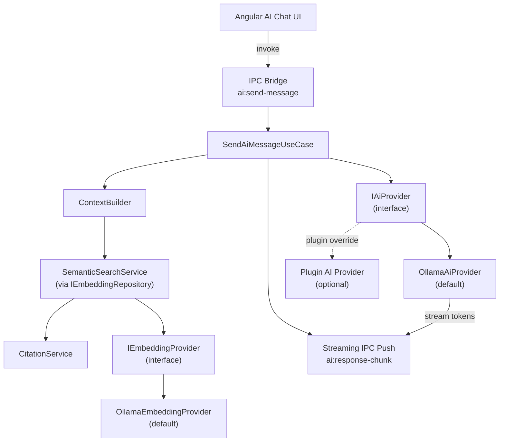
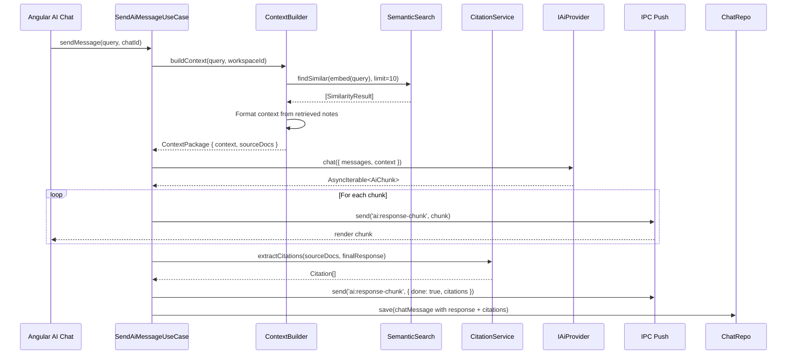

# 13 — AI Architecture

> **Document Type:** Architecture Specification
> **Status:** Draft
> **Applies To:** Notebook — All Versions
> **Related Documents:**
> [01-SystemOverview.md](./01-SystemOverview.md) · [02-CleanArchitecture.md](./02-CleanArchitecture.md) · [08-RepositoryPattern.md](./08-RepositoryPattern.md) · [09-EventBus.md](./09-EventBus.md) · [10-PluginArchitecture.md](./10-PluginArchitecture.md) · [../00-overview/04-FunctionalRequirements.md §8–10](../00-overview/04-FunctionalRequirements.md)

---

## 1. Purpose

This document specifies the high-level AI architecture for Notebook. It covers the provider abstractions, embedding pipeline, AI chat with Retrieval-Augmented Generation (RAG), streaming, citation, and fallback strategy.

**This document does not specify RAG internals** (chunking strategies, embedding models, similarity thresholds). Those are implementation decisions documented in `docs/03-modules/` once the architecture is established.

**Core constraint:** The AI **shall not** use knowledge outside the user's own Workspace content. No external API call is made during AI inference by default.

---

## 2. AI Architecture Overview



---

## 3. Provider Abstractions

The AI system is built entirely on interfaces. The default implementations use Ollama but can be replaced by plugin-provided implementations.

### 3.1 `IAiProvider`

Responsible for language model inference — generating responses to chat queries given a context.

```
IAiProvider {
  isAvailable(): Promise<boolean>
  listModels(): Promise<AiModelInfo[]>
  chat(request: AiChatRequest): AsyncIterable<AiChunk>
  getProviderInfo(): AiProviderInfo
}

AiChatRequest {
  model: string
  messages: AiMessage[]
  context: string          // Retrieved and formatted Workspace content
  maxTokens?: number
  temperature?: number
}

AiChunk {
  content: string
  done: boolean
  citations?: Citation[]
}
```

### 3.2 `IEmbeddingProvider`

Responsible for generating vector embeddings from text content.

```
IEmbeddingProvider {
  isAvailable(): Promise<boolean>
  embed(text: string): Promise<EmbeddingVector>
  embedBatch(texts: string[]): Promise<EmbeddingVector[]>
  getDimensions(): number
  getModelInfo(): EmbeddingModelInfo
}
```

### 3.3 `OllamaAiProvider` (Default Implementation)

Communicates with the locally-running Ollama process via its local HTTP API (`http://localhost:11434`). Ollama runs on loopback only — no external network connection is involved in default AI inference.

The provider:
- Detects whether Ollama is running and surfaces status to the application
- Lists available locally-installed models
- Streams responses using Ollama's streaming chat completion API
- Handles backpressure from the stream

### 3.4 Provider Selection and Fallback

At startup, the `PluginRegistryService` checks for a plugin-registered AI provider. If one is registered:
- The plugin provider is used for inference
- The user's configured model applies to the plugin provider

If no plugin provider is registered, `OllamaAiProvider` is used.

If Ollama is not running or no model is configured, the AI chat interface **shall** display a clear "AI unavailable" state with actionable guidance (start Ollama, select a model) rather than failing silently.

---

## 4. Embedding Pipeline

Vector embeddings are the backbone of semantic search and AI context retrieval.

### 4.1 Embedding Triggers

Embeddings are generated (or regenerated) when:

| Trigger | Source |
|---|---|
| Note created | `NoteCreatedEvent` → `EmbeddingQueueService` |
| Note content updated | `NoteUpdatedEvent` → `EmbeddingQueueService` |
| Attachment added | `AttachmentAddedEvent` → `EmbeddingQueueService` |
| OCR completed for attachment | `OcrCompletedEvent` → `EmbeddingQueueService` |

### 4.2 Embedding Queue

The `EmbeddingQueueService` maintains an in-memory queue of pending embedding jobs. It:

- Processes jobs sequentially (to avoid overwhelming the Ollama process)
- Retries failed jobs up to a configured limit with exponential backoff
- Persists queue state to the Workspace database so that a crash does not silently drop pending embeddings
- Pushes progress events to the renderer via IPC (`embedding:progress`)

### 4.3 Embedding Storage

Generated embedding vectors are stored in the Workspace SQLite database using the `sqlite-vec` extension, co-located with note metadata. Each embedding record stores:

- Source ID (note ID or attachment ID)
- Source type (`note` | `attachment`)
- Embedding vector (float array)
- Model identifier (so embeddings can be invalidated when the model changes)
- Generation timestamp

### 4.4 Model Change Invalidation

If the user changes the embedding model, all existing embeddings are invalidated (marked as stale) and the entire Workspace content is re-queued for re-embedding. This ensures semantic search results are always consistent with the current model.

---

## 5. AI Chat — Request Flow



### 5.1 Context Building

The `ContextBuilder` is responsible for:
1. Embedding the user's query using `IEmbeddingProvider`
2. Retrieving the top-N semantically similar notes and attachment texts using `IEmbeddingRepository.findSimilar()`
3. Including backlink-connected notes as supplementary context (lower weight)
4. Formatting the retrieved content into a structured context string suitable for the AI prompt
5. Returning the source documents for citation purposes

The context window size is bounded by the model's maximum context length. Content is truncated or ranked by relevance if it exceeds the limit.

### 5.2 Citation Service

The `CitationService` maps AI response content back to the source notes and attachments that were included in the context. Citations are stored with each AI message and rendered as clickable links in the chat UI that navigate to the source note.

### 5.3 Grounding Guarantee

The system prompt provided to the AI model **shall** include an explicit instruction to answer only from the provided context and to state when it cannot find relevant information in the provided notes. This is a prompt-level enforcement of the grounding guarantee (FR-AI-04).

---

## 6. Streaming

AI responses are streamed token by token from Ollama through the following path:

1. `OllamaAiProvider.chat()` returns an `AsyncIterable<AiChunk>` backed by Ollama's Server-Sent Events stream.
2. `SendAiMessageUseCase` iterates the async iterable.
3. Each chunk is pushed to the renderer via `webContents.send('ai:response-chunk', chunk)`.
4. The Angular AI chat component appends each chunk to the displayed response string.
5. When `done: true` is received, the component finalizes the response and renders citations.

---

## 7. AI Availability and Status

The application **shall** maintain and expose AI subsystem status to the UI via an IPC query:

| Status | Meaning |
|---|---|
| `available` | Ollama is running and at least one model is configured |
| `no-ollama` | Ollama process is not detected |
| `no-model` | Ollama is running but no model is selected/installed |
| `provider-error` | The active AI provider reported an error |
| `plugin-provider` | A plugin-registered AI provider is active |

---

## 8. Semantic Search (Standalone)

Semantic search is also available outside of AI chat as a standalone search mode:

1. The user's query is embedded using `IEmbeddingProvider`
2. The embedded query vector is compared against all stored embeddings in the Workspace using `IEmbeddingRepository.findSimilar()`
3. Results are ranked by cosine similarity score and returned to the UI

This is separate from the AI chat flow — semantic search returns notes, not AI-generated answers.

---

## 9. Future Considerations (AI-Specific)

These items are documented for awareness but **shall not** influence initial implementation decisions:

- **Chunking strategy:** Long notes may need to be chunked into multiple overlapping segments before embedding. The chunk size and overlap are model-dependent and will be specified in `docs/03-modules/`.
- **Re-ranking:** A second-stage cross-encoder re-ranker (local) for higher-precision context selection.
- **Multi-modal AI:** If Ollama adds stable multi-modal model support, image attachments could be directly referenced in AI context without requiring OCR.
- **Knowledge graph integration:** If graph visualization is added in a future version, the graph edges (wiki links, backlinks) could be used to augment semantic similarity scoring.
- **Conversation memory:** Maintaining a summarized long-term memory of past AI conversations within the Workspace, used as lightweight context in new sessions.

---

## 10. Acceptance Criteria

- AI chat is fully operational without internet connectivity when using the default Ollama provider.
- Every AI response cites the specific notes it used; citations are clickable links to those notes.
- Replacing `OllamaAiProvider` with a plugin-registered provider requires zero changes to `SendAiMessageUseCase`.
- When Ollama is not running, the AI chat UI displays a clear, actionable error state.
- Semantic search returns results within 1 second for a Workspace with 10,000 embedded documents.
- After a note is edited, its embedding is updated before the next semantic search returns stale results.
