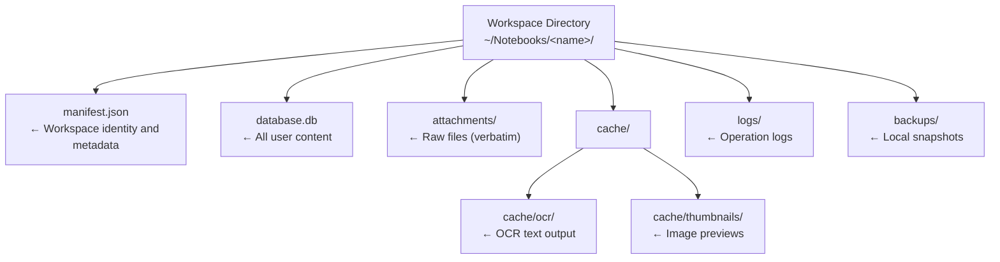
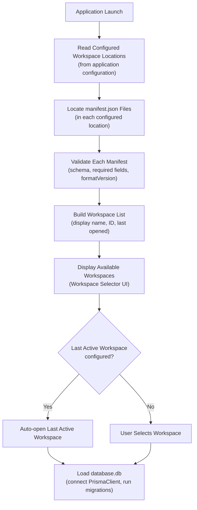
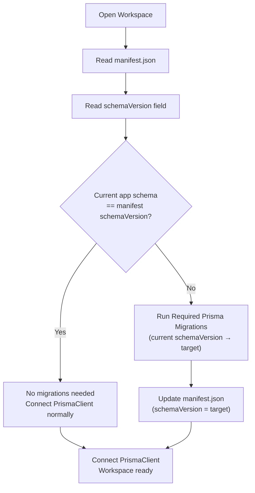
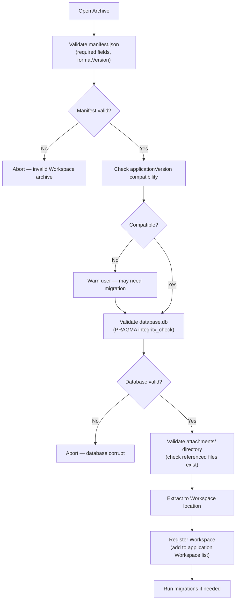
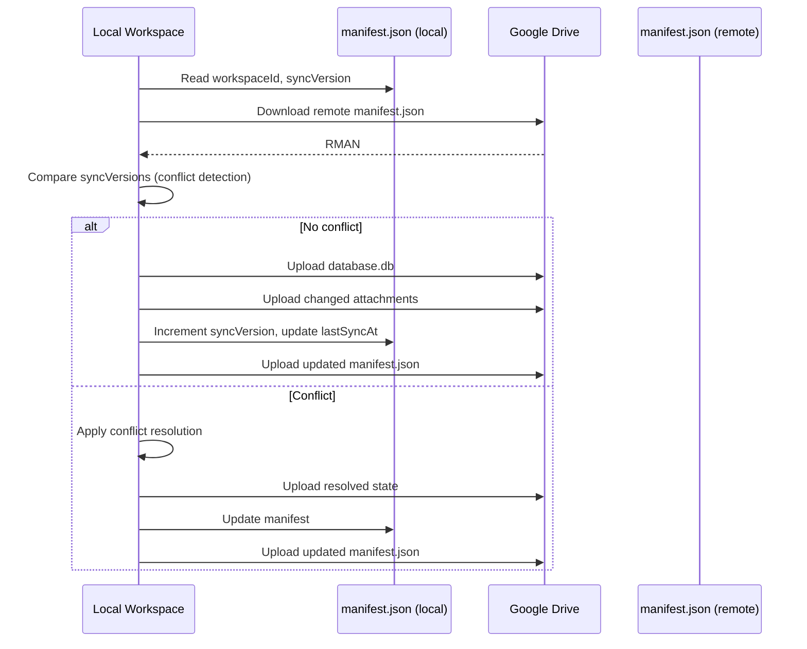

# 15 — Workspace Manifest

> **Document Type:** Architecture Specification
> **Status:** Draft
> **Applies To:** Notebook — All Versions
> **Related Documents:**
> [01-SystemOverview.md §6.2](./01-SystemOverview.md) · [14-WorkspaceManager (§14)](./01-SystemOverview.md) · [12-SynchronizationArchitecture.md](./12-SynchronizationArchitecture.md) · [ADR-009-WorkspaceIsolation.md](./ADR-009-WorkspaceIsolation.md) · [ADR-010-WorkspaceManifest.md](./ADR-010-WorkspaceManifest.md)

---

## 1. Purpose

Every Workspace **shall** contain a `manifest.json` file at its root directory. The Workspace Manifest is the **single source of truth for Workspace identity and metadata**. It describes the Workspace itself — it does not store user content.

The SQLite `database.db` continues to be the authoritative store for all user content: Notes, Folders, Attachments, Tags, Todos, AI Chats, Version History, and Embeddings.

The Manifest and the database are **complementary**:

| What | Stored In |
|---|---|
| Workspace identity (ID, name, format version) | `manifest.json` |
| Schema version, application version | `manifest.json` |
| Creation date, last opened, last sync timestamps | `manifest.json` |
| Sync state, device records | `manifest.json` |
| Database filename | `manifest.json` |
| Notes, Folders, Tags, Todos, AI Chats | `database.db` |
| Attachments (files) | `attachments/` |
| Embedding vectors, FTS index | `database.db` |
| Version history | `database.db` |

---

## 2. Workspace Directory Structure

Every Workspace directory follows this canonical layout. The Manifest is always the first file read when the Workspace is opened.



```
~/Notebooks/<workspace-name>/
    manifest.json        ← Read first on open; synchronized with database.db
    database.db          ← SQLite database (all user content and indexes)
    attachments/         ← Raw attachment files stored verbatim
    cache/
        ocr/             ← OCR text cache (reproducible)
        thumbnails/      ← Image thumbnail cache (reproducible)
    logs/                ← Workspace-level background job logs
    backups/             ← Local backup snapshots
```

---

## 3. Manifest Fields

### 3.1 Current Fields (V1)

The following fields **shall** be present in every valid `manifest.json`:

```json
{
  "workspaceId": "550e8400-e29b-41d4-a716-446655440000",
  "workspaceName": "My Knowledge Base",
  "formatVersion": "1",
  "schemaVersion": "5",
  "applicationVersion": "1.0.0",
  "databaseFilename": "database.db",
  "createdAt": "2024-01-15T10:30:00Z",
  "lastOpenedAt": "2024-06-20T08:15:00Z",
  "lastSyncAt": "2024-06-19T22:00:00Z",
  "devices": {
    "<device-id-1>": {
      "deviceName": "MacBook Pro",
      "lastSyncAt": "2024-06-19T22:00:00Z",
      "syncVersion": 42
    },
    "<device-id-2>": {
      "deviceName": "Windows Desktop",
      "lastSyncAt": "2024-06-18T14:30:00Z",
      "syncVersion": 41
    }
  },
  "lastModifiedAt": "2024-06-20T08:15:00Z",
  "lastModifiedBy": "<device-id-1>"
}
```

| Field | Type | Description |
|---|---|---|
| `workspaceId` | UUID v4 | Globally unique, immutable identifier for this Workspace. Never changes after creation. |
| `workspaceName` | string | Display name. May be changed by the user; synced across devices. |
| `formatVersion` | string | Version of the Workspace directory format itself. Used for future directory layout migrations. |
| `schemaVersion` | string | Current database schema version. Used to determine which Prisma migrations need to run on open. |
| `applicationVersion` | string | The version of Notebook that last wrote this Workspace. Used for compatibility checks. |
| `databaseFilename` | string | Name of the SQLite database file within the Workspace directory. Defaults to `database.db`. |
| `createdAt` | ISO-8601 | UTC timestamp of Workspace creation. Immutable after creation. |
| `lastOpenedAt` | ISO-8601 | UTC timestamp of the most recent time this Workspace was opened on any device. |
| `lastSyncAt` | ISO-8601 | UTC timestamp of the most recent successful sync operation. Null if never synced. |
| `devices` | object | Per-device sync metadata map (keyed by device ID). |
| `lastModifiedAt` | ISO-8601 | UTC timestamp of the last write to `manifest.json` on any device. |
| `lastModifiedBy` | device ID | The device ID that last wrote to `manifest.json`. Used in conflict detection. |

### 3.2 Future Fields (Reserved — Not V1)

Future versions of the Workspace format **may** introduce the following fields. Their presence **shall** be treated as optional and ignored by versions that do not support them:

| Field | Purpose |
|---|---|
| `encryption` | Encryption algorithm, key derivation parameters, and salt. Enables per-Workspace at-rest encryption. |
| `syncProviders` | Array of configured sync provider IDs and their per-provider state. Enables multiple simultaneous sync targets. |
| `compression` | Compression algorithm applied to the database or attachments. |
| `icon` | Base64-encoded Workspace icon (small PNG) for display in the Workspace selector. |
| `color` | Hex color code for the Workspace accent color in the UI. |
| `readOnly` | Boolean. If `true`, the application opens the Workspace in read-only mode. |
| `tags` | Array of user-defined labels for the Workspace (distinct from Note tags). |

---

## 4. Workspace Discovery

At application startup, Notebook discovers available Workspaces by locating `manifest.json` files, not by scanning SQLite databases.

### 4.1 Discovery Flow



### 4.2 Why Manifest Discovery Rather Than Database Scanning

| Reason | Detail |
|---|---|
| **Speed** | Reading a small JSON file is orders of magnitude faster than opening and querying a SQLite database. Discovery of 20 Workspaces takes milliseconds. |
| **Safety** | If a `database.db` is corrupted or locked by another process, the manifest can still be read. The application can surface the Workspace in the selector with a warning, rather than crashing on open. |
| **Pre-open validation** | The manifest's `schemaVersion` and `applicationVersion` can be checked before connecting to the database, allowing incompatible Workspaces to be identified without performing any migration. |
| **Decoupling** | The Workspace selector and list are populated from manifest metadata only. The database is never touched until the user explicitly opens a Workspace. |
| **Rename support** | Renaming a Workspace (its display name) updates only `manifest.json`. No database writes are needed for a name change. |
| **Future flexibility** | The `databaseFilename` field in the manifest allows the database filename to be changed in future Workspace format versions without breaking discovery. |

---

## 5. Database Migration Control

The manifest's `schemaVersion` field drives the database migration process. The application **shall** read the manifest before connecting the Prisma client, so it can determine which migrations to run.

### 5.1 Migration Flow



### 5.2 Migration Safety Rules

- **Never run migrations without reading the manifest first.** The manifest's `schemaVersion` is the authoritative current version.
- **Update the manifest after migration completes.** If the application crashes during migration, the manifest will still show the old `schemaVersion`. On the next open, the migration will be re-attempted from the same starting point.
- **Never downgrade.** If `manifest.schemaVersion` is greater than the application's known schema version, the Workspace is from a newer application version. The application **shall** refuse to open it and present a clear error.
- **Manifest writes are atomic.** The manifest is written using a write-to-temp-then-rename pattern to prevent partial writes on crash.

---

## 6. Import and Export

Import and Export operate at the Workspace level — the unit of transfer is the complete Workspace directory.

### 6.1 Export

A Workspace export produces an archive (e.g., a `.zip` file) containing:

| Included | Excluded | Optional |
|---|---|---|
| `manifest.json` | `logs/` | `cache/` (user choice) |
| `database.db` | | `backups/` (user choice) |
| `attachments/` | | |

The `logs/` directory is **always excluded** from exports — it contains machine-specific operational logs with no value outside the originating device.

The `manifest.json` is always included and is the first file validated when the export archive is imported.

### 6.2 Import Validation Sequence

When importing a Workspace archive, the application **shall** validate in this order:



---

## 7. Google Drive Synchronization

The Workspace Manifest plays a central role in sync. It is synchronized together with `database.db` and `attachments/` as part of every sync operation.

### 7.1 Fields Used by Sync

| Manifest Field | Sync Usage |
|---|---|
| `workspaceId` | Identifies the Workspace on Google Drive; used as the remote folder name/key |
| `schemaVersion` | Checked before restoring; prevents a newer-schema backup from being restored by an older app |
| `applicationVersion` | Logged in sync records; used for compatibility warnings |
| `devices[deviceId].syncVersion` | Used for ordering and conflict detection — higher syncVersion = more recent |
| `lastModifiedAt` | Used as a tie-breaker in conflict detection |
| `lastModifiedBy` | Identifies which device made the last change |
| `lastSyncAt` | Updated after every successful sync; used for display in the UI |

### 7.2 Sync Sequence with Manifest



### 7.3 Manifest as the Sync Anchor

The `manifest.json` is the **first file downloaded** during a restore or sync, and the **last file uploaded** after a successful sync. This ordering ensures:

- The manifest always reflects the committed state of a sync, not an in-progress state.
- If sync fails mid-upload (before the manifest is uploaded), the remote manifest still shows the previous `syncVersion`. The next sync will re-detect the divergence and retry.

---

## 8. Backup

Backups are Workspace-level. A backup is a point-in-time archive of the entire Workspace directory.

### 8.1 Backup Contents

| Included | Notes |
|---|---|
| `manifest.json` | Always included; first file validated on restore |
| `database.db` | Always included |
| `attachments/` | Always included |
| `cache/` | Optional (reproducible; included for speed of restore) |
| `logs/` | Excluded by default |

### 8.2 Backup Validation Sequence

When validating a backup before restore, the application **shall** validate in this order:

1. **Validate `manifest.json`** — Confirm required fields are present and `formatVersion` is compatible. If the manifest is missing or invalid, the backup **shall** be rejected immediately.
2. **Validate `database.db`** — Run `PRAGMA integrity_check` on the SQLite database. If the database is corrupt, the user is warned and restore is offered with a caveat.
3. **Validate `attachments/`** — Verify that attachment files referenced in the database exist in the archive. Missing attachment files are reported but do not block restore.

This ordering ensures that even a partially corrupt backup can be identified, and the user understands exactly what is and is not recoverable before committing to a restore.

---

## 9. Future Capabilities Enabled by the Manifest

The Manifest design anticipates future Workspace capabilities without requiring database schema changes or architectural rework.

| Capability | How the Manifest Enables It |
|---|---|
| **At-rest encryption** | The `encryption` field stores the algorithm identifier, key derivation function, and salt. The application reads this field before attempting to open `database.db`, so it knows to prompt for a passphrase. The database is never opened without the correct key. |
| **Multiple sync providers** | The `syncProviders` array lists each configured sync provider (Google Drive, WebDAV, future providers) with their independent sync state. Each provider has its own `syncVersion` and `lastSyncAt`. |
| **Read-only Workspaces** | The `readOnly` flag instructs the application to open the Workspace in a mode where no writes to `database.db` or `attachments/` are permitted. Useful for shared or archived Workspaces. |
| **Portable Workspaces** | Because the manifest stores the `databaseFilename`, the Workspace directory can be self-describing when placed on any filesystem. A future tool can open any valid Workspace directory by reading its manifest alone. |
| **Workspace sharing** | The manifest can include a `sharedWith` field listing authorized device IDs or public keys, enabling future peer-to-peer or selective sharing without a central authority. |
| **Workspace compression** | The `compression` field describes the compression format applied to `database.db` or the archive format used for backup. The application reads this before decompressing. |
| **Workspace templates** | A future `isTemplate` boolean flag in the manifest marks a Workspace as a template. Creating a new Workspace from a template copies the directory and resets `workspaceId`, `createdAt`, and all device/sync records in the manifest. |

> **Note:** None of these future fields are part of the V1 Workspace format. Their presence in `manifest.json` files from future versions **shall** be silently ignored by V1 applications, preserving forward compatibility.

---

## 10. Manifest Integrity

### 10.1 Write Safety

The manifest **shall** be written using an atomic rename pattern:

1. Write the new manifest content to `manifest.json.tmp`
2. Flush and close the file
3. Atomically rename `manifest.json.tmp` to `manifest.json`

This ensures that a crash during a manifest write cannot produce a partially written manifest. On the next open, the application will always find either the complete old manifest or the complete new manifest.

### 10.2 Corruption Recovery

If `manifest.json` cannot be parsed (truncated, invalid JSON):

1. The application **shall** check for `manifest.json.tmp` (indicating a crash during an atomic write) and attempt to use it.
2. If no valid manifest can be found, the application **shall** present a recovery dialog offering: (a) attempt to read the database directly to reconstruct a minimal manifest, or (b) remove the Workspace from the registry.
3. The application **shall never** silently delete a Workspace with a corrupt manifest.

---

## 11. Acceptance Criteria

- Every newly created Workspace contains a valid `manifest.json` before `database.db` is opened for the first time.
- Workspace discovery at startup reads only `manifest.json` files; no `database.db` is opened during the discovery phase.
- After a successful database migration, `manifest.json`'s `schemaVersion` field is updated to reflect the new schema version.
- A Workspace exported and imported on a new machine has an identical `manifest.json` (adjusted only for device-specific fields).
- A backup with a missing or invalid `manifest.json` is rejected before any attempt to validate `database.db`.
- A `manifest.json` write that is interrupted mid-write does not produce a corrupt manifest on the next open.
- Future fields present in a manifest from a newer application version are silently ignored without error.
