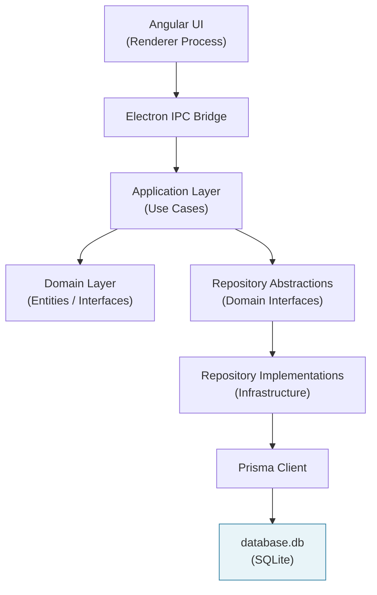
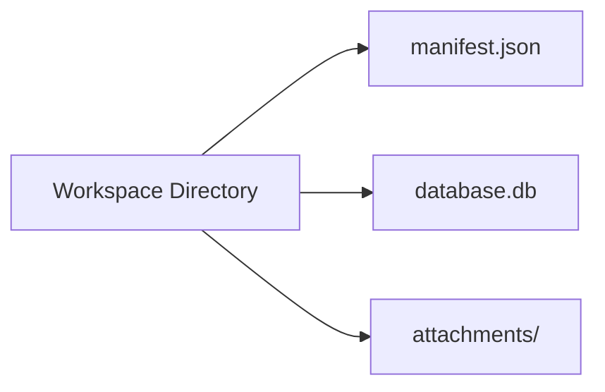
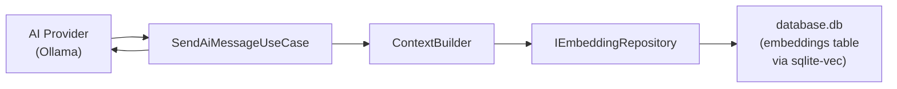

# 01 — Database Overview

> **Document Type:** Database Overview
> **Status:** Draft
> **Applies To:** Notebook — All Versions
> **Related Documents:**
> [00-DataModelPrinciples.md](./00-DataModelPrinciples.md) · [02-StorageLayout.md](./02-StorageLayout.md) · [04-Schema.md](./04-Schema.md) · [../01-architecture/ADR-003](../01-architecture/14-ArchitectureDecisions.md) · [../01-architecture/ADR-009-WorkspaceIsolation.md](../01-architecture/ADR-009-WorkspaceIsolation.md) · [../01-architecture/01-SystemOverview.md §6](../01-architecture/01-SystemOverview.md)

---

## 1. Purpose

This document provides the high-level overview of the Notebook database subsystem. It answers:

- What the database is responsible for
- What is explicitly out of scope
- How the database relates to the overall system architecture
- How the database relates to the Workspace model
- How the database relates to Google Drive synchronization
- How the database relates to the AI subsystem

This document is the entry point for the `docs/02-database/` section. All subsequent documents elaborate on specific aspects described here.

---

## 2. What the Database Is

The Notebook database is an **embedded SQLite database**, one per Workspace, stored as `database.db` in the Workspace root directory. It is the authoritative store for all structured, queryable data within a Workspace.

There is no database server. There is no connection pool to a remote host. There is no cloud database. The database file is a single file on the user's local filesystem, opened directly by the Electron main process using Prisma.

This is not a compromise. It is the correct choice for a privacy-first, offline-first, local-first personal knowledge management application. The user's data is on their machine, under their control, accessible without any external service.

---

## 3. Responsibilities

The database is responsible for all structured user data within a Workspace:

| Responsibility | Description |
|---|---|
| **Notes** | Title, content (rich text), creation timestamp, update timestamp, folder membership, soft-delete state |
| **Folders** | Hierarchy, name, display order, soft-delete state |
| **Attachments** | Metadata records: filename, MIME type, file size, checksum, OCR status, link to note |
| **Tags** | Tag definitions and tag-to-entity associations (notes, attachments) |
| **Todos** | Task records: title, completion status, due date, priority, note association |
| **AI Chats** | Chat session records and individual message history with citations |
| **Embeddings** | sqlite-vec vector records for semantic search and RAG retrieval |
| **Full-Text Search Index** | FTS5 virtual table for keyword search over note content and OCR text |
| **Wiki Links** | Resolved link records for note-to-note connections and backlinks |
| **Version History** | Append-only snapshots of note content at each save point |
| **Plugin Configuration** | Per-plugin state and configuration data for installed plugins |
| **Application Settings** | Workspace-level user preferences and configuration |
| **Background Job State** | Job queue state for OCR, embedding, and backup jobs (resume on restart) |

---

## 4. What the Database Is NOT Responsible For

The following are explicitly out of scope for the database:

| Out of Scope | Where It Lives |
|---|---|
| **Raw attachment files** | `attachments/` directory on the filesystem |
| **OCR intermediate text output** | `cache/ocr/` directory (reproducible) |
| **Image thumbnails** | `cache/thumbnails/` directory (reproducible) |
| **Operation logs** | `logs/` directory |
| **Local backup archives** | `backups/` directory |
| **Workspace identity and sync metadata** | `manifest.json` (see [ADR-010](../01-architecture/ADR-010-WorkspaceManifest.md)) |
| **Application-level settings** | `app.getPath('userData')` configuration store |

---

## 5. Relationship with the Architecture

The database lives entirely in the Infrastructure Layer of the Clean Architecture model. No other layer has direct access to the database.

**The Dependency Rule is strictly enforced:**

- The Domain Layer defines `IRepository<T>` interfaces. It has zero awareness of SQLite, Prisma, or any specific database technology.
- Repository implementations in the Infrastructure Layer implement those domain interfaces using Prisma and raw SQL for FTS5/sqlite-vec queries.
- Use Cases call domain interfaces only. Swapping SQLite for a different database requires changing only the Infrastructure Layer implementations.

This is not theoretical flexibility for its own sake. It means unit tests for use cases never touch a real database. It means the database technology can evolve without rewriting business logic.

---

## 6. Relationship with the Workspace

Every database is owned by exactly one Workspace. The Workspace is the outermost scope. This relationship has several important properties:

**Lifecycle coupling:**

| Workspace Event | Database Action |
|---|---|
| Workspace created | `database.db` is created; initial schema is applied via Prisma Migrate |
| Workspace opened | Prisma client connects to `database.db`; pending migrations are run |
| Workspace closed | Prisma client is disconnected gracefully |
| Workspace deleted | `database.db` is deleted as part of the directory deletion |
| Workspace backed up | `database.db` is included in the backup archive |
| Workspace exported | `database.db` is included in the export archive |
| Workspace imported | `database.db` is extracted and integrity-checked before registration |
| Workspace synced | `database.db` is synchronized to/from Google Drive as a single file |

The Workspace Manager is the sole component responsible for the Prisma client lifecycle. No other component creates, connects, or disconnects a Prisma client instance. See [01-SystemOverview.md §14](../01-architecture/01-SystemOverview.md).

**Identity separation:**

The database does not store the Workspace's own identity. The Workspace ID, name, schema version, and sync metadata all live in `manifest.json`. This is intentional: the manifest can be read without opening the database, enabling fast Workspace discovery at startup. See [ADR-010](../01-architecture/ADR-010-WorkspaceManifest.md).

---

## 7. Relationship with Google Drive

Google Drive is an optional, user-configured synchronization target. The database's relationship with Google Drive is defined by these boundaries:

| Aspect | Rule |
|---|---|
| **Authority** | The local `database.db` is always authoritative. Google Drive is always secondary. |
| **Transfer unit** | `database.db` is synchronized as a single file, not row by row. |
| **Conflict handling** | Database-level conflicts (two divergent `database.db` files) are resolved by user choice: keep local, use remote, or keep both. |
| **Sync frequency** | Sync is user-initiated or scheduled. The database is never modified as a result of background network activity without user action. |
| **Integrity before restore** | Before the remote `database.db` replaces the local one, a `PRAGMA integrity_check` is performed on both the local backup and the remote file. |
| **Offline behavior** | The database operates identically with or without network connectivity. Google Drive unavailability does not affect any database operation. |

The sync subsystem does not access the database through repositories or use cases — sync is a file-level operation that treats `database.db` as an opaque binary artifact. Business logic that arises from sync (e.g., registering a restored Workspace) flows through Application Layer use cases after the file is in place.

See [../01-architecture/12-SynchronizationArchitecture.md](../01-architecture/12-SynchronizationArchitecture.md) for the complete sync design.

---

## 8. Relationship with AI

The AI subsystem has a carefully controlled, read-only relationship with the database.

**AI boundaries with respect to the database:**

| Boundary | Rule |
|---|---|
| **No direct database access** | AI providers never query the database. All data retrieval is performed through `IEmbeddingRepository` and `ISearchRepository`. |
| **Embeddings are stored in the database** | sqlite-vec embedding vectors are stored in `database.db` alongside note metadata, enabling atomic updates. |
| **Embeddings are Workspace-scoped** | There is no cross-Workspace embedding index. AI context is always derived exclusively from the active Workspace's content. |
| **Model change invalidation** | When the user changes the embedding model, the `embeddings` table is marked stale and re-indexing is queued. This is a database operation, not a filesystem operation. |
| **Embedding pipeline is database-driven** | The embedding queue reads from the `notes` and `attachments` tables to determine what needs (re-)embedding. Status flags in those tables track processing state. |

See [../01-architecture/13-AIArchitecture.md](../01-architecture/13-AIArchitecture.md) for the complete AI architecture.

---

## 9. Database Technology Summary

| Concern | Technology | Rationale |
|---|---|---|
| **Relational store** | SQLite 3 | Embedded, serverless, zero-config, portable file format |
| **ORM / migrations** | Prisma | Type-safe queries, declarative schema, migration management |
| **Full-text search** | SQLite FTS5 | Co-located with data, no external service |
| **Vector search** | sqlite-vec | Co-located with data, no external service |
| **WAL mode** | SQLite WAL | Crash safety, improved read concurrency |
| **Foreign keys** | `PRAGMA foreign_keys = ON` | Referential integrity enforcement |

Full rationale for each technology choice is documented in:
- [ADR-003 — SQLite as Primary Database](../01-architecture/14-ArchitectureDecisions.md)
- [ADR-004 — Prisma as ORM](../01-architecture/14-ArchitectureDecisions.md)
- [05-SQLite.md](./05-SQLite.md)
- [06-sqlite-vec.md](./06-sqlite-vec.md)

---

## 10. Acceptance Criteria

- Every Workspace has exactly one `database.db` file.
- No data from one Workspace's database is visible from any other Workspace.
- The database is fully operational without any network connection.
- All repository implementations access the database only through Prisma (or `$queryRaw` for FTS5/sqlite-vec) — never through direct filesystem reads of `database.db`.
- The AI subsystem reads embeddings only through `IEmbeddingRepository`. It never issues raw SQL against the database.
- `PRAGMA foreign_keys = ON` is set on every database connection opened by the application.
- The database is closed gracefully on Workspace close and on application exit.
