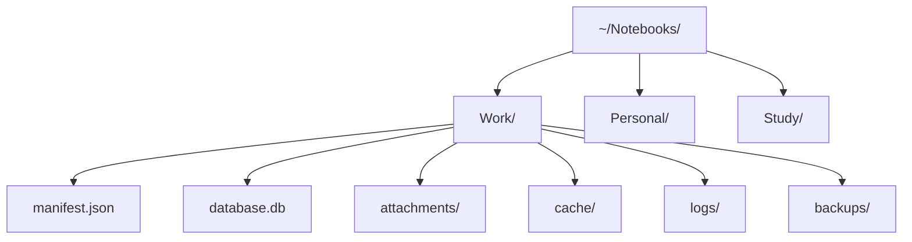
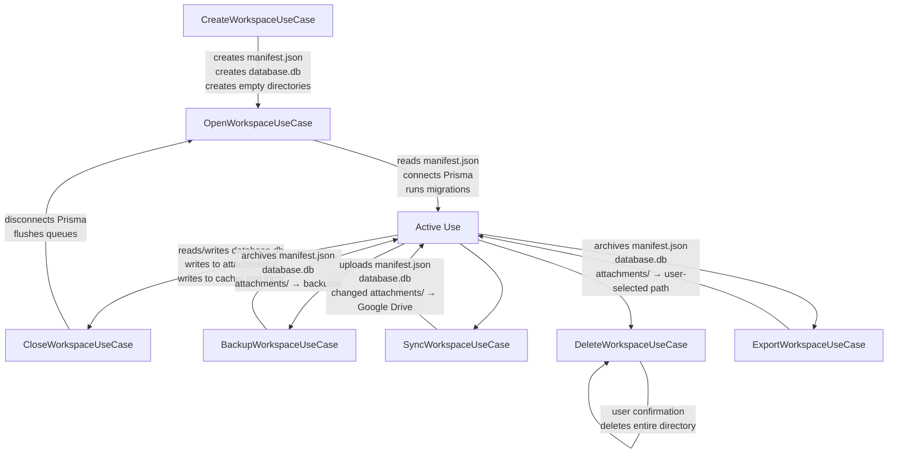

# 02 — Storage Layout

> **Document Type:** Storage Layout Specification
> **Status:** Draft
> **Applies To:** Notebook — All Versions
> **Related Documents:**
> [00-DataModelPrinciples.md](./00-DataModelPrinciples.md) · [01-Overview.md](./01-Overview.md) · [10-BackupStrategy.md](./10-BackupStrategy.md) · [../01-architecture/ADR-009-WorkspaceIsolation.md](../01-architecture/ADR-009-WorkspaceIsolation.md) · [../01-architecture/ADR-010-WorkspaceManifest.md](../01-architecture/ADR-010-WorkspaceManifest.md) · [../01-architecture/15-WorkspaceManifest.md](../01-architecture/15-WorkspaceManifest.md) · [../01-architecture/01-SystemOverview.md §6.2](../01-architecture/01-SystemOverview.md)

---

## 1. Purpose

This document describes the physical storage structure of a Notebook Workspace on the local filesystem. It explains the purpose of every directory and file, who owns each artifact, and what happens to each artifact over the lifecycle of the Workspace.

---

## 2. Storage Overview

Notebook stores all Workspace data in a structured directory on the user's local filesystem. Multiple Workspaces are independent directories, typically co-located under a common parent chosen by the user (e.g., `~/Notebooks/`).



Each Workspace directory is fully self-contained. Moving a Workspace directory to another machine, another user account, or a different path requires only registering it in the application — no data modification is needed.

---

## 3. Canonical Directory Layout

```
~/Notebooks/<workspace-name>/
    manifest.json
    database.db
    attachments/
    cache/
        ocr/
        thumbnails/
    logs/
    backups/
```

This layout is defined by ADR-009 and ADR-010 and is frozen for V1. Future versions may extend the layout (e.g., adding an `exports/` staging directory) through a new `formatVersion` in the manifest.

---

## 4. File and Directory Reference

### 4.1 `manifest.json`

| Property | Value |
|---|---|
| **Type** | File — plain JSON |
| **Owner** | Workspace Manager |
| **Created** | Before `database.db`, on Workspace creation |
| **Modified** | After successful migrations, after successful sync, on Workspace rename |
| **Synchronized** | Yes — synchronized to Google Drive on every sync |
| **Included in backup** | Yes — always the first entry in a backup archive |
| **Included in export** | Yes — always the first entry in an export archive |
| **Deletable** | No — a missing manifest triggers recovery flow |

**Purpose:** The single source of truth for Workspace identity and operational metadata. Contains the Workspace UUID, display name, schema version, format version, database filename, creation timestamp, last-opened timestamp, last-sync timestamp, and per-device sync records.

`manifest.json` is the **first file read** when opening a Workspace and the **last file written** after a successful sync or migration. This ordering ensures the manifest always reflects a committed state.

The manifest does **not** contain user content (notes, tags, todos). It describes the Workspace container, not the Workspace contents.

Full specification: [../01-architecture/15-WorkspaceManifest.md](../01-architecture/15-WorkspaceManifest.md).

---

### 4.2 `database.db`

| Property | Value |
|---|---|
| **Type** | File — SQLite 3 database |
| **Owner** | Workspace Manager (via Prisma client) |
| **Created** | After `manifest.json`, on Workspace creation |
| **Modified** | On any write operation: note save, tag update, embedding insert, etc. |
| **WAL file** | `database.db-wal` (managed by SQLite — transient) |
| **SHM file** | `database.db-shm` (managed by SQLite — transient) |
| **Synchronized** | Yes — synchronized to Google Drive as a single file |
| **Included in backup** | Yes |
| **Included in export** | Yes |
| **Deletable** | No — catastrophic data loss |

**Purpose:** The authoritative relational data store for all structured user content in the Workspace: Notes, Folders, Attachments (metadata), Tags, Todos, AI Chats, Chat Messages, Embeddings (sqlite-vec), Full-Text Search index (FTS5), Wiki Links, Version History, Plugin Configuration, Application Settings, and background job state.

`database.db` is opened exclusively by the Prisma client, connected by the Workspace Manager. No other process or component accesses this file directly.

**WAL files:** When WAL mode is enabled (which it always is — see [05-SQLite.md](./05-SQLite.md)), SQLite manages two companion files:
- `database.db-wal` — the write-ahead log. Transient during operation; merged into `database.db` on checkpoint.
- `database.db-shm` — the shared memory file for WAL coordination. Always transient; safe to delete when the database is not open.

Backup and sync operations **shall** account for WAL files. A backup taken while the WAL file exists must include the WAL file, or it must trigger a checkpoint first to merge outstanding WAL entries into the main database file.

---

### 4.3 `attachments/`

| Property | Value |
|---|---|
| **Type** | Directory |
| **Owner** | Attachment service (via repository) |
| **Created** | On Workspace creation (empty directory) |
| **Contents** | Raw binary files: PDFs, images, DOCX, XLSX, TXT, etc. |
| **File naming** | `<attachment-id>.<original-extension>` |
| **Synchronized** | Yes — files synced incrementally to Google Drive |
| **Included in backup** | Yes |
| **Included in export** | Yes |
| **Deletable** | Individual files may be deleted when the attachment record is permanently deleted |

**Purpose:** Storage for raw binary attachment files. Every file in this directory has a corresponding `attachments` record in `database.db` that describes it (original filename, MIME type, size, checksum, OCR status).

**File naming:** Attachments are stored using their UUID identifier as the filename (e.g., `550e8400-e29b-41d4-a716-446655440000.pdf`). The original filename is preserved in the `attachments` metadata record. This prevents filename collisions and makes it safe to accept files with identical names from different sources.

**Orphan detection:** Periodic maintenance may scan `attachments/` and cross-reference with the `attachments` table to detect orphaned files (files with no corresponding database record). Orphaned files are reported to the user for review, never deleted automatically.

**Lifecycle:**
- Created: when the user attaches a file to a note.
- Read: when the user downloads or previews an attachment, or when OCR or embedding processes it.
- Deleted: when the user permanently deletes an attachment (soft-delete followed by permanent delete from Trash).

---

### 4.4 `cache/`

| Property | Value |
|---|---|
| **Type** | Directory |
| **Owner** | Background job subsystems (OCR, thumbnail generator) |
| **Created** | On Workspace creation (empty directory) |
| **Reproducible** | Yes — all cache contents can be regenerated from source data |
| **Synchronized** | No — excluded from Google Drive sync |
| **Included in backup** | Optional (user choice; not required for restore) |
| **Included in export** | Optional (user choice) |
| **Deletable** | Yes — safe to delete entire `cache/` directory; contents are regenerated on demand |

**Purpose:** Stores intermediate and derived artifacts that can be regenerated from source data. The cache is never the source of truth for any data. Deleting the cache is always safe.

---

#### 4.4.1 `cache/ocr/`

| Property | Value |
|---|---|
| **Owner** | OCR service |
| **Contents** | Plain text output of OCR processing for each attachment |
| **File naming** | `<attachment-id>.txt` |
| **Reproducible** | Yes — regenerated by re-running OCR on the original attachment file |

**Purpose:** Stores the raw text output extracted from image-based attachments (images, scanned PDFs) by the Tesseract OCR engine. The OCR text is indexed into the FTS5 full-text search index and used as input for embedding generation.

**Lifecycle:** Created when the OCR job completes. The `attachments.ocr_status` column in `database.db` tracks whether OCR has run and whether the result is current. If an attachment is replaced or re-processed, the corresponding OCR cache file is regenerated.

**Why cache, not database:** OCR text output can be large (many pages of text). Storing it in the database would inflate row sizes and complicate FTS5 indexing (which stores its own copy of indexed text). The OCR output file is a pre-processing artifact; the FTS5 index in `database.db` is the operational store.

---

#### 4.4.2 `cache/thumbnails/`

| Property | Value |
|---|---|
| **Owner** | Thumbnail generation service |
| **Contents** | Scaled image previews for the UI |
| **File naming** | `<attachment-id>-<size>.webp` (e.g., `<uuid>-256.webp`) |
| **Reproducible** | Yes — regenerated from the original attachment file |

**Purpose:** Stores scaled image thumbnails generated from image attachments and the first page of PDFs. Thumbnails are used in the attachment browser and note editor to display previews without loading the full-resolution original.

**Lifecycle:** Created by the thumbnail generation background job after an image or PDF attachment is added. Deleted when the parent attachment is deleted. Regenerated if the source attachment changes.

---

### 4.5 `logs/`

| Property | Value |
|---|---|
| **Type** | Directory |
| **Owner** | Logging subsystem |
| **Created** | On Workspace creation (empty directory) |
| **Contents** | Workspace-scoped operation logs (background jobs, sync events, error records) |
| **Reproducible** | No — logs are not reproducible, but they are also not essential |
| **Synchronized** | No — excluded from Google Drive sync |
| **Included in backup** | No — always excluded |
| **Included in export** | No — always excluded |
| **Deletable** | Yes — safe to delete; contains no user content |

**Purpose:** Stores structured log files for Workspace-scoped background operations: OCR job results, embedding generation status, sync events, backup events, and error records. Logs are machine-specific operational records, not user data.

**Exclusion from sync and export:** Logs contain machine-specific information (job IDs, timestamps, file paths) that are irrelevant on other devices. Including them in sync or export would add size without value and could expose operational information that the user does not expect to share.

**Retention:** Log files rotate on a configurable schedule (default: 7 days). Old log files are automatically deleted by the logging subsystem. No user action is required.

---

### 4.6 `backups/`

| Property | Value |
|---|---|
| **Type** | Directory |
| **Owner** | Backup service |
| **Created** | On Workspace creation (empty directory), or on first backup |
| **Contents** | Point-in-time backup archives (`.zip`) |
| **File naming** | `notebook-backup-<workspace-name>-<YYYY-MM-DD>-<HHmmss>.zip` |
| **Reproducible** | No — backups represent past states that cannot be regenerated |
| **Synchronized** | No — local backups are local-only |
| **Included in backup** | No — backups are not backed up into themselves |
| **Included in export** | No |
| **Deletable** | Individual backup archives may be deleted by the user |

**Purpose:** Stores local point-in-time backup archives created by the backup service. Each backup is a complete, self-contained archive of `manifest.json`, `database.db`, and `attachments/` at the moment the backup was taken. Backups are the recovery mechanism for local data loss (accidental note deletion, schema migration failure, file corruption).

**Local-only:** Backups in `backups/` are local-only by design. They are not synchronized to Google Drive. Google Drive sync is a separate mechanism for cross-device continuity; local backups are for local recovery. If the user wants off-site backup, they are responsible for backing up the `backups/` directory or the entire Workspace directory themselves, or using Google Drive sync.

**Retention:** Backups accumulate indefinitely unless the user explicitly deletes them. A future background job may offer configurable automatic pruning of old backups beyond a retention limit.

See [10-BackupStrategy.md](./10-BackupStrategy.md) for the complete backup strategy.

---

## 5. Ownership Summary

| Artifact | Owner | Created By | Modified By |
|---|---|---|---|
| `manifest.json` | Workspace Manager | `CreateWorkspaceUseCase` | Workspace Manager (migration, sync, rename) |
| `database.db` | Workspace Manager (via Prisma) | `CreateWorkspaceUseCase` | Repository implementations (all writes) |
| `attachments/` | Attachment Repository | `CreateWorkspaceUseCase` | Attachment service |
| `attachments/<file>` | Attachment Repository | `AddAttachmentUseCase` | Not modified — immutable after creation |
| `cache/ocr/<file>` | OCR service | OCR background job | OCR re-run |
| `cache/thumbnails/<file>` | Thumbnail service | Thumbnail background job | Thumbnail re-generation |
| `logs/` | Logging subsystem | `CreateWorkspaceUseCase` | Logging subsystem (append-only) |
| `backups/<archive>` | Backup service | `BackupWorkspaceUseCase` | Never — immutable after creation |

---

## 6. Lifecycle Diagram



---

## 7. Cross-Platform Path Considerations

The Workspace root directory is chosen by the user through a directory picker. The application does not impose a specific location. Common defaults:

| Platform | Common Default |
|---|---|
| macOS | `~/Notebooks/` |
| Windows | `%USERPROFILE%\Notebooks\` |
| Linux | `~/Notebooks/` |

The application **shall** use Node.js `path.join()` for all filesystem operations — never string concatenation — to ensure cross-platform path compatibility. All paths stored in the application's registry or in logs are stored as absolute paths normalized for the host OS.

**Workspace names as directory names:** The Workspace display name is used as the directory name (with filesystem-unsafe characters sanitized). If the user renames a Workspace, the directory is renamed to match. The `workspaceId` UUID in `manifest.json` is the stable identifier; the directory name is mutable.

---

## 8. Future Considerations

- **`exports/` staging directory:** A transient `exports/` directory may be created inside the Workspace during export operations and deleted on completion. This keeps the export staging isolated from other Workspace content.
- **Workspace compression:** A future `compression` field in `manifest.json` may indicate that `database.db` or `attachments/` are stored in a compressed format. The storage layout remains identical; the application decompresses transparently on access.
- **Workspace encryption:** A future `encryption` field in `manifest.json` may indicate that `database.db` is encrypted with SQLCipher. The storage layout is unchanged; the application prompts for a passphrase before opening the database.
