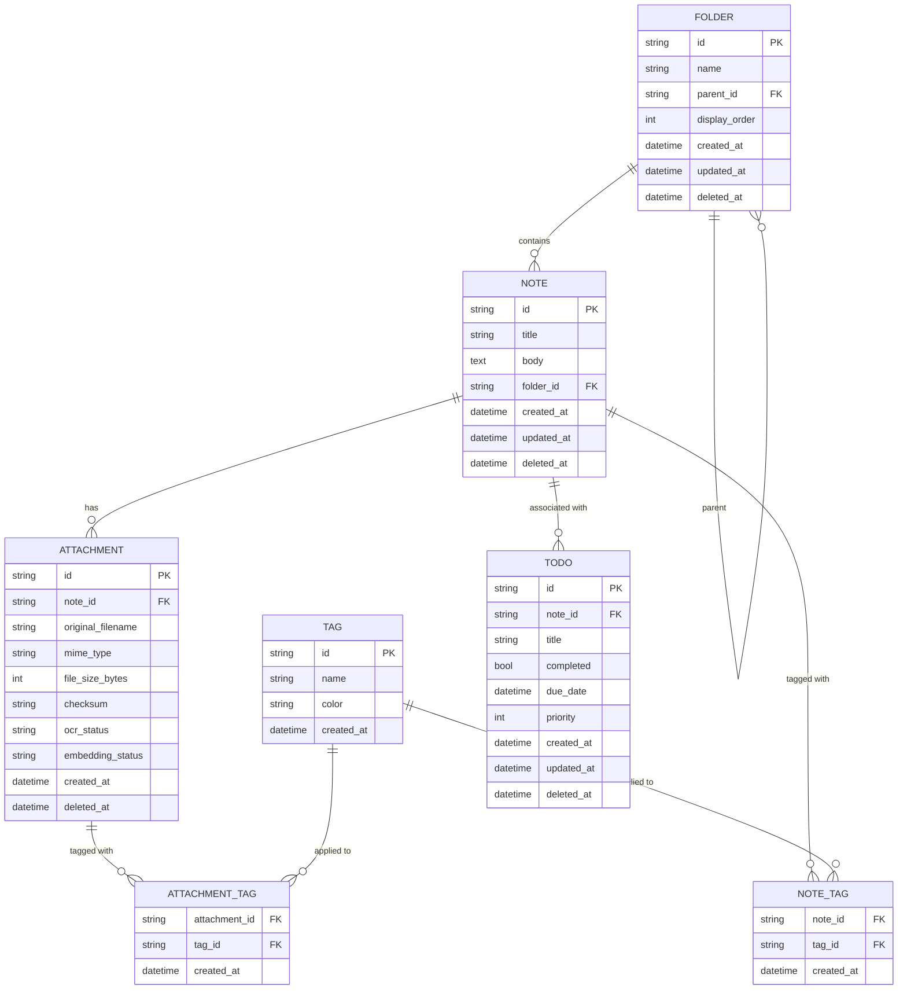
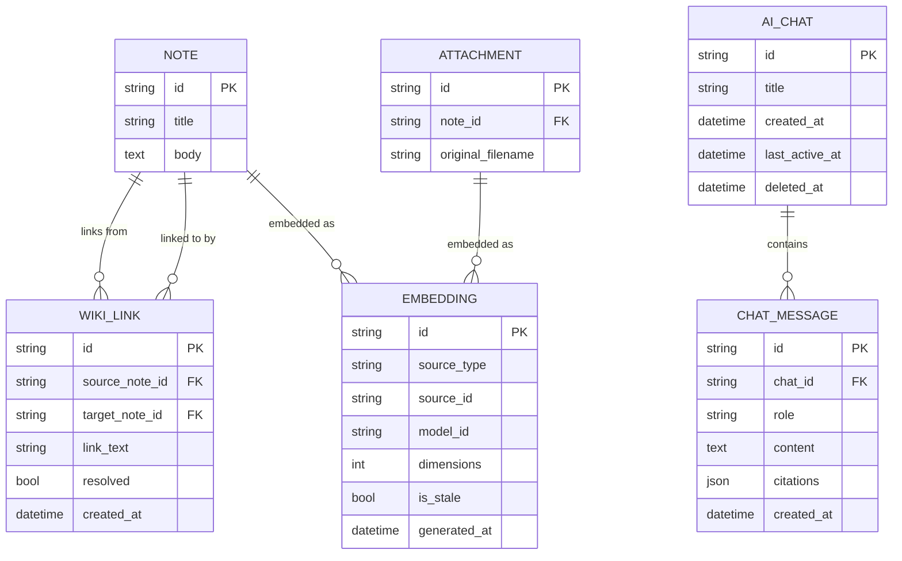
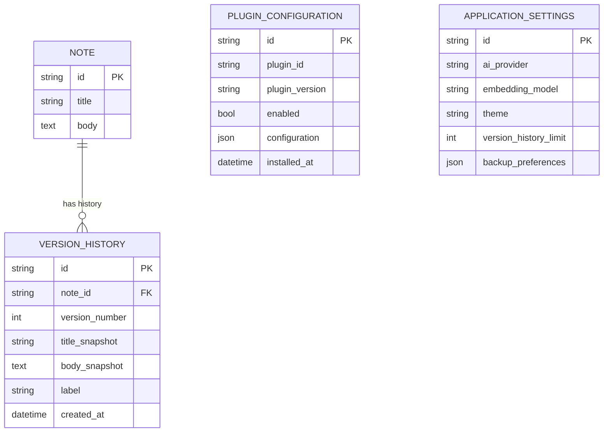
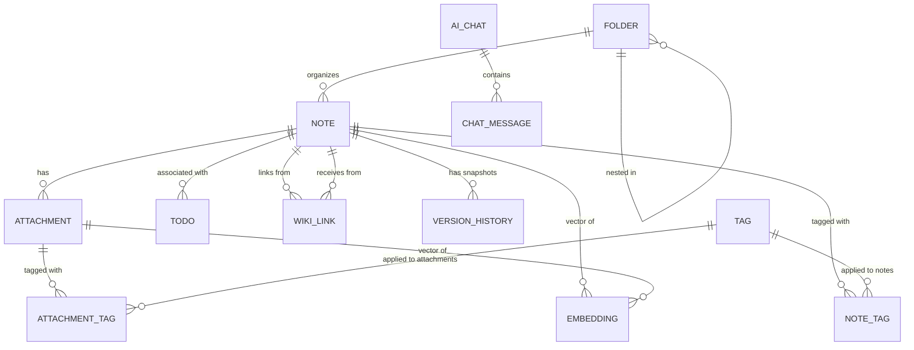

# 03 — Entity Relationship Diagram (ERD)

> **Document Type:** Entity Relationship Diagram
> **Status:** Draft
> **Applies To:** Notebook — All Versions
> **Related Documents:**
> [00-DataModelPrinciples.md](./00-DataModelPrinciples.md) · [04-Schema.md](./04-Schema.md) · [08-Indexes.md](./08-Indexes.md) · [../01-architecture/01-SystemOverview.md §6](../01-architecture/01-SystemOverview.md) · [../00-overview/04-FunctionalRequirements.md](../00-overview/04-FunctionalRequirements.md) · [../00-overview/07-Glossary.md](../00-overview/07-Glossary.md)

---

## 1. Purpose

This document identifies the entities in the Notebook data model, defines their relationships, and presents them as ER diagrams. It does not define SQL schemas or Prisma models. It is the conceptual foundation from which [04-Schema.md](./04-Schema.md) derives its table definitions.

Every entity identified here corresponds to a table (or group of tables) in the database schema.

---

## 2. Entity Index

| Entity | Description |
|---|---|
| **Folder** | A hierarchical container for organizing Notes within a Workspace |
| **Note** | The primary unit of user-created content |
| **Attachment** | A binary file associated with a Note |
| **Tag** | A user-defined label applied to Notes or Attachments |
| **NoteTag** | Junction entity: the association between a Note and a Tag |
| **AttachmentTag** | Junction entity: the association between an Attachment and a Tag |
| **Todo** | A task item, optionally linked to a Note |
| **WikiLink** | A resolved link between two Notes, with backlink support |
| **AIChat** | An AI conversation session within a Workspace |
| **ChatMessage** | An individual message within an AI Chat |
| **Embedding** | A vector embedding record for a Note or Attachment |
| **VersionHistory** | An immutable snapshot of a Note's content at a point in time |
| **PluginConfiguration** | Configuration and state for an installed Plugin |
| **ApplicationSettings** | Workspace-level user preferences |

---

## 3. Core Content Entities

### 3.1 Folder

A Folder is a hierarchical container for organizing Notes. Folders support arbitrary nesting depth. A Folder that has no parent is a root-level Folder.

**Key properties:**
- Unique identifier (UUID)
- Display name
- Optional parent folder (self-referential relationship for nesting)
- Display order within parent
- Soft-delete state

### 3.2 Note

A Note is the primary unit of user-created content. Every Note belongs to a Workspace, and optionally to a Folder. A Note may have Attachments, Tags, WikiLinks, and Version History.

**Key properties:**
- Unique identifier (UUID)
- Title
- Body (rich text — stored as a structured document format, e.g., JSON/HTML)
- Optional folder membership
- Creation and update timestamps
- Soft-delete state

### 3.3 Attachment

An Attachment is a binary file associated with a Note. The database record stores metadata about the attachment; the actual file bytes live in `attachments/` on the filesystem.

**Key properties:**
- Unique identifier (UUID) — also used as the filename in `attachments/`
- Reference to parent Note
- Original filename
- MIME type
- File size
- SHA-256 checksum
- OCR status (pending, processing, completed, failed, not applicable)
- Embedding status (pending, processing, completed, failed)
- Soft-delete state

### 3.4 Tag

A Tag is a user-defined label. Tags are Workspace-scoped string labels that can be applied to Notes and Attachments.

**Key properties:**
- Unique identifier (UUID)
- Name (unique within the Workspace)
- Color (optional, for UI display)
- Creation timestamp

### 3.5 Todo

A Todo is a task item within a Workspace. Todos may be associated with a specific Note (providing context) or exist independently.

**Key properties:**
- Unique identifier (UUID)
- Title
- Completion status (boolean)
- Optional due date
- Optional priority level
- Optional reference to a Note
- Creation and update timestamps
- Soft-delete state

---

## 4. Relationship Entities

### 4.1 NoteTag (Junction)

Associates a Note with a Tag. A Note may have many Tags; a Tag may be applied to many Notes.

### 4.2 AttachmentTag (Junction)

Associates an Attachment with a Tag. An Attachment may have many Tags; a Tag may be applied to many Attachments.

### 4.3 WikiLink

A WikiLink represents a resolved internal link from one Note to another. When a Note contains `[[Target Note Title]]`, the application resolves the title to a Note UUID and creates a WikiLink record. This enables backlinks: given a Note, the application can efficiently query all Notes that link to it.

**Key properties:**
- Unique identifier (UUID)
- Source Note ID
- Target Note ID
- Link text (the original `[[text]]` as written by the user)
- Resolved status

---

## 5. AI Entities

### 5.1 AIChat

An AIChat represents a conversation session between the user and the AI within a Workspace. Multiple AIChats may exist within a single Workspace.

**Key properties:**
- Unique identifier (UUID)
- Title (user-given or auto-generated from the first message)
- Creation and last-active timestamps
- Soft-delete state

### 5.2 ChatMessage

A ChatMessage is an individual message within an AIChat. Messages alternate between user messages and AI responses. AI messages may include citation references to the source notes used in the response.

**Key properties:**
- Unique identifier (UUID)
- Reference to parent AIChat
- Role (user | assistant)
- Content (message text)
- Optional citations (JSON array of note references)
- Timestamp

---

## 6. Knowledge Graph Entities

### 6.1 Embedding

An Embedding stores the vector representation of a Note or Attachment's content. Embeddings are generated by the local Ollama embedding model and stored using the sqlite-vec extension.

**Key properties:**
- Unique identifier (UUID)
- Source type (note | attachment)
- Source ID (Note UUID or Attachment UUID)
- Model identifier (the embedding model that generated this vector)
- Vector dimension count
- Vector data (float32 array, stored by sqlite-vec)
- Generation timestamp
- Staleness flag

---

## 7. History and Configuration Entities

### 7.1 VersionHistory

A VersionHistory record is an immutable snapshot of a Note's content at a specific point in time. Records are created on each note save. They are never updated.

**Key properties:**
- Unique identifier (UUID)
- Reference to parent Note
- Version number (monotonically increasing per Note)
- Snapshot of note title at time of save
- Snapshot of note body at time of save
- Timestamp of snapshot
- Optional label (user-defined name for a version)

### 7.2 PluginConfiguration

A PluginConfiguration record stores the configuration and state for a specific installed Plugin within the Workspace. Plugin configuration is Workspace-scoped — the same plugin may have different configuration in different Workspaces.

**Key properties:**
- Unique identifier (UUID)
- Plugin identifier (string — plugin's declared ID)
- Plugin version
- Enabled status
- Configuration data (JSON blob — plugin-defined schema)
- Installation timestamp

### 7.3 ApplicationSettings

ApplicationSettings stores Workspace-level user preferences. There is exactly one ApplicationSettings record per Workspace.

**Key properties:**
- Unique identifier (UUID, or a fixed singleton row)
- AI provider preference
- Embedding model preference
- Default theme
- Version history retention limit
- Backup preferences
- Any other Workspace-scoped user preference

---

## 8. Entity Relationship Diagrams

### 8.1 Core Content Model

---

### 8.2 AI and Knowledge Graph Model

---

### 8.3 Version History and Configuration Model

---

### 8.4 Complete Relationship Overview

---

## 9. Entity Cardinalities Summary

| Relationship | Cardinality | Notes |
|---|---|---|
| Folder → Folder | 0..1 parent, 0..N children | Self-referential for nesting |
| Folder → Note | 0..N | A Note may have no Folder (root-level) |
| Note → Attachment | 0..N | A Note may have many Attachments |
| Note → Tag (via NoteTag) | 0..N | Many-to-many |
| Attachment → Tag (via AttachmentTag) | 0..N | Many-to-many |
| Note → Todo | 0..N | A Todo may be unlinked (no Note) |
| Note → WikiLink (source) | 0..N | A Note may link to many other Notes |
| Note → WikiLink (target) | 0..N | A Note may be linked to by many other Notes |
| Note → VersionHistory | 0..N | One snapshot per save |
| Note → Embedding | 0..1 | One embedding record per Note (per model) |
| Attachment → Embedding | 0..1 | One embedding record per Attachment (per model) |
| AIChat → ChatMessage | 1..N | A Chat always has at least one message |

---

## 10. Design Decisions

### No Global Workspace Entity

There is no `workspaces` table in `database.db`. The Workspace itself is described by `manifest.json`, not by a database record. This is a deliberate consequence of ADR-010: the manifest is readable without opening the database, enabling fast startup discovery.

### Tags Are Workspace-Scoped Singletons

A Tag record exists once in the `tags` table, shared by all Notes and Attachments that use it. Tags are not duplicated per note. This means renaming a Tag is a single `UPDATE tags SET name = ? WHERE id = ?` — it instantly renames the tag across all content.

### WikiLinks Are Resolved, Not Lazy

WikiLink records store the resolved target Note UUID, not just the raw link text. Resolution happens at save time. This means backlink queries are fast (`SELECT * FROM wiki_links WHERE target_note_id = ?`) with no runtime resolution needed. Unresolved links (where the target Note does not exist) are stored with `resolved = false` and resolved lazily when the target Note is created.

### Embedding Records Are Not Stored as Prisma-Managed Rows for the Vector Column

The vector data itself is managed by sqlite-vec's virtual table mechanism. The `embeddings` table has a metadata row (Prisma-managed) and a corresponding sqlite-vec vector entry. The two are kept in sync by the repository implementation. See [06-sqlite-vec.md](./06-sqlite-vec.md) for details.

---

## 11. Future Considerations

- **Background job state table:** A `background_jobs` table to persist queue state for OCR, embedding, and backup jobs across restarts. Described implicitly in the system overview; schema defined in [04-Schema.md](./04-Schema.md).
- **Attachment previews as metadata:** A future `attachment_previews` extension to the `attachments` record for storing preview-generation metadata (thumbnail dimensions, first page text extract count).
- **Note relations (beyond wiki links):** If a future version supports typed relations between Notes (parent-child, related, contradicts), a `note_relations` table with a `relation_type` column would extend the wiki links model.
