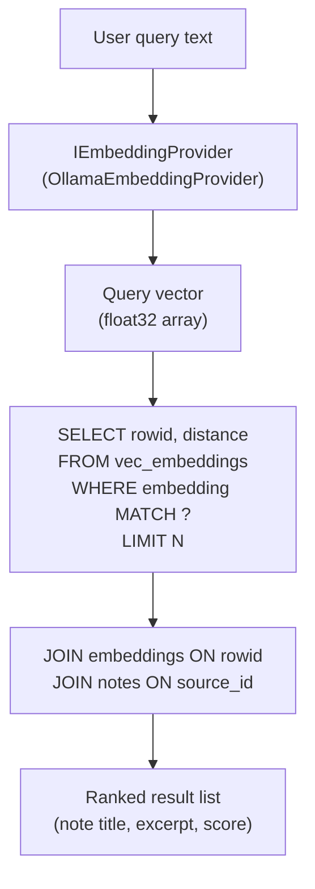
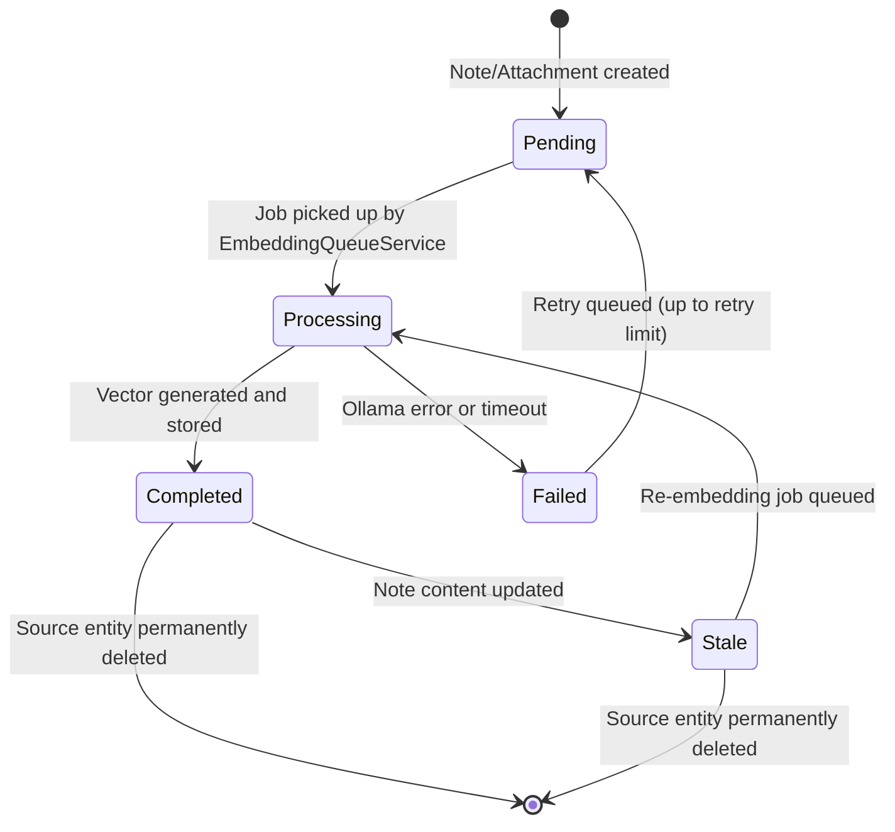
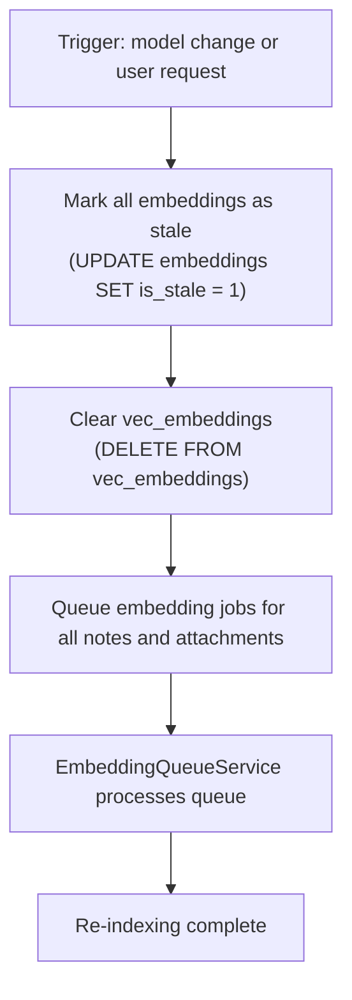
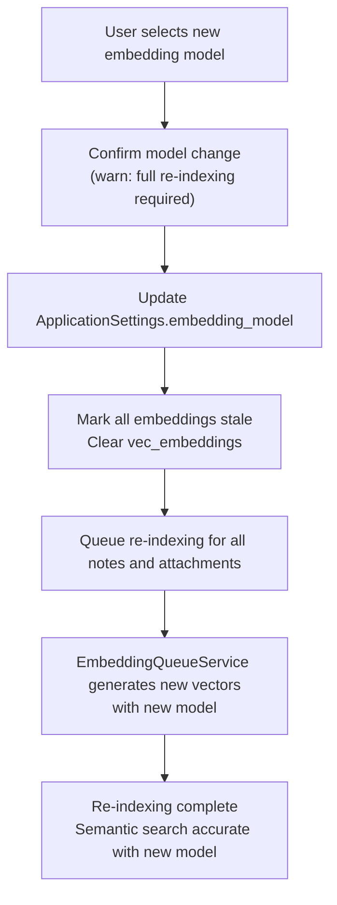

# 06 — sqlite-vec

> **Document Type:** Technology Specification — Vector Search
> **Status:** Draft
> **Applies To:** Notebook — All Versions
> **Related Documents:**
> [00-DataModelPrinciples.md](./00-DataModelPrinciples.md) · [04-Schema.md](./04-Schema.md) · [05-SQLite.md](./05-SQLite.md) · [08-Indexes.md](./08-Indexes.md) · [../01-architecture/13-AIArchitecture.md](../01-architecture/13-AIArchitecture.md) · [../01-architecture/01-SystemOverview.md §17](../01-architecture/01-SystemOverview.md)

---

## 1. Purpose

This document describes how Notebook uses the `sqlite-vec` extension for vector embedding storage, indexing, and retrieval. It covers the full lifecycle of an embedding — from generation through storage, retrieval, invalidation, and future model replacement.

---

## 2. Why sqlite-vec

### 2.1 The Problem

Semantic search and RAG require storing and querying high-dimensional vector embeddings. The naive approach — storing vectors as binary blobs in a regular table and computing cosine similarity in application code — does not scale beyond a few thousand documents. A dedicated vector index is required for sub-second retrieval across tens of thousands of embeddings.

The following options were considered:

| Option | Assessment |
|---|---|
| **External vector database (Chroma, Weaviate, Qdrant)** | Requires a separate process or server. Violates offline-first and local-first principles. Rejected. |
| **In-memory index (FAISS, HNSW via hnswlib)** | Fast, but the index must be rebuilt from database rows on every startup. Large Workspaces create noticeable startup delay. Persistence requires a secondary file format. Rejected. |
| **Application-level brute-force cosine similarity** | Acceptable for small Workspaces (<1,000 notes). Does not scale to the target of 10,000 embedded documents within 1 second. Rejected as default. |
| **sqlite-vec** | A SQLite extension that adds a vector table type with nearest-neighbor search directly inside the SQLite database file. Co-located with relational data, no external process, no secondary index file. Chosen. |

### 2.2 Alignment with Core Principles

| Principle | How sqlite-vec Satisfies It |
|---|---|
| **Offline-first** | sqlite-vec is a compiled SQLite extension loaded in-process. No network. No service. |
| **Local-first** | Vectors are stored in `database.db` alongside the relational data they describe. |
| **Workspace-first** | Each Workspace's `database.db` contains its own isolated vec index. |
| **Privacy-first** | Embedding vectors are numerical representations of private note content. They never leave the device. |

---

## 3. How sqlite-vec Works

sqlite-vec adds a new type of virtual table — a vector table — to SQLite. The vector table stores float32 vectors indexed for nearest-neighbor search (approximate, using an HNSW-like algorithm internally).

From the application's perspective:
- Inserting an embedding is an `INSERT INTO vec_embeddings(rowid, embedding) VALUES (?, ?)`.
- Querying for the nearest neighbors is a `SELECT rowid, distance FROM vec_embeddings WHERE embedding MATCH ?` with a `LIMIT` clause.
- The `rowid` in the vector table corresponds to the `rowid` of a corresponding row in the `embeddings` metadata table, which stores the mapping to the source Note or Attachment UUID.

sqlite-vec is loaded as a SQLite extension via the Prisma `loadExtension` mechanism when the database connection is opened.

---

## 4. Embedding Storage

### 4.1 Two-Table Design

Embedding storage is split across two structures:

| Structure | Purpose |
|---|---|
| `embeddings` table (Prisma-managed) | Metadata: source entity type, source UUID, model ID, dimension count, staleness flag, timestamp |
| `vec_embeddings` virtual table (sqlite-vec) | The actual float32 vector data, indexed for nearest-neighbor search |

The two structures are linked by a shared integer `rowid`. When an embedding record is inserted into `embeddings`, its auto-assigned `rowid` is used as the `rowid` in `vec_embeddings`.

**Why two structures?** The sqlite-vec virtual table cannot store arbitrary metadata columns alongside the vector — it stores only the vector and its rowid. All metadata (source entity, model, timestamp, staleness) is stored in the regular `embeddings` table and joined by rowid at query time.

### 4.2 Vector Format

| Property | Value |
|---|---|
| **Data type** | float32 (IEEE 754 single-precision) |
| **Dimensions** | Model-dependent; recorded in `embeddings.dimensions` |
| **Default model** | Ollama's default embedding model (e.g., `nomic-embed-text`) |
| **Dimension range** | Typically 384–1536 dimensions depending on chosen model |

All vectors in a Workspace's `vec_embeddings` table **shall** have the same dimension count, because they are generated by the same embedding model. If the user changes the embedding model, all existing vectors must be invalidated before new vectors of different dimensions can be inserted. See §7 (Model Replacement) below.

### 4.3 Source Types

Embeddings are generated for two source types:

| Source Type | Content Embedded |
|---|---|
| `note` | The plain-text extraction of the Note's Tiptap body, concatenated with its title |
| `attachment` | The OCR-extracted text from `cache/ocr/<attachment-id>.txt`, or the parsed text content for document formats |

Embeddings are **not** generated for attachment types that have no extractable text (e.g., audio, video files without transcription).

### 4.4 Embedding Granularity

Embeddings are generated at the **logical content chunk** level, not at the whole-document level. A single Note or Attachment may produce multiple embedding records — one per logical chunk.

**Why chunk-level, not whole-document:**

Embedding an entire note as a single vector produces an average representation of all the note's content. For a long note covering multiple topics, this average vector is unlikely to match any specific sub-topic well during retrieval. A user asking a specific question will get a less relevant result from a blended whole-document vector than from a focused chunk-level vector that represents the specific passage they need.

Chunk-level embeddings provide the following advantages for RAG:

- **Better retrieval precision:** Each chunk represents a focused topic. A narrow query matches the relevant chunk directly rather than competing against unrelated content in the same document.
- **Precise citations:** The AI context builder can include the specific section, heading, or paragraph that supports a claim — not the entire note. This makes AI responses more verifiable.
- **Efficient context windows:** Retrieving N relevant chunks from different notes fits more useful information into the model's context window than retrieving N entire notes.
- **Graceful degradation on long documents:** Chunking prevents very long documents from dominating the vector space with a single high-dimensional average.

**Intended chunk boundaries for notes:**

| Chunk Type | Description |
|---|---|
| **Note sections** | Logical sections delimited by headings form the primary chunk boundary |
| **Headings** | Each heading is embedded with its immediately following content as context |
| **Paragraph groups** | Adjacent semantically-cohesive paragraphs are grouped and embedded together |

**Intended chunk boundaries for attachments:**

| Chunk Type | Description |
|---|---|
| **OCR text chunks** | OCR-extracted text is split into overlapping windows before embedding |
| **Document chunks** | Parsed text from DOCX, PDF, Markdown, and plain text files is split into overlapping windows |

**Scope of this document:** The `embeddings` table stores one metadata row and one vector per chunk. The `source_id` on a chunk-level embedding record identifies the parent Note or Attachment, not the chunk itself. Chunk boundaries, overlap size, and minimum chunk length are AI implementation concerns defined in the AI architecture documentation. This document defines only that chunk-based embedding is the strategy and why it is preferable to whole-document embedding.

---

## 5. Vector Indexing

### 5.1 Index Type

sqlite-vec uses an approximate nearest-neighbor (ANN) index. The exact index algorithm is internal to the sqlite-vec extension version used. ANN search trades a small degree of recall accuracy for significant query speed improvement over exact brute-force search.

For a personal knowledge management use case, approximate results are acceptable. Semantic search returning 8 of the 10 most relevant notes is sufficient — exact mathematical top-10 recall is not a requirement.

### 5.2 Index Scope

The `vec_embeddings` table is Workspace-scoped. It exists in `database.db` and contains embeddings only for content within that Workspace. There is no shared vector index across Workspaces.

This means:
- Semantic search is always scoped to the active Workspace by construction.
- Re-indexing one Workspace does not affect any other Workspace.
- The index size is proportional to the content of the Workspace, not all Workspaces combined.

### 5.3 Index Maintenance

The vector index is maintained incrementally:
- **Insert:** When a new embedding is generated, it is inserted into `vec_embeddings` immediately.
- **Update:** When an embedding is regenerated (e.g., note content changed), the existing vector entry is deleted and replaced by the new vector.
- **Delete:** When a source entity (Note or Attachment) is permanently deleted, its vector entry is deleted from `vec_embeddings` and its metadata row is deleted from `embeddings`.
- **Stale markers:** When content changes but re-embedding has not yet run, `embeddings.is_stale = 1` is set. Stale embeddings remain in the index temporarily; they are replaced when the re-embedding job runs.

---

## 6. Retrieval

### 6.1 Query Flow

### 6.2 Retrieval Parameters

| Parameter | Default | Description |
|---|---|---|
| **Top-N** | 10 | Number of nearest neighbors to retrieve |
| **Distance metric** | Cosine similarity | The default metric for text embeddings |
| **Staleness filter** | Stale results included but flagged | Stale embeddings are not excluded from retrieval — they may still be relevant. Their staleness is noted in the result metadata. |

### 6.3 Result Resolution

After the vector query returns a list of `(rowid, distance)` pairs, the repository resolves each rowid to its source entity:

1. `SELECT source_type, source_id FROM embeddings WHERE rowid = ?`
2. For `source_type = 'note'`: `SELECT title, body FROM notes WHERE id = ?`
3. For `source_type = 'attachment'`: `SELECT original_filename FROM attachments WHERE id = ?` and read OCR text from `cache/ocr/<id>.txt`

This two-step resolution is performed in a single database transaction. The resulting list of resolved entities with similarity scores is returned to the Context Builder.

---

## 7. Embedding Lifecycle

### 7.1 Generation Triggers

Embeddings are generated (or regenerated) in response to these events:

| Trigger | Source |
|---|---|
| Note created | `NoteCreatedEvent` → `EmbeddingQueueService` |
| Note content updated | `NoteUpdatedEvent` → `EmbeddingQueueService` |
| Attachment added | `AttachmentAddedEvent` → `EmbeddingQueueService` |
| OCR completed | `OcrCompletedEvent` → `EmbeddingQueueService` |

### 7.2 Queue Processing

Embedding generation is queued and processed sequentially by the `EmbeddingQueueService`:

- Processes one embedding job at a time (to avoid overwhelming Ollama).
- Retries failed jobs up to a configurable limit with exponential backoff.
- Persists queue state in the `background_jobs` table so that interrupted jobs resume on next launch.
- Pushes progress events to the renderer via IPC (`embedding:progress`).

### 7.3 Staleness Management

When a note's content changes, its embedding is immediately marked stale (`is_stale = 1`) in the `embeddings` table, and a re-embedding job is queued. The stale embedding remains in the `vec_embeddings` index until the new embedding replaces it.

**Design decision — why keep stale embeddings in the index:** Removing a stale embedding immediately creates a window where semantic search returns no results for that note. A slightly outdated embedding is better than no embedding. The staleness flag allows the UI to optionally indicate when a result may be based on an older version of the note.

---

## 8. Re-indexing

### 8.1 Full Re-indexing Triggers

A full Workspace re-index is required when:

- The user changes the embedding model (see §9)
- The sqlite-vec index becomes corrupted (detected by an error during query)
- The user explicitly requests a full re-index via Settings → Maintenance

### 8.2 Re-indexing Procedure

Full re-indexing is a background operation:

The re-indexing procedure does **not** delete the `embeddings` metadata rows immediately; it marks them stale. This allows the queue to process each source entity individually and update the metadata row when its new vector is ready. If re-indexing is interrupted, the `is_stale` flag indicates which entities still need processing, and the job can resume where it left off.

### 8.3 Re-indexing Impact

During re-indexing, semantic search continues to function using the existing (stale) vectors. Results may be less accurate than normal until re-indexing completes. The UI **shall** indicate that re-indexing is in progress with a non-blocking status indicator.

---

## 9. Deletion

### 9.1 On Soft Delete

When a Note or Attachment is soft-deleted (`deleted_at` is set), its embedding is **not** removed from the index. The source entity is excluded from search results at the application layer by filtering on `deleted_at IS NULL` before resolving search results.

**Rationale:** Soft-deleted entities may be restored. Removing and regenerating embeddings on every soft-delete/restore cycle wastes computation. The application layer filter is sufficient.

### 9.2 On Permanent Delete

When a Note or Attachment is permanently deleted:

1. The `vec_embeddings` row is deleted by rowid.
2. The `embeddings` metadata row is deleted by cascade or explicit DELETE.
3. The filesystem attachment file (if any) is deleted by the attachment service.

All three steps execute within a single transaction.

---

## 10. Future Model Replacement

### 10.1 The Model Change Problem

Embedding vectors are not interchangeable across models. A vector generated by `nomic-embed-text` cannot be compared by cosine similarity with a vector generated by `all-minilm-l6-v2`. Mixing vectors from different models produces meaningless similarity scores.

When the user changes the embedding model, all existing embeddings **shall** be invalidated before new embeddings are generated with the new model.

### 10.2 Model Change Procedure

### 10.3 Model Identifier Tracking

Every embedding record stores the `model_id` (the model name/identifier as returned by Ollama). This field enables:

- Detection of stale embeddings: if `embeddings.model_id` differs from `ApplicationSettings.embedding_model`, the embedding needs regeneration.
- Diagnostic queries: "how many embeddings were generated with model X?"
- Future multi-model scenarios: if the user has a mix of embeddings from different models (e.g., after a partial re-index), the `model_id` column enables filtering.

---

## 11. Acceptance Criteria

- Semantic search over a Workspace with 10,000 embedded documents returns results in under 1 second.
- After a note is edited, its embedding is marked stale immediately and a re-embedding job is queued within the same transaction.
- Changing the embedding model triggers a full re-index of all Workspace content before the new model's embeddings are used for search.
- Permanently deleting a Note removes its vector from `vec_embeddings` and its row from `embeddings` in the same transaction.
- The `vec_embeddings` index is contained entirely within `database.db` — no external index file is created.
- Semantic search never returns results from Workspaces other than the active one.
- Re-indexing can be interrupted and resumed; no embedding records are permanently lost due to an interrupted re-index.
