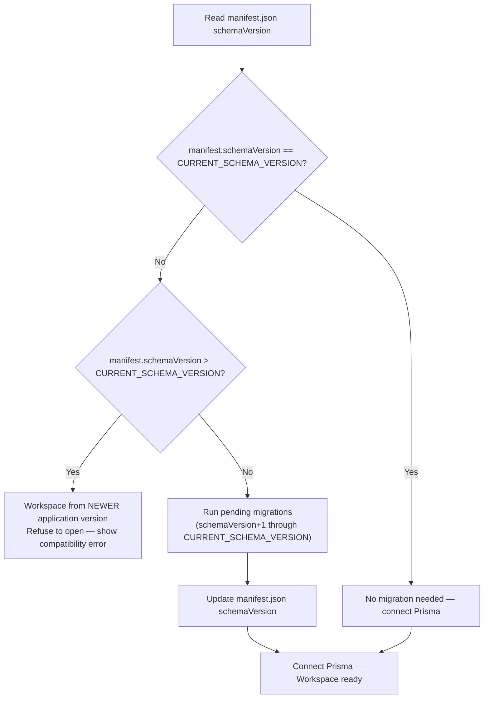
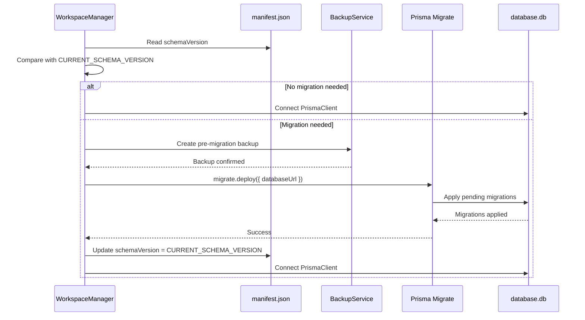

# 07 — Migrations

> **Document Type:** Migration Strategy
> **Status:** Draft
> **Applies To:** Notebook — All Versions
> **Related Documents:**
> [00-DataModelPrinciples.md](./00-DataModelPrinciples.md) · [04-Schema.md](./04-Schema.md) · [09-Versioning.md](./09-Versioning.md) · [10-BackupStrategy.md](./10-BackupStrategy.md) · [../01-architecture/ADR-009-WorkspaceIsolation.md](../01-architecture/ADR-009-WorkspaceIsolation.md) · [../01-architecture/ADR-010-WorkspaceManifest.md](../01-architecture/ADR-010-WorkspaceManifest.md) · [../01-architecture/15-WorkspaceManifest.md §5](../01-architecture/15-WorkspaceManifest.md)

---

## 1. Purpose

This document defines the migration strategy for Notebook's database schema. It covers how the schema evolves over time, how migrations are applied to individual Workspace databases, how failures are handled, and how the Workspace Manifest interacts with the migration process.

---

## 2. Migration Philosophy

### 2.1 Migrations Are Contracts

A migration is a permanent, irreversible contract with user data. Every migration that ships in a released version of Notebook **shall** be considered immutable. The migration history is a sequential record of every schema change ever applied to any Workspace database.

Modifying a migration after it has been shipped destroys the integrity of Workspace databases that have already applied it. Modifying shipped migrations is prohibited.

### 2.2 Forward Only

Notebook uses a **forward-only migration strategy**. Migrations are applied in sequence as the application version increases. There is no automatic "rollback" migration that reverses changes.

**Why forward-only:**

- SQLite does not have a `DROP COLUMN` statement in older versions (added only in SQLite 3.35.0). True rollback of column additions requires a complete table rebuild, which is expensive and risky with user data.
- PKM users accumulate years of data. A migration that fails in a rollback scenario is worse than the original schema issue — the database is left in an indeterminate state.
- Forward-only with additive changes (nullable columns, new tables) means no migration ever risks data loss by design.

### 2.3 Additive by Default

New migrations **should** be additive:

- Add nullable columns — existing rows default to `NULL`.
- Add new tables — no impact on existing queries.
- Add new indexes — performance improvement only.

Destructive changes (removing a column, changing a type, renaming a column) require a multi-step migration window and **shall** be documented with explicit justification.

### 2.4 Per-Workspace Migration

Because each Workspace has its own `database.db`, migrations are applied individually to each Workspace when it is opened. There is no global migration step that affects all Workspaces simultaneously.

The Workspace Manager applies any pending migrations on every Workspace open, using the `schemaVersion` in `manifest.json` as the current version indicator.

---

## 3. Schema Versioning

### 3.1 Version Source of Truth

The authoritative current schema version of a Workspace database is the `schemaVersion` field in `manifest.json`.

**Why not the database itself?** The schema version must be readable before the Prisma client connects — to determine what migrations to run and whether the database is compatible with the current application version. Storing the version inside the database creates a circular dependency: you must open the database to read the version, but you need the version to know how to open the database. The manifest breaks this cycle.

See [ADR-010](../01-architecture/ADR-010-WorkspaceManifest.md) and [../01-architecture/15-WorkspaceManifest.md §5](../01-architecture/15-WorkspaceManifest.md).

### 3.2 Version Format

Schema versions are monotonically increasing integers: `1`, `2`, `3`, `4`, ...

Each migration increments the version by exactly 1. There are no minor versions, no semantic versioning. Simplicity is the highest priority.

### 3.3 Application Schema Version

The application bundle contains a compile-time constant `CURRENT_SCHEMA_VERSION`. This is the schema version that the current release of Notebook supports. When a Workspace is opened:

---

## 4. Migration Management with Prisma

### 4.1 Prisma Migrate

Prisma Migrate manages the migration files. Each migration is a SQL file generated by `prisma migrate dev` and stored in the `prisma/migrations/` directory of the main process package.

Each migration directory contains:
- `migration.sql` — the SQL statements to apply
- A timestamp-based directory name (e.g., `20240115_001_add_tags_table`)

### 4.2 Migration Execution

When the Workspace Manager determines that migrations are needed, it uses the Prisma `migrate deploy` programmatic API to apply pending migrations to the specific `database.db` file. The Prisma migration engine handles:

- Determining which migrations have already been applied (via the `_prisma_migrations` shadow table in the database)
- Applying missing migrations in order
- Recording each applied migration in `_prisma_migrations`

### 4.3 FTS5 and sqlite-vec Migrations

Prisma Migrate manages standard table schemas. FTS5 virtual tables and sqlite-vec virtual tables require raw SQL DDL. These are handled as:

- Custom SQL migration files that run alongside Prisma migrations
- Applied in the same migration step as the corresponding schema change
- Tracked in the migration sequence using the same version number

The `_prisma_migrations` table tracks both Prisma-generated migrations and custom SQL migrations, ensuring a single, complete record of all applied changes.

---

## 5. Migration Procedure

### 5.1 Workspace Open Migration Flow

### 5.2 Pre-Migration Backup

Before applying any migration, the Workspace Manager **shall** create an automatic backup of the current `database.db`. This backup is stored in `backups/pre-migration-<schemaVersion>-<timestamp>.zip`.

**Why:** If a migration fails after partial application, the pre-migration backup provides a guaranteed recovery path. The user can restore to the pre-migration state without any data loss.

The pre-migration backup is created silently — no user action required. The user is notified only if the migration fails and the backup is needed for recovery.

### 5.3 Migration Failure Handling

If a migration fails:

1. The Prisma migration engine rolls back the in-progress transaction (SQLite's ACID guarantees ensure partial migrations do not persist).
2. The `manifest.json` `schemaVersion` is **not updated** — it still reflects the pre-migration version.
3. The application displays an error dialog explaining the failure and the availability of the pre-migration backup.
4. The Workspace is not opened.
5. On the next open attempt, migration is retried from the same starting point.

**Critical invariant:** The `schemaVersion` in `manifest.json` is updated only after all pending migrations complete successfully. A crash during migration leaves the manifest at the old version, enabling safe retry.

---

## 6. Rollback Strategy

### 6.1 No Automatic Schema Rollback

There is no automatic schema rollback. Forward-only migrations with SQLite's transaction safety mean that a failed migration leaves the database unchanged — there is nothing to roll back.

If a migration is partially applied and then rolled back by SQLite's transaction rollback, the database is in its pre-migration state, which is identical to the state covered by the pre-migration backup.

### 6.2 Recovery from Pre-Migration Backup

If a migration consistently fails and the user cannot open the Workspace:

1. The application presents a recovery option: "Restore from pre-migration backup."
2. The user confirms.
3. The application replaces `database.db` with the backed-up version.
4. The application leaves `manifest.json` at the pre-migration `schemaVersion`.
5. The Workspace can be opened with the previous application version while the migration failure is investigated.

### 6.3 Application Version Rollback

If the user downgrades the application (installs an older version), Workspaces that have been migrated to a newer `schemaVersion` will be refused by the older application version. This is intentional — opening a database with a newer schema using an older application risks data corruption.

The user's options when downgrading:
- Restore a pre-migration backup created by the newer version.
- Continue using the newer application version.

This is a known, accepted trade-off of forward-only migrations with schema versioning.

---

## 7. Workspace Migration

### 7.1 Every Workspace Is Migrated Independently

Each Workspace's `database.db` is migrated independently when that Workspace is opened. A Workspace that has not been opened since version 3 will be migrated from version 3 to the current schema when first opened in the new application version.

This means Workspaces at different schema versions can coexist on the same machine. This is safe because:

- The application always opens one Workspace at a time.
- Each Workspace's `manifest.json` records its own `schemaVersion`.
- Migration runs to completion before the Workspace's content is accessible.

### 7.2 Multi-Version Workspace Coexistence

Example: a user has three Workspaces, all at different schema versions after upgrading the application.

| Workspace | manifest schemaVersion | Action on open |
|---|---|---|
| Work | 5 (current) | No migration — open directly |
| Personal | 3 | Migrate 3→4, 4→5 — then open |
| Archive | 1 | Migrate 1→2, 2→3, 3→4, 4→5 — then open |

All three Workspaces will be at `schemaVersion = 5` after they have been opened.

---

## 8. Manifest Version Updates

### 8.1 The schemaVersion Update Rule

The `manifest.json` `schemaVersion` field **shall** be updated immediately after all pending migrations complete successfully, as part of the same atomic write using the temp-rename pattern.

The sequence is:
1. All SQL migrations applied successfully.
2. `_prisma_migrations` table reflects all applied migrations.
3. Write `manifest.json.tmp` with `schemaVersion = CURRENT_SCHEMA_VERSION`.
4. Atomically rename `manifest.json.tmp` → `manifest.json`.
5. Connect Prisma client.

Steps 1–4 are atomic. A crash between steps 3 and 4 leaves the old `manifest.json` intact (the `.tmp` file is abandoned). On next open, the migration is retried from the same starting point.

### 8.2 No `schemaVersion` Downgrade

The `schemaVersion` in `manifest.json` is only ever incremented, never decremented. An application **shall** refuse to open a Workspace whose `schemaVersion` is greater than `CURRENT_SCHEMA_VERSION`.

---

## 9. Writing Safe Migrations

### 9.1 Rules for New Migrations

| Rule | Rationale |
|---|---|
| **Migrations are immutable after shipping** | Once applied to user databases, changing a migration corrupts those databases |
| **Use nullable columns for additions** | `ALTER TABLE notes ADD COLUMN metadata TEXT` — existing rows default to NULL; no backfill required |
| **Test migrations on real data volumes** | A migration that works on 10 rows may be extremely slow on 100,000 rows |
| **Never truncate or drop production data without explicit user confirmation** | Migrations are applied automatically; data loss is permanent |
| **Wrap multi-statement migrations in a transaction** | SQLite's transaction guarantees atomicity |
| **Migrate FTS5 and sqlite-vec tables in the same step as their corresponding schema changes** | FTS and vector indexes must remain consistent with the tables they index |
| **Test migration failure scenarios** | Deliberately fail a migration in a test environment and verify the backup/recovery path works |

### 9.2 Multi-Step Destructive Change Pattern

When a destructive change is required (e.g., removing a deprecated column):

**Step 1 — Migration N: Deprecate**
- Add a replacement column.
- Write a migration that copies data from the old column to the new column.
- Application code is updated to write to both old and new columns (backwards compatibility window).

**Step 2 — Migration N+1 (next release): Remove**
- Drop the old column (via SQLite `ALTER TABLE ... DROP COLUMN` if supported, otherwise via table rebuild).
- Application code stops writing to the old column.

This two-step pattern ensures no data loss if a user is on the intermediate version (between Migration N and N+1) for an extended period.

---

## 10. Failure Recovery Summary

| Failure Scenario | Database State | Manifest State | Recovery Path |
|---|---|---|---|
| Migration SQL fails mid-transaction | Rolled back to pre-migration state (SQLite ACID) | Not updated (old schemaVersion) | Retry on next open |
| Application crash during migration | Depends on crash point; SQLite WAL ensures consistency | Not updated (old schemaVersion) | Retry on next open |
| Application crash after migration, before manifest update | Migrations applied; manifest still shows old schemaVersion | Not updated | Migrations are idempotent; Prisma sees them as applied; `schemaVersion` is updated on next open |
| Manifest update fails (disk full) | Migrations applied | Not updated | Handled by temp-rename pattern; retry on next open |

---

## 11. Acceptance Criteria

- Schema migrations are applied to each Workspace's `database.db` independently, on Workspace open, before the Prisma client is connected.
- A pre-migration automatic backup is created before any migration runs.
- `manifest.json` `schemaVersion` is updated only after all pending migrations complete successfully.
- A failed migration leaves the database in its pre-migration state and the manifest unchanged, enabling safe retry.
- A Workspace with `schemaVersion > CURRENT_SCHEMA_VERSION` is refused with a clear error message.
- Every migration is tested on a Workspace with realistic data volumes before shipping.
- FTS5 and sqlite-vec virtual tables are migrated in the same step as their corresponding relational table changes.
