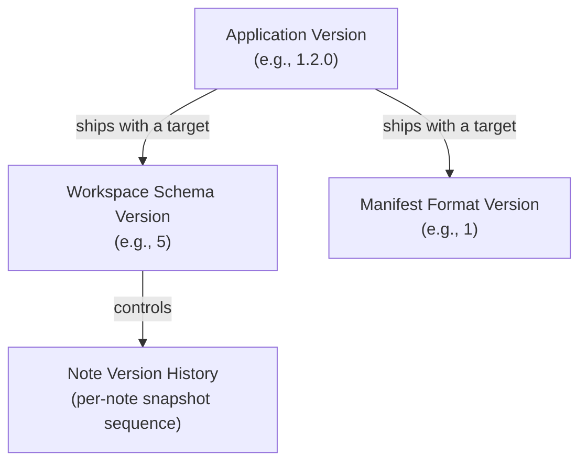
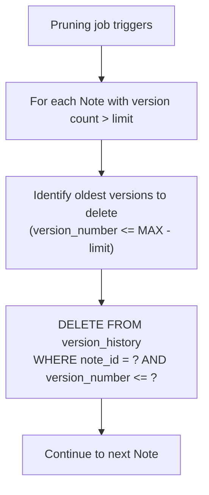

# 09 — Versioning

> **Document Type:** Versioning Strategy
> **Status:** Draft
> **Applies To:** Notebook — All Versions
> **Related Documents:**
> [00-DataModelPrinciples.md](./00-DataModelPrinciples.md) · [04-Schema.md](./04-Schema.md) · [07-Migrations.md](./07-Migrations.md) · [../01-architecture/ADR-010-WorkspaceManifest.md](../01-architecture/ADR-010-WorkspaceManifest.md) · [../01-architecture/15-WorkspaceManifest.md](../01-architecture/15-WorkspaceManifest.md)

---

## 1. Purpose

This document explains versioning in Notebook across four distinct dimensions:

1. **Entity versioning** — how Note content history is tracked
2. **Workspace schema version** — the database schema version for a specific Workspace
3. **Manifest format version** — the version of the Workspace directory format
4. **Application version** — the version of the Notebook application itself

Understanding the distinction between these four version types is essential for writing correct migrations, implementing backup validation, and reasoning about forward compatibility.

---

## 2. Versioning Dimensions



These are independent dimensions. The application version changes on every release. The schema version changes only when the database structure changes. The manifest format version changes only when the Workspace directory layout changes. Entity version history is an application feature, not an infrastructure concept.

---

## 3. Entity Versioning (Note Version History)

### 3.1 What Is Tracked

Every time a Note is saved, a snapshot of its title and body is appended to the `version_history` table. This creates an ordered history of every state the note has passed through.

- Snapshots are immutable — they are never updated.
- Snapshots are identified by `version_number` — a monotonically increasing integer per Note, starting at 1.
- The latest snapshot always represents the state of the note at its last save.

### 3.2 Version Number Scheme

```
version_number = 1   → first save (note created)
version_number = 2   → second save
version_number = N   → Nth save
```

The `version_number` is maintained by the repository: it is always `MAX(version_number) + 1` for the note's existing history, or `1` for a new note.

### 3.3 Retention Policy

The `ApplicationSettings.version_history_limit` field defines the maximum number of versions retained per Note (default: 50).

A background pruning job runs on schedule and physically deletes the oldest versions beyond the limit:



Pruning is **permanent** — pruned versions are not soft-deleted and cannot be recovered.

### 3.4 User-Facing Versioning Features

| Feature | Description |
|---|---|
| **Version list** | User can browse all retained versions of a Note, sorted newest-first |
| **Version diff** | User can compare any two versions side-by-side |
| **Version restore** | User can restore a Note to any retained version (which creates a new version record at the top of the history) |
| **Version label** | User can assign a label to a version (e.g., "Draft v2", "Final") to make it persistent beyond pruning |

**Labeled versions are exempt from pruning.** A version with a non-null `label` value is never automatically deleted by the pruning job.

### 3.5 Version History and Sync

Version history rows are included in `database.db` and are therefore synchronized to Google Drive as part of the database file. A Workspace restored from Google Drive includes the full version history up to the point of the last sync.

---

## 4. Workspace Schema Version

### 4.1 What It Is

The schema version is a monotonically increasing integer that identifies the structural version of a Workspace's `database.db`. It is stored in `manifest.json` as `schemaVersion`.

- `schemaVersion = 1` is the initial schema applied when a Workspace is created.
- `schemaVersion = N` means all migrations up to and including migration N have been applied.

### 4.2 Where It Lives

The `schemaVersion` lives in `manifest.json`, not in the database. This is a deliberate design decision (ADR-010) that enables the application to determine what migrations are needed before opening the database.

### 4.3 Version Progression

| Event | schemaVersion Change |
|---|---|
| Workspace created | Set to `CURRENT_SCHEMA_VERSION` (the latest schema at creation time) |
| Workspace opened with pending migrations | Updated to `CURRENT_SCHEMA_VERSION` after migrations complete |
| Application upgrade with no new migrations | No change |
| Application upgrade with new migrations | Updated to new `CURRENT_SCHEMA_VERSION` on next Workspace open |

### 4.4 Schema Version in the Application

The application defines a compile-time constant `CURRENT_SCHEMA_VERSION`. This value:

- Determines whether migrations need to run on a given Workspace (by comparison with `manifest.schemaVersion`).
- Is stored in `manifest.json` after migrations complete.
- Is checked at Workspace open to detect Workspaces from future application versions (`manifest.schemaVersion > CURRENT_SCHEMA_VERSION`).

### 4.5 Backward and Forward Compatibility

| Scenario | Behavior |
|---|---|
| `manifest.schemaVersion == CURRENT_SCHEMA_VERSION` | Open directly, no migration |
| `manifest.schemaVersion < CURRENT_SCHEMA_VERSION` | Run pending migrations, update manifest, open |
| `manifest.schemaVersion > CURRENT_SCHEMA_VERSION` | Refuse to open — Workspace is from a newer application. Show clear error. |

The `schemaVersion > CURRENT_SCHEMA_VERSION` case protects users from opening a Workspace with an older application that does not know how to handle the newer schema — which could corrupt data.

---

## 5. Manifest Format Version

### 5.1 What It Is

The `formatVersion` field in `manifest.json` identifies the version of the Workspace directory format itself — the layout, the set of directories, and the structure of the manifest file.

This is distinct from `schemaVersion`, which only describes the database structure.

### 5.2 Version 1 (V1)

The V1 Workspace format is defined by the canonical directory layout in [02-StorageLayout.md](./02-StorageLayout.md):

```
<workspace-name>/
    manifest.json       (formatVersion = "1")
    database.db
    attachments/
    cache/
    logs/
    backups/
```

### 5.3 When Format Version Changes

The `formatVersion` increments when:

- The directory layout changes (e.g., a new required directory is added).
- The manifest JSON structure changes in a backward-incompatible way (e.g., a required field is renamed or removed).
- The `databaseFilename` convention changes.

Adding new optional fields to `manifest.json` does **not** require incrementing `formatVersion`. Optional fields are silently ignored by applications that do not recognize them.

### 5.4 Forward Compatibility for Format Version

A V1 application encountering a Workspace with `formatVersion = "2"` **shall** refuse to open it with a clear error: "This Workspace was created by a newer version of Notebook. Please upgrade."

This prevents data corruption from an application that does not understand the new directory layout.

---

## 6. Application Version

### 6.1 What It Is

The application version (e.g., `1.2.0`) follows semantic versioning (MAJOR.MINOR.PATCH). It is stored in `manifest.json` as `applicationVersion` — recording which version of Notebook last wrote to the Workspace.

### 6.2 Purpose in the Database Context

The `applicationVersion` in `manifest.json` is used for:

| Purpose | Description |
|---|---|
| **Compatibility diagnostics** | If a Workspace behaves unexpectedly, knowing which application version last wrote it provides critical context for debugging |
| **Sync compatibility logging** | The sync subsystem logs the `applicationVersion` of each device's manifest for diagnostic purposes |
| **Support** | Users can report their `manifest.json` content to support, revealing the exact application version without requiring the user to find it in the OS |
| **Future capability negotiation** | Future sync protocols may use `applicationVersion` to determine which features both sides of a sync support |

### 6.3 What Application Version Does NOT Control

The `applicationVersion` does **not** gate Workspace open. The `schemaVersion` and `formatVersion` fields control access. A Workspace written by application version `1.0.0` is fully openable by version `1.5.0` — the schema version determines whether migrations run, not the application version.

---

## 7. Prisma Migration Version

Prisma Migrate maintains its own migration history in the `_prisma_migrations` table inside `database.db`. This is an implementation detail of the Prisma ORM, not a Notebook-level versioning concept.

The relationship between Prisma's migration table and `manifest.json`'s `schemaVersion` is:

- `manifest.schemaVersion = N` means the Prisma migration table contains records for all migrations up to and including migration N.
- The `schemaVersion` is updated by the application after Prisma confirms all migrations have been applied.

The `_prisma_migrations` table is never directly read by application code — only by the Prisma migrate engine. Application code uses `manifest.schemaVersion` as the version indicator.

---

## 8. Version Compatibility Matrix

The following table summarizes how version fields interact at Workspace open time:

| manifest.schemaVersion | manifest.formatVersion | Outcome |
|---|---|---|
| == CURRENT_SCHEMA_VERSION | == 1 (current) | Open directly |
| < CURRENT_SCHEMA_VERSION | == 1 (current) | Run migrations, update schemaVersion, open |
| > CURRENT_SCHEMA_VERSION | Any | Refuse — future schema, show upgrade message |
| Any | > 1 (future) | Refuse — future format, show upgrade message |
| Any | < 1 (impossible) | Invalid manifest — show recovery dialog |

---

## 9. Future Considerations

### 9.1 Delta Compression for Version History

Currently, version history stores complete snapshots of `body` for every version. For heavily edited notes, this can accumulate significant storage. Future versions may store diffs (delta compression) rather than full snapshots, reducing storage by an order of magnitude for long edit histories.

**Design consideration:** Delta compression requires a base snapshot (e.g., the first version, or every Nth version as a keyframe) and a chain of deltas. Restoring a version from delta requires replaying the delta chain from the nearest keyframe. This adds complexity; it is deferred until profiling confirms storage is a real concern.

### 9.2 Cross-Version Schema Inspection

A future maintenance tool could read the `_prisma_migrations` table and `manifest.schemaVersion` to produce a report of a Workspace's schema history — useful for diagnosing migration failures in support scenarios.

### 9.3 Semantic Versioning for schemaVersion

The current integer schema version is deliberately simple. If future schema evolution requires distinguishing between incompatible major changes and backward-compatible minor changes, a `MAJOR.MINOR` schema version could be introduced via a `formatVersion` increment (since the manifest format would change). This is a future consideration, not a current requirement.

---

## 10. Acceptance Criteria

- `manifest.json` `schemaVersion` is set to `CURRENT_SCHEMA_VERSION` on every new Workspace creation.
- `manifest.json` `schemaVersion` is updated to `CURRENT_SCHEMA_VERSION` after all pending migrations complete successfully.
- A Workspace with `schemaVersion > CURRENT_SCHEMA_VERSION` is refused with a clear, user-readable error message.
- A Workspace with `formatVersion > "1"` is refused with a clear, user-readable error message.
- Version history snapshots are immutable — no update or soft-delete operation may modify a `version_history` row.
- Labeled versions are never deleted by the automatic pruning job.
- `applicationVersion` in `manifest.json` is updated on every Workspace close to reflect the current application version.
