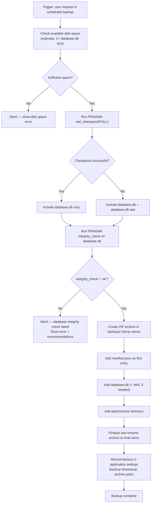
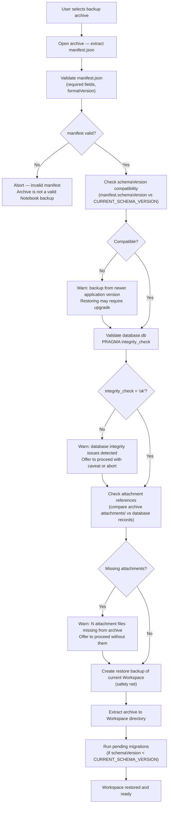

# 10 — Backup Strategy

> **Document Type:** Backup and Recovery Specification
> **Status:** Draft
> **Applies To:** Notebook — All Versions
> **Related Documents:**
> [02-StorageLayout.md](./02-StorageLayout.md) · [05-SQLite.md](./05-SQLite.md) · [07-Migrations.md](./07-Migrations.md) · [09-Versioning.md](./09-Versioning.md) · [../01-architecture/12-SynchronizationArchitecture.md](../01-architecture/12-SynchronizationArchitecture.md) · [../01-architecture/15-WorkspaceManifest.md §8](../01-architecture/15-WorkspaceManifest.md)

---

## 1. Purpose

This document defines the backup and restore strategy for Notebook Workspaces. It covers the backup contents, naming convention, validation procedure, integrity checks, restore flow, disaster recovery, and the interaction between local backups and Google Drive synchronization.

---

## 2. Backup Philosophy

### 2.1 Local Backup Is a Safety Net, Not Sync

Local backups and Google Drive sync are **distinct and complementary** mechanisms:

| Mechanism | Purpose | Scope |
|---|---|---|
| **Local backup** | Point-in-time snapshot of the Workspace on the same machine | Protection from local data loss: accidental deletion, corruption, migration failure |
| **Google Drive sync** | Cross-device continuity — keep the Workspace accessible on multiple machines | Protection from machine loss, hardware failure |

Neither replaces the other. A user with only local backups is not protected from machine loss. A user with only Google Drive sync is not protected from accidentally overwriting a good version with a corrupted one.

### 2.2 Backup Is Workspace-Scoped

Each Workspace is backed up independently. There is no full-application backup that captures all Workspaces simultaneously. This is consistent with the Workspace-first design principle: each Workspace is a self-contained unit.

### 2.3 Backups Are Immutable Archives

A backup archive, once created, is never modified. It represents a complete, verified snapshot of the Workspace at a specific point in time. If the Workspace changes after a backup, a new backup is created — the old archive is never updated.

### 2.4 Never Delete Backups Automatically Without Explicit Configuration

Backup archives accumulate in `backups/`. The application **shall not** automatically delete backups without explicit user configuration (e.g., a retention policy). By default, all backups are retained indefinitely.

---

## 3. Backup Contents

A Notebook Workspace backup is a ZIP archive containing:

| Artifact | Always Included | Condition |
|---|---|---|
| `manifest.json` | Yes | First entry in the archive; first validated on restore |
| `database.db` | Yes | The complete SQLite database |
| `database.db-wal` | Conditionally | Included if WAL checkpoint was not performed before backup |
| `attachments/` | Yes | All non-deleted attachment files |
| `cache/` | Optional | User choice (default: exclude — reproducible from source data) |
| `logs/` | No | Always excluded — machine-specific operational logs |
| `backups/` | No | Always excluded — backups are not backed up into themselves |

**WAL file handling:** Before creating a backup, the application **shall** attempt a WAL checkpoint (`PRAGMA wal_checkpoint(FULL)`) to merge outstanding WAL entries into `database.db`. If the checkpoint is successful, the WAL file is empty (or does not exist) and does not need to be included. If the checkpoint fails (e.g., because a long-running read is blocking it), the WAL file **shall** be included in the archive to ensure a consistent snapshot.

---

## 4. Backup Naming Convention

Backup archives follow this naming format:

```
notebook-backup-<workspace-name>-<YYYY-MM-DD>-<HHmmss>.zip
```

**Examples:**
```
notebook-backup-Work-2024-06-20-143022.zip
notebook-backup-Personal-2024-06-20-143022.zip
notebook-backup-Study-2024-01-15-090000.zip
```

**Workspace name sanitization:** Special characters in the Workspace name that are not filesystem-safe are replaced with hyphens. Spaces are replaced with hyphens. The name is limited to a reasonable length to avoid filesystem path length limits.

**Timestamp format:** UTC timestamp in `YYYY-MM-DD-HHmmss` format. UTC is used to ensure consistency across timezones and across devices.

**Pre-migration backups** use a specific prefix:
```
notebook-backup-<workspace-name>-pre-migration-<schemaVersion>-<timestamp>.zip
```

---

## 5. Backup Creation Flow



**Atomic archive creation:** The archive is created with a temporary name (e.g., `~notebook-backup-Work.tmp.zip`) and renamed to the final name only after the archive is complete. This prevents a partial archive from appearing as a valid backup if the operation is interrupted.

---

## 6. Backup Types

### 6.1 Manual Backup

Triggered by the user via Settings → Backup → "Create Backup Now". Always available. No confirmation required; backup is created immediately.

### 6.2 Scheduled Automatic Backup

Configurable via `ApplicationSettings`:
- `backup_enabled = true`
- `backup_frequency_hours = N` (default: 24 hours)

When enabled, the Background Job Manager triggers a backup on the configured schedule, provided:
- The Workspace is open
- The machine is running on AC power (not battery — avoids waking/draining the machine)
- At least N hours have elapsed since the last backup

Scheduled backups run silently. The user is notified only if the backup fails.

### 6.3 Pre-Migration Backup

Automatically created by the Workspace Manager before applying any database migrations. See [07-Migrations.md §5.2](./07-Migrations.md). This backup uses the pre-migration naming convention and is created regardless of the user's backup configuration.

---

## 7. Restore Flow



### 7.1 Pre-Restore Safety Backup

Before any restore operation replaces the current Workspace data, the application **shall** create an automatic backup of the current state. This ensures the user can recover the pre-restore state if the restore turns out to be undesirable.

The pre-restore backup is named:
```
notebook-backup-<workspace-name>-pre-restore-<timestamp>.zip
```

### 7.2 Restore Never Deletes Without Confirmation

The restore operation replaces the current `database.db` and `attachments/` with those from the archive. This is a destructive operation. The application **shall** display a confirmation dialog with an explicit description of what will be replaced before any files are overwritten.

---

## 8. Validation

### 8.1 manifest.json Validation

The manifest is the first artifact validated in any backup operation (creation or restore). Validation checks:

| Check | Pass Condition |
|---|---|
| File exists in archive | `manifest.json` is the first or second entry |
| Parseable JSON | No JSON syntax errors |
| Required fields present | `workspaceId`, `schemaVersion`, `formatVersion`, `databaseFilename` are all present |
| `formatVersion` compatible | `formatVersion` ≤ current application's supported format version |
| `workspaceId` is a valid UUID | Matches UUID v4 format |

### 8.2 Database Integrity Validation

SQLite's `PRAGMA integrity_check` runs on `database.db` after extracting it from the archive (but before overwriting the current database during a restore). This checks:

- Page structure is valid
- Row format is correct
- Index consistency
- B-tree integrity

`integrity_check` returns `ok` if no issues are found, or a list of problems.

### 8.3 Attachment Reference Validation

The application compares the list of attachment files in the archive's `attachments/` directory against the attachment UUIDs referenced in `database.db.attachments`. Missing files are reported as warnings — they do not block the restore, but the user is informed that certain attachments will be unavailable after restore.

---

## 9. Integrity Checks

### 9.1 Backup Creation Integrity

Before creating a backup archive, `PRAGMA integrity_check` runs on the live `database.db`. If integrity check fails, the backup is aborted and the user is informed. The application **shall** not create a backup of a corrupt database — a corrupt backup has no recovery value.

### 9.2 Scheduled Integrity Check

As a separate maintenance operation (distinct from backup), the application may run `PRAGMA quick_check` on Workspace open and `PRAGMA integrity_check` on a weekly schedule. Integrity check failures are surfaced to the user with guidance to restore from backup or contact support.

---

## 10. Backup Retention Policy

### 10.1 Default Policy — No Automatic Deletion

By default, backups accumulate indefinitely in `backups/`. The user is responsible for managing disk space.

### 10.2 Configurable Retention

`ApplicationSettings.backup_retention_days` (optional) configures automatic deletion of old backups:

- If set, the scheduled maintenance job deletes backup archives older than `backup_retention_days`.
- Pre-migration backups are **exempt** from automatic retention deletion — they are retained until explicitly deleted by the user.
- Pre-restore backups are also exempt.

### 10.3 Manual Deletion

The user may manually delete individual backup archives via Settings → Backup → Manage Backups. The application shows each archive with its date, size, and type (manual, scheduled, pre-migration, pre-restore).

---

## 11. Disaster Recovery

### 11.1 Scenario: Accidental Note Deletion

**Recovery path:**
1. Use the Trash (soft delete recovery) — no backup needed.
2. If Trash is empty (permanently deleted): restore from the most recent backup taken before the deletion.

### 11.2 Scenario: Database Corruption

**Recovery path:**
1. The application detects corruption via `PRAGMA quick_check` on Workspace open.
2. User is prompted to restore from a backup.
3. User selects the most recent backup where integrity check passes.
4. Restore flow executes.

### 11.3 Scenario: Migration Failure

**Recovery path:**
1. The pre-migration backup is available in `backups/`.
2. User restores from the pre-migration backup.
3. The Workspace opens with the pre-migration schema.
4. User can continue using the previous application version or wait for a fixed migration.

### 11.4 Scenario: Machine Loss

**Recovery path:**
1. If Google Drive sync was configured, restore from Google Drive.
2. If no sync: local backups were on the same machine — also lost.
3. Prevention: configure Google Drive sync OR copy `backups/` to external storage regularly.

This is documented as a known limitation of local-only backups. The user is informed of this risk in the Backup Settings UI.

### 11.5 Scenario: Accidental Overwrite During Sync

**Recovery path:**
1. Google Drive sync may overwrite local data in conflict scenarios (with user confirmation).
2. The sync subsystem creates a pre-sync backup before any overwrite: `notebook-backup-<workspace>-pre-sync-<timestamp>.zip`.
3. User can restore from this backup.

---

## 12. Google Drive Interaction

### 12.1 Local Backups Are Not Synced to Google Drive

Backup archives in `backups/` are excluded from Google Drive sync. This is intentional:

- Backup archives can be large (hundreds of MB). Syncing them would consume significant Google Drive quota.
- Backups represent local recovery artifacts, not cross-device continuity data.
- Google Drive sync itself serves the cross-device continuity purpose.

### 12.2 Google Drive Is Not a Backup Target

Notebook does not treat Google Drive as a backup system. Google Drive sync maintains a mirror of the current Workspace state. If the user accidentally deletes all notes and syncs, the deletion is propagated to Google Drive.

For off-site backup, users should either:
- Copy `backups/` to external storage manually.
- Use a system backup tool (Time Machine, Windows Backup) that captures the entire Workspace directory.

### 12.3 Pre-Sync Safety Backups

Before executing a sync operation that will overwrite local data (e.g., "Use Remote" conflict resolution), the sync subsystem **shall** create a pre-sync backup. This is a safety net that preserves the local state before it is replaced.

---

## 13. Incremental Backups (Future)

### 13.1 Current State

V1 backups are full backups — every backup archive contains the complete `database.db` and all attachment files. This is simple, correct, and easy to restore.

### 13.2 Future: Incremental Backup

For large Workspaces with many attachments, full backups may become time-consuming and storage-intensive. A future incremental backup system would:

1. Create a full "base" backup periodically (e.g., weekly).
2. Create daily incremental backups that include only:
   - A new `database.db` (SQLite changes are always stored as a full file in WAL mode — incremental database-level snapshots require external tooling).
   - Only the attachment files added or changed since the last backup.
3. Restore combines the base backup + all incrementals in sequence.

**Design note:** Incremental backups for SQLite at the page level are possible using SQLite's backup API (page-by-page diff). This is a future optimization; V1 uses full backups.

---

## 14. Acceptance Criteria

- Every backup archive begins with `manifest.json` as the first entry.
- Backup creation runs `PRAGMA integrity_check` on `database.db` before archiving. A corrupt database causes backup to abort with a clear error.
- The backup archive is created atomically — no partial archive is ever left as a final archive name.
- A pre-migration backup is automatically created before any database migration runs.
- Restore validates `manifest.json` before touching `database.db`.
- Restore validates `database.db` with `PRAGMA integrity_check` before replacing the current database.
- A pre-restore backup of the current Workspace is created before any files are overwritten.
- Pre-migration and pre-restore backups are never automatically deleted by the retention policy.
- Backup archives in `backups/` are excluded from Google Drive sync.
- The user can create a manual backup at any time from Settings.
