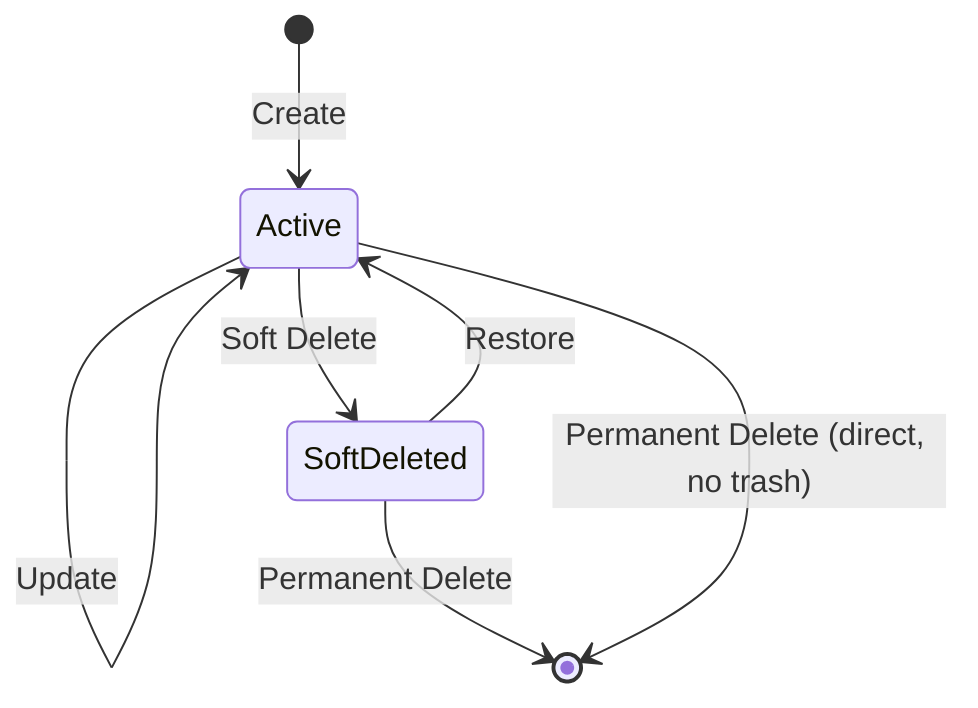
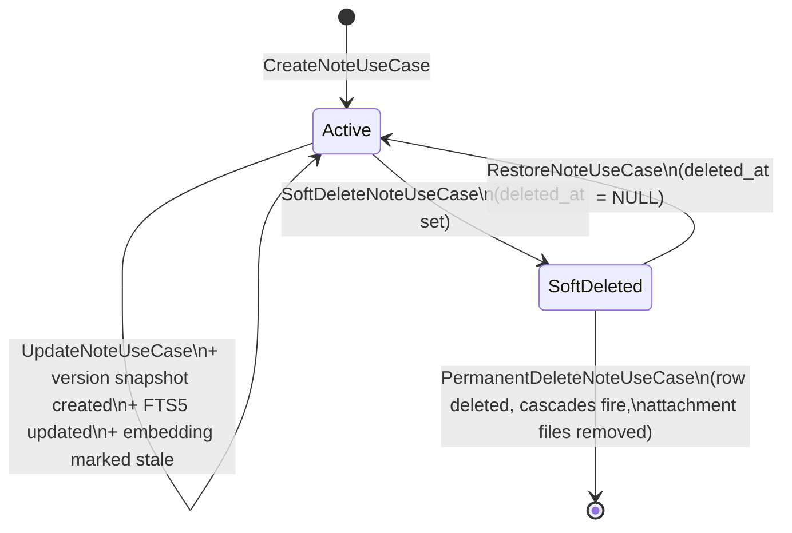
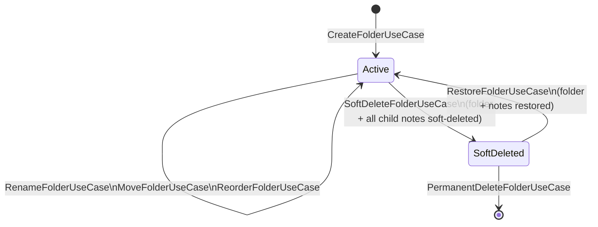
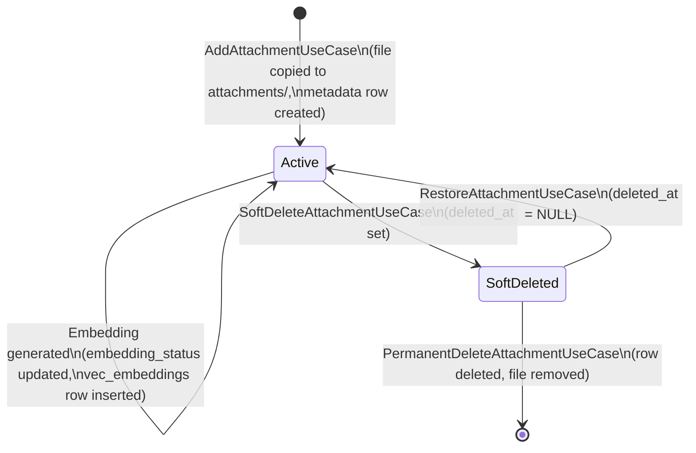
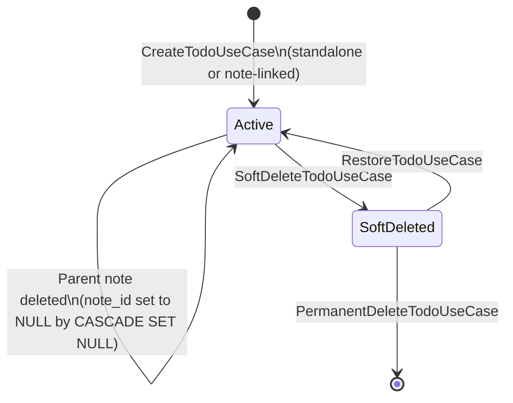
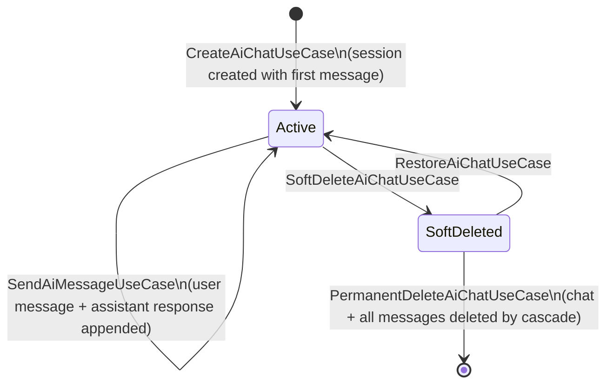
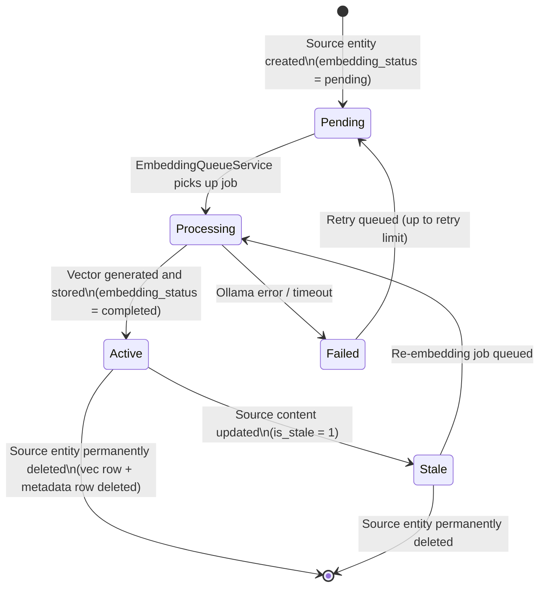

# 11 — Entity Lifecycle

> **Document Type:** Entity Lifecycle Specification
> **Status:** Draft
> **Applies To:** Notebook — All Versions
> **Related Documents:**
> [00-DataModelPrinciples.md](./00-DataModelPrinciples.md) · [04-Schema.md](./04-Schema.md) · [06-sqlite-vec.md](./06-sqlite-vec.md) · [09-Versioning.md](./09-Versioning.md) · [10-BackupStrategy.md](./10-BackupStrategy.md) · [../01-architecture/01-SystemOverview.md §14](../01-architecture/01-SystemOverview.md)

---

## 1. Purpose

This document defines the full lifecycle of each major entity in the Notebook data model. For each entity it documents:

- **Create** — what triggers creation, what state the entity starts in
- **Update** — what mutations are permitted and what they affect
- **Version Creation** — whether and how a version snapshot is produced
- **Soft Delete** — what soft deletion means for the entity and its dependents
- **Restore** — how the entity is returned to active state
- **Permanent Delete** — what physical removal entails across the database and filesystem

Lifecycle invariants are stated explicitly. These invariants must hold at all times regardless of the code path that produces a state transition.

---

## 2. Lifecycle Conventions

All entity lifecycles in Notebook follow a common state grammar derived from the data model principles:

Not every entity passes through every state. Entities without soft delete move directly from Active to Permanent Delete. Immutable entities (version history, chat messages) have no Update transition.

---

## 3. Note Lifecycle

The Note is the primary entity in Notebook. Its lifecycle is the most involved, encompassing version history, embeddings, wiki links, FTS5 indexing, and the Trash.

### 3.1 State Diagram

### 3.2 Create

**Trigger:** `CreateNoteUseCase` — user creates a new note.

**Responsibilities:**
- A UUID v4 is generated client-side (domain layer) before any database interaction.
- A row is inserted into `notes` with `deleted_at = NULL`, `embedding_status = 'pending'`, and the initial `body` (empty Tiptap JSON document).
- An initial version history snapshot is inserted into `version_history` with `version_number = 1`.
- An `INSERT` into `fts_notes` indexes the (empty) note for search.
- A `NoteCreatedEvent` is emitted, which triggers the `EmbeddingQueueService` to queue an embedding job.

All three database operations (notes insert, version_history insert, fts_notes insert) execute within a single transaction.

**Post-condition:** The note is active (`deleted_at IS NULL`), appears in the folder or root list, and is queued for embedding.

### 3.3 Update

**Trigger:** `UpdateNoteUseCase` — user saves a note after editing.

**Responsibilities:**
- `notes.title`, `notes.body`, `notes.word_count`, and `notes.updated_at` are updated.
- A new `version_history` row is inserted with `version_number = MAX(version_number) + 1`.
- The `fts_notes` virtual table entry is updated with the new title and body text.
- Outgoing `wiki_links` from this note are deleted and recomputed from the new body content.
- `notes.embedding_status` is set to `'pending'` and a `NoteUpdatedEvent` triggers re-embedding.

All operations execute within a single transaction.

**Invariant:** A saved note always has a corresponding `version_history` row for every save. There is never a saved state that has no version record.

### 3.4 Version Creation

A version snapshot is created on every `UpdateNoteUseCase` execution and on `CreateNoteUseCase` (version 1). See [09-Versioning.md §3](./09-Versioning.md) for retention, pruning, and labeled-version protection.

Version records are immutable. They are never updated after creation.

### 3.5 Soft Delete

**Trigger:** `SoftDeleteNoteUseCase` — user moves a note to Trash.

**Responsibilities:**
- `notes.deleted_at` is set to the current UTC timestamp.
- If the note belongs to a folder being soft-deleted (cascade), all notes in the folder receive the same `deleted_at` timestamp in a single batch update.
- The `fts_notes` entry is **not** removed — FTS results are filtered at the application layer by `deleted_at IS NULL`.
- The embedding record is **not** removed — soft-deleted notes are excluded from search results at the application layer.
- `wiki_links` are **not** removed — backlinks to this note remain, but the UI marks the target note as deleted.

**Post-condition:** The note has `deleted_at IS NOT NULL`. It is invisible to all standard queries that filter on active content. It appears in the Trash UI.

### 3.6 Restore

**Trigger:** `RestoreNoteUseCase` — user restores a note from Trash.

**Responsibilities:**
- `notes.deleted_at` is set to `NULL`.
- No version history change — restore does not create a version snapshot.
- FTS and embedding records remain intact (they were not removed on soft delete).

**Post-condition:** The note has `deleted_at IS NULL`. It appears in its original folder (or root if the folder was deleted). The embedding reflects the state at soft-delete time; re-embedding is not triggered unless the content was stale.

### 3.7 Permanent Delete

**Trigger:** `PermanentDeleteNoteUseCase` — user deletes a note from Trash, or empties Trash.

**Responsibilities (in a single transaction):**
1. Delete the `notes` row — cascade fires automatically.
2. Cascade: `attachments` rows with `note_id = ?` are deleted.
3. Cascade: `note_tags` rows are deleted.
4. Cascade: `wiki_links` where `source_note_id = ?` are deleted.
5. Cascade: `wiki_links` where `target_note_id = ?` have `target_note_id` set to `NULL` (SET NULL).
6. Cascade: `version_history` rows are deleted.
7. Application layer: for each deleted attachment record, the corresponding file in `attachments/` is deleted from the filesystem.
8. Application layer: the `vec_embeddings` row for the note's embedding is deleted, and the `embeddings` metadata row is deleted.
9. Application layer: the `fts_notes` entry for the note is deleted.

**Invariant:** After permanent delete, no reference to the note's UUID remains in any active record. Filesystem files for all associated attachments are removed. The note's UUID is retired and will not be reused.

---

## 4. Folder Lifecycle

### 4.1 State Diagram

### 4.2 Create

**Trigger:** `CreateFolderUseCase` — user creates a new folder.

**Responsibilities:**
- A UUID v4 is generated and a row is inserted into `folders` with `parent_id` (NULL for root) and `deleted_at = NULL`.
- No embedding or FTS indexing — folders are navigational containers, not searchable content.

### 4.3 Update

Folders support three update operations:

| Operation | Columns Changed |
|---|---|
| Rename | `name`, `updated_at` |
| Move (change parent) | `parent_id`, `updated_at` |
| Reorder | `display_order`, `updated_at` |

None of these operations trigger version history, embedding, or FTS changes.

### 4.4 Version Creation

Folders do not have version history. Folder renames and moves are not tracked historically.

### 4.5 Soft Delete

**Trigger:** `SoftDeleteFolderUseCase` — user moves a folder to Trash.

**Responsibilities:**
- `folders.deleted_at` is set.
- All notes in the folder have `notes.deleted_at` set in a batch update (same timestamp).
- Child folders (sub-folders) have `folders.deleted_at` set recursively.
- Notes within child folders have `notes.deleted_at` set recursively.

This cascade ensures the entire sub-tree is soft-deleted atomically.

### 4.6 Restore

**Trigger:** `RestoreFolderUseCase` — user restores a folder from Trash.

**Responsibilities:**
- `folders.deleted_at = NULL`.
- All notes that were soft-deleted as part of this folder's deletion have `notes.deleted_at = NULL` (identified by matching the soft-delete timestamp).
- Child folders and their notes are restored recursively.

**Design note:** Only notes that were soft-deleted as part of this folder operation are restored. Notes within the folder that were already in Trash before the folder was deleted are not affected.

### 4.7 Permanent Delete

**Responsibilities:**
1. Delete the `folders` row.
2. Cascade: `parent_id` of child folders is set to `NULL` (SET NULL) — children become root-level.
3. Cascade: `folder_id` of notes is set to `NULL` (SET NULL) — notes become root-level.

**Distinction from Note permanent delete:** Deleting a folder does not permanently delete its notes. Notes become root-level (folder-less). This is intentional — folder deletion is an organizational action, not a content deletion action.

---

## 5. Attachment Lifecycle

### 5.1 State Diagram

### 5.2 Create

**Trigger:** `AddAttachmentUseCase` — user attaches a file to a note.

**Responsibilities:**
1. The file is copied into `attachments/<uuid>.<ext>` on the filesystem.
2. An `attachments` metadata row is inserted: `note_id`, `original_filename`, `mime_type`, `file_size_bytes`, `checksum`, `ocr_status = 'pending'` (or `'not_applicable'` for binary-only types), `embedding_status = 'pending'`.
3. An `AttachmentAddedEvent` is emitted, triggering the OCR queue (if applicable) and the embedding queue.

The file copy and the metadata row insertion are performed as an atomic unit: the file is copied first, then the row is inserted. If the row insertion fails, the file is removed (compensating action).

### 5.3 Update

Attachment metadata is immutable after creation with the following exceptions:

| Column | When Updated |
|---|---|
| `ocr_status` | When the OCR job processes the attachment |
| `embedding_status` | When the embedding job processes the attachment |

The original file bytes in `attachments/` are never modified. If a user needs to replace an attachment, the old one is deleted and a new one is added.

### 5.4 Version Creation

Attachments do not have version history. The file is immutable after creation.

### 5.5 Soft Delete

**Trigger:** `SoftDeleteAttachmentUseCase` — user removes an attachment from a note.

**Responsibilities:**
- `attachments.deleted_at` is set.
- The file in `attachments/` is **not** removed — it remains until permanent deletion.
- The embedding record is **not** removed — soft-deleted attachments are excluded at the application layer.

### 5.6 Restore

**Trigger:** `RestoreAttachmentUseCase` — user restores a deleted attachment.

**Responsibilities:**
- `attachments.deleted_at = NULL`.
- File, OCR cache, and embedding record remain intact.

### 5.7 Permanent Delete

**Responsibilities (single transaction):**
1. Delete the `attachments` row.
2. Cascade: `attachment_tags` rows deleted.
3. Application layer: delete `attachments/<uuid>.<ext>` from the filesystem.
4. Application layer: delete `cache/ocr/<uuid>.txt` if it exists.
5. Application layer: delete `cache/thumbnails/<uuid>-*.webp` if they exist.
6. Application layer: delete `vec_embeddings` row and `embeddings` metadata row.

**Invariant:** After permanent deletion, no file bytes remain on the filesystem for this attachment's UUID.

---

## 6. Todo Lifecycle

### 6.1 State Diagram

### 6.2 Create

**Trigger:** `CreateTodoUseCase` — user creates a task.

**Responsibilities:**
- A UUID v4 is assigned.
- `note_id` is set if the todo is created in the context of a note; `NULL` for a standalone todo.
- `completed = 0`, `deleted_at = NULL`.

### 6.3 Update

Permitted mutations:

| Field | Meaning |
|---|---|
| `title` | Task description changed |
| `completed` | Task marked complete (1) or incomplete (0) |
| `due_date` | Due date added, changed, or cleared |
| `priority` | Priority assigned or changed |
| `note_id` | Todo linked to or unlinked from a Note |

### 6.4 Version Creation

Todos do not have version history.

### 6.5 Note Deletion Effect

When the referenced Note is permanently deleted, `todos.note_id` is set to `NULL` by the `ON DELETE SET NULL` cascade rule. The Todo becomes standalone. It is not deleted. No user action or notification is required — the Todo simply loses its note association.

### 6.6 Soft Delete, Restore, Permanent Delete

Follow the standard pattern: `deleted_at` set on soft delete, cleared on restore, row physically deleted on permanent delete.

---

## 7. AI Chat Lifecycle

### 7.1 State Diagram

### 7.2 Create

**Trigger:** `CreateAiChatUseCase` — user opens a new AI conversation.

**Responsibilities:**
- A `ai_chats` row is inserted with `deleted_at = NULL`, `title` (auto-generated or user-given), `created_at`, `last_active_at`.

### 7.3 Update

The `ai_chats` row is updated in two ways:

| Trigger | Columns Updated |
|---|---|
| User sends a message | `last_active_at` updated to current timestamp |
| User renames the chat | `title` updated |

### 7.4 Message Append

**Trigger:** `SendAiMessageUseCase` — user sends a message and the AI responds.

**Responsibilities:**
1. A `chat_messages` row is inserted for the user message (`role = 'user'`).
2. The AI provider is called with the conversation context and the retrieved embeddings.
3. A `chat_messages` row is inserted for the AI response (`role = 'assistant'`, `citations` populated from the context builder's source references).
4. `ai_chats.last_active_at` is updated.

`chat_messages` rows are immutable after insertion. The conversation is an append-only log.

### 7.5 Version Creation

AI Chats do not have version history. `chat_messages` rows are immutable; the conversation log is the history.

### 7.6 Soft Delete

**Trigger:** `SoftDeleteAiChatUseCase`.

**Responsibilities:**
- `ai_chats.deleted_at` is set.
- `chat_messages` rows are **not** soft-deleted — they remain physically and are cascade-deleted on permanent delete.

### 7.7 Permanent Delete

**Responsibilities:**
1. Delete the `ai_chats` row.
2. Cascade: all `chat_messages` rows for this chat are deleted.

No filesystem artifacts are associated with AI chats.

---

## 8. Embedding Lifecycle

### 8.1 State Diagram

See [06-sqlite-vec.md §7](./06-sqlite-vec.md) for the full embedding lifecycle specification including queue processing, staleness management, and model replacement.

### 8.2 Create

Embedding records are created by the `EmbeddingQueueService`, not by any user-facing use case. The service:

1. Reads a pending job from `background_jobs` (type: `embedding`).
2. Fetches the source content (note body text or attachment OCR text).
3. Calls the `IEmbeddingProvider` (Ollama) to generate the vector.
4. Inserts a row into `embeddings` (metadata) and a corresponding row into `vec_embeddings` (vector).
5. Updates `notes.embedding_status` or `attachments.embedding_status` to `'completed'`.

### 8.3 Update (Stale → Active)

When source content changes, the embedding is marked stale (`is_stale = 1`). The re-embedding job:

1. Generates a new vector for the updated content.
2. Deletes the old `vec_embeddings` row by rowid.
3. Inserts the new vector into `vec_embeddings`.
4. Updates the `embeddings` metadata row (`model_id`, `generated_at`, `is_stale = 0`).

### 8.4 Permanent Delete

When the source entity (Note or Attachment) is permanently deleted, the embedding's `vec_embeddings` row and `embeddings` metadata row are deleted by the repository layer in the same transaction as the source entity deletion.

**Invariant:** There is never an orphaned `embeddings` or `vec_embeddings` row whose `source_id` references a non-existent Note or Attachment. Referential integrity is enforced at the application layer by the embedding repository.

---

## 9. Lifecycle Invariants Summary

The following invariants must hold at all times, regardless of the code path that produces a state transition:

| Invariant | Description |
|---|---|
| **I-01: Transactional consistency** | Every lifecycle transition that touches multiple tables executes within a single database transaction |
| **I-02: FTS always in sync** | `fts_notes` is updated in the same transaction as every note create, update, or delete |
| **I-03: Version on every save** | A `version_history` row is inserted in the same transaction as every `notes.body` update |
| **I-04: UUID never reused** | A permanently deleted entity's UUID is never assigned to a new entity |
| **I-05: Filesystem cleanup follows database** | Attachment files are deleted from the filesystem only after the database record deletion is committed |
| **I-06: Soft-deleted content invisible** | All repository read methods apply `deleted_at IS NULL` by default; accessing deleted content requires explicit opt-in |
| **I-07: Embedding staleness immediate** | When note or attachment content changes, `is_stale = 1` is set in the same transaction as the content update |
| **I-08: No embedding without source** | An embedding record always has a corresponding active or soft-deleted Note or Attachment. Orphaned embeddings are a bug state |
| **I-09: Labeled versions exempt from pruning** | Version history rows with a non-null `label` are never deleted by the background pruning job |
| **I-10: Pre-migration backup before any schema change** | The Backup service creates a backup before any migration runs; the Workspace is not opened if the backup fails |
