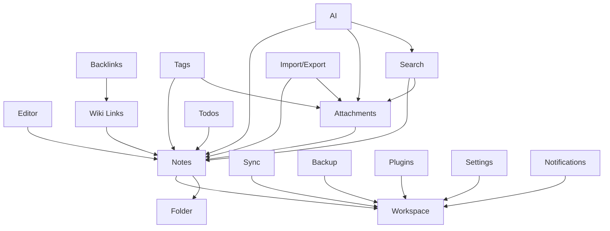

# 00 — Module Overview

> **Document Type:** Module Framework Overview
> **Status:** Draft
> **Applies To:** Notebook — All Versions
> **Layer:** Module Specification (Layer 6 of 7 — see [GOVERNANCE.md](../GOVERNANCE.md))
> **Related Documents:**
> [../00-overview/04-FunctionalRequirements.md](../00-overview/04-FunctionalRequirements.md) · [../01-architecture/01-SystemOverview.md](../01-architecture/01-SystemOverview.md) · [../01-architecture/02-CleanArchitecture.md](../01-architecture/02-CleanArchitecture.md) · [../02-database/00-DataModelPrinciples.md](../02-database/00-DataModelPrinciples.md) · [../GOVERNANCE.md](../GOVERNANCE.md)

---

## 1. Purpose

This document is the entry point for `docs/03-modules/`. It defines the structure, principles, and conventions of the module specification layer.

Module specifications define **functional behavior** — what each feature does, why it exists, how it responds to user actions, what rules govern it, and what constitutes acceptance. Module specifications are the implementation contract: developers and AI coding agents implement features by following module specifications, not by interpreting architecture documents or inferred intent.

Module specifications are **not**:
- Source code
- API definitions
- Database schema definitions
- UI mockups or wireframes
- Architecture designs

Those concerns are addressed in `docs/01-architecture/` and `docs/02-database/` respectively.

---

## 2. Position in the Documentation Hierarchy

Per [GOVERNANCE.md §2](../GOVERNANCE.md), documentation follows this authority order:

```
Governance (highest)
  → Architecture Decision Records (ADRs)
    → Product Requirements (docs/00-overview/)
      → Architecture Documents (docs/01-architecture/)
        → Database Documents (docs/02-database/)
          → Module Specifications (docs/03-modules/) ← THIS LAYER
            → Development Guides (lowest)
```

Module specifications **shall not** contradict any document above them in this hierarchy. If a module specification requirement conflicts with an approved ADR or architecture document, the higher authority document wins and the module specification must be corrected.

Module specifications **shall** be the authoritative reference for:
- Feature-level functional behavior
- Business rules
- State transitions
- Error handling
- Acceptance criteria
- Edge cases

---

## 3. Module Index

The following modules are defined in `docs/03-modules/`. Each module owns a subdirectory containing a `README.md` and one or more specification documents.

| # | Module | Directory | Primary Concern |
|---|---|---|---|
| 01 | Workspace | `workspace/` | Workspace creation, opening, closing, switching, deletion |
| 02 | Folder | `folder/` | Folder hierarchy creation, navigation, and management |
| 03 | Notes | `notes/` | Note creation, editing, version history, and metadata |
| 04 | Editor | `editor/` | Rich text editing, formatting, autosave, and toolbar |
| 05 | Wiki Links | `wikilinks/` | `[[Link]]` syntax, link resolution, and link management |
| 06 | Backlinks | `backlinks/` | Automatic bidirectional backlink maintenance |
| 07 | Attachments | `attachments/` | File attachment, OCR, previews, and lifecycle |
| 08 | Tags | `tags/` | Tag creation, assignment, browsing, and rename |
| 09 | Search | `search/` | Full-text search, semantic search, and hybrid search |
| 10 | AI | `ai/` | AI chat, RAG pipeline, context building, and citations |
| 11 | Todos | `todos/` | Task creation, completion, filtering, and note linkage |
| 12 | Sync | `sync/` | Google Drive authorization, sync, and conflict resolution |
| 13 | Backup | `backup/` | Local backup creation, validation, and restore |
| 14 | Import / Export | `import-export/` | Markdown import, Workspace export, format conversion |
| 15 | Plugins | `plugins/` | Plugin installation, lifecycle, and extension points |
| 16 | Settings | `settings/` | Workspace and application configuration |
| 17 | Notifications | `notifications/` | In-app notifications, background job status, and alerts |

---

## 4. Module Principles

The following principles apply to every module. They are derived from the project philosophy ([README.md](../../README.md)) and the architectural rules ([01-architecture/02-CleanArchitecture.md](../01-architecture/02-CleanArchitecture.md)).

### MP-01 — Single Responsibility

Every module owns exactly one functional domain. A module does not implement cross-cutting concerns — those are handled by shared infrastructure (EventBus, Repository Pattern, IPC Bridge).

**Example:** The `attachments/` module owns attachment file management. OCR processing is triggered by an event emitted from the attachments module, but OCR processing logic is documented within `attachments/` as it is an attachment-specific concern.

### MP-02 — Explicit Ownership

Every piece of user-facing behavior is owned by exactly one module. When a feature involves multiple modules (e.g., saving a note triggers version history creation), the primary module documents the trigger; the secondary module documents the response.

**Example:** `notes/` documents that saving a note emits a `NoteUpdatedEvent`. `editor/` documents autosave. Version history creation in response to a save is documented in `notes/` because the `version_history` table is a note concern.

### MP-03 — No Hidden Side Effects

Every side effect of a user action must be explicitly documented in the owning module's specification. If saving a note updates FTS5, re-queues embeddings, creates a version snapshot, and resolves wiki links, all four side effects are listed in the Notes module's workflow documentation.

Hidden side effects are a primary cause of regression bugs. Making them explicit enables complete, confident test coverage.

### MP-04 — Event-Driven Where Appropriate

Modules communicate through the EventBus ([01-architecture/09-EventBus.md](../01-architecture/09-EventBus.md)) rather than through direct inter-module dependencies. A module may emit events; it shall not directly call use cases owned by another module.

**Example:** The Attachments module emits `AttachmentAddedEvent`. The AI module's embedding queue listens to this event. The Attachments module has no knowledge of the embedding pipeline.

### MP-05 — Offline-First

Every module specification shall describe complete functionality in an offline state. Network-dependent features (Google Drive sync, optional cloud AI) are described separately and always require explicit user action.

No module may assume network availability for any core feature.

### MP-06 — Workspace-Scoped

All user data is scoped to the active Workspace. No module may read, write, or query data from a Workspace other than the currently open one. Cross-Workspace operations are not permitted at the module layer.

**Implication for specifications:** Module specifications never describe "all notes in the application" — only "all notes in the active Workspace."

### MP-07 — Testable

Every functional requirement described in a module specification shall be expressed in a form that is testable. Acceptance criteria define the observable, verifiable conditions that confirm correct behavior. Vague requirements ("notes should feel fast") are not acceptable — they must be made concrete ("note list renders within 200ms for a Workspace with 10,000 notes").

### MP-08 — Extensible

Module specifications shall anticipate extension without mandating it. The Plugin system provides official extension points. Where a module boundary intersects with a plugin extension point, the module documents what the extension point is and what it allows — without prescribing specific plugin implementations.

### MP-09 — Consistent Terminology

All module specifications use the terminology established in [00-overview/07-Glossary.md](../00-overview/07-Glossary.md) and [GOVERNANCE.md §7](../GOVERNANCE.md). No module may introduce synonyms for established terms.

| Use | Never |
|---|---|
| Workspace | Project, Vault, Library |
| Note | Document, Page, File |
| Attachment | Asset, File, Upload |
| Folder | Directory, Category, Notebook |
| Tag | Label, Category |
| Wiki Link | Internal Link, [[Link]] |
| Backlink | Inbound Link, Reverse Link |

### MP-10 — No Direct Database Access from UI

The Angular renderer process has zero direct database access. All data access flows through the IPC Bridge → Application Layer → Repository Layer → SQLite. Module specifications describe user-facing behavior; they do not reference database queries, Prisma models, or SQL.

Database interaction is documented at the conceptual level: "the module reads from the notes table" — not at the implementation level: "SELECT * FROM notes WHERE…".

### MP-11 — Respect Application Service Boundaries

The Application Layer owns use cases. The Domain Layer owns business logic. The Infrastructure Layer owns data access. Module specifications describe what use cases do, not how they are internally implemented.

A module specification may reference use case names (e.g., `CreateNoteUseCase`) as logical labels — they identify the entry point for a behavior, not an implementation prescription.

---

## 5. Standard Module Specification Template

Every specification document within a module directory **shall** follow this template. The template defines seventeen sections. Not every section is mandatory for every document — sections that do not apply to a specific specification shall be noted as "Not applicable" with a one-line explanation.

The template is defined in full in [MODULE-TEMPLATE.md](./MODULE-TEMPLATE.md).

### Template Section Index

| # | Section | Purpose |
|---|---|---|
| 1 | Purpose | Why this specification exists and what behavior it defines |
| 2 | Scope | The boundary of what this document covers and explicitly excludes |
| 3 | Responsibilities | The actions and data this module owns |
| 4 | User Stories | Who does what and why — user-facing motivation |
| 5 | Functional Requirements | The observable behaviors the system shall support |
| 6 | Business Rules | Constraints and invariants that govern how the feature behaves |
| 7 | Workflow | Step-by-step description of user interactions and system responses |
| 8 | State Transitions | State machine diagram for entities managed by this module |
| 9 | Dependencies | Other modules, services, and events this module relies on |
| 10 | Database Interaction | Which tables are read and written (conceptual level only) |
| 11 | Events | Domain events emitted and consumed by this module |
| 12 | UI Components | The UI surfaces involved (named components, not designs) |
| 13 | Error Handling | How errors are detected, communicated, and recovered |
| 14 | Edge Cases | Boundary conditions and unusual scenarios explicitly handled |
| 15 | Performance Considerations | Latency targets and efficiency requirements |
| 16 | Acceptance Criteria | Verifiable conditions that define done |
| 17 | Future Enhancements | Planned or considered improvements deferred from the current specification |

---

## 6. Cross-Module Dependency Map

The following table provides a high-level dependency overview between modules. An arrow (A → B) means Module A depends on behavior defined in Module B.



This map reflects functional dependencies at the behavior level — not architectural or runtime dependencies. Architectural dependencies are documented in [01-architecture/02-CleanArchitecture.md](../01-architecture/02-CleanArchitecture.md).

---

## 7. Specification Status Convention

Every module specification document shall declare a status in its header block:

| Status | Meaning |
|---|---|
| `Draft` | Under initial development; not yet ready for implementation |
| `Review` | Complete draft; awaiting team review |
| `Approved` | Reviewed and accepted; ready for implementation |
| `Implemented` | Feature is implemented and verified against acceptance criteria |
| `Superseded` | Replaced by a newer specification |

---

## 8. Requirements Traceability

Each functional requirement in `docs/00-overview/04-FunctionalRequirements.md` maps to one or more module specifications. Traceability ensures that no approved requirement is left without a corresponding detailed specification.

| Requirement Area | Module |
|---|---|
| FR-WS (Workspace) | `workspace/` |
| FR-FL (Folder) | `folder/` |
| FR-NT (Notes) | `notes/`, `editor/`, `wikilinks/`, `backlinks/` |
| FR-AT (Attachments), FR-OCR (OCR) | `attachments/` |
| FR-FTS (Full-Text Search) | `search/` |
| FR-SEM (Semantic Search) | `search/`, `ai/` |
| FR-AI (AI / RAG) | `ai/` |
| FR-VH (Version History) | `notes/` |
| FR-TD (Todos) | `todos/` |
| FR-TAG (Tags) | `tags/` |
| FR-SYNC (Sync) | `sync/` |
| FR-IMP (Import) | `import-export/` |
| FR-EXP (Export) | `import-export/` |
| FR-TR (Trash) | `notes/`, `folder/`, `attachments/` |
| FR-PLG (Plugins) | `plugins/` |

---

## 9. Acceptance Criteria

- Every module directory contains a `README.md` describing the module's purpose, scope, responsibilities, and planned specification documents.
- Every specification document within a module directory follows the standard template defined in `MODULE-TEMPLATE.md`.
- No module specification contradicts an approved ADR, architecture document, or database document.
- Every functional requirement in `docs/00-overview/04-FunctionalRequirements.md` is traceable to at least one module specification.
- All terminology in module specifications matches the Glossary.

---

## 10. Future Considerations

- **SDK documentation (`docs/sdk/`):** Plugin SDK and public API contracts will be documented separately. The `plugins/` module specification defines the functional behavior of the plugin system; the SDK documents the developer-facing API surface.
- **Localization module:** If multi-language support is added, a `localization/` module will document string management, locale selection, and RTL layout behavior.
- **Accessibility module:** An `accessibility/` specification may be added to document keyboard navigation, screen reader support, and WCAG compliance requirements.
- **Analytics (opt-in):** If user-consent analytics are ever introduced, they will be documented in a new module with explicit privacy controls defined before implementation.
