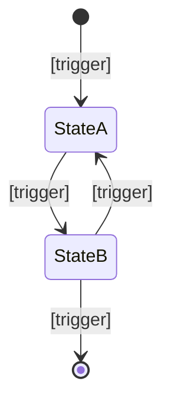

# Module Specification Template

> **Document Type:** Template Definition
> **Status:** Active
> **Applies To:** All Module Specification Documents in `docs/03-modules/`
> **Related Documents:**
> [00-ModuleOverview.md](./00-ModuleOverview.md) · [../GOVERNANCE.md](../GOVERNANCE.md) · [../00-overview/04-FunctionalRequirements.md](../00-overview/04-FunctionalRequirements.md)

---

## Purpose of This Document

This file defines the standard template that every module specification document within `docs/03-modules/` **shall** follow. Copy this template into a new specification file and replace the placeholder content.

Every section is explained below. Sections that genuinely do not apply to a specific specification may be marked "Not applicable — [brief reason]". Do not omit sections silently.

---

---

# [Module Name] — [Specification Title]

> **Document Type:** Module Specification
> **Module:** [module-directory-name]
> **Status:** Draft | Review | Approved | Implemented | Superseded
> **Version:** 1.0
> **Applies To:** Notebook — All Versions
> **Related Documents:**
> [Link to parent module README] · [Link to related functional requirements] · [Link to related database doc if applicable] · [Link to related architecture doc if applicable]

---

## 1. Purpose

*One to three paragraphs. Answer: why does this specification exist? What user need does it address? What behavior does it define?*

*Focus on WHY before HOW. A reader who finishes this section should understand what problem is solved and why it matters to the user.*

*Do not describe implementation. Do not reference code.*

---

## 2. Scope

*Define the boundary of this specification clearly.*

**This document covers:**
- [Explicit list of behaviors covered]

**This document does NOT cover:**
- [Explicit exclusions — reference the document that covers each exclusion]

*Scope boundaries prevent scope creep and make cross-referencing unambiguous.*

---

## 3. Responsibilities

*List what this module owns. Use noun phrases.*

This module is responsible for:

- [Responsibility 1 — e.g., "Creating new notes within the active Workspace"]
- [Responsibility 2]
- [Responsibility 3]

*Responsibilities must be exclusive — if another module shares a responsibility, assign it explicitly and document the boundary.*

---

## 4. User Stories

*Express each user-facing behavior as a user story. Format: "As a [role], I want to [goal] so that [benefit]."*

*Each story should map to one or more functional requirements in §5.*

| ID | User Story |
|---|---|
| US-[MODULE]-01 | As a user, I want to [goal] so that [benefit]. |
| US-[MODULE]-02 | As a user, I want to [goal] so that [benefit]. |

---

## 5. Functional Requirements

*List the specific, observable behaviors the system shall support. Use SHALL (mandatory), SHOULD (recommended), and MAY (optional) consistently.*

*Map each requirement back to the parent requirement in `docs/00-overview/04-FunctionalRequirements.md` where applicable.*

**[SPEC-MODULE-01]** The system **shall** [behavior].
> *Traces to: FR-[AREA]-[NN]*

**[SPEC-MODULE-02]** The system **should** [behavior].

**[SPEC-MODULE-03]** The system **may** [behavior].

*Requirements must be testable. Avoid subjective language ("fast", "intuitive", "nice"). Make every requirement verifiable.*

---

## 6. Business Rules

*List constraints and invariants that govern how the feature behaves. Business rules are boundaries — they define what is permitted, what is prohibited, and what is enforced.*

**[RULE-MODULE-01]** [Rule statement — e.g., "A note title shall not exceed 500 characters."]

**[RULE-MODULE-02]** [Rule statement]

*Business rules are often the source of edge case bugs. Document them explicitly here rather than burying them in workflow descriptions.*

---

## 7. Workflow

*Describe the step-by-step interaction between the user and the system. Use numbered steps. Include system responses, not just user actions.*

*Workflows must be complete: every step either ends the flow or leads to another step.*

### 7.1 [Primary Workflow Name]

**Precondition:** [What must be true before this workflow can begin]

1. User performs [action].
2. System responds with [behavior].
3. System performs [internal action — e.g., "saves to database", "emits event"].
4. [Continue until terminal state]

**Postcondition:** [What is true after the workflow completes successfully]

### 7.2 [Secondary Workflow Name — if applicable]

*Repeat pattern for each significant workflow.*

---

## 8. State Transitions

*Define the states an entity managed by this module can be in. Use a Mermaid state diagram.*

*If this module does not manage a stateful entity, note "Not applicable — this module does not own a stateful entity" and omit the diagram.*

| State | Meaning |
|---|---|
| StateA | [Description] |
| StateB | [Description] |

---

## 9. Dependencies

*List other modules, services, infrastructure components, and events this module depends on. Do not describe implementation — describe behavioral dependencies.*

### 9.1 Module Dependencies

| Depends On | Why |
|---|---|
| [Module Name] | [Reason — e.g., "Workspace module provides the active Workspace context"] |

### 9.2 Infrastructure Dependencies

| Component | Why |
|---|---|
| SQLite | [Specific tables or data this module reads/writes] |
| Filesystem | [Specific filesystem operations, if any] |
| EventBus | [Events consumed or emitted] |
| IPC Bridge | [IPC channels used] |

---

## 10. Database Interaction

*Describe, at the conceptual level, which tables this module reads from and writes to. Do NOT include SQL, Prisma models, or schema definitions.*

*Reference `docs/02-database/04-Schema.md` for table definitions.*

| Operation | Table(s) | Trigger |
|---|---|---|
| Read | `[table]` | [When this data is read] |
| Write | `[table]` | [When this data is written] |
| Delete | `[table]` | [When this data is deleted] |

---

## 11. Events

*List the domain events this module emits and consumes. Reference `docs/01-architecture/09-EventBus.md` for the event system design.*

### 11.1 Events Emitted

| Event | Payload | When Emitted |
|---|---|---|
| `[EventName]` | `[Description of payload]` | [Trigger condition] |

### 11.2 Events Consumed

| Event | Producer | Action Taken |
|---|---|---|
| `[EventName]` | [Producing module] | [What this module does in response] |

---

## 12. UI Components

*Name the UI components involved in this module's behavior. Do not describe visual design, layout, or styling.*

*Component names should match (or anticipate) the Angular component names in the implementation.*

| Component | Responsibility |
|---|---|
| `[ComponentName]` | [What this component does in the context of this module] |

---

## 13. Error Handling

*Describe how errors are detected, communicated, and recovered. For each error condition, document the cause, the system response, and the user-visible message or action.*

| Error Condition | System Response | User-Visible Message |
|---|---|---|
| [Error condition] | [What the system does] | [What the user sees or can do] |

*Errors must never leave the application in an inconsistent state. Document the recovery path for every failure mode.*

---

## 14. Edge Cases

*Explicitly document boundary conditions, unusual inputs, and scenarios that require special handling.*

| Edge Case | Expected Behavior |
|---|---|
| [Edge case description] | [How the system handles it] |

*Edge cases that are not explicitly documented tend to become bugs. When in doubt, document the expected behavior.*

---

## 15. Performance Considerations

*State latency targets, throughput requirements, and any data volume assumptions relevant to this module. Reference `docs/00-overview/05-NonFunctionalRequirements.md` for the global performance budget.*

| Operation | Target | Condition |
|---|---|---|
| [Operation name] | [< N ms] | [At what data volume or context] |

---

## 16. Acceptance Criteria

*List the specific, verifiable conditions that define "done" for this specification. These should directly correspond to the functional requirements in §5.*

*Write acceptance criteria as observable outcomes, not implementation descriptions.*

- [ ] [Criterion 1 — e.g., "Creating a note with an empty title results in a validation error before the record is saved."]
- [ ] [Criterion 2]
- [ ] [Criterion 3]

---

## 17. Future Enhancements

*Document planned or considered improvements that are intentionally deferred from the current specification. This section prevents scope creep while preserving design intent.*

- **[Enhancement name]:** [Brief description of the deferred feature and why it is deferred]
- **[Enhancement name]:** [Brief description]

---

*End of Template*
