> **Document Type:** Module Specification
> **Status:** Frozen
> **Version:** 1.0
> **Depends On:** AI Assistant Module
> **Document Owner:** Core Architecture Team

# 02 — Conversation Lifecycle

---

## 1. Purpose

This document defines the lifecycle of an AI Conversation within the Notebook ecosystem. It establishes the conceptual stages a Conversation passes through and the business rules governing each transition — with particular emphasis on the independence of Conversations from canonical Notebook content.

## 2. Conversation Concepts

### 2.1 Conversation Identity
It is critical to distinguish the conceptual identities within the Conversation domain:
- **Conversation:** Organizes related AI interactions. It is the outer container — the persistent, user-owned record of a complete AI dialogue.
- **Chat Session:** Manages active interaction state. It represents the bounded, live exchange window within a Conversation.
- **Conversation Turn:** Pairs a User Message with an Assistant Response, representing a single completed cycle of the RAG Pipeline.
- **Message:** The atomic communication units. A Message is either a user-submitted input or an AI-generated output.

Each concept has a distinct responsibility and lifecycle. Conversations organize AI interactions only. They maintain complete separation from Notebook entities.

### 2.2 Conversation Content
A Conversation contains:
- An ordered sequence of **User Messages** (user-submitted inputs).
- An ordered sequence of **Assistant Messages** (derived outputs from the AI provider).
- Optional **Source Attribution** — references to the canonical entity UUIDs that contributed context to each Assistant Message.

**Rule:** A Conversation is owned entirely by the AI Assistant module. It exists independently from all Notes, Attachments, and canonical Workspace content.

## 3. Lifecycle Operations

### 3.1 Conversation Creation
- A Conversation is created when the user initiates a new AI dialogue session.
- The Conversation is assigned a unique UUID at birth.
- **Rule:** Creating a Conversation NEVER modifies any Note, Attachment, or canonical entity.

### 3.2 Conversation Continuation
- An existing Conversation is extended by submitting a new Message.
- Each new Message may trigger a fresh Retrieval Request to update the contextual grounding.
- Prior Messages and AI Responses within the Conversation may inform the contextual framing of the new AI Request (conversational memory).
- **Rule:** Continuing a Conversation NEVER modifies the source Notes or Attachments used for retrieval.

### 3.3 Conversation Completion
- A Conversation reaches a natural completion state when the user ends the session or navigates away.
- Completed Conversations are retained for the user's reference unless explicitly archived or deleted.

### 3.4 Conversation Archival
- A user may archive a Conversation to remove it from the active view without permanently deleting it.
- Archived Conversations remain retrievable and their Messages and AI Responses remain intact.

### 3.5 Conversation Deletion
- The user may permanently delete a Conversation.
- **Rule:** Deleting a Conversation removes all associated Messages and AI Responses.
- **Rule:** Deleting a Conversation NEVER deletes any Note, Attachment, Tag, OCR Result, or any other canonical Notebook entity — even entities whose content was referenced as context within that Conversation.

### 3.6 Conversation Regeneration
- A user may regenerate an AI Response within a Conversation (e.g., to obtain a different phrasing).
- Regeneration submits a new AI Request using the same Message and an updated or repeated Retrieval Result.
- The prior AI Response may be superseded or appended to, depending on the user's choice.
- **Rule:** Regenerating a Response NEVER modifies the source canonical content.

## 4. Lifecycle Diagram

```mermaid
stateDiagram-v2
    [*] --> Created : User Initiates Dialogue
    Created --> Active : First Message Submitted

    Active --> Active : Message Continued
    Active --> Completed : User Ends Session

    Completed --> Archived : User Archives
    Completed --> Deleted : User Deletes

    Archived --> Active : User Resumes
    Archived --> Deleted : User Deletes

    Deleted --> [*]
```

## 5. Conversation Independence

This is a foundational invariant of the AI Assistant module:
- Conversations are entirely independent from Notes. A Note has no knowledge of whether it was referenced in a Conversation.
- A Conversation may reference many Notes; deleting the Conversation affects none of them.
- A Note may be permanently deleted; any Conversation that previously referenced its content retains the prior AI Responses, but future retrievals will no longer surface that Note.
- **Rule:** No cascade relationship exists from Conversations to canonical Notebook entities. All cascades are strictly unidirectional: if a Note is deleted, the Conversation is not affected beyond losing that Note's future retrievability.

## 6. Business Rules

- **Independence:** Conversations are owned by the AI Assistant module and exist independently from all canonical Notebook modules.
- **Non-Destructive:** Creating, continuing, archiving, or deleting a Conversation NEVER modifies any canonical Notebook entity.
- **Derived Content:** All AI Responses stored within a Conversation are derived artifacts. They are not authoritative records.
- **Attribution Preservation:** Where source entity UUIDs were recorded at response generation time, they remain associated with the response even after the source Note is deleted (as historical attribution).
- **Safe Failures:** A failure during AI Response generation is recorded within the Conversation as a failed message. The Conversation itself remains accessible and intact.

## 7. Edge Cases

- **Source Note Deleted:** A Conversation may contain AI Responses referencing a Note that has since been permanently deleted. The Response text is retained; future retrieval will simply no longer surface that Note.
- **Long Conversations:** Very long Conversations (hundreds of message turns) may require contextual summarization to maintain manageable AI Request sizes. This summarization is performed within the Conversation domain and NEVER writes back to Notes.
- **Interrupted Generation:** If an AI provider disconnects mid-response, the partial response is discarded and the Conversation records a failed message state. The user may retry.

## 8. Acceptance Criteria

- Creating a new Conversation and submitting a question about "budget planning" does not alter any of the Notes retrieved for context.
- Permanently deleting a Conversation that previously referenced 10 Notes leaves all 10 Notes completely intact.
- A permanently deleted source Note does not cause any error in a Conversation that previously referenced it — the existing AI Response text is preserved as-is, with the UUID attribution marked as referencing a deleted entity.
