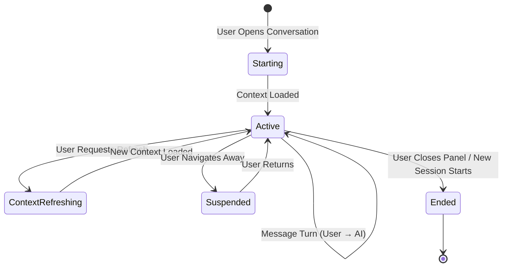

> **Document Type:** Module Specification
> **Status:** Frozen
> **Version:** 1.0
> **Depends On:** AI Assistant Module, Embeddings & Retrieval, Search
> **Document Owner:** Core Architecture Team

# 03 — Chat Sessions

---

## 1. Purpose

This document defines the concept of a Chat Session within the AI Assistant module. It establishes what a Session is, how it relates to Conversations and retrieved context, and the ownership boundaries that govern its lifecycle.

## 2. Session Concepts

### 2.1 What is a Chat Session?
A Chat Session is a bounded, active interaction window within a Conversation. It represents the user's currently active engagement with the AI Assistant — the working context for a specific set of questions and responses.

- A **Conversation** is the persistent, cumulative record (the full history).
- A **Chat Session** is the active, live exchange happening right now.

A single Conversation may contain multiple Sessions over time (e.g., the user returns to a Conversation the next day and starts a new session within it).

### 2.2 Session Identity Philosophy
It is important to distinguish conceptual identities within the Session domain:
- **Chat Session:** Represents the active, bounded interaction window within a Conversation.
- **Session Context:** The retrieved and assembled semantic context loaded at the start of the Session, drawn from the Embeddings & Retrieval module.
- **Message Turn:** A single user Message and its associated AI Response within a Session.
- Each concept has a distinct responsibility and lifecycle. A Session does not own the canonical Notebook entities it draws context from.

## 3. Session Lifecycle

### 3.1 Session Start
- A Session begins when the user opens or resumes a Conversation.
- At Session start, the module may optionally trigger a Retrieval Request to pre-load relevant context based on the Conversation topic.
- **Rule:** Starting a Session NEVER modifies any canonical Notebook entity.

### 3.2 Session Active (Message Turns)
- Within an active Session, the user submits Messages and receives AI Responses.
- Each Message Turn may trigger a fresh Retrieval Request to re-ground the response in current Notebook content.
- **Rule:** Message processing NEVER modifies Notes, Attachments, OCR Results, Tags, or Wiki Links.

### 3.3 Context Refresh
- The Session may refresh its retrieved context mid-session (e.g., the user explicitly requests "use my latest notes").
- A Context Refresh triggers a new Retrieval Request and replaces the active Session Context.
- **Rule:** Context Refresh is a read-only operation. It NEVER modifies the sources it reads from.

### 3.4 Session Suspension
- A Session is suspended when the user navigates away or the application becomes inactive.
- Suspended Sessions may be resumed; their Message history is preserved within the parent Conversation.

### 3.5 Session End
- A Session ends when the user explicitly closes the Conversation panel, or when the Session is superseded by a new Session.
- The completed Message Turns are persisted to the parent Conversation.

### 3.6 Session Regeneration
- A user may regenerate the last AI Response within an active Session.
- Regeneration submits a new AI Request without creating a new Message Turn.
- **Rule:** Regeneration NEVER modifies canonical Notebook content.

## 4. Session Lifecycle Diagram

## 5. Session Ownership

- The **AI Assistant module** owns the Chat Session, its Message Turns, and its Session Context.
- The **Embeddings & Retrieval module** owns the Retrieval Pipeline that supplies Session Context.
- **Rule:** Sessions consume retrieval context. Sessions NEVER own Notebook entities.
- **Rule:** Ending or deleting a Session NEVER deletes any Note, Attachment, or canonical entity.

## 6. Session Continuity

### 6.1 Continuity Within a Conversation
- Sessions within the same Conversation share access to the Conversation's Message history.
- A new Session may access prior AI Responses as conversational context (subject to context length constraints managed within the AI module).

### 6.2 Continuity Across Conversations
- Sessions in different Conversations are entirely independent. One Conversation's AI Responses do not inform another Conversation's Session Context unless the user explicitly references them.

## 7. Business Rules

- **Session Independence:** Sessions organise AI interactions. They NEVER own the canonical Notebook entities they draw context from.
- **Context Ownership:** Session Context is a derived, ephemeral artifact. It is discarded when the Session ends or refreshes.
- **Non-Destructive:** Every Session operation (start, continue, refresh, suspend, end) is non-destructive with respect to canonical Notebook data.
- **Failure Isolation:** A Session failure (e.g., provider unavailable mid-session) records the failure state in the Message Turn. The parent Conversation and all canonical Notebook entities remain completely unaffected.

## 8. Edge Cases

- **Source Note Updated Mid-Session:** If the user edits a Note while a Session is active, the Session Context may be stale. The user may explicitly trigger a Context Refresh to reload updated content.
- **Empty Retrieval:** If the Retrieval Pipeline returns no candidates (e.g., no relevant Notes exist), the AI Request proceeds with minimal context. The AI Response may be less grounded, which should be communicated transparently to the user.
- **Very Long Session:** An extremely long Session with hundreds of Message Turns may approach context limits for the AI provider. The module must manage this gracefully (e.g., by summarising older turns) without writing to any Note.

## 9. Performance Considerations

- Context pre-loading at Session Start should be bounded in scope to avoid unnecessary latency before the user can interact.
- Context Refresh should be cancellable — if the user submits a Message before the refresh completes, the Session processes the Message using the prior context.

## 10. Acceptance Criteria

- Opening a Conversation and sending a message successfully triggers a Retrieval Request, receives context, submits an AI Request, and stores the AI Response in the Session — without modifying any source Note.
- A Context Refresh mid-session reloads the retrieval context and the next AI Response reflects the updated Notebook content, without the previous Context Refresh altering any Note.
- Ending a Chat Session persists the Message Turns to the parent Conversation without modifying any canonical Notebook entity referenced during the session.
