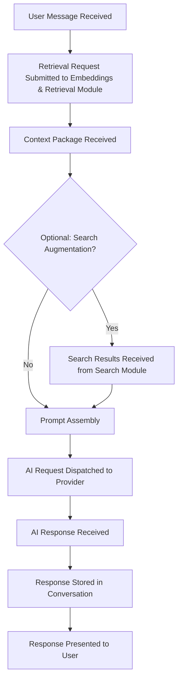

> **Document Type:** Module Specification
> **Status:** Frozen
> **Version:** 1.0
> **Depends On:** AI Assistant Module, Embeddings & Retrieval, Search
> **Document Owner:** Core Architecture Team

# 04 — RAG Pipeline

---

## 1. Purpose

This document defines the conceptual design of the Retrieval-Augmented Generation (RAG) Pipeline within the AI Assistant module. It establishes the sequence of stages through which retrieved context is consumed, composed, and transformed into a grounded AI Request — without the AI Assistant ever assuming ownership of the retrieval infrastructure it depends upon.

## 2. RAG Concepts

### 2.1 What is RAG?
Retrieval-Augmented Generation is the practice of anchoring AI generation in retrieved, real content rather than relying solely on a model's trained knowledge. The pipeline:
1. **Retrieves** semantically relevant Notebook content.
2. **Assembles** that content into a structured context.
3. **Generates** an AI Response grounded in that context.

The RAG pipeline belongs to the AI Assistant module. The Retrieval it consumes belongs to the Embeddings & Retrieval module.

### 2.2 Pipeline Identity Philosophy
It is critical to distinguish the conceptual roles within the RAG Pipeline:
- **RAG Request:** The initiating trigger — a user Message that causes the pipeline to activate.
- **Retrieval Consumption:** The stage in which the AI Assistant receives the Context Package from the Embeddings & Retrieval module. The AI Assistant does NOT perform retrieval; it consumes the output.
- **Prompt Assembly:** The stage in which the Context Package and Conversation history are composed into a structured AI Request.
- **AI Response:** The derived output produced by the AI provider from the assembled request.

## 3. Pipeline Stages

### 3.1 Stage 1 — Message Received
- The user submits a Message within an active Chat Session.
- The pipeline is activated. The Message is recorded in the Conversation.

### 3.2 Stage 2 — Retrieval Requested
- The AI Assistant submits a **Retrieval Request** to the Embeddings & Retrieval module.
- The Retrieval Request contains the user's Message as the semantic anchor, with optional scope constraints derived from the active Conversation.
- **Rule:** The AI Assistant NEVER performs retrieval itself. It delegates entirely to the Embeddings & Retrieval module.
- **Rule:** The AI Assistant NEVER owns Search Indexes or Embeddings. It requests retrieval outputs as a consumer.

### 3.3 Stage 3 — Context Package Received
- The Embeddings & Retrieval module returns a Context Package — a ranked, curated set of content fragments derived from the user's canonical Notebook content.
- The Context Package is an ephemeral artifact owned by the Embeddings & Retrieval module. The AI Assistant consumes it; it does not store it permanently.

### 3.4 Stage 4 — Search Augmentation (Optional)
- Optionally, the AI Assistant may request keyword-matched Search Results from the Search module to supplement the semantic context.
- **Rule:** The AI Assistant NEVER owns or modifies Search Indexes.

### 3.5 Stage 5 — Prompt Assembly
- The retrieved Context Package (and optionally, Search Results) are composed with the Conversation history and the user's current Message to form a structured AI Request.
- This stage is defined in detail in [05-PromptAssembly.md](./05-PromptAssembly.md).

### 3.6 Stage 6 — AI Response Generated
- The assembled AI Request is dispatched to the configured AI Provider.
- The provider returns an AI Response, which is stored within the Conversation.
- This stage is defined in detail in [06-ResponseGeneration.md](./06-ResponseGeneration.md).

## 4. Pipeline Lifecycle Diagram

## 5. Pipeline Dependencies

| Stage | Depends On | Ownership |
|---|---|---|
| Retrieval Request | Embeddings & Retrieval Module | Embeddings & Retrieval |
| Context Package | Embeddings & Retrieval Module | Embeddings & Retrieval |
| Search Augmentation | Search Module | Search Module |
| Prompt Assembly | Context Package, Conversation History, User Message | AI Assistant Module |
| AI Response | AI Provider (abstracted) | AI Assistant Module |

**Rule:** At no pipeline stage does the AI Assistant assert ownership over Search Indexes, Embedding Stores, Notes, Attachments, or OCR Results. It reads from, and is served by, these systems.

## 6. Pipeline Consumers

The RAG Pipeline is an internal mechanism of the AI Assistant module. Its primary consumer is the **Chat UI** — but its outputs (AI Responses) may also be consumed by:
- **Editor (Future):** AI writing suggestions presented within the Note Editor, requiring explicit user acceptance.
- **Command Palette (Future):** Single-shot AI actions (e.g., "Summarize this Note").

## 7. Business Rules

- **Consumer Posture:** The AI Assistant consumes Retrieval and Search outputs. It NEVER performs retrieval or search itself.
- **Non-Ownership:** The AI Assistant NEVER owns Search Indexes, Embedding Stores, or canonical Notebook content.
- **Non-Destructive:** Every pipeline stage is read-only with respect to canonical Notebook modules. The pipeline NEVER writes back to Notes, Attachments, or OCR Results.
- **Failure Isolation:** A failure at any pipeline stage (e.g., Retrieval unavailable, provider timeout) MUST NOT corrupt canonical Notebook data. The pipeline records the failure within the Conversation and gracefully degrades.
- **Grounded Generation:** The pipeline must always attempt retrieval before generation. Generating a response from a model's training data alone — with no retrieval attempt — is a degraded state, not a design choice.

## 8. Edge Cases

- **Retrieval Returns Empty Set:** If the Embeddings & Retrieval module returns no candidates, the pipeline proceeds to Prompt Assembly with an empty Context Package. The AI Response should transparently communicate the absence of retrieved context.
- **Provider Unavailable:** If the AI Provider is unreachable, Stage 6 fails. The failure is recorded in the Conversation as a failed message. The user may retry without any canonical data being affected.
- **Slow Retrieval:** If the Retrieval Request is slow, the pipeline should conceptually support a timeout after which it proceeds with partial context rather than blocking the user indefinitely.

## 9. Acceptance Criteria

- Submitting a Message in an active Chat Session triggers a Retrieval Request to the Embeddings & Retrieval module without the AI Assistant directly accessing the embedding store.
- A pipeline failure at Stage 6 (provider timeout) records the failure in the Conversation and does not alter any source Note, Attachment, or OCR Result.
- The AI Assistant pipeline completes end-to-end while the user's Note file remains byte-for-byte identical before and after the pipeline execution.
