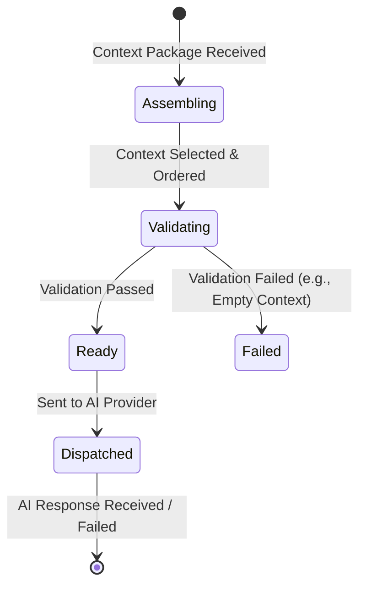

> **Document Type:** Module Specification
> **Status:** Frozen
> **Version:** 1.0
> **Depends On:** AI Assistant Module, Embeddings & Retrieval
> **Document Owner:** Core Architecture Team

# 05 — Prompt Assembly

---

## 1. Purpose

This document defines the conceptual design of Prompt Assembly within the AI Assistant module. It establishes how the AI Request is composed from its constituent inputs — the Context Package, the Conversation history, and the user's current Message — without prescribing prompt templates, model-specific formatting, or LLM implementation details.

## 2. Prompt Assembly Concepts

### 2.1 What is Prompt Assembly?
Prompt Assembly is the process of composing a structured AI Request from three distinct sources:
- **The User Request:** The user's current Message — the primary intent to be fulfilled.
- **The Conversation History:** Prior User Messages and Assistant Messages within the active Conversation, providing continuity.
- **The Context Package:** Retrieved Notebook content fragments, supplied by the Embeddings & Retrieval module.

The assembly pipeline flows as follows:

`User Request` &darr; `Conversation History` &darr; `Retrieved Context` &darr; `Prompt Assembly` &darr; `AI Request` &darr; `AI Response`

The assembled AI Request is a derived artifact. It is transient — created solely to fulfil one generation cycle. No stage of this flow modifies any canonical Notebook entity.

### 2.2 Assembly Identity Philosophy
- **AI Request:** The assembled, structured input passed to the AI provider. It is ephemeral and has no canonical persistence.
- **Context Selection:** The subset of the Context Package chosen for inclusion, constrained by the provider's context capacity.
- **Assembly:** The combining activity — ordering, formatting, and bounding the inputs into a coherent request. Assembly leaves no trace on any source.

## 3. Context Sources

Prompt Assembly draws from the following inputs, each on a strictly read-only basis:

| Input | Source | Owner |
|---|---|---|
| Context Package | Embeddings & Retrieval module | Embeddings & Retrieval module |
| Conversation History | AI Assistant module (Conversation store) | AI Assistant module |
| User Request (Message) | Active Chat Session | AI Assistant module |

**Rule:** Prompt Assembly reads from these sources. It NEVER writes back to the Embeddings & Retrieval module, the Notes module, or any other canonical module.

## 4. Context Selection

### 4.1 Selection Philosophy
- Not all fragments within a Context Package may be included in every AI Request. AI providers operate within bounded context windows.
- Context Selection is the activity of choosing which fragments to include, governed by relevance ranking (highest-ranked fragments are prioritised) and fragment size.
- **Rule:** Context Selection is a read-only operation. It NEVER modifies the Context Package or its source Notes.

### 4.2 Context Ordering
- Selected fragments are ordered within the AI Request to maximise their utility to the provider — typically: most relevant fragments closest to the User Request.
- Ordering affects only the AI Request structure. It NEVER reorders or modifies the canonical source content.

## 5. Conversation History Inclusion

### 5.1 History Purpose
- Including prior Message turns provides the AI provider with conversational continuity — enabling follow-up questions, reference resolution (e.g., "What about the one from last quarter?"), and coherent dialogue.

### 5.2 History Bounding
- For long Conversations, including the full history may exceed provider context limits.
- The module conceptually supports a **history window** — including only the most recent N turns — and may summarise older turns without writing the summary back to any Note.
- **Rule:** Conversation history summarisation is performed in-memory for the AI Request. It NEVER persists to Notes or any canonical module.

## 6. Prompt Lifecycle

## 7. Prompt Validation

### 7.1 Empty Context
- If the Context Package is empty (e.g., retrieval returned nothing), the AI Request may still proceed but must communicate transparently to the user that no Notebook context was available.

### 7.2 Oversized Request
- If the assembled AI Request would exceed the provider's capacity after all trimming, the request is reduced by dropping the lowest-ranked context fragments first, then trimming conversation history, until it fits within limits.
- **Rule:** No reduction strategy involves writing to, or modifying, any canonical Notebook entity.

### 7.3 Invalid User Request
- A structurally invalid User Request (e.g., an empty message) is rejected before Assembly begins. No AI Request is assembled or dispatched.

## 8. Business Rules

- **Derived Request:** The AI Request is a derived, ephemeral artifact. It possesses no persistence beyond the generation cycle.
- **Non-Destructive:** Prompt Assembly NEVER modifies Notes, Attachments, OCR Results, Tags, Wiki Links, or the Context Package it reads from.
- **Read-Only Posture:** Assembly reads from the Context Package and Conversation History. It never writes to any module that owns those artifacts.
- **Transparency:** The structure of the AI Request (which context fragments were selected) should be traceable for user transparency, but this traceability is stored within the Conversation domain — not written back to Notes.

## 9. Citation Philosophy

When the AI provider generates a Response, the source Notebook entities whose content informed that Response are conceptually cited:
- **Citation:** A reference from an AI Response to a specific canonical Notebook entity (e.g., a Note UUID, an Attachment UUID) whose content was included in the Context Package.
- Citations provide traceability — the user can understand what Notebook content grounded the AI Response.
- Citations NEVER grant the AI Assistant ownership over the cited entities.
- Citations are derived metadata stored within the Conversation domain. They are not written to the cited Notes or Attachments.
- Citing a Note in an AI Response does not modify, annotate, or alter that Note in any way.
- If a cited Note is subsequently deleted, the citation is marked as referencing a deleted entity. The AI Response text is preserved.

## 9. Edge Cases

- **All Context Fragments Oversized:** If every individual context fragment exceeds practical limits, the module may truncate individual fragments (from the end) to fit. Truncation NEVER modifies the source content.
- **No Conversation History:** For first-turn messages (no prior history exists), Assembly proceeds with only the Context Package and the User Request.
- **Context Refresh Mid-Assembly:** If the user triggers a Context Refresh while Assembly is in progress, the in-flight Assembly is abandoned and a new pipeline cycle begins with the refreshed context.

## 10. Performance Considerations

- Context Selection should be bounded in time — the selection and ordering algorithm should not introduce significant latency before the AI Request is dispatched.
- History bounding should be computed incrementally; the module should not re-compute the full history on every Message Turn.

## 11. Acceptance Criteria

- An AI Request assembled from a 3-fragment Context Package and 2 prior Conversation turns results in a coherent, bounded request dispatched to the provider, without modifying the 3 source Notes or the Conversation history.
- An AI Request assembled when the retrieval returns an empty Context Package is dispatched with a transparent "no context available" signal, without blocking the user or modifying any canonical entity.
- Dropping low-ranked context fragments to fit within provider limits does not alter the canonical content of the dropped Notes.
