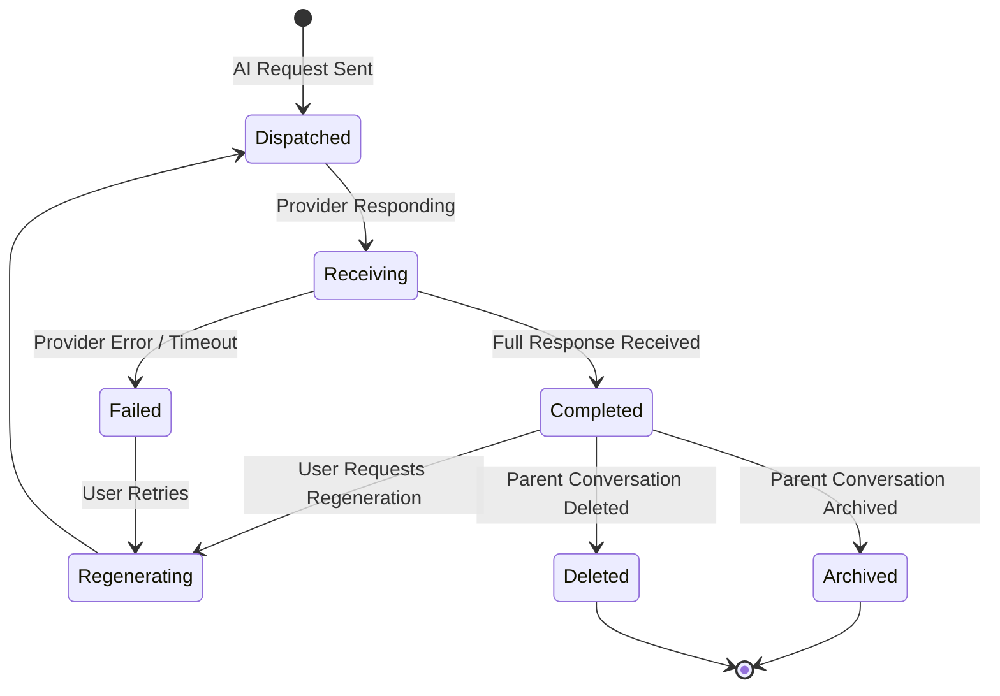

> **Document Type:** Module Specification
> **Status:** Frozen
> **Version:** 1.0
> **Depends On:** AI Assistant Module
> **Document Owner:** Core Architecture Team

# 06 — Response Generation

---

## 1. Purpose

This document defines the conceptual design of AI Response Generation within the AI Assistant module. It establishes what an AI Response is, how it is produced and validated, and the inviolable rules governing its relationship with canonical Notebook content.

## 2. Response Concepts

### 2.1 What is an AI Response?
An AI Response is a derived textual artifact produced by an AI provider in response to an assembled AI Request. It represents the AI provider's output — a language generation based on the context and conversation history supplied by the RAG Pipeline.

### 2.2 Response Identity Philosophy
It is critical to distinguish the conceptual identities within the Response domain:
- **AI Request:** The structured input dispatched to the AI provider (assembled in [05-PromptAssembly.md](./05-PromptAssembly.md)).
- **AI Generation:** The active processing activity performed by the AI provider. It is transient and has no persistence within the Notebook ecosystem.
- **AI Response:** The derived textual output returned by the provider. It is stored within the parent Conversation — never within a Note.
- **Source Attribution:** The set of canonical entity UUIDs (e.g., Note UUIDs) whose content was included in the Context Package for this Response. Attribution is stored with the Response as a transparency mechanism.

### 2.3 Response Ownership
- **Rule:** AI Responses may reference Notebook knowledge, but they NEVER replace Notebook entities.
- **Rule:** Notebook entities remain the canonical source of truth.
- **Rule:** AI Responses are strictly derived artifacts. They NEVER become canonical Notebook data.
- **Rule:** An AI Response is advisory — it is not an authoritative record of truth.

## 3. Response Lifecycle

### 3.1 Dispatched
- The assembled AI Request is sent to the configured AI provider.
- The Conversation Message Turn records the request as "awaiting response."

### 3.2 Streaming / Receiving
- The AI provider returns the response, potentially as a progressive delivery — producing output incrementally as the generation proceeds.
- The module receives and accumulates the response for presentation.
- **Rule:** Progressive delivery NEVER writes partially-formed content to any Note or canonical entity.
- **Streaming Philosophy:** Streaming is a response delivery capability — it describes how the response reaches the user, not how retrieval works or who owns the response. Streaming does not change AI ownership, does not affect the retrieval pipeline, and remains independent from model implementation. A streamed response and a fully-buffered response are identical in their architectural status: both are derived artifacts owned by the AI Assistant module.

### 3.3 Completed
- The full AI Response is received and stored within the Conversation.
- Source Attribution is recorded alongside the Response.
- The Response is presented to the user.

### 3.4 Failed
- If the provider fails (timeout, error, disconnection), the Message Turn is marked as failed.
- A failed response is clearly communicated to the user.
- **Rule:** A failed Response MUST NOT corrupt any canonical Notebook entity.

### 3.5 Regenerated
- The user may request regeneration of a failed or unsatisfactory Response.
- Regeneration assembles a new AI Request from the same Message and a fresh or repeated Retrieval Result.
- The new Response supersedes the previous one within the Conversation.
- **Rule:** Regeneration NEVER modifies any canonical source content.

### 3.6 Archived / Deleted
- AI Responses are archived or deleted as part of their parent Conversation lifecycle.
- **Rule:** Deleting an AI Response or its parent Conversation NEVER deletes any Note, Attachment, or canonical entity referenced in the Source Attribution.

## 4. Response Lifecycle Diagram

## 5. Response Validation

### 5.1 Empty Response
- If the AI provider returns an empty or whitespace-only response, the module marks the Message Turn as failed with a descriptive diagnostic.
- An empty response is not presented to the user as a valid answer.

### 5.2 Provider Error Codes
- The module validates that the provider's response does not indicate a structural error (e.g., content policy violation, malformed output).
- Invalid responses are recorded as failures. The Conversation remains accessible.

### 5.3 Response Integrity
- The module validates that the response can be safely stored and presented — i.e., it does not contain malformed encoding or structurally dangerous content.
- This validation is performed entirely within the AI Assistant module. It NEVER involves writing to canonical modules.

## 6. Response Presentation

### 6.1 Source Attribution Display
- Where Source Attribution was recorded, the UI may display the contributing Note UUIDs (or their titles) so the user understands what Notebook content grounded the response.
- Clicking an attributed source navigates to the canonical Note — it does not modify it.

### 6.2 AI Response Marker
- AI Responses must be visually distinguished from user-authored content in the Chat UI.
- An AI Response must never appear in the Editor as user content unless the user explicitly copies and pastes it — a deliberate user action.

### 6.3 Regeneration Transparency
- If a Response has been regenerated, prior and new responses may be presented to the user for comparison, subject to UI design decisions outside this module's scope.

## 7. Business Rules

- **Derived Artifact:** AI Responses are strictly derived. They NEVER propagate into canonical Notebook data automatically.
- **Non-Destructive:** Generation, regeneration, and deletion of AI Responses NEVER modifies Notes, Attachments, Tags, OCR Results, Wiki Links, or Search Indexes.
- **Explicit Adoption Required:** Any path by which an AI Response's text could enter a Note requires an explicit, deliberate user action. Automatic Notebook modification is architecturally prohibited. The user is always the final decision maker.
- **AI Failure Philosophy:** AI failures affect only AI interactions. A failed AI Response generation is isolated to the Conversation domain. Failures in this module MUST NEVER corrupt or alter Notes, Attachments, OCR Results, Search Indexes, Tags, Wiki Links, or Embedding stores. Notebook integrity is always preserved regardless of AI module state.
- **Safe Failures:** A failed AI Response generation is always isolated to the Conversation domain. The user retains full access to their Notebook.
- **Idempotency:** Regenerating a Response for the same input context may legitimately produce a different output. This is expected; it does not represent data corruption.

## 8. Edge Cases

- **Long Response:** If the AI provider returns an unusually long response, it is stored and presented in full within the Conversation. It is NEVER truncated and stored as a Note without explicit user action.
- **Response References Deleted Note:** The Source Attribution may reference a Note that has since been permanently deleted. The Response text is retained; the attribution UUID is marked as referencing a deleted entity.
- **Concurrent Regeneration:** If the user triggers regeneration while a prior generation is still in-flight, the prior request is cancelled and a new request is dispatched. No partial response is written to any canonical entity.

## 9. Performance Considerations

- AI Response generation may be slow (seconds to minutes for complex requests). The UI should indicate activity without blocking access to the rest of the Notebook.
- Streaming responses improve perceived performance by presenting tokens as they arrive, reducing apparent latency.
- Source Attribution computation should not block response presentation — it may be resolved asynchronously after the response is displayed.

## 10. Future Enhancements

- **AI-Suggested Note Creation:** Allow the user to explicitly save an AI Response as a new Note with a single deliberate action. The system must never do this automatically.
- **Collaborative AI Responses:** Multiple users in a shared Workspace may view and build upon AI Responses within shared Conversations — subject to access control rules defined by the Workspace module.

## 11. Acceptance Criteria

- An AI Response is successfully generated, stored in the Conversation, and presented to the user with Source Attribution — without modifying any of the referenced source Notes.
- A user who requests "Save this response as a note" completes an explicit action that creates a new Note; the creation does not happen automatically without that deliberate step.
- A provider failure mid-response records a failed Message Turn in the Conversation. The user can immediately open and edit all their Notes without any interruption.
