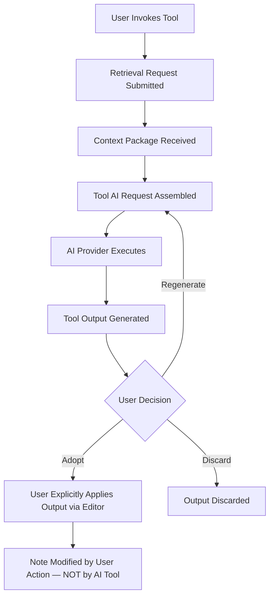

> **Document Type:** Module Specification
> **Status:** Frozen
> **Version:** 1.0
> **Depends On:** AI Assistant Module, Embeddings & Retrieval, Search
> **Document Owner:** Core Architecture Team

# 07 — AI Tools

---

## 1. Purpose

This document defines the conceptual design of AI Tools within the AI Assistant module. It establishes what an AI Tool is, the categories of tools supported, and the strict rules governing how tools consume retrieved context without assuming ownership of the canonical content they operate upon.

## 2. AI Tool Concepts

### 2.1 What is an AI Tool?
An AI Tool is a focused, purpose-scoped AI capability that the user can invoke to perform a specific task grounded in retrieved Notebook content. Tools are specialisations of the core RAG Pipeline — each targets a distinct user intent (e.g., "Summarise this," "Rewrite this," "Explain this concept").

### 2.2 Tool Identity Philosophy
It is important to distinguish the conceptual identities within the AI Tools domain:
- **Tool Definition:** The conceptual specification of a Tool — its purpose, its input expectations, and its output type. A Tool Definition has no runtime state.
- **Tool Invocation:** The runtime activation of a Tool for a specific user request and context. An Invocation is transient.
- **Tool Output:** The derived artifact produced by the Tool Invocation. It is a derived result — never canonical Notebook data.
- **Tool Coordination:** The activity of orchestrating multiple Tool Invocations in sequence or in parallel to fulfil a complex user request.

### 2.3 Derived Nature
- **Rule:** AI Tool outputs are derived artifacts. They NEVER become canonical Notebook data automatically.
- **Rule:** AI Tools NEVER modify Notes, Attachments, Tags, or any canonical entity automatically.
- **Rule:** AI Tools NEVER own the Notebook content they consume.

## 3. Tool Categories

The following tool categories are conceptually supported. Categories group tools by their primary intent. New categories may be introduced as additive extensions without altering existing tool behaviour.

### 3.1 Discovery Tools
- **Question Answering:** Answering a specific user question grounded in retrieved Notebook context.
- **Explanation:** Producing a plain-language explanation of a concept or term found within retrieved content.

### 3.2 Transformation Tools
- **Summarization:** Condensing retrieved content (a Note, a collection, or search results) into a shorter derived summary.
- **Rewrite:** Producing an alternative phrasing or restructuring of user-selected text — presented for review and explicit adoption.
- **Translation:** Converting retrieved or selected text into a different language, presented as a derived output.
- **Tone Adaptation:** Adjusting the register or formality of selected content — always presented for user review.

### 3.3 Creation Tools
- **Brainstorming:** Generating idea suggestions grounded in Notebook context — all suggestions are advisory and require user adoption.
- **Note Suggestions:** Proposing content that could expand or enrich an existing Note — presented as suggestions, not saved automatically.
- **Content Organisation:** Suggesting how a collection of Notes or content fragments might be restructured — advisory only.

## 4. Tool Lifecycle

### 4.1 Invocation
- A Tool is invoked when the user selects it from the AI Assistant interface or Command Palette.
- The Invocation triggers a Retrieval Request (via the Embeddings & Retrieval module) to ground the Tool's execution in relevant Notebook content.
- **Rule:** Tool Invocation NEVER modifies any canonical Notebook entity.

### 4.2 Execution
- The Tool assembles its specific AI Request from the retrieved Context Package, any user-selected text, and the Tool's purpose scope.
- The AI provider processes the request and returns a Tool Output.
- **Rule:** Execution is entirely read-only with respect to canonical modules.

### 4.3 Output Presentation
- Tool Output is presented to the user for review.
- The user decides whether to adopt, modify, discard, or save the output.
- **Rule:** No Tool Output is ever automatically written to a Note or any canonical entity.

### 4.4 Output Adoption
- If the user explicitly adopts a Tool Output (e.g., copies it into the Editor), the Note modification is performed by the Editor module under the user's direct action — not by the AI Tool.
- The AI Tool's responsibility ends at output presentation.

## 5. Tool Lifecycle Diagram

## 6. Tool Coordination

For complex user requests that require multiple tool capabilities (e.g., "Summarise and then translate"), the AI Assistant module may coordinate Tool Invocations sequentially. Each Invocation remains independently scoped and produces its own derived output. Coordination never introduces automatic writes to canonical content.

## 7. Tool Consumers

AI Tools are consumed by:
- **Chat UI:** Inline Tool invocation within a Conversation.
- **Editor (Future):** Contextual Tools triggered from within the Note editing surface.
- **Command Palette (Future):** Direct Tool invocation without a full Conversation (e.g., "Summarise this Note").

## 8. Business Rules

- **Consumer Posture:** AI Tools consume retrieved context. They NEVER perform retrieval themselves, own Search Indexes, or own Embedding stores.
- **Derived Outputs:** All Tool Outputs are derived artifacts. They NEVER propagate into canonical Notebook data without explicit user action.
- **User Control:** Users remain in full control of their Notebook. AI Tools present outputs for review; adoption is always a deliberate user decision.
- **Failure Isolation:** A failed Tool Invocation (e.g., provider error) records the failure within the Conversation. It MUST NOT corrupt any canonical Notebook entity.
- **Tool Independence:** Each Tool category is independently scoped. Adding a new Tool category must not modify the behaviour of existing tools.

## 9. Edge Cases

- **Empty Context:** If retrieval returns no relevant content for a Tool Invocation, the Tool Output must transparently indicate the absence of grounding context. The Tool must not fabricate grounded content.
- **User Deselects Mid-Execution:** If the user navigates away during a Tool Invocation, the in-flight request is cancelled gracefully. No partial output is written anywhere.
- **Conflicting Outputs:** If Tool Coordination produces conflicting outputs (e.g., summaries that contradict), the conflict is presented to the user for resolution — the AI Tool never resolves it automatically.

## 10. Acceptance Criteria

- Invoking the Summarization tool on a Note produces a derived summary presented for user review, without altering the source Note.
- Invoking the Rewrite tool on a selected paragraph presents an alternative phrasing within the Chat UI or Editor suggestion panel. No change is written to the Note until the user explicitly accepts.
- A failed Tool Invocation (provider timeout) records the failure in the Conversation and leaves all canonical Notes and Attachments completely unmodified.
