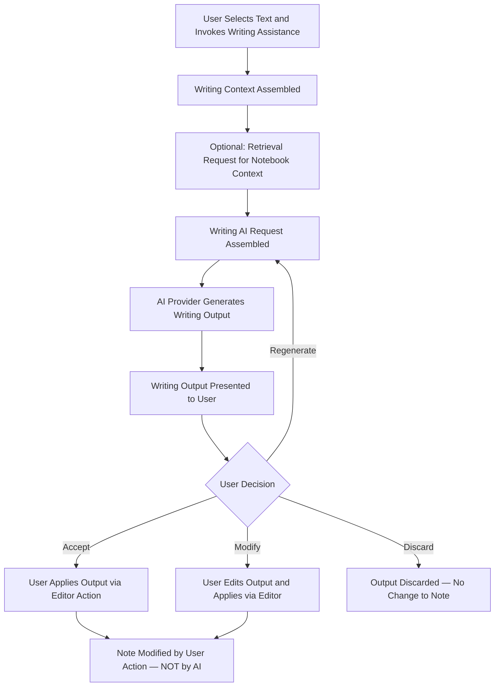

> **Document Type:** Module Specification
> **Status:** Frozen
> **Version:** 1.0
> **Depends On:** AI Assistant Module, Embeddings & Retrieval, Editor Module
> **Document Owner:** Core Architecture Team

# 08 — Writing Assistance

---

## 1. Purpose

This document defines the conceptual design of Writing Assistance within the AI Assistant module. It establishes how the AI Assistant can support the user's authoring process — generating, transforming, and improving content — while maintaining the inviolable principle that users retain complete, deliberate control over what enters their canonical Notes.

## 2. Writing Assistance Concepts

### 2.1 What is Writing Assistance?
Writing Assistance is a category of AI capability designed to support the user's authoring intent. It operates on user-selected text or retrieved context to produce derived textual suggestions — never autonomous modifications.

Writing Assistance is a collaborative tool. The user authors; the AI suggests. The distinction is absolute.

### 2.2 Writing Assistance Identity Philosophy
- **Writing Request:** The user's explicit invocation of a Writing Assistance capability (e.g., "Improve this paragraph").
- **Writing Context:** The combination of the user-selected text, optional retrieved Notebook context, and the active Conversation history that informs the assistance.
- **Writing Output:** The derived suggestion produced by the AI provider — presented to the user for review, never automatically applied.
- **User Decision:** The explicit user action that determines whether the Writing Output enters a Note. Only a user decision can cause this transition.

### 2.3 Derived Nature
- **Rule:** Writing Assistance produces derived content. All outputs are suggestions, not authoritative revisions.
- **Rule:** Writing Assistance NEVER modifies Notes automatically. A user decision is required before any generated content enters a canonical Note.
- **Rule:** Writing Assistance NEVER owns Notes, Attachments, or any canonical entity.

## 3. Writing Assistance Capabilities

### 3.1 Content Improvement
- **Grammar Correction:** Identifying and suggesting corrections to grammatical errors in selected text.
- **Clarity Enhancement:** Suggesting rephrasing to improve readability and precision.
- **Style Consistency:** Proposing adjustments to align selected text with the broader tone of the Note or the user's stated preferences.

### 3.2 Content Generation
- **Expansion:** Generating additional content that extends a selected passage — presented as a suggestion.
- **Continuation:** Offering a continuation of an incomplete sentence or paragraph — always presented for review.
- **Outline Drafting:** Producing a structural outline for a Note topic — the user explicitly applies it if desired.

### 3.3 Content Transformation
- **Rewrite:** Producing an alternative version of selected text with different phrasing while preserving meaning.
- **Simplification:** Transforming complex or technical text into a more accessible form.
- **Formalisation / Casualisation:** Adjusting the register of selected text toward a more formal or casual tone.

### 3.4 Translation
- Producing a translation of selected text into another language.
- The translated text is presented as a derived output. The user explicitly decides whether to replace or supplement the original.

## 4. Writing Workflow

## 5. User Control Philosophy

This is the foundational principle of Writing Assistance:

**The AI Assistant generates. The user decides. The Editor applies.**

- The AI Assistant produces a Writing Output and presents it within the Chat UI or a dedicated suggestion panel.
- The user reviews the output and makes one of three choices: accept, modify, or discard.
- Only a deliberate user action (e.g., clicking "Apply" or manually copy-pasting) causes the content to enter the Note.
- This action is executed through the Editor module, which owns all canonical writing operations.
- The AI Assistant has no direct write access to the Notes module.

## 6. Context Consumption

Writing Assistance may optionally retrieve Notebook context to inform its outputs:
- A grammar correction for a technical Note may retrieve related Notes to understand domain terminology.
- A content expansion request may retrieve related Notes to ensure the generated content is consistent with existing knowledge.
- **Rule:** Retrieval is always read-only. Context consumption NEVER modifies Notes, Attachments, or OCR Results.

## 7. Business Rules

- **Derived Content:** All Writing Assistance outputs are derived suggestions. They NEVER become canonical Note content without explicit user action.
- **User Control Absolute:** The user remains the sole author of their Notebook. The AI Assistant is an advisor, never an autonomous editor.
- **No Automatic Saves:** Writing Assistance NEVER triggers a Note save operation. The save path belongs exclusively to the user via the Editor.
- **Editor Boundary:** The Editor module owns the canonical write path to Notes. Writing Assistance outputs cross into the Note only through that boundary, via deliberate user action.
- **Failure Isolation:** A Writing Assistance failure (e.g., provider error) is reported to the user. The Note being authored remains completely unaffected.

## 8. Edge Cases

- **No Text Selected:** If the user invokes Writing Assistance without selecting text, the module may request that the user make a selection, or may operate on the entire active Note's content — always with output presented for review, never applied automatically.
- **Conflict with Existing Content:** If a Writing Output conflicts with the Note's existing content (e.g., a generated paragraph contradicts an existing paragraph), the conflict is visible to the user at review time. The AI never resolves it automatically.
- **Very Long Selection:** If the user selects text exceeding the provider's context window, the module trims the selection gracefully (notifying the user) rather than silently omitting content. The trimming NEVER modifies the canonical Note.

## 9. Performance Considerations

- Writing Assistance responses should be optimised for low perceived latency, as they are used inline with the authoring flow.
- Streaming output should be used where possible to present the suggestion progressively rather than waiting for the full generation.

## 10. Future Enhancements

- **Inline Suggestions:** Ghost-text suggestions within the Editor as the user types, accepted via a single keypress — always requiring active user acceptance per suggestion.
- **Voice-Dictated Writing:** Transcribed speech-to-text provided as a Writing Input — the AI may assist in cleaning and formatting the dictated text, subject to user review.

## 11. Acceptance Criteria

- Invoking "Improve this paragraph" on selected text in the Editor presents an improved suggestion within a dedicated panel, without altering the canonical Note text.
- The user accepts the suggestion: the text is applied to the Note through an explicit Editor action. The AI Assistant has no direct write access to the Note during this process.
- The user discards the suggestion: the Note is byte-for-byte identical to its state before the Writing Assistance was invoked.
