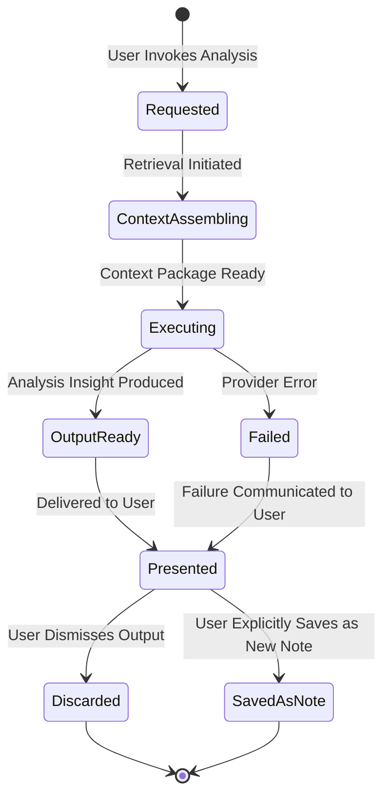

> **Document Type:** Module Specification
> **Status:** Frozen
> **Version:** 1.0
> **Depends On:** AI Assistant Module, Embeddings & Retrieval, Search, Notes, Attachments, OCR, Tags
> **Document Owner:** Core Architecture Team

# 09 — Document Analysis

---

## 1. Purpose

This document defines the conceptual design of Document Analysis within the AI Assistant module. It establishes how the AI Assistant consumes canonical Notebook content to produce derived analytical insights — summaries, structural analyses, answers, and cross-document observations — without modifying any of the source entities it examines.

## 2. Document Analysis Concepts

### 2.1 What is Document Analysis?
Document Analysis is the capability to apply AI reasoning to Notebook content at the document level — examining a single Note, an Attachment's extracted text, or a collection of related documents — to surface insights the user might not easily derive manually.

Document Analysis is a read-only, consumer-only capability. It interprets Notebook content; it NEVER alters it.

### 2.2 Analysis Identity Philosophy
- **Analysis Request:** The user's explicit request to analyse a specific piece of Notebook content (e.g., "Analyse this PDF's key themes").
- **Analysis Context:** The retrieved Notebook content consumed by the analysis — drawn from the Embeddings & Retrieval module and canonical source modules.
- **Analysis Execution:** The active AI processing activity applied to the Analysis Context. Transient and non-persistent.
- **Analysis Output (Insight):** The derived result — a summary, an observation, a structured answer — presented to the user. Never a canonical artifact.

### 2.3 Derived Nature
- **Rule:** Analysis Outputs are derived insights. They NEVER become canonical Notebook data.
- **Rule:** Document Analysis NEVER modifies Notes, Attachments, OCR Results, Tags, or any canonical entity.
- **Rule:** Document Analysis NEVER owns the documents it analyses.

## 3. Analysis Capabilities

### 3.1 Summarization
- Producing a concise derived summary of a Note, an Attachment's extracted content (via OCR), or a collection of retrieved fragments.
- The summary is presented as a derived insight. It does not replace the source Note.

### 3.2 Question Answering
- Answering specific questions grounded in the content of one or more identified documents.
- e.g., "What are the payment terms in this contract attachment?" — answered from the OCR-extracted text.

### 3.3 Structural Insights
- Identifying the conceptual structure of a Note (e.g., "This Note contains three main arguments") without prescribing changes.
- Insights are advisory observations, not editing instructions.

### 3.4 Theme and Topic Extraction
- Identifying the primary themes, topics, or entities discussed within a document or collection.
- Outputs are derived observations presented for user consideration.

### 3.5 Cross-Document Analysis (Future)
- Identifying conceptual relationships, contradictions, or patterns across multiple Notes or Attachments.
- e.g., "These three meeting notes all reference the same project milestone."
- Cross-document analysis consumes multiple retrieved context fragments and produces a single synthesised insight.

## 4. Analysis Lifecycle

### 4.1 Analysis Request Received
- The user identifies a document or collection for analysis and invokes a specific Analysis capability.
- **Rule:** Creating an Analysis Request NEVER modifies the target document.

### 4.2 Context Retrieval
- The module submits a Retrieval Request (or directly requests content from the canonical owning module) to assemble the Analysis Context.
- For a single identified Note, the module may fetch the Note's content directly via read-only access.
- For collection-level analysis, the Embeddings & Retrieval module supplies a ranked Context Package.
- **Rule:** Context retrieval is strictly read-only.

### 4.3 Analysis Execution
- The assembled Analysis Context is dispatched to the AI provider as an Analysis AI Request.
- The AI provider returns an Analysis Output.
- **Rule:** Analysis Execution NEVER writes to any canonical module.

### 4.4 Output Presentation
- The Analysis Output (Insight) is presented to the user within the Chat UI or a dedicated Analysis panel.
- **Rule:** Analysis Output is NEVER automatically saved to a Note or Attachment.

### 4.5 Output Archival (Optional)
- The user may explicitly choose to save an Analysis Insight as a new Note. This is an explicit user action — not an automatic behaviour.
- The creation of the new Note is performed by the Notes module under the user's authority.

## 5. Analysis Lifecycle Diagram

## 6. Context Consumption

Document Analysis may consume content from the following sources, each on a strictly read-only basis:

| Source | Content Type | Owner |
|---|---|---|
| Notes | Markdown text, titles, frontmatter | Notes Module |
| OCR Results | Extracted text from images and PDFs | OCR Module |
| Attachments | File names, MIME types (metadata only) | Attachments Module |
| Tags | Tag display names associated with target Notes | Tags Module |
| Wiki Links | Link structures associated with target Notes | Wiki Links Module |

**Rule:** Document Analysis reads from these sources. It NEVER writes to them.

## 7. Business Rules

- **Consumer Only:** Document Analysis consumes Notebook content. It NEVER owns it.
- **Derived Insights:** All Analysis Outputs are derived artifacts. They are advisory, not authoritative.
- **Non-Destructive:** Analysing a Note or Attachment NEVER modifies it — not its content, not its modification timestamp, not its metadata.
- **Explicit Adoption:** An Analysis Insight can only enter the canonical Notebook corpus via an explicit, deliberate user action (creating a new Note). Automatic saving is architecturally prohibited.
- **Failure Isolation:** A failed Analysis Execution (e.g., provider timeout) is reported to the user. The analysed document remains completely unaffected.

## 8. Edge Cases

- **OCR Not Available:** If an Attachment's OCR Result has not yet been generated, Document Analysis cannot access its textual content. The module must communicate this limitation transparently, without triggering OCR generation as a side effect.
- **Very Large Documents:** If a Note or OCR Result exceeds the AI provider's context limits, the module must trim the content gracefully (notifying the user of truncation) without modifying the source.
- **Deleted Source Mid-Analysis:** If the source Note is deleted while Analysis Execution is in progress, the Execution is cancelled. The Analysis Output is not persisted. No error is written to any canonical entity.
- **Cross-Document Conflict:** If Cross-Document Analysis identifies contradictions between Notes, the conflict is presented as an observation. The AI NEVER resolves the conflict by modifying either Note.

## 9. Performance Considerations

- Single-document analysis should be optimised for interactive speeds — a response within a few seconds for most Notes.
- Collection-level or cross-document analysis is inherently heavier. The module should communicate expected latency transparently and allow the user to cancel if needed.
- Retrieval for collection analysis should be bounded (e.g., analysing the top N most relevant Notes rather than the entire Workspace) to prevent runaway context assembly.

## 10. Future Enhancements

- **Scheduled Analysis:** Users may configure recurring analysis tasks (e.g., "Weekly summary of new Meeting Notes") — executed on a schedule but always producing Advisory Outputs, never autonomous modifications.
- **Comparative Analysis:** Explicitly comparing two or more Notes side-by-side to surface differences in argument, tone, or fact.
- **Trend Identification:** Identifying patterns across Notebook content over time (e.g., recurring themes in meeting notes from the past quarter).

## 11. Acceptance Criteria

- Invoking "Summarise this Note" produces a derived summary within the Chat UI without altering the source Note's content or modification date.
- Invoking "Answer questions about this PDF" on an Attachment's OCR-extracted text returns grounded answers without modifying the Attachment or the OCR Result.
- A user who explicitly saves an Analysis Insight as a new Note triggers a deliberate creation action. The original analysed Note remains unchanged.
