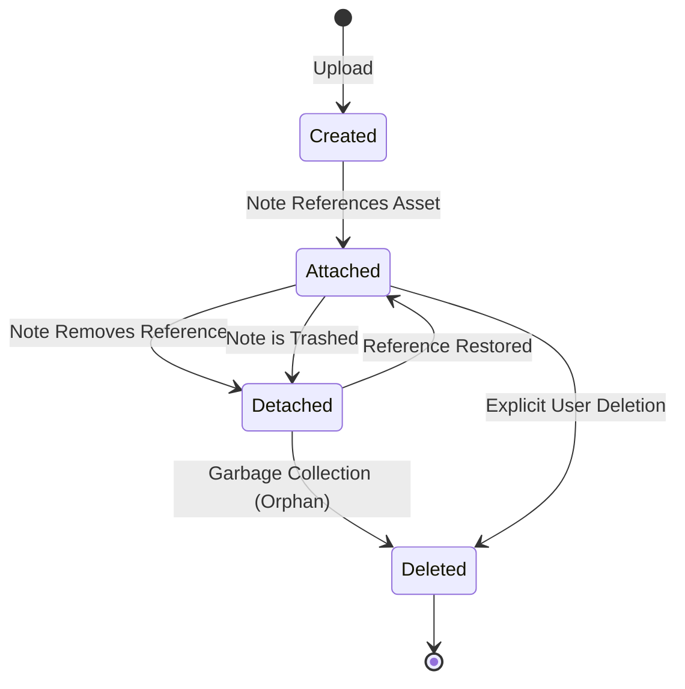

> **Document Type:** Module Specification
> **Status:** Draft
> **Version:** 1.0
> **Depends On:** Attachments Overview
> **Document Owner:** Core Architecture Team

# 02 — Attachment Lifecycle

---

## 1. Purpose

This document outlines the lifecycle of an Attachment, detailing how it transitions from creation to eventual deletion. It reinforces that lifecycle management belongs strictly to the Attachments module.

## 2. Lifecycle Operations

### 2.1 Create
- The module ingests a binary stream, generates a UUID, extracts initial metadata, and persists the file.

### 2.2 Attach
- A Note formally registers a reference to the Attachment UUID.

### 2.3 Detach
- A Note removes its reference to the Attachment UUID (e.g., the user deletes the image block from the Editor).

### 2.4 Replace
- A user updates an attachment (e.g., uploading a newer version of a PDF). Conceptually, the module creates a new Attachment UUID and updates the Note's reference, or handles internal versioning while keeping the UUID stable.

### 2.5 Rename
- Changing the `Display Name` or `Original File Name` metadata. This does NOT alter the underlying UUID or the file bytes.

### 2.6 Move
- Conceptually irrelevant at the Attachment level, as attachments do not live in user-facing Folders. They are tied to the Workspace.

### 2.7 Archive
- A target Note is archived. The Attachment remains active and accessible.

### 2.8 Delete
- The Attachment is permanently destroyed from storage, and its metadata record is purged.

### 2.9 Restore
- If an Attachment was soft-deleted (if supported), it is restored to active status.

### 2.10 Import / Export
- **Import:** The module ingests raw files from a ZIP archive, minting new UUIDs.
- **Export:** The module resolves UUIDs back into raw files placed alongside the exported Markdown notes.

## 3. Lifecycle Diagrams

## 4. Business Rules

- **Lifecycle Independence:** Deleting a Note does NOT necessarily require immediate deletion of its referenced Attachments. The Attachments module is responsible for identifying and cleaning up "Orphaned" files asynchronously.
- **Cascade Deletion:** If a user explicitly deletes an Attachment from the system interface, any Notes referencing it will now contain a "Broken Reference."

## 5. Edge Cases

- **Concurrent Attachments:** If two Notes reference the same Attachment, detaching it from Note A must NOT delete the Attachment, as Note B still requires it.
- **Upload Interruption:** If the `Create` process is interrupted (network loss), the partial file must be safely discarded without leaving a corrupted record.

## 6. Acceptance Criteria

- Deleting a Note places the Note in the Trash but leaves the Attachment intact in storage.
- A scheduled garbage collection routine successfully identifies Attachments with zero incoming Note references and permanently deletes them.
