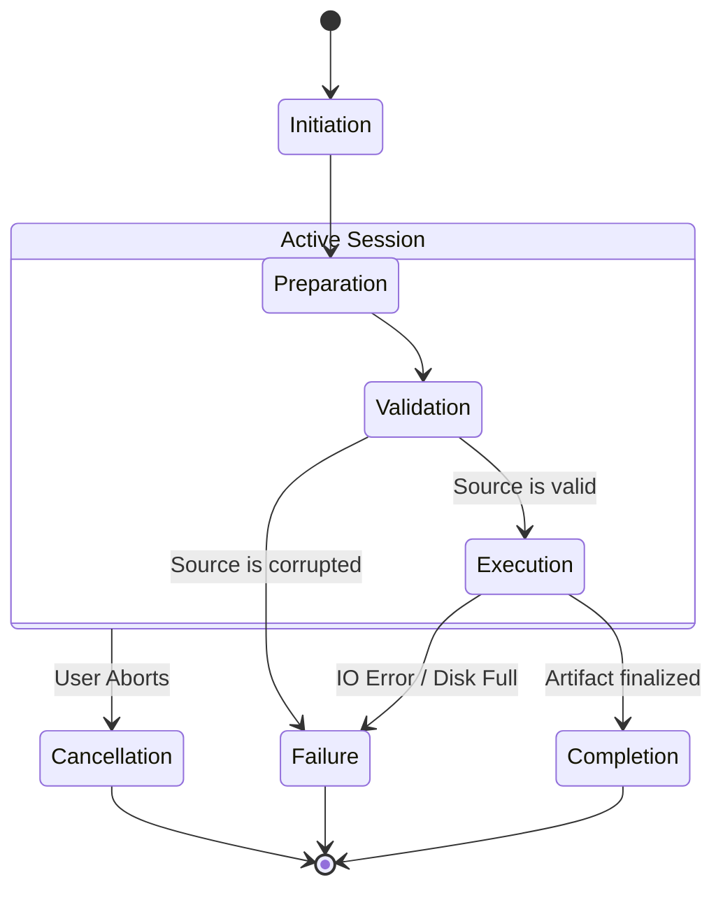

# 02 — Backup Lifecycle

> **Module:** Backup & Restore
> **Status:** Approved
> **Applies To:** Notebook Application

---

## 1. Purpose

The Backup Lifecycle defines the strict sequential phases required to safely generate a Backup Artifact from an active Workspace. 

---

## 2. Lifecycle Phases

### 2.1 Backup Initiation
The lifecycle begins when a Backup Request is received (manual or automatic). A Backup Session is instantiated to coordinate the workflow.

### 2.2 Preparation
The module prepares the active data for snapshotting.
- Flushes pending WAL (Write-Ahead Log) commits to the SQLite database.
- Generates a file manifest of all attachments to be included.

### 2.3 Validation
Before copying data, the module verifies that the source is healthy.
- Executes an integrity check against the active database.
- **Rule:** A corrupted Workspace will not be backed up, preventing the creation of useless, broken artifacts.

### 2.4 Backup Execution
The actual derivation of the artifact occurs.
- The active database is copied or streamed safely.
- Attachments are archived.
- Compression or encryption extensions are invoked if configured.

### 2.5 Completion
The Backup Artifact is finalized, moved to its final destination (e.g., `backups/` directory), and a `BackupCompleted` event is published.

### 2.6 Failure
If an error occurs (e.g., disk full, database lock):
- The Backup Session aborts.
- Temporary files are purged.
- A `BackupFailed` event is published.

### 2.7 Cancellation
If the user cancels the backup manually:
- The Backup Session terminates execution safely.
- Temporary artifacts are cleaned up.
- A `BackupCancelled` event is published.

---

## 3. Lifecycle Diagram

---

## 4. Business Rules

- **Backup never modifies Notebook data.** The execution phase relies on read-only access or safe snapshot commands (e.g., SQLite Backup API).
- **Backup failures never corrupt Notebook entities.** An aborted backup session simply drops the temporary artifact. The original Workspace remains perfectly intact.
- **Backup artifacts are derived artifacts.** 

---

## 5. Acceptance Criteria

- If the hard drive runs out of space during Backup Execution, the process transitions to Failure and cleans up partial files without affecting the active SQLite database.
- A user can cancel a backup midway through, which instantly stops the archive process and emits `BackupCancelled`.

---

## 6. Cross References

- [01-BackupOverview.md](./01-BackupOverview.md)
- [04-RestoreLifecycle.md](./04-RestoreLifecycle.md)
