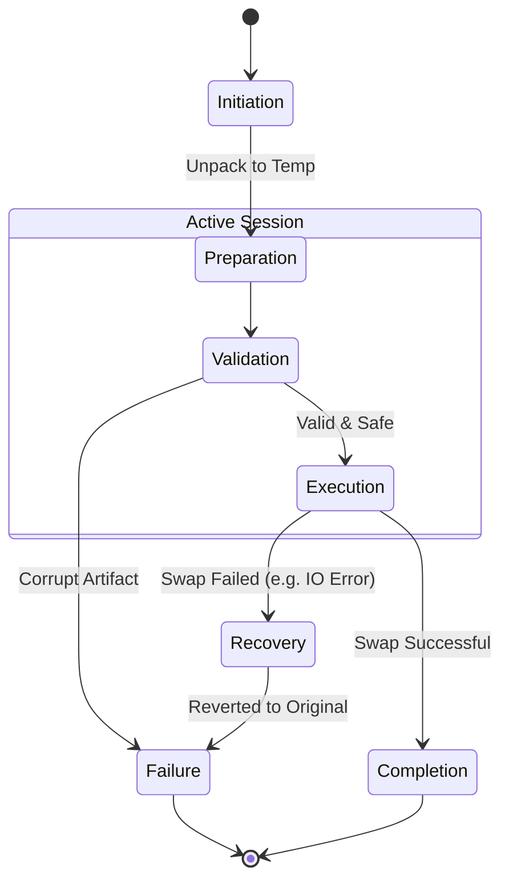

# 04 — Restore Lifecycle

> **Module:** Backup & Restore
> **Status:** Approved
> **Applies To:** Notebook Application

---

## 1. Purpose

The Restore Lifecycle defines the strict sequential phases required to safely recreate an active Workspace from a Backup Artifact. It ensures that data corruption is never introduced during the recovery process.

---

## 2. Restore Philosophy

- **Restore recreates Notebook state from a backup.** It extracts the derived artifact and promotes it back into canonical data.
- **Restore never changes Notebook ownership.** The data model and ownership structure dictated by the Domain remain exactly the same.
- **Restore validation occurs before Notebook data becomes active.** The artifact is fully vetted in an isolated environment before the system swaps it in.

---

## 3. Lifecycle Phases

### 3.1 Restore Initiation
The lifecycle begins when a Restore Request is issued against a specific Backup Artifact. A Restore Session is instantiated. The UI must ensure the user understands that their current active Workspace state will be overwritten.

### 3.2 Restore Preparation
The module unpacks the Backup Artifact into a temporary, isolated directory.
- Decompresses or decrypts the artifact if required.
- Ensures the active Workspace is locked to prevent concurrent writes during the restore process.

### 3.3 Validation
The extracted payload is rigorously validated.
- The SQLite database undergoes a `PRAGMA integrity_check`.
- The manifest is checked to ensure compatibility (e.g., correct schema version).
- **Rule:** Invalid backups are never restored.

### 3.4 Restore Execution
The system coordinates with the Workspace Manager to perform the swap.
- The current active Workspace is moved to a safe recovery directory (a "pre-restore backup").
- The validated temporary directory is moved into the official Workspace location.

### 3.5 Completion
The system successfully re-initializes the Workspace with the newly restored data.
- A `RestoreCompleted` event is published.
- The application reloads the UI to reflect the restored state.

### 3.6 Failure
If an error occurs during extraction or validation:
- The Restore Session aborts.
- The temporary directory is purged.
- The active Workspace remains completely untouched and functional.
- A `RestoreFailed` event is published.

### 3.7 Recovery
If a failure occurs *during* the execution swap phase:
- The system automatically reverts to the "pre-restore backup" created in step 3.4.
- Ensures the application never ends up in a partially restored, broken state.

---

## 4. Lifecycle Diagram

---

## 5. Business Rules

- **Restore recreates Notebook state from a backup.**
- **Restore never changes Notebook ownership.**
- **Restore validation occurs before Notebook data becomes active.**
- **Failures never corrupt Notebook data.**

---

## 6. Acceptance Criteria

- Attempting to restore a `.zip` file containing a corrupted SQLite database fails safely during the Validation phase, and the active Workspace is unharmed.
- A successful Restore operation completely replaces the Workspace contents, and the application resumes normal operation without requiring a hard restart.

---

## 7. Cross References

- [02-BackupLifecycle.md](./02-BackupLifecycle.md)
- [05-BackupValidation.md](./05-BackupValidation.md)
