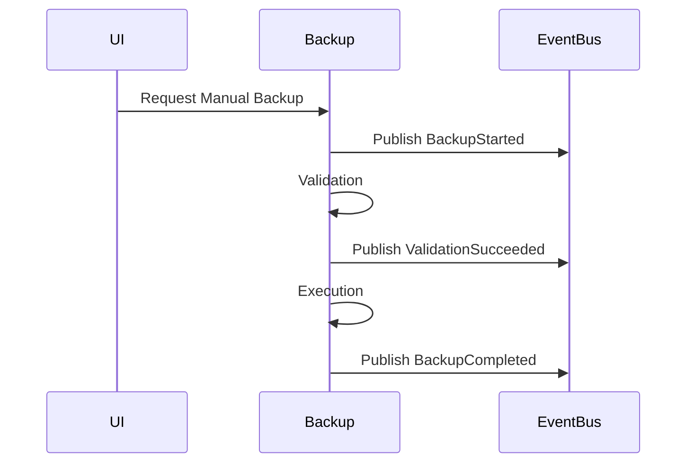

# 06 — Backup Events

> **Module:** Backup & Restore
> **Status:** Frozen
> **Version:** 1.0
> **Architecture Review:** Approved

---

## 1. Purpose

The Backup Events document defines the communication interface between the Backup & Restore module and the rest of the application. It ensures decoupled, reactive behavior.

---

## 2. Event Philosophy

- **Events communicate backup state.** They inform the system when a long-running process starts, succeeds, or fails.
- **Events never transfer ownership.** They transmit metadata (such as the path to a completed Backup Artifact), but never pass live domain entities.
- **Loose coupling.** The UI and other modules react to these events without needing direct knowledge of the Backup internal state machine.

---

## 3. Published Events

The module broadcasts these conceptual events to the Event Bus:

| Event | Payload Examples | Description |
|---|---|---|
| `BackupStarted` | `workspaceId`, `strategy` | Fired when a Backup Session begins. |
| `BackupCompleted` | `workspaceId`, `artifactPath` | Fired when an artifact is successfully derived. |
| `BackupCancelled` | `workspaceId` | Fired when a user aborts the process. |
| `BackupFailed` | `workspaceId`, `errorCode` | Fired when backup creation aborts due to an error. |
| `RestoreStarted` | `workspaceId`, `artifactPath` | Fired when a Restore Session begins. |
| `RestoreCompleted` | `workspaceId` | Fired when a Workspace is successfully replaced. |
| `RestoreCancelled` | `workspaceId` | Fired when a user aborts before the swap. |
| `RestoreFailed` | `workspaceId`, `errorCode` | Fired if validation or extraction fails. |
| `ValidationSucceeded` | `sessionId`, `phase` | Fired when an integrity check passes. |
| `ValidationFailed` | `sessionId`, `reason` | Fired when corrupt or incompatible data is detected. |

---

## 4. Consumed Events

The Backup & Restore module listens to these events to drive automatic strategies:

| Event | Reaction |
|---|---|
| `WorkspaceOpened` | May evaluate if a scheduled backup is past due. |
| `WorkspaceClosed` | May trigger an automatic backup snapshot on exit. |
| `SynchronizationCompleted` | May trigger a local backup to preserve the newly synchronized state. |

---

## 5. Event Ordering

---

## 6. Business Rules

- **Events communicate backup state.**
- **Events never transfer ownership.**

---

## 7. Acceptance Criteria

- When `RestoreCompleted` is published, the Workspace Manager listens to it and reloads the active context automatically.
- A `BackupFailed` event includes a descriptive error code allowing the UI to present actionable feedback to the user.

---

## 8. Cross References

- [02-BackupLifecycle.md](./02-BackupLifecycle.md)
- [04-RestoreLifecycle.md](./04-RestoreLifecycle.md)
