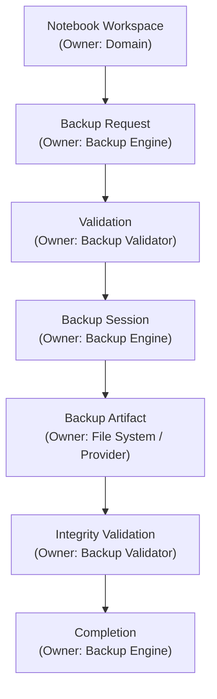
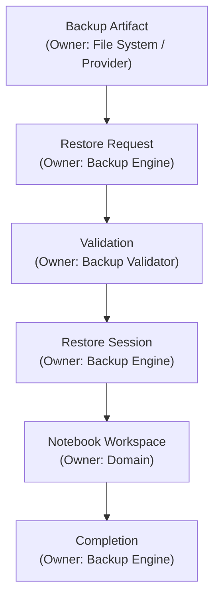

# 08 — Backup Governance

> **Module:** Backup & Restore
> **Status:** Approved
> **Applies To:** Notebook Application

---

## 1. Purpose

The Backup Governance document defines the strict ownership boundaries, responsibilities, and consistency rules for the Backup & Restore module. It ensures that the module protects data without ever violating the clean architectural separation of the Notebook application.

---

## 2. Ownership Boundaries

### 2.1 Backup & Restore Owns:
- **Backup coordination:** Managing the scheduling and triggers for backups.
- **Restore coordination:** Orchestrating the safe extraction of artifacts.
- **Backup validation:** Guaranteeing the integrity of payloads both pre-backup and pre-restore.
- **Backup lifecycle:** The state machine progressing from initiation to completion.

### 2.2 Backup & Restore Does NOT Own:
- **Workspace**
- **Folder**
- **Notes**
- **Attachments**
- **Tags**
- **OCR**
- **Search**
- **Embeddings**
- **AI Assistant**
- **Todos**
- **Synchronization**

---

## 3. Module Interactions & Consistency Rules

- **Backup coordinates protection of Notebook data.** It is infrastructure, built to ensure the persistence and recoverability of the user's data.
- **Notebook entities remain canonical.** The act of backing up data does not change its canonical status.
- **Module boundaries are absolute.** The Backup module does not query the `Notes` table to figure out what to back up; it backs up the entire SQLite database file as an opaque payload.

---

## 4. Canonical Workflow

### 4.1 Backup Workflow

### 4.2 Restore Workflow

### 4.3 Workflow Clarifications
- **Every stage has one owner.** There is no overlapping responsibility between the Domain and the Backup engine.
- **Ownership never transfers.**
- **Backup artifacts remain derived artifacts.** They only transition back to being Notebook data once a Restore Session officially completes the swap into the canonical path.

---

## 5. Business Rules

- **Backup is optional.** 
- **Restore requires successful validation.**
- **Backup artifacts never become Notebook entities.** They are isolated snapshots.
- **Restore never changes Notebook ownership.**
- **Failures never corrupt Notebook data.**

---

## 6. Acceptance Criteria

- Code reviews confirm that the Backup & Restore module contains zero SQL queries referencing domain tables like `Notes` or `Folders`.
- A corrupted backup artifact fails the Restore Validation stage and never reaches the "Notebook Workspace" stage of the workflow.

---

## 7. Cross References

- [01-BackupOverview.md](./01-BackupOverview.md)
- [02-BackupLifecycle.md](./02-BackupLifecycle.md)
- [04-RestoreLifecycle.md](./04-RestoreLifecycle.md)
