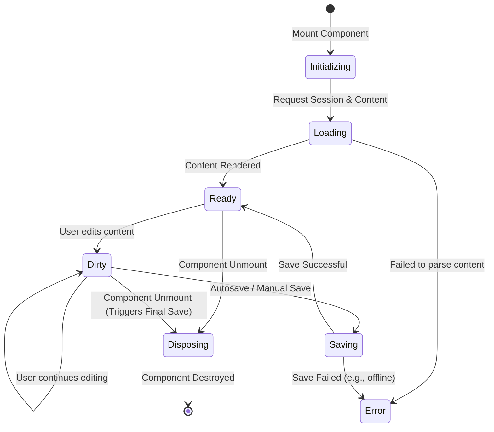

> **Document Type:** Module Specification
> **Status:** Draft
> **Version:** 1.0
> **Depends On:** Notes Module
> **Document Owner:** Core Architecture Team

# 02 — Editor Lifecycle

---

## 1. Purpose

This document outlines the complete lifecycle of the Editor component. It tracks the Editor's state from initialization to disposal, clarifying how it interacts with the underlying Editing Session to safely render and mutate data.

## 2. Scope

**This document covers:**
- Component initialization and teardown.
- State transitions (Loading, Ready, Dirty, Saving).
- Recovery interactions.

## 3. Lifecycle Phases

### 3.1 Initialization
- The Editor component is mounted.
- It requests an active `Editing Session` for a specific Note UUID from the Notes module.

### 3.2 Loading Note Content
- The Editor parses the incoming semantic payload (e.g., JSON).
- The internal Editor state is instantiated based on the payload.

### 3.3 Rendering
- The Editor transitions to the `Ready` state.
- The UI becomes interactive for the user.

### 3.4 Editing (Volatile State)
- The user modifies the content.
- The Editor transitions to a `Dirty` state.
- Emits runtime events (`EditorContentChanged`).

### 3.5 Saving
- Triggered by Autosave or a manual command.
- The Editor serializes its internal state back into the semantic payload format and sends it to the Notes module.
- Upon success, the Editor transitions back to a `Ready` (Clean) state.

### 3.6 Closing and Disposal
- The user navigates away or closes the Editor.
- The Editor triggers a final, synchronous flush of any remaining Dirty state.
- The Editor releases the Editing Session and is destroyed from memory.

## 4. State Transitions

## 5. Recovery Interaction

- If the Editor fails to load a heavily corrupted Note payload, it MUST gracefully fallback to a raw text view or read-only mode, rather than crashing the entire application UI.
- If the Editor crashes unexpectedly, the Notes module's Session and Autosave mechanisms limit data loss.

## 6. Business Rules

- **Blocking Disposal:** The Editor MUST NOT complete its disposal process until the final volatile state has been successfully handed off to the persistence layer.
- **Stateless Reinitialization:** The Editor must be fully capable of re-initializing cleanly from a new payload at any time.

## 7. Edge Cases

- **Offline Edits:** If `Saving` fails due to a network or database lock, the Editor remains in the `Dirty` state and attempts exponential backoff retries.
- **Concurrent External Update:** If the Note is modified externally (e.g., by a sync process), the Editor should prompt the user to reload, or elegantly merge non-conflicting changes.

## 8. Performance Considerations

- Loading and Parsing (Phase 3.2) must be optimized for large documents (e.g., 50k+ words) to prevent UI blocking (using virtualization or chunking as needed).

## 9. Acceptance Criteria

- The Editor correctly transitions from Initializing &rarr; Loading &rarr; Ready.
- Unmounting the Editor successfully flushes all Dirty state before destruction.
