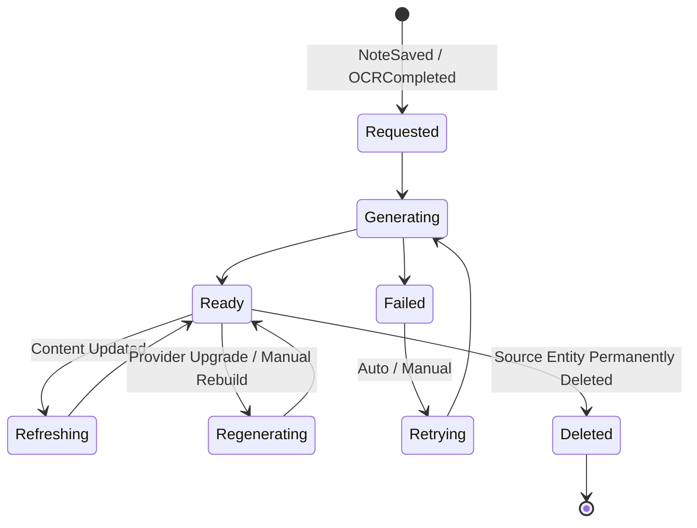

> **Document Type:** Module Specification
> **Status:** Draft
> **Version:** 1.0
> **Depends On:** Notes, Attachments, OCR
> **Document Owner:** Core Architecture Team

# 02 — Embedding Lifecycle

---

## 1. Purpose

This document defines the lifecycle of an Embedding within the Notebook ecosystem. It establishes the conceptual stages an embedding passes through and the business rules governing each transition.

## 2. Lifecycle Operations

### 2.1 Embedding Request
- A trigger (e.g., the `NoteSaved` event, the `OCRCompleted` event, or a manual user action) causes an Embedding Request to be created.
- The request records the source entity UUID (e.g., a Note UUID), the type of content, and the intended provider.
- **Rule:** Creating an Embedding Request never modifies the source Note or Attachment.

### 2.2 Generation
- An Embedding Job is instantiated from the Request.
- The module reads the text payload of the source entity (read-only) and dispatches it to the configured Embedding Provider.
- The provider returns a semantic vector, which is stored as the Embedding artifact.
- **Rule:** The generation step NEVER writes back to the source entity.

### 2.3 Storage Concept
- The resulting vector is stored in an independent store (conceptually a vector index), linked to the source entity by its UUID.
- The embedding store is a derived layer, entirely separate from the canonical Note storage.

### 2.4 Refresh
- When a Note is meaningfully updated (e.g., significant content change), the existing embedding is superseded and a fresh Embedding Request is queued.
- The old embedding remains valid and queryable until the refresh completes, preserving continuity.

### 2.5 Regeneration
- The same canonical entity may have its embedding regenerated at any time. Reasons include:
  - Embedding model evolution — a new or improved model becomes available.
  - Configuration changes — the provider or generation parameters are updated.
  - Manual regeneration — explicitly triggered by the user or system administrator.
  - Workspace reindexing — a full rebuild operation covers all entities.
- Each regeneration produces a new **Embedding Version**, conceptually superseding the previous version.
- **Rule:** Regeneration NEVER modifies source Notebook content.
- **Rule:** Notebook entity identity (e.g., the Note UUID) remains entirely unchanged across all Embedding Versions.

### 2.6 Deletion
- If the source entity is permanently deleted (e.g., `NotePermanentDeleted`), the associated embedding is garbage collected.
- **Rule:** Deleting an embedding NEVER deletes the source entity. The relationship is strictly unidirectional.

### 2.7 Rebuild
- A full Rebuild operation clears all embeddings in the store and re-generates them from scratch by traversing all canonical content.
- The Rebuild is a background operation that must not block user interaction.

## 3. Lifecycle Diagram

## 4. Embedding Version Philosophy

The same canonical entity may be processed multiple times throughout its lifetime. This is a normal, expected lifecycle event:
- Multiple embedding runs are completely valid.
- Each successful run produces a new Embedding Version that supersedes the prior version conceptually.
- New Embedding Versions may be generated due to model evolution, configuration changes, manual regeneration, or workspace reindexing.
- The source entity identity (e.g., Note UUID) never changes across any number of Embedding Versions.
- Notebook content is never modified as a result of version transitions.

## 5. Business Rules

- **Non-Destructive:** Generating, refreshing, or deleting an embedding NEVER modifies Notes, Attachments, or OCR Results.
- **Eventual Consistency:** The embedding store reflects the canonical content in an eventually consistent manner.
- **Idempotency:** Regenerating an embedding for the same entity multiple times produces a single, current representation — not duplicates.
- **Safe Failures:** A failed embedding generation (e.g., provider timeout) is recorded as a failed job. It does not corrupt the source entity or the broader embedding store.

## 6. Edge Cases

- **Rapid Editing:** If a user saves a Note ten times in rapid succession, the module must debounce or coalesce the resulting Embedding Requests to prevent unnecessary provider calls.
- **Source Deleted Mid-Generation:** If the source Note is deleted while its Embedding Job is executing, the job is cancelled gracefully and no embedding artifact is persisted.
- **Provider Unavailable:** If the configured Embedding Provider is unreachable, the job transitions to `Failed` and enters the retry queue. The canonical Note remains fully accessible.

## 7. Acceptance Criteria

- Saving a Note queues an Embedding Request without altering the Note's content or modification timestamp.
- Deleting a Note successfully garbage collects the associated embedding without affecting any other Notes or their embeddings.
- Triggering a full Rebuild clears and reconstructs the embedding store while all canonical Notes remain perfectly accessible throughout the operation.
