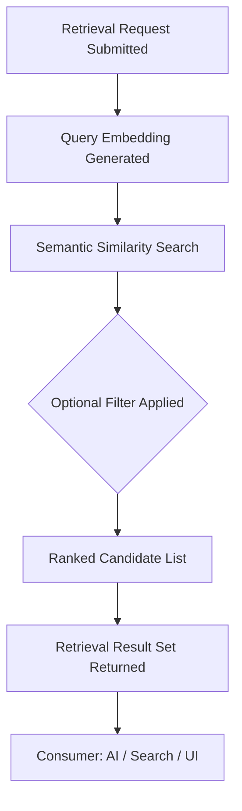

> **Document Type:** Module Specification
> **Status:** Draft
> **Version:** 1.0
> **Depends On:** Embeddings, Search
> **Document Owner:** Core Architecture Team

# 03 — Retrieval Overview

---

## 1. Purpose

This document defines the Retrieval capability within the Embeddings & Retrieval module. It establishes what Retrieval is, how it operates within the Notebook ecosystem, and the strict boundaries that separate it from AI generation and canonical data ownership.

## 2. Concept

Retrieval is the process of identifying the most conceptually relevant Notebook entities in response to a request. It does not generate new information — it surfaces existing information from the Notebook by measuring semantic proximity between the request and the embedding store.

**Critical distinction:** Retrieval produces a list of candidate entity references. It does NOT generate text, AI responses, or summaries. Those responsibilities belong exclusively to the AI module.

## 3. Retrieval Concepts

### 3.1 Retrieval Identity Philosophy
It is critical to distinguish conceptual identities within the Retrieval domain:
- **Retrieval Request:** Represents a consumer's formalized request to find semantically relevant Notebook entities for a given input query or context. Immutable once submitted.
- **Retrieval Execution:** Represents the active processing of that request against the embedding store. Transient — it produces outputs but has no persistence of its own.
- **Candidate Set:** Represents the ordered collection of entity UUID references and relevance scores produced by the Execution. It is a volatile intermediate artifact, not a final output.
- **Context Package:** Represents the assembled, consumer-ready artifact derived from the Candidate Set. Fragments of canonical content are fetched and composed into a structured package for downstream use.
- Each concept has a distinct responsibility and lifecycle. Retrieval never progresses to AI response generation — that boundary belongs exclusively to the AI module.

### 3.2 Derived Nature
- Retrieval Results are ephemeral, derived objects. They NEVER become canonical data.
- They reference canonical entities but NEVER own them.

## 4. Retrieval Requests

A Retrieval Request is formed by a consumer (e.g., an AI module preparing context, or a "Related Notes" UI feature). It contains:
- A query or context string (the semantic anchor).
- Optional scope constraints (e.g., within a specific Folder, tagged with specific Tags).
- Optional result count limit.

**Rule:** A Retrieval Request is read-only. It never modifies the embedding store or any canonical entity.

## 5. Retrieval Pipeline

The Retrieval pipeline conceptually follows these stages:

### 5.1 Query Embedding
- The input query text is itself converted into a temporary embedding vector for the purpose of comparison. This vector is transient and is not persisted to the embedding store.

### 5.2 Semantic Search
- The module compares the query vector against the stored entity embeddings to find candidates with the closest conceptual proximity.

### 5.3 Optional Filtering
- Retrieval may be scoped by Folder, Tags, or date range — consuming metadata from canonical modules to narrow the candidate set, analogously to Search Filters.

### 5.4 Ranking
- Candidates are ranked by conceptual proximity. Ranking affects presentation order only. It never modifies canonical data.

## 6. Retrieval Results

- Retrieval Results are a ranked list of entity UUID references and their associated relevance scores.
- Results are volatile — they are generated on demand and discarded after use.
- Results reference Notebook entities but NEVER own them.
- Results NEVER contain the full text payload of a Note. The AI or UI consumer must separately fetch the canonical content from the Notes module using the returned UUID.

## 7. Retrieval Consumers

Consumers are the modules or features that submit Retrieval Requests:
- **AI Module (Future):** Constructs a prompt context by retrieving the most relevant Note fragments before calling a language model.
- **Related Notes (UI Feature):** Surfaces a list of semantically similar Notes while the user is reading or editing.
- **Smart Search (Future):** Augments keyword search results with semantically relevant candidates.

**Rule:** Retrieval serves consumers but NEVER dictates how they use the results.

## 8. Business Rules

- **Consumer Only:** Retrieval consumes both the Embedding store and, optionally, Search Results as a pre-filter. It NEVER owns either.
- **Non-Generative:** Retrieval NEVER generates AI responses, summaries, or new content.
- **Non-Destructive:** Executing a Retrieval Request NEVER modifies canonical Notes, Attachments, OCR Results, Tags, or Wiki Links.
- **Ephemeral Results:** Retrieval Results are transient. They possess no persistence and are discarded after being consumed.
- **Retrieval Failure Philosophy:** Retrieval failures affect only semantic retrieval. They MUST NEVER corrupt Notes, Attachments, OCR Results, Search Indexes, Tags, Wiki Links, or Editor content. Notebook integrity is always preserved.
- **Failure Isolation:** A failed Retrieval operation (e.g., the embedding store is temporarily unavailable) MUST NOT prevent users from opening, editing, or saving Notes.

## 9. Edge Cases

- **Empty Embedding Store:** If no embeddings have been generated yet, the Retrieval pipeline returns an empty result set. This is not an error state; the consumer is responsible for graceful degradation.
- **Stale Embeddings:** If a Note has been updated but its embedding has not yet been refreshed, the Retrieval result for that Note reflects the previous version's semantics until the refresh completes.
- **No Results:** A valid Retrieval Request that finds no sufficiently proximate candidates yields an empty result set, not an error.

## 10. Acceptance Criteria

- A Retrieval Request anchored to the text "financial planning" successfully returns a ranked list of Note UUIDs whose content is semantically related, without reading the full Note payloads during the ranking phase.
- A Retrieval Request executed while the embedding store is rebuilding gracefully returns an empty result set and a non-fatal warning, without crashing the application or preventing the user from accessing their Notes.
- The full text of a retrieved Note is never included in the Retrieval Result itself — only the entity UUID and a relevance score are returned to the consumer.
