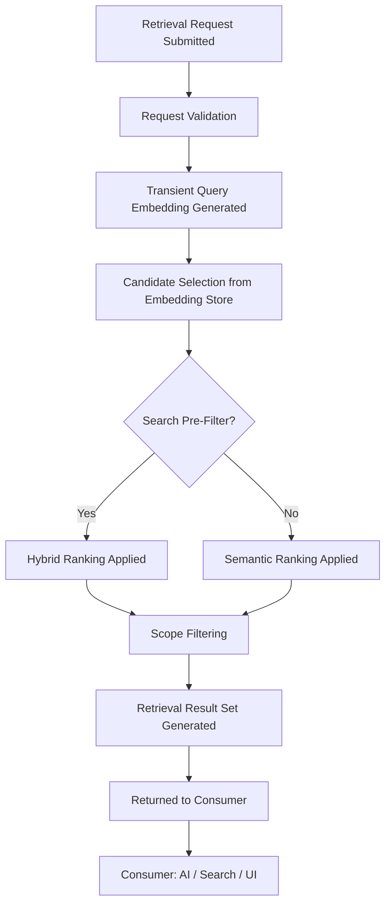

> **Document Type:** Module Specification
> **Status:** Draft
> **Version:** 1.0
> **Depends On:** Embeddings, Search, Notes, Attachments, OCR
> **Document Owner:** Core Architecture Team

# 04 — Retrieval Pipeline

---

## 1. Purpose

This document describes the conceptual design of the Retrieval Pipeline — the sequence of stages through which a Retrieval Request is processed to produce a ranked candidate set of Notebook entities. It establishes what the pipeline consumes, what it produces, and the ownership rules it must respect at every stage.

## 2. Pipeline Concepts

### 2.1 Pipeline Identity
The Retrieval Pipeline is not a single operation; it is a composed sequence of discrete stages. Each stage has a clearly defined input and output, making the pipeline testable, observable, and extensible without violating existing boundaries.

### 2.2 Pipeline Role
The Pipeline acts as a coordinator. It orchestrates reads from the embedding store and, optionally, from the Search module, to produce a refined candidate list. It NEVER writes to canonical modules, NEVER generates AI content, and NEVER persists its intermediate or final outputs as Notebook data.

## 3. Pipeline Stages

### 3.1 Stage 1 — Retrieval Request Received
- A consumer (e.g., an AI module, a Related Notes UI feature) submits a Retrieval Request containing a query context and optional scope constraints.
- The Pipeline validates the request structure before proceeding.

### 3.2 Stage 2 — Query Embedding
- The request's query text is converted into a transient semantic vector.
- This vector is ephemeral — it is used only within this pipeline execution and is NEVER persisted to the embedding store.

### 3.3 Stage 3 — Candidate Selection
- The transient query vector is compared against the persisted embedding store to identify the most semantically proximate entities.
- The output of this stage is a raw candidate list — a set of entity UUID references with associated proximity scores.

### 3.4 Stage 4 — Search Pre-Filter (Optional)
- Optionally, the pipeline may consume a Search Result set as an additional filter or ranking signal.
- This creates a Hybrid Retrieval posture: candidates that score well on both semantic proximity AND keyword relevance rank higher.
- **Rule:** The pipeline consumes Search Results; it NEVER modifies Search Indexes or Search state.

### 3.5 Stage 5 — Scope Filtering
- Scope constraints from the original request (e.g., limit to a specific Folder UUID, require a specific Tag UUID) are applied to narrow the candidate list.
- Scope filtering reads metadata from canonical modules (Notes, Tags, Folders) on a read-only basis.

### 3.6 Stage 6 — Ranking
- The filtered candidate list is sorted by a composite score that weighs semantic proximity, optional keyword relevance, and metadata signals (e.g., recency, Tag relevance).
- Ranking affects the candidate ordering only. It NEVER modifies the underlying entities or their embeddings.

### 3.7 Stage 7 — Retrieval Result Set Returned
- The pipeline emits a ranked Retrieval Result Set to the requesting consumer.
- The result set contains entity UUID references and relevance scores — never the full canonical content of the entities.

## 4. Pipeline Lifecycle Diagram

## 5. Pipeline Dependencies

| Stage | Consumes | Ownership |
|---|---|---|
| Query Embedding | Embedding Provider | Embeddings module |
| Candidate Selection | Embedding Store | Embeddings module |
| Search Pre-Filter | Search Results | Search module |
| Scope Filtering | Note / Tag / Folder metadata | Notes, Tags modules |
| Result Set | Assembled candidate list | Embeddings & Retrieval module |

**Rule:** At no stage does the pipeline assert ownership over Notes, Attachments, OCR Results, or Search Indexes. It reads; it never writes.

## 6. Pipeline Consumers

- **AI Module:** Consumes the Result Set to assemble context for a language model.
- **Related Notes (UI):** Consumes the Result Set to present a sidebar of semantically similar Notes.
- **Smart Search (Future):** Consumes the Result Set to augment keyword search rankings.

**Rule:** The Pipeline serves consumers but NEVER determines how they use the results.

## 7. Business Rules

- **Read-Only Posture:** The pipeline reads from the embedding store and optional Search Results. It NEVER modifies any canonical module.
- **Ephemeral Intermediates:** All intermediate values produced within the pipeline (transient vectors, raw candidate lists) are discarded after the execution completes.
- **Non-Generative:** The pipeline prepares candidate context. It NEVER generates AI responses, summaries, or authored content.
- **Failure Isolation:** A failure at any pipeline stage (e.g., embedding store unavailable, Search module timeout) must not corrupt canonical Notebook data. The pipeline returns a degraded but safe result or an empty set with a non-fatal warning.
- **Consumer Independence:** Each consumer receives the same ranked result set and interprets it independently.

## 8. Edge Cases

- **Empty Embedding Store:** If no embeddings exist, Stage 3 produces an empty candidate list. The pipeline completes gracefully and returns an empty result set.
- **Search Module Unavailable:** If the optional Search Pre-Filter stage cannot contact the Search module, the pipeline falls back to pure semantic ranking.
- **Conflicting Scope Filters:** If a scope filter references a Folder or Tag that no longer exists, the filter is silently dropped and the pipeline proceeds without it.

## 9. Performance Considerations

- The Query Embedding (Stage 2) may introduce latency if using a remote provider. The architecture should conceptually support caching recent query embeddings for frequent queries.
- Scope Filtering (Stage 5) should be applied as early as possible in the pipeline to reduce the candidate pool before expensive ranking operations.

## 10. Acceptance Criteria

- A Retrieval Request scoped to a specific Folder successfully returns only candidates whose source Notes reside within that Folder, without reading or modifying Notes in other Folders.
- A Retrieval Request executed when the Search module is offline completes successfully using pure semantic ranking, returning a valid (if unaugmented) result set.
- The full Markdown content of a retrieved Note is never included in the Retrieval Result Set — only the entity UUID and relevance score are returned to the consumer.
