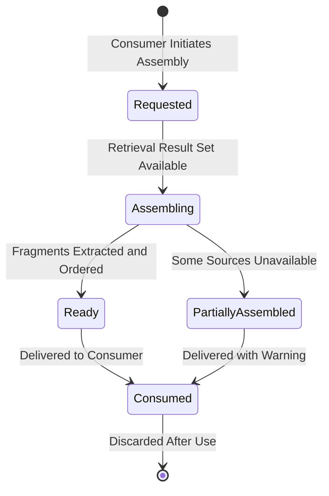

> **Document Type:** Module Specification
> **Status:** Draft
> **Version:** 1.0
> **Depends On:** Embeddings, Search, Notes, Attachments, OCR, Tags, Wiki Links
> **Document Owner:** Core Architecture Team

# 05 — Context Assembly

---

## 1. Purpose

This document defines the conceptual design of Context Assembly — the process of taking a Retrieval Result Set and composing it into a structured context artifact that downstream consumers (primarily AI modules) can act upon. It establishes what context is, where it comes from, and the strict rules governing its lifecycle.

## 2. Context Concepts

### 2.1 What is Context?
Context is a transient, derived artifact assembled from canonical Notebook content. It represents a curated selection of information deemed most relevant to a specific consumer's request at a specific point in time.

Context is not a Note. It is not a permanent structure. It is an ephemeral composition produced to fulfil a single consumer request.

### 2.2 Context Identity Philosophy
- **Context Assembly Request:** Represents a consumer's request to assemble context from a given Retrieval Result Set.
- **Context Package:** The assembled artifact — a structured, ordered collection of content fragments derived from canonical sources.
- **Content Fragment:** A single extracted piece of information from a canonical source (e.g., a paragraph from a Note, a Tag name, an OCR excerpt).
- Each concept has a distinct responsibility. The identity of the source entities (Note UUIDs, Attachment UUIDs) remains entirely independent from the Context Package.

### 2.3 Context Package Philosophy
- **Rule:** Context Packages are ephemeral derived artifacts. They possess no permanent identity.
- **Rule:** Context Packages are assembled exclusively for downstream consumers. They are never stored as part of the Notebook corpus.
- **Rule:** Context Packages NEVER become canonical Notebook data.
- **Rule:** Context Packages may be regenerated at any time by re-issuing a Context Assembly Request. Regeneration never modifies the canonical sources it draws from.

## 3. Context Sources

Context may be assembled from the following canonical sources, each read on a strictly read-only basis:

| Source | Content Type | Module Owner |
|---|---|---|
| Notes | Markdown text payloads, titles, frontmatter | Notes Module |
| OCR Results | Extracted text from images and PDFs | OCR Module |
| Tags | Tag display names and their associations | Tags Module |
| Wiki Links | Link targets and relationship descriptions | Wiki Links Module |
| Attachment Metadata | File names, MIME types, sizes | Attachments Module |

**Rule:** Context Assembly reads from these sources. It NEVER writes to them.

## 4. Context Composition

### 4.1 Fragment Extraction
- For each candidate in the Retrieval Result Set, the assembly process fetches the relevant content fragment from the owning canonical module.
- Fragments are not the full entity; they are the most semantically relevant portions (e.g., a paragraph containing the matched concept, not the entire Note body).

### 4.2 Context Ordering
- Fragments are ordered by the relevance ranking established in the Retrieval Pipeline.
- The highest-ranked candidates appear first in the assembled Context Package, ensuring the most relevant information is most accessible to the consumer.

### 4.3 Context Completeness
- A complete Context Package contains enough information for the downstream consumer to act meaningfully.
- A partial Context Package (e.g., assembled from a degraded Retrieval Result Set) is still a valid output — the consumer is responsible for gracefully handling incomplete context.

### 4.4 Deduplication
- If multiple Retrieval Results reference overlapping content (e.g., two Notes quoting the same source), the assembly process should deduplicate redundant fragments to prevent context bloat.

## 5. Context Lifecycle

## 6. Context Regeneration

- Context is never cached permanently. Each consumer request triggers a fresh assembly.
- If the canonical sources have changed since the last retrieval (e.g., the user edited a Note), the next Context Assembly request will capture the updated state.
- **Rule:** Context regeneration never modifies any canonical source. It re-reads them.

## 7. Business Rules

- **Derived Artifact:** Context Packages are strictly derived. They NEVER become part of the canonical Notebook corpus.
- **Strict Read-Only:** The assembly process reads canonical content from owning modules. It NEVER writes back or alters modification timestamps.
- **Ephemeral Lifecycle:** Context Packages exist only to serve a specific consumer request. They are discarded immediately after delivery.
- **Ownership Preserved:** Each fragment within a Context Package retains a reference to its originating entity UUID, preserving conceptual attribution to the canonical owner.
- **No AI Authorship:** Context Assembly never generates new text or information. It curates and structures existing, user-authored content.

## 8. Edge Cases

- **Source Note Deleted Mid-Assembly:** If a Note is deleted while its content is being fetched for context assembly, the fragment is omitted and the Context Package is marked as partial.
- **OCR Not Yet Available:** If an Attachment's OCR Result has not yet been generated, the assembly process skips the OCR fragment and notes the gap. It NEVER triggers OCR generation as a side effect.
- **No Relevant Content Found:** If the Retrieval Result Set is empty, the Context Package is empty. This is a valid output; the consumer handles the empty state.

## 9. Performance Considerations

- Fragment extraction should be bounded in length to prevent excessive context packages that overwhelm downstream consumers.
- The assembly process should operate concurrently across multiple fragment sources where possible, to minimize latency.

## 10. Acceptance Criteria

- A Context Assembly request successfully composes fragments from a Note body, a related OCR Result, and an associated Tag name, without modifying the source Note, OCR artifact, or Tag record.
- If the source Note for one candidate is deleted mid-assembly, the remaining fragments are assembled and delivered as a partial Context Package with a non-fatal warning, rather than failing the entire request.
- The assembled Context Package contains only content fragment text and source entity UUID references — never authentication credentials, internal system identifiers beyond source UUIDs, or private metadata beyond what was directly requested.
