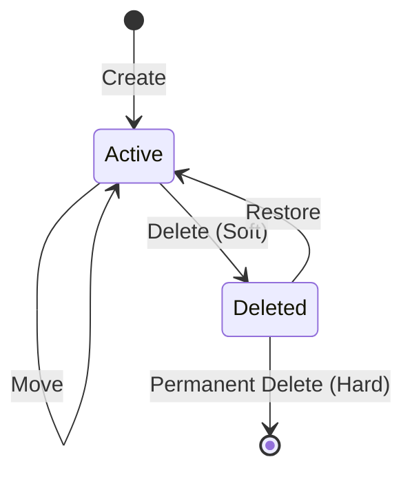

# 01 — Folder Lifecycle

> **Document Type:** Module Specification
> **Module:** folder
> **Status:** Frozen
> **Version:** 1.0
> **Architecture Review:** Approved

---

## 1. Purpose

This document details the complete lifecycle of a Folder entity within a Workspace. It describes the states a Folder transitions through from its initial creation to its eventual permanent deletion, ensuring a predictable and resilient organizational structure for Notes.

---

## 2. Scope

**This document covers:**
- Folder state definitions (Active, Deleted).
- Lifecycle operations (Create, Rename, Move, Copy, Merge, Archive, Delete, Restore, Permanent Delete).
- State transitions mapping.
- Ownership of the Folder record throughout its lifecycle.

**This document does NOT cover:**
- Implementation of the actual operations (see `03-FolderOperations.md`).
- Validation rules for these transitions (see `04-FolderValidation.md`).

---

## 3. Ownership Throughout Lifecycle

- A Folder belongs to exactly one Workspace from creation until permanent deletion.
- A Folder record is owned exclusively by the Folder module.
- While a Folder is Active, it serves as an organizational anchor for Notes.
- When a Folder is Soft-Deleted, it still retains its UUID, Name, and Workspace association, but is hidden from the primary user interface.
- Deleting or destroying a Folder does not inherently destroy Notes (ownership of Notes remains with the Notes module).

---

## 4. Folder States

A Folder can exist in one of two primary states within the database:

1. **Active**: The Folder is visible in the normal UI hierarchy. It can be moved, renamed, and have Notes assigned to it.
2. **Deleted (Soft-Deleted)**: The Folder resides in the Trash. It is hidden from standard navigation. It cannot have new Notes assigned to it, but it retains its historical relationships.

*(Note: "Archived" is a future state currently excluded from the V1 implementation).*

---

## 5. Lifecycle Operations

### 5.1 Create
A new Folder is instantiated with a unique, immutable UUID, a given Name, and optionally a Parent ID. It enters the **Active** state immediately.

### 5.2 Rename
An Active Folder's display name is updated. Its identity (UUID) and state remain unchanged.

### 5.3 Move
An Active Folder's parent is changed to another Active Folder (or to the Root). Its identity and state remain unchanged. 

### 5.4 Copy (Future)
An Active Folder's metadata is duplicated to create a completely new Folder with a new UUID. The original Folder remains unchanged.

### 5.5 Merge (Future)
Two Active Folders are merged. The Notes from the source Folder are reassigned to the destination Folder. The source Folder is then Soft-Deleted.

### 5.6 Archive (Future)
An Active Folder is marked as read-only and hidden from default views to reduce clutter, without moving it to the Trash.

### 5.7 Delete
An Active Folder is Soft-Deleted. It transitions to the **Deleted** state. Its `deletedAt` timestamp is set. 

### 5.8 Restore
A Soft-Deleted Folder is recovered from the Trash. It transitions back to the **Active** state. Its `deletedAt` timestamp is cleared. If its former parent is also Deleted, it may be restored to the Root.

### 5.9 Permanent Delete
A Soft-Deleted Folder is permanently removed from the database (Hard-Deleted). This operation is irreversible.

---

## 6. State Transitions

The following state diagram illustrates the valid transitions for a Folder:

---

## 7. Business Rules

- **Immutable Identity:** A Folder's UUID is assigned at Create and never changes during any lifecycle operation.
- **State Constraint on Move/Rename:** A Folder cannot be moved or renamed while in the **Deleted** state. It must be Restored first.
- **Lifecycle Independence:** A Folder's lifecycle is independent of the Notes it organizes. Deleting a Folder does not permanently delete its associated Notes.

---

## 8. Acceptance Criteria

- A Folder can transition cleanly from Create -> Active -> Deleted -> Permanent Delete.
- A Folder in the Deleted state can be Restored to the Active state.
- Lifecycle operations correctly update the state without altering the underlying immutable UUID.
