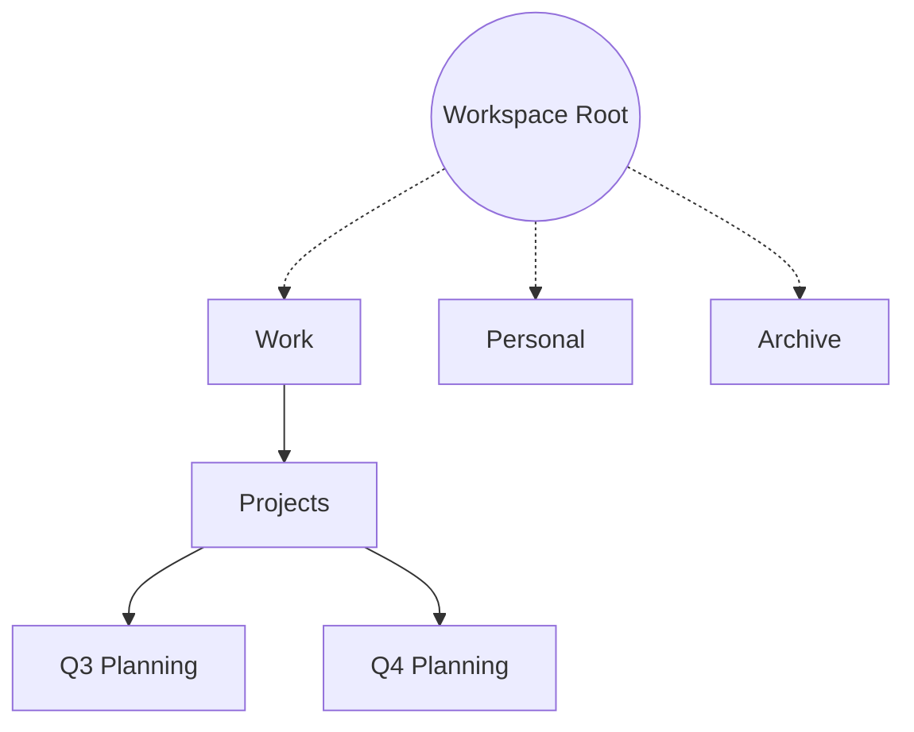

# 02 — Folder Hierarchy

> **Document Type:** Module Specification
> **Module:** folder
> **Status:** Draft
> **Version:** 1.0
> **Applies To:** Notebook — All Versions
> **Related Documents:**
> [README.md](./README.md) · [04-FolderValidation.md](./04-FolderValidation.md)

---

## 1. Purpose

This document defines the structural model for how Folders are organized relative to one another within a Workspace. It outlines the concepts of roots, nesting, paths, and the algorithms used to traverse and display the hierarchy.

---

## 2. Scope

**This document covers:**
- Hierarchy elements (Root, Parent, Child, Sibling).
- Depth and path generation.
- Traversal strategies.
- UI state properties (Expansion, Sorting).
- Breadcrumb generation.

**This document does NOT cover:**
- How a user executes a move operation (see `03-FolderOperations.md`).
- Circular reference validation algorithms (see `04-FolderValidation.md`).

---

## 3. Hierarchy Model

The Folder structure in Notebook is modeled as a Forest of Directed Acyclic Graphs (DAGs), strictly constrained to Trees. This means every node (Folder) has exactly zero or one parents, and no cycles are permitted.

### 3.1 Root Folder

Every Workspace contains exactly one Root Folder.
- The Root Folder cannot be deleted.
- All user-created Folders exist beneath the Root Folder.
- The Root Folder is an implementation detail and may or may not be visible depending on UI design (e.g., it might be abstracted away as the "Workspace" top-level node).

*Rationale: Enforcing a single, permanent Root Folder guarantees a unified anchor point for the entire hierarchy, simplifying recursive queries and ensuring no Folder can ever be truly detached from the Workspace structure.*

### 3.2 Nested Folders (Tree Depth)

A nested Folder is one that has a defined `parentId` pointing to another valid Folder UUID.
- **Unlimited Nesting:** The underlying data model supports unlimited nesting depth for Folders.
- **UI Constraints:** While the model is theoretically unlimited, user interfaces may impose practical display limits (e.g., stopping UI rendering at 10 levels deep).
- **Safe Traversal:** Business logic must not assume a maximum depth. All recursive traversal (e.g., deleting a folder tree) should remain safe and validated.
- **Siblings:** Folders that share the exact same `parentId` (or are both at the Root) are considered siblings.

### 3.3 Empty Folders

Empty folders are explicitly supported by the model.
- Empty folders are valid and do not require Notes to exist.
- Empty folders participate normally in search, synchronization, backup, and export.
- They serve the critical function of preserving the user's intended organization, even before content is added.

---

## 4. Path and Depth Generation

### 4.1 Folder Path Generation
A Folder's "Path" is a derived string representing its location in the hierarchy. It is constructed dynamically by traversing up from the current Folder to the Root, concatenating the display names.

Example Path: `Work / Projects / Q3 Planning`

**Path Generation Principles:**
- Folder Path is derived.
- Folder Path is not the permanent identifier (UUID is).
- Folder Path may be cached for performance (e.g., to speed up search index lookups).
- Cached paths can always be rebuilt from the source hierarchy relationships.
- Folder Path changes after a rename or move operation.

*Why this improves maintainability: Storing static paths can lead to massive cascade update issues when a top-level folder is renamed. By dynamically deriving or caching the path while relying on the UUID for identity, renaming "Work" to "Professional" is an O(1) database operation.*

### 4.2 Folder Depth
The depth of a Folder is the number of edges between the Folder and the Root. 
- Top-level Folders (at Root) have Depth = 0.
- `Projects` (child of `Work`) has Depth = 1.

### 4.3 Breadcrumb Generation
Breadcrumbs are a UI abstraction representing the path. They are generated by querying the ancestry of a given Folder. The output is an ordered array of Folder objects (UUID and Name), from Root to the target Folder, enabling the UI to render clickable navigation links.

---

## 5. Traversal Strategy

To construct the Folder tree or generate paths efficiently:
- **Relational Stores:** Standard Adjacency List pattern is used (`id`, `parentId`). Common Table Expressions (CTEs) in SQLite (recursive queries) are the preferred method for resolving deep trees efficiently.
- **In-Memory Caching:** Once loaded, the Workspace UI may maintain an in-memory representation of the tree to facilitate rapid drag-and-drop or path resolution without repeatedly hitting the database.

---

## 6. UI State Representation

While the backend hierarchy is strictly data-driven, the UI requires additional contextual states to render the tree correctly.

### 6.1 Folder Ordering
Siblings must be deterministically ordered within the UI. Folder ordering is purely an organizational preference and is completely independent of the Folder's identity.

Supported ordering strategies:
- **Manual Ordering:** Users explicitly drag and drop Folders into a desired order. This updates a `sortOrder` integer field in the database.
- **Alphabetical:** A dynamic sorting based on the Folder Name.
- **Created Date:** Sorted by the Folder's chronological creation time.
- **Updated Date:** Sorted by the most recent modification time.
- **Custom Ordering (future):** Plug-in based or semantic ordering.

### 6.2 Expansion and Collapsed State
The Folder tree in the UI can be expanded or collapsed.
- This state (`isExpanded`) is transient and local to the user's current session or device.
- It is NOT part of the core Folder domain entity. It is managed by UI local storage or User Settings.

---

## 7. Derived Folder Statistics

The Folder module can expose derived statistical information for the UI to display rich context. 

Examples of derived statistics:
- Number of Notes
- Number of Child Folders
- Last Modified (most recent update to the folder or its children)
- Total Attachment Count
- Future Todo Count

**Principles of Statistics:**
- Statistics are derived values.
- They are not authoritative data.
- They may be recalculated or cached for performance.
- Cached values can always be rebuilt from the underlying Notes and Attachments tables.

---

## 8. Business Rules

- **Acyclic Enforcement:** A Folder can never be an ancestor of itself.
- **Single Parent:** A Folder can have a maximum of one parent. Multi-parenting (symlinks) is not supported.
- **Orphan Prevention:** If a parent Folder is deleted, its children must either be deleted, or structurally reassigned (handled in Operations/Recovery).

---

## 9. Acceptance Criteria

- The system can generate a correct text Path for a Folder nested 5 levels deep.
- Recursive queries do not fail or infinitely loop.
- Sibling folders are consistently sorted alphabetically.
- Breadcrumbs accurately reflect the structural ancestry of a given Note or Folder.
