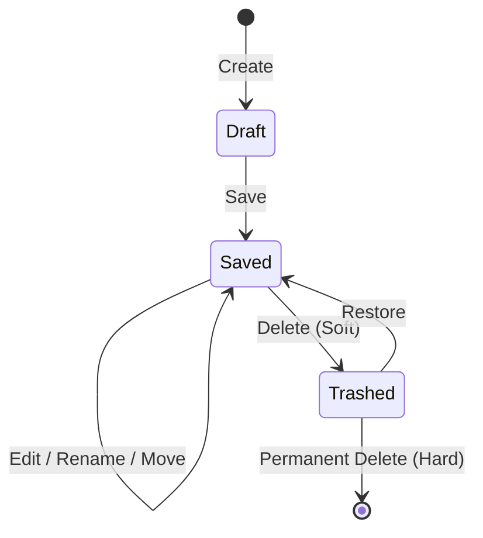

> **Document Type:** Module Specification
> **Status:** Draft
> **Version:** 1.0
> **Depends On:** Workspace Module, Folder Module
> **Document Owner:** Core Architecture Team

# 01 — Note Lifecycle

---

## 1. Purpose

This document details the complete lifecycle of a Note entity within the Workspace. It defines how a Note transitions from creation to permanent deletion, establishing the business rules that govern each phase.

## 2. Scope

**This document covers:**
- Lifecycle operations (Create, Open, Edit, Save, Rename, Move, Duplicate).
- Deletion operations (Archive, Trash, Restore, Permanent Delete).
- Import and Export lifecycles.
- State transitions, ownership boundaries, and validation constraints.

**This document does NOT cover:**
- Editor-specific implementations of "Open" or "Edit".
- Detailed sync conflict resolution (see Synchronization module).

## 3. Operations and Lifecycle

### 3.1 Create
- **Description:** Instantiates a new Note record in the database.
- **Business Rules:** 
  - Must generate a unique, immutable UUID.
  - Must be assigned to exactly one active Workspace.
  - Must be assigned to exactly one valid Folder (or the Workspace root folder if applicable).
  - Initializes `createdAt` and `updatedAt` timestamps.
- **Transitions:** `[None] -> Draft` or `[None] -> Saved`.

### 3.2 Open
- **Description:** Retrieves the Note content and metadata for presentation or editing.
- **Business Rules:** The Note must exist and not be Permanently Deleted. Opening a Trashed note may be allowed in a read-only state.

### 3.3 Edit & Save
- **Description:** Mutates the content or metadata of the Note.
- **Business Rules:** 
  - Updates the `updatedAt` timestamp.
  - The UUID remains unchanged.
  - Cannot edit a Trashed Note unless restored first.

### 3.4 Rename
- **Description:** Alters the `Title` metadata of the Note.
- **Business Rules:** 
  - Does NOT change the Note's UUID.
  - Triggers a metadata update event, independently of a content payload update.

### 3.5 Move
- **Description:** Alters the `folderId` the Note belongs to.
- **Business Rules:** 
  - The target Folder must exist in the same Workspace.
  - Does NOT change the Note's UUID or content.

### 3.6 Duplicate
- **Description:** Creates an exact clone of the Note's content and metadata.
- **Business Rules:** 
  - Must generate a completely new UUID for the clone.
  - Updates `createdAt` and `updatedAt` for the new record.

### 3.7 Archive (Reference)
- **Description:** Marks the Note as archived, hiding it from default views.
- **Business Rules:** Handled as a metadata flag. Does not change folder or UUID.

### 3.8 Trash (Soft Delete)
- **Description:** Moves the Note to the system Trash.
- **Business Rules:** 
  - Sets the `deletedAt` timestamp or a `Trashed` status flag.
  - The Note is hidden from primary queries but remains in the database.

### 3.9 Restore
- **Description:** Recovers a Trashed Note back to active status.
- **Business Rules:** 
  - Clears the `deletedAt` flag.
  - If the original Folder is deleted, the Note must be restored to a safe location (e.g., Workspace root).

### 3.10 Permanent Delete (Hard Delete)
- **Description:** Destroys the Note record from the database.
- **Business Rules:** 
  - Requires explicit user confirmation.
  - Is irreversible.
  - Must trigger cleanup of associated attachments and backlinks.

### 3.11 Import / Export (Reference)
- **Description:** Moving Note data in or out of the system.
- **Business Rules:** Imported Notes receive native Notebook identities (UUIDs) upon successful ingestion. They shed external IDs to become standard Notebook entities.

### 3.12 Soft Delete Philosophy

The preferred deletion lifecycle for a Note follows a safe, recoverable path:
`Active` &rarr; `Archived` (optional) &rarr; `Trash` &rarr; `Permanent Delete`

- **Explicit Confirmation:** Permanent deletion requires explicit user confirmation.
- **Never Silently Destroyed:** User data (Notes) should never be silently destroyed.
- **Recovery:** The Trash provides ample recovery opportunities.
- **Preserved Identity:** Recovery fully preserves the Note's identity (UUID) and associations.

## 4. Lifecycle Transitions

## 5. Error Handling and Edge Cases

- **Invalid Folder Move:** If a move is requested to a non-existent or deleted Folder, the operation MUST fail, and the Note MUST remain in its original Folder.
- **Concurrent Edits:** Handled via optimistic concurrency control (e.g., version numbers or timestamps). The core module must reject a save if the provided version is older than the stored version.

## 6. Performance Considerations

- Soft-deleting thousands of notes (e.g., when a parent Folder is deleted) should be processed in a single transaction to prevent UI freezing and ensure data atomicity.

## 7. Acceptance Criteria

- A Note can transition from Created -> Saved -> Trashed -> Restored.
- A Note's UUID remains strictly identical across renaming, moving, and content updates.
- Permanent deletion requires a confirmed transaction and removes the record entirely.
