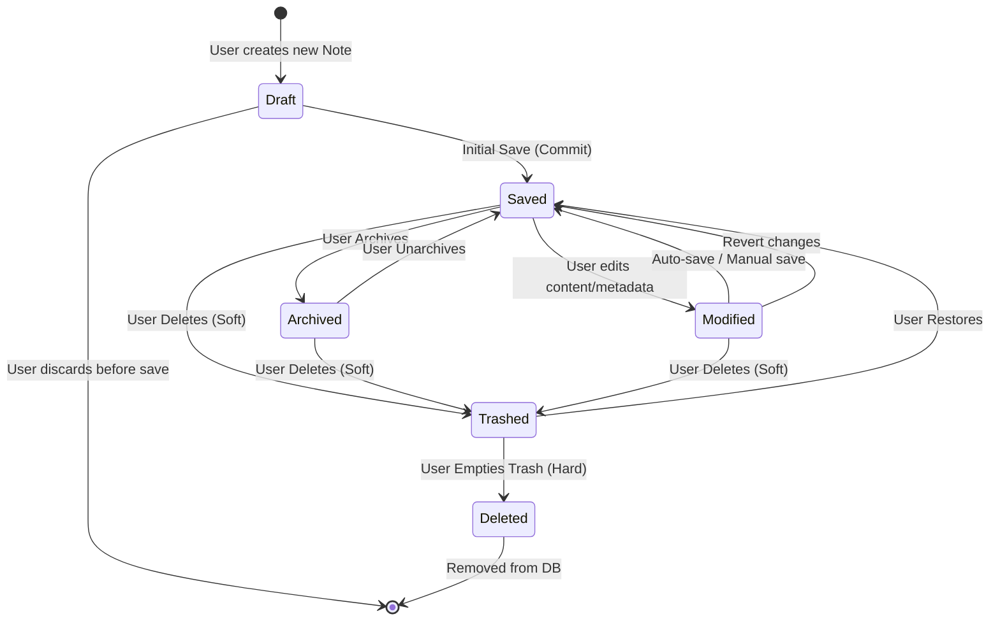

> **Document Type:** Module Specification
> **Status:** Draft
> **Version:** 1.0
> **Depends On:** Workspace Module
> **Document Owner:** Core Architecture Team

# 05 — Note States

---

## 1. Purpose

This document defines every valid state a Note can inhabit during its lifecycle within the Notebook application. It provides a formal state machine outlining how a Note transitions between these states based on user interactions and system events.

## 2. Scope

**This document covers:**
- Valid conceptual states (Draft, Saved, Modified, Archived, Trashed, Deleted, Imported, Recovered).
- Valid and Invalid transitions.
- Recovery scenarios.

## 3. Valid Note States

- **Draft:** A newly instantiated Note that exists only in memory and has not yet been persisted to the database. (Transient state).
- **Saved:** The Note is persisted in the database and is currently up-to-date with no unsaved changes. (Active state).
- **Modified:** The Note has been altered in the Editor, but the changes have not yet been successfully committed to the database. (Transient state).
- **Archived:** The Note is saved and valid, but flagged by the user to be hidden from standard active views to reduce clutter. (Active, hidden state).
- **Trashed:** The Note has been soft-deleted by the user. It is moved to the system Trash and hidden from standard queries, but remains fully recoverable in the database. (Inactive state).
- **Deleted (Permanent):** The Note record has been hard-deleted from the database. (Terminal state).
- **Imported:** A transitional state where external data is being ingested but has not yet completed normalization into a standard "Saved" Note.
- **Recovered:** A transitional state indicating a Note was salvaged during a database corruption repair or a missing-parent scenario, usually resulting in being moved to the Workspace root.

## 4. State Transitions

The following state machine illustrates how Notes move between major persistence states.

## 5. Invalid Transitions

The system must actively prevent the following invalid transitions to protect data integrity:
- **Trashed → Modified:** A user cannot edit the content of a Note while it is in the Trash. It must be Restored to the `Saved` state first.
- **Deleted → Restored:** Once a Note reaches the Permanent `Deleted` state, it ceases to exist. It cannot transition back.
- **Draft → Trashed:** A Note that has never been saved cannot be Trashed; it is simply discarded from memory.

## 6. Recovery Scenarios

- **Orphaned Note (Missing Folder):** If the database repair system detects a `Saved` Note whose `folderId` points to a non-existent folder, the system transitions the Note momentarily to `Recovered`, assigns it to the Workspace Root, and returns it to `Saved`.
- **Interrupted Save:** If a crash occurs while a Note is in the `Modified` state, the local cache/WAL must attempt to reconcile the state upon reboot, returning it either to the last `Saved` state or committing the `Modified` payload if intact.

## 7. Acceptance Criteria

- The UI prevents a user from typing into the Editor if the underlying Note is in the `Trashed` state.
- A Note successfully returns to the `Saved` state when restored from the Trash.
- Discarding a `Draft` Note does not leave orphaned records in the database.
