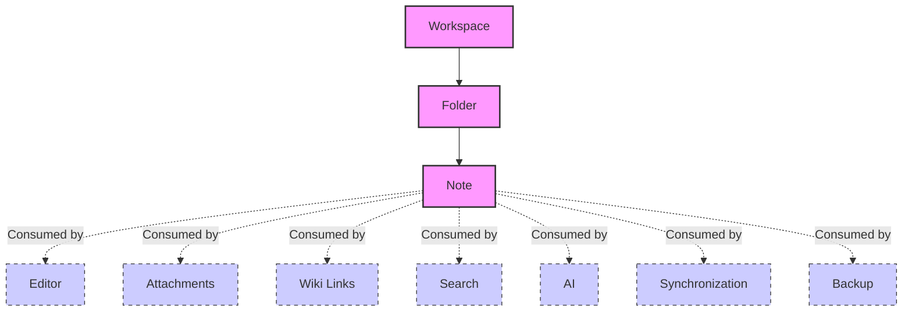

> **Document Type:** Module Specification
> **Status:** Draft
> **Version:** 1.0
> **Depends On:** Workspace Module
> **Document Owner:** Core Architecture Team

# 06 — Note Relationships

---

## 1. Purpose

This document explicitly defines the boundaries and relationships between the Notes module and other subsystems within the Notebook application. It ensures that the Notes module remains highly cohesive, loosely coupled, and strictly adheres to its own domain.

## 2. Scope

**This document covers:**
- Conceptual relationships and ownership boundaries.
- How Notes interact with Workspace, Folders, Editor, Attachments, Links, Search, AI, Sync, and Backup.

## 3. Strict Ownership Boundaries

- **The Notes module owns ONLY Notes.**
- It does NOT own the search index.
- It does NOT own binary files or images.
- It does NOT own the rendering logic.
- It does NOT own the synchronization conflict resolution engine.

## 4. Subsystem Relationships

*Note: The arrows indicate consumption and referencing. These modules consume Notes but do not own them.*

### 4.1 Workspace
- **Relationship:** Parent Container.
- **Rules:** Every Note has a mandatory many-to-one relationship with a Workspace. The Workspace provides the database context in which the Note lives. Deleting a Workspace permanently deletes all associated Notes.

### 4.2 Folder
- **Relationship:** Organizational Parent.
- **Rules:** Every Note has a mandatory many-to-one relationship with a Folder (which may be the implicit Root Folder). The Folder module owns the hierarchy; the Notes module merely stores a `folderId` pointer to participate in that hierarchy.

### 4.3 Editor (Reference)
- **Relationship:** Consumer / Presenter.
- **Rules:** The Editor is a stateless consumer of the Note. It asks the Notes module for content, transforms it into a visual DOM, allows the user to edit it, and passes the updated content back to the Notes module to save. The Notes module has no knowledge of how the Editor works.

### 4.4 Attachments (Reference)
- **Relationship:** Sibling Dependency.
- **Rules:** A Note's content may contain references (IDs) to Attachments (e.g., embedded images). The Attachments module owns the binary files and metadata for those images. The Notes module only stores the reference ID inside the text payload.

### 4.5 Wiki Links (Reference)
- **Relationship:** Sibling Dependency.
- **Rules:** Notes can link to other Notes via Wiki Links (e.g., `[[My Other Note]]`). The Wiki Links module is responsible for parsing these links and maintaining a graph of relationships. The Notes module simply treats them as text strings within the content.

### 4.6 Search (Reference)
- **Relationship:** Observer / Consumer.
- **Rules:** The Notes module never calls the Search module. Instead, the Notes module emits `NoteCreated` and `NoteUpdated` events. The Search module listens to these events and updates its own separate Full-Text Search (FTS) index asynchronously. **Notes never depend on Search.**

### 4.7 AI (Reference)
- **Relationship:** Observer / Consumer.
- **Rules:** Similar to Search, the AI module listens to Note events to generate vector embeddings for RAG (Retrieval-Augmented Generation) features. The Notes module is entirely unaware of the AI subsystem.

### 4.8 Synchronization (Reference)
- **Relationship:** External Mutator.
- **Rules:** The Sync engine pulls Note records from the database and pushes updates from external sources. The Notes module treats Sync as just another client (like the UI) requesting changes. The Notes module does not contain any network or sync-conflict logic.

### 4.9 Backup (Reference)
- **Relationship:** Infrastructure Consumer.
- **Rules:** Backups are taken at the SQLite database file level (managed by the Workspace). The Notes module is entirely decoupled from the backup process.

### 4.10 Import / Export (Reference)
- **Relationship:** External Mutator / Consumer.
- **Rules:** The Import module maps external file formats into native Note payloads and calls the Notes module to Create them. The Export module reads Note payloads and formats them into Markdown/PDF.

## 5. Ownership Matrix

To strictly enforce domain boundaries, the following matrix defines the authoritative owner for various note-related concerns:

| Responsibility | Owner | Boundary Rule |
|---|---|---|
| **Lifecycle** | Notes | Notes module creates and deletes the record. |
| **Identity** | Notes | Notes module defines and maintains the UUID. |
| **Content** | Notes | Notes module stores the semantic payload. |
| **Rendering** | Editor | Editor translates payload into interactive UI. |
| **Search Index** | Search | Search module builds FTS index from Note events. |
| **Embeddings** | AI | AI module builds vector embeddings from Note events. |
| **Binary Files** | Attachments | Attachments module stores files referenced by Notes. |
| **Sync State** | Synchronization | Sync module tracks vector clocks and remote states. |
| **Version History**| Version History Module | Tracks diffs over time (future). |

## 6. Acceptance Criteria

- The Notes module can be compiled and unit-tested in complete isolation, without loading the Search, AI, or Editor modules.
- Events emitted by the Notes module provide sufficient payload data for the Search and AI modules to update their respective indexes without tightly coupling the codebases.
