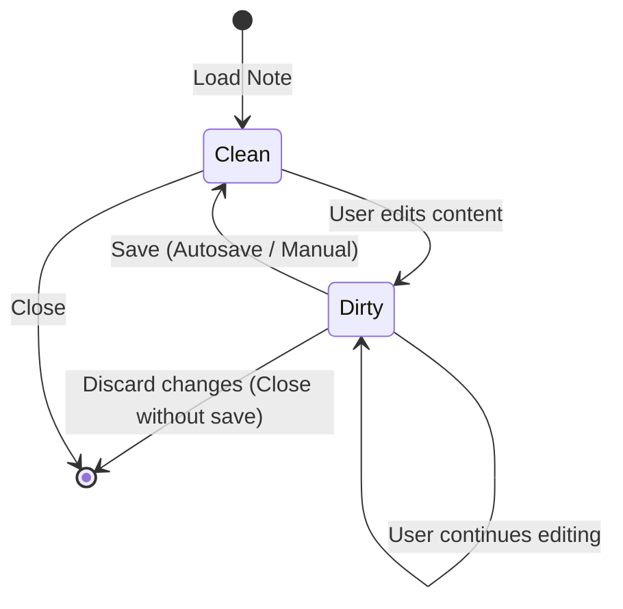
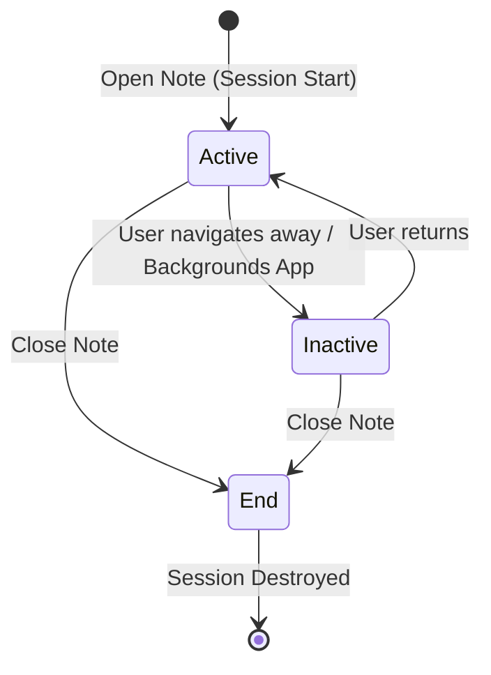

> **Document Type:** Module Specification
> **Status:** Draft
> **Version:** 1.0
> **Depends On:** Workspace Module
> **Document Owner:** Core Architecture Team

# 07 — Editing Session

---

## 1. Purpose

This document defines the lifecycle and boundaries of a Note Editing Session. It establishes the business rules governing how a Note is safely opened, modified in memory, and closed, ensuring data integrity without dictating the Editor's UI presentation.

## 2. Scope

**This document covers:**
- Editing session lifecycle (Start, Active, Inactive, Read-Only, End).
- Session state transitions and boundaries.
- Error handling and edge cases during active edits.

**This document does NOT cover:**
- Keyboard shortcuts or toolbar behaviors.
- The rendering DOM or rich text schema.
- Synchronization conflict resolution algorithms.

## 3. Ownership and Responsibilities

- **Owner:** Notes Module (manages the persistence and runtime lock state).
- **Consumer:** Editor Module (requests the session, holds the active state, pushes changes).
- **Responsibilities:** Ensure that a Note is not simultaneously corrupted by concurrent local edits, and maintain a clear boundary between persistent state and volatile memory state.

## 4. Editing Workflow and Boundaries

### 4.1 Session Start
A session begins when the user requests to view or edit a Note.
- The Notes module retrieves the Canonical Note from the database.
- A volatile "Active Session" is established in runtime memory.

### 4.2 Active Session
The Note is currently loaded in memory and actively receiving modifications.
- Edits mutate the volatile state, not the immediate persistent state.
- **Rule:** Only ONE editing session exists for a given Note on a single device at any time.

### 4.3 Session Identity
- Editing Sessions have temporary runtime identities (e.g., a session ID).
- Sessions are strictly transient.
- Multiple editing sessions may exist over the lifetime of a single Note (each time it is opened).
- Session identity is completely independent from Note identity.
- Closing a session never changes the Note's core identity.

### 4.3 Inactive Session
The Note is still loaded in memory, but the user is away (e.g., switched tabs, application in background).
- Serves as a trigger state for `Autosave` operations.

### 4.5 Read Only Session (Future)
A session explicitly locked from modification. These are future extension points:
- Permission restrictions (future)
- Locked Notes (future)
- Recovery Mode
- Plugin-controlled read-only mode

### 4.6 Session End
The session is cleanly terminated.
- Volatile state is flushed to the persistent database.
- The runtime session is destroyed.

## 5. Dirty State

During an editing session, the Note transitions through data states based on its synchronization with the persistent database:

- **Clean State:** The volatile memory matches the database exactly.
- **Modified State / Dirty State:** The volatile memory contains unsaved changes. The Note is "Dirty".
- **Saved State:** The changes have been successfully persisted.

**Principles:**
- A Dirty Note contains unsaved changes.
- Saving clears the Dirty State.
- Dirty State is a runtime concept, not stored in the database.
- Dirty State does not affect Note identity.

## 6. Session State Transitions

## 6. Business Rules

- **Local Runtime Concept:** Editing sessions are purely local, volatile runtime concepts. They do not exist in the database.
- **Single Instance:** Only one editing session per Note is permitted per application instance to prevent local collision.
- **Sync Independence:** Editing sessions are completely independent of Synchronization. The sync engine operates on the persistent database, not the volatile session memory.
- **Volatile Mutation:** Modifications during a session do not change the permanent identity (UUID) of the Note.

## 7. Error Handling and Edge Cases

- **Application Crash During Session:** The session ends abruptly without flushing. See [10-Recovery.md](./10-Recovery.md) for how the Autosave subsystem mitigates this.
- **Concurrent External Deletion:** If a Note is deleted via Sync while an Active Session is open, the session MUST be gracefully transitioned to a "Read-Only" or "Conflict" state, explicitly warning the user rather than blindly overwriting the deletion.

## 8. Performance Considerations

- The active session payload must be kept minimal in memory. Large binary attachments must be loaded by reference, not held in the session text payload.

## 9. Acceptance Criteria

- Requesting to open the same Note twice returns the same singleton session instance.
- Closing a session correctly triggers a final save and clears the Note from volatile memory.

## 10. Cross References

- [08-Autosave.md](./08-Autosave.md)
- [10-Recovery.md](./10-Recovery.md)
