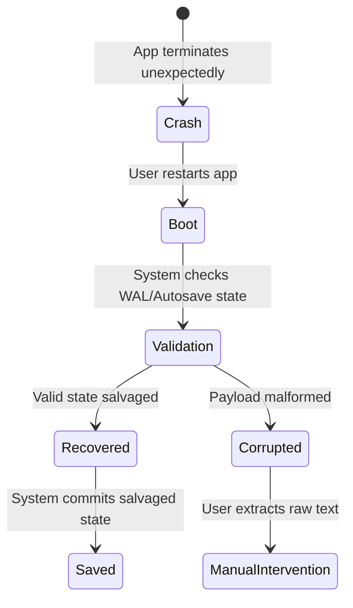

> **Document Type:** Module Specification
> **Status:** Draft
> **Version:** 1.0
> **Depends On:** Workspace Module
> **Document Owner:** Core Architecture Team

# 10 — Recovery

---

## 1. Purpose

This document outlines the Recovery subsystem for the Notes module. It defines the strategies and workflows the system employs to salvage user data in the event of crashes, corruption, or unexpected interruptions.

## 2. Scope

**This document covers:**
- Recovery scenarios (Crash, Shutdown, Corruption, Interrupted Save).
- Validation and repair strategies.
- The Recovery workflow and user interactions.

**This document does NOT cover:**
- Recovery after synchronization conflicts (handled by the Sync module).
- Operating system level file recovery.

## 3. Recovery Scenarios

### 3.1 Application Crash & Unexpected Shutdown
If the application terminates unexpectedly, the volatile memory of an active Editing Session is lost.
- **Strategy:** Upon restart, the system checks for uncommitted temporary Cache/WAL files or relies on the last successful Autosave.

### 3.2 Interrupted Save / Partial Write
If a power failure occurs precisely during a database write.
- **Strategy:** Rely on SQLite's WAL (Write-Ahead Logging) to ensure atomicity. If the transaction was incomplete, the database rolls back to the previous intact state. 

### 3.3 Corrupted Note Payload
If a Note's JSON/Markdown payload is structurally invalid when read from the database.
- **Strategy:** Isolate the Note. Transition it to a "Read-Only / Corrupted" state. Expose the raw string payload to the user for manual extraction rather than failing to load the app entirely.

### 3.4 Recovery After Import
If an import process fails halfway through.
- **Strategy:** Wrap imports in a database transaction. If it fails, roll back entirely. If partial failure is allowed, cleanly log which items failed while committing successful ones.

### 3.5 Version Recovery
If the current Saved state is deemed undesirable by the user (e.g., accidental mass deletion of text).
- **Strategy:** User-driven restoration from the Version History subsystem.

## 4. Recovery Workflow and Principles

### 4.1 Recovery Priority
When recovering data, the system MUST use the least destructive option first. The preferred conceptual recovery order is:

`Autosave` &rarr; `Version History` &rarr; `Manual Backup` &rarr; `User Confirmation (Manual Extraction)`

### 4.2 Core Principles
- **Prioritize User Data:** Recovery MUST always prioritize preservation of user data. Even malformed text is better than a deleted record.
- **Validation First:** Any recovered volatile data must pass schema validation before being committed as a permanent Saved state.
- **User Confirmation:** User confirmation is required whenever recovery could overwrite existing data. If the system detects a significant discrepancy during recovery (e.g., a massive unsaved cache differs entirely from the DB state), it SHOULD prompt the user for confirmation rather than silently overwriting.

## 5. Recovery State Transitions

## 6. Business Rules

- Recovery processes MUST log their actions to a system event log for debugging.
- A Note in a `Corrupted` state must not crash the broader application UI; it must fail gracefully.

## 7. Acceptance Criteria

- Simulating an application kill during an active editing session results in data loss no greater than the periodic autosave threshold.
- A manually inserted malformed JSON payload in the database results in a graceful error state in the UI, not a white screen of death.
