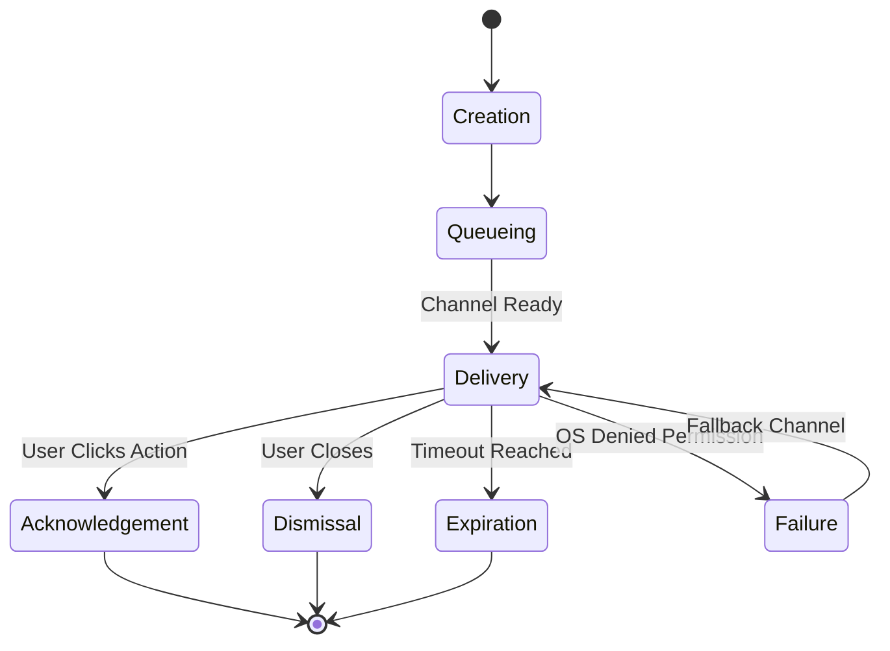

# 02 — Notification Lifecycle

> **Module:** Notifications
> **Status:** Approved
> **Applies To:** Notebook Application

---

## 1. Purpose

The Notification Lifecycle defines the sequential states a notification passes through from creation to removal, ensuring predictable UI behavior.

---

## 2. Lifecycle Phases

### 2.1 Creation
A module dispatches a Notification Request with an assigned priority (e.g., Information, Warning, Error, Critical). Priorities guide delivery behavior (e.g., Critical alerts bypass queues). The Notification module creates a tracked instance in memory.

### 2.2 Queueing (Conceptual)
If multiple notifications arrive rapidly, they are queued to prevent overwhelming the user. The system may collapse duplicate messages.

### 2.3 Delivery
The Notification is routed to the appropriate Channel (e.g., rendered as a Toast in the UI, or passed to the OS Desktop Notification API).

### 2.4 Acknowledgement
The user explicitly interacts with the notification (e.g., clicks "View Details" or "Retry").

### 2.5 Dismissal
The user explicitly closes the notification, removing it from the active view.

### 2.6 Expiration
The notification automatically dismisses itself after a predefined timeout (e.g., 5 seconds for success messages).

### 2.7 Failure
If a channel fails to deliver (e.g., Desktop OS permissions denied), it may gracefully fall back to an In-app channel.

---

## 3. Lifecycle Diagram

---

## 4. Business Rules

- **Notifications never own business logic.** Actions triggered by a notification simply emit an event back to the originating module.

---

## 5. Future Enhancements

- **Notification Deduplication:** Conceptually, notification systems may suppress duplicate notifications to reduce user fatigue while preserving important information.

---

## 6. Acceptance Criteria

- A "Sync Success" notification auto-expires after 5 seconds.
- A "Sync Failed" error notification requires manual Dismissal or Acknowledgement.

---

## 7. Cross References

- [03-NotificationChannels.md](./03-NotificationChannels.md)
