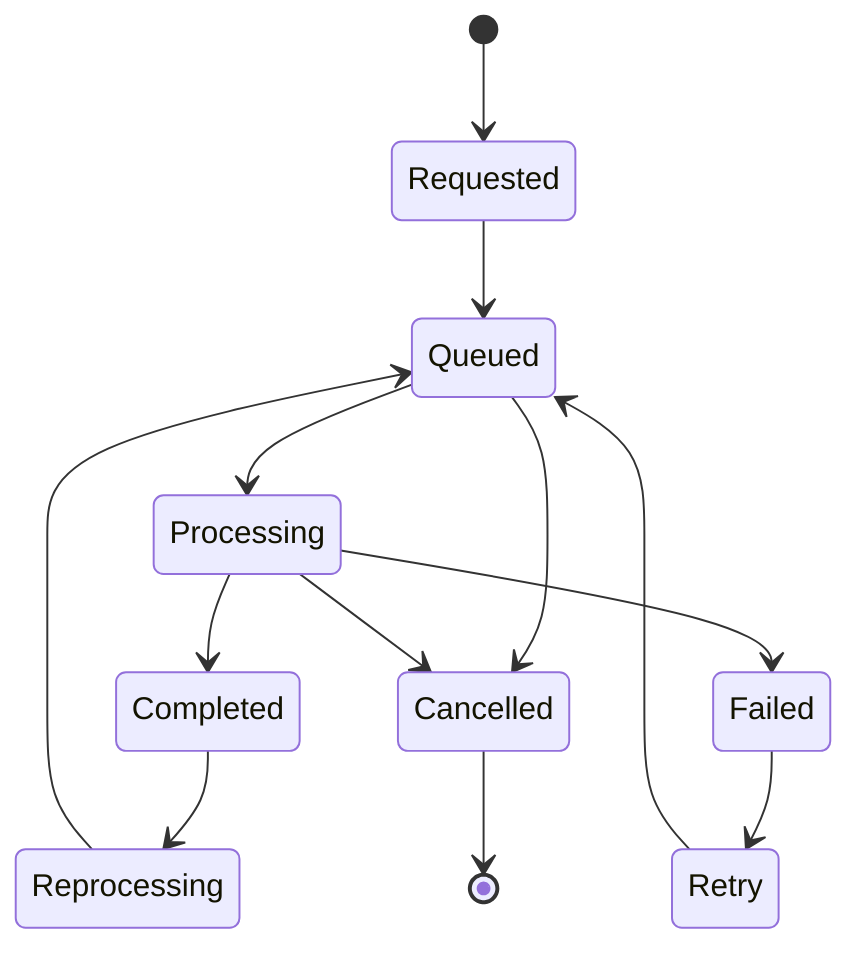

> **Document Type:** Module Specification
> **Status:** Draft
> **Version:** 1.0
> **Depends On:** Attachments Module
> **Document Owner:** Core Architecture Team

# 02 — OCR Lifecycle

---

## 1. Purpose

This document details the lifecycle of an OCR processing job. It ensures predictable, resilient execution of background extraction tasks.

## 2. Lifecycle Operations

### 2.1 Request
- The module receives a trigger (typically an `AttachmentCreated` event). It validates the MIME type and queues an OCR Job.

### 2.2 Queue
- The job sits in a conceptual waiting state. This protects system resources by preventing spikes in upload activity from overwhelming the CPU/Memory.

### 2.3 Processing
- A worker picks up the job, fetches the binary payload, and runs the extraction algorithm.

### 2.4 Completion
- The text is successfully extracted, the result is saved, and an `OCRCompleted` event is broadcast.

### 2.5 Failure
- An error occurs (timeout, unreadable file, engine crash). The job is marked as `Failed`.

### 2.6 Retry
- A `Failed` job is moved back into the `Queue` state, either via an automatic backoff strategy or manual user intervention.

### 2.7 Cancellation
- A queued or processing job is aborted. This typically occurs if the underlying Attachment is deleted before processing finishes.

### 2.8 Reprocessing (Multiple OCR Runs)
- An existing, completed result is discarded and the job is re-queued.
- **Multiple Runs:** The same Attachment may be processed multiple times throughout its lifecycle. Examples include:
  - Manual reprocessing triggered by the user.
  - Deployment of an improved OCR engine.
  - Changes to OCR configuration or language settings.
  - Better image preprocessing capabilities becoming available.
- **Validity:** Multiple OCR runs are completely valid. OCR Results may be freely regenerated.
- **Identity Preservation:** The underlying Attachment identity NEVER changes regardless of how many times it is processed. Previous OCR Results may be superseded conceptually by the newer run.

## 3. Lifecycle Diagrams

## 4. Business Rules

- **Independence:** OCR processing is completely independent from Note editing. Users can freely type in the Editor while attachments are being processed in the background.
- **Idempotent Retries:** Retrying a job must not result in duplicate derived text artifacts. The new result overwrites the old result.

## 5. Edge Cases

- **Immediate Deletion:** If a user uploads an image and immediately deletes it within 2 seconds, the `AttachmentDeleted` event must intercept and Cancel the queued OCR job to prevent wasted CPU cycles.
- **Engine Timeouts:** The processing state must have a maximum timeout to prevent complex PDFs from locking workers indefinitely.

## 6. Acceptance Criteria

- Deleting a Note containing an unprocessed Attachment successfully triggers a Cancellation of the pending OCR job.
- An administrator can manually trigger a Reprocessing of all PDFs, overwriting the old OCR results seamlessly without duplicating data in the Search index.
