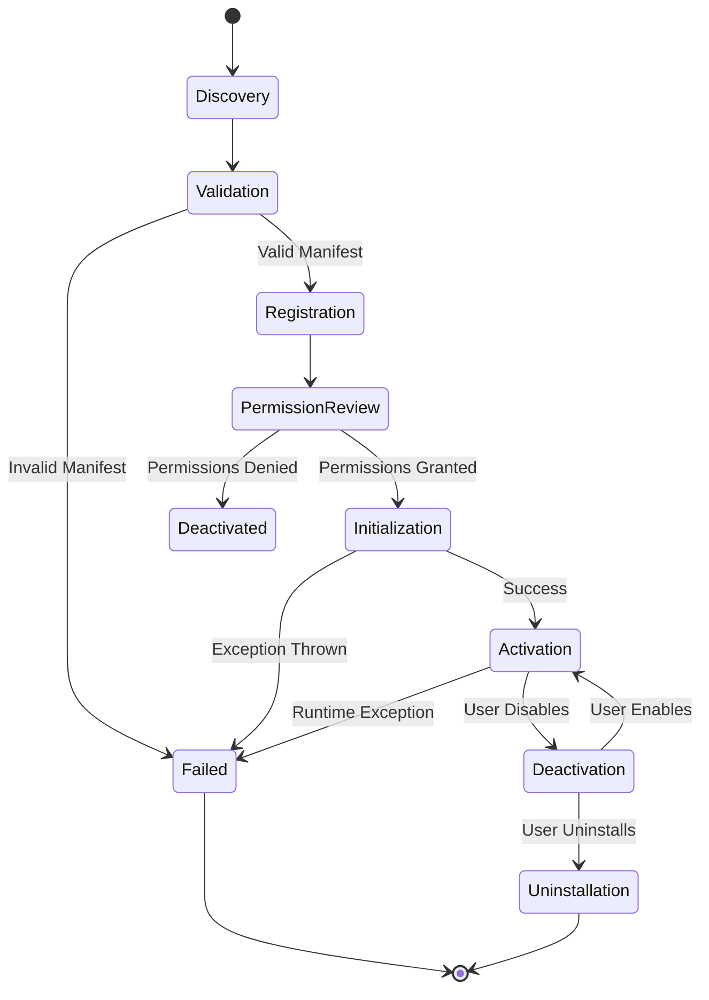

# 02 — Plugin Lifecycle

> **Module:** Plugins
> **Status:** Approved
> **Applies To:** Notebook Application

---

## 1. Purpose

The Plugin Lifecycle documents the strict sequence of states a Plugin transitions through, ensuring that untrusted code is validated before it interacts with the Notebook.

---

## 2. Lifecycle Philosophy

- **Plugins are validated before activation.** No plugin code runs until its manifest and signatures (if applicable) are verified.
- **Failed plugins never destabilize Notebook.** Failures are isolated.
- **Notebook continues operating safely even if plugins fail.**

---

## 3. Lifecycle Phases

### 3.1 Discovery
The SDK scans known directories for Plugin Packages and parses their Plugin Manifests.

### 3.2 Validation
The SDK verifies the manifest. It checks SDK version compatibility and ensures the requested permissions are structurally valid.

### 3.3 Registration
The valid plugin is registered in the internal catalog but is not yet executing code.

### 3.4 Permission Review
(Conceptual Phase) The system ensures the user has granted the permissions requested by the manifest. If denied, the plugin transitions to Deactivated.

### 3.5 Initialization
The plugin's entry point is loaded into memory.

### 3.6 Activation
The plugin executes its startup logic, hooking into Extension Points (e.g., registering a new Toolbar icon).

### 3.7 Deactivation
The plugin is gracefully shut down. All resources and hooks attached to Extension Points are cleaned up.

### 3.8 Update
The plugin package is replaced with a newer version. The lifecycle loops back to Validation.

### 3.9 Uninstallation
The Plugin Package is permanently removed from the system, and its registered preferences are purged.

---

## 4. Failure Handling & Recovery

- If a plugin throws an unhandled exception during Activation or at runtime, the SDK catches the error.
- The Plugin Instance is forcibly transitioned to a **Failed** state and immediately deactivated.
- A `PluginFailed` event is broadcasted.
- **Recovery:** The user is notified via the Notifications module. The user can attempt to reload the plugin or uninstall it. Notebook data remains completely safe.

---

## 5. Lifecycle Diagram

---

## 6. Business Rules

- **Plugin failures never corrupt Notebook data.**
- **Plugins are validated before activation.**

---

## 7. Acceptance Criteria

- A plugin with a syntax error in its main execution script fails during Initialization, transitions to Failed, and the core application UI remains perfectly responsive.

---

## 8. Cross References

- [04-PermissionsAndSecurity.md](./04-PermissionsAndSecurity.md)
- [06-PluginEvents.md](./06-PluginEvents.md)
